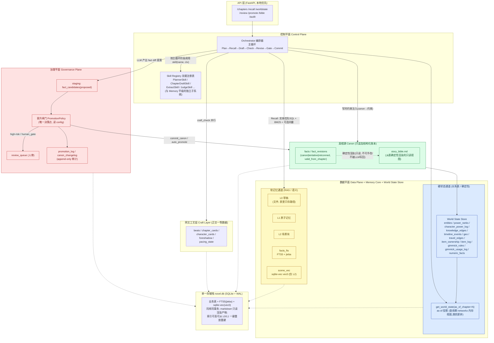
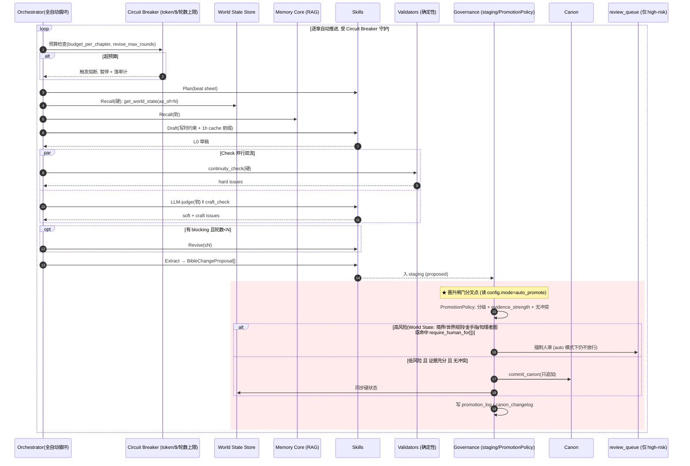

## 1. 总体架构与模块边界

> 本节是 NovelForge 的"地图与边界条约"：定义三平面分层、各模块职责与不可逾越的边界、两条端到端时序、canon→约束的主数据流向与 生成→staging→canon 的回流向，并在架构图上落实"软记忆走 RAG / 硬状态走关系表"(硬原则 1)与"双模式同管线、单闸门分叉"(硬原则 5)。后续各节(数据模型详见第 02 节、World State Store 详见第 02 节、检索与召回详见第 06 节、一致性引擎详见第 04 节、治理与晋升闸门详见第 03 节、网文工艺层详见第 05 节、成本与缓存详见第 06 节、存储栈详见第 02 节、API 详见第 08 节)在本节确立的边界内展开,不得越界。

### 1.1 设计立场与一句话架构

NovelForge 是一条**单一写作管线**,运行在**三个平面**之上,产出全部先入 **staging**,在**唯一的晋升闸门(PromotionPolicy)** 处按 `config.canon_governance.mode` 分叉为"人审定 canon(模式1)"或"自动晋升(模式2)"。真相源是**只追加的结构化账本**(`facts` / `fact_revisions`),一致性靠**世界状态模拟**(World State Store 的 as-of 投影)而非相似度检索来保障,追更力由**正交的网文工艺层**单独负责。全栈本地优先,收口于单一 `novel.db`(SQLite + WAL)。

一句话边界判定原则贯穿全篇(硬原则 1):

- **凡是"对/错有唯一答案"的问题**(境界越级、信息差、时间线/地理、数值守恒、金手指、库存、伏笔到期)→ 走 **World State Store 关系表 + 确定性 Python validator**(纯 SQL + 算术 + networkx + 状态机,无 LLM)。
- **凡是"好/不好、像不像、合不合氛围"的问题**(文风、动机合理性、模糊设定召回)→ 才走 **RAG + LLM-judge**。
- 二者在架构图上是**两条物理分离的通道**,不混用、不互相兜底。

### 1.2 三平面总架构图

三平面 = **控制平面**(Orchestrator + Skill Registry)、**数据平面**(Memory Core 的 L0/L1/L2 + World State Store)、**治理平面**(Governance: staging + 晋升闸门 + 审计)。下图同时标出"硬状态走关系表 / 软记忆走 RAG"的物理分流(见数据平面内部的左右两条通道)与单一存储收口。



**图例读法(关键边界)**:

- **蓝色 = 硬状态通道**:任何确定性事实/算术/时序/全序/状态机/缺失边检测只能从这里取数,validator 只读这里。
- **黄色 = 软记忆通道**:RAG 召回、相似桥段、语义判断走这里;LLM-judge 只能消费这里的内容。
- **红色 = 治理平面**:所有 LLM 产出的"对 canon 的变更"必经 staging→PromotionPolicy,无旁路。
- **绿色 = canon**:只追加,LLM 永不直接写,`story_bible.md` 永远是只读渲染产物。
- **虚线箭头(-.->) 到 novel.db**:强调硬原则 11——所有数据(含 FTS5/vec0)同库同事务,markdown 是渲染产物。

### 1.3 模块职责与边界条约

下表逐模块声明"做什么 / 绝不做什么 / 输入 / 输出 / 所属平面",**边界即契约**。

| 模块 | 平面 | 职责(做什么) | 绝不做(硬边界) | 主输入 | 主输出 |
|---|---|---|---|---|---|
| **Orchestrator(编排器)** | 控制 | 驱动主循环 `Plan→Recall→Draft→Check(continuity‖craft)→Revise(≤N)→Gate→Commit`;调度 Skill;聚合 issues;触发 PipelineManager | 不自己写业务逻辑/不直接改 canon/不做晋升决策(委托 PromotionPolicy) | API 请求、config | 章节产物、staging 提案、审计事件 |
| **Skill Registry** | 控制 | 以 name 注册/解析独立 Skill(Planner/ChapterDraft/Extract/Judge…);声明各 skill 的 IO 契约与模型档位(Haiku/Sonnet/Opus) | 不持有状态/不持久化记忆(记忆只在 Memory Core);不是 Memory 的 L4(已拆为平级,见硬原则 11 末) | skill 调用请求 + ctx | 结构化 skill 结果 |
| **Memory Core(L0/L1/L2)** | 数据 | 软记忆:L0 草稿(存文件,表存路径)、L1 原子记忆、L2 场景块;为 Recall 提供语义/关键词召回素材 | 不存"硬状态真相"(那是 World State Store);不被当作一致性判定依据 | 草稿、抽取结果 | 召回片段、嵌入/FTS 索引 |
| **World State Store** | 数据 | 硬状态真相的关系建模 + `get_world_state(as_of_chapter=N)` as-of 投影;承载境界/知情者图/时间线/地理/库存/金手指/数值 | 不做相似度检索;不存文风/氛围;不接受 LLM 直接写(经 canon 同步) | canon 提交事件 | as-of 世界状态快照(供写时约束 + 事后兜底) |
| **Governance(治理)** | 治理 | staging(`fact_candidates`)状态机 + 唯一晋升闸门 `PromotionPolicy` + `review_queue` + append-only 审计(`promotion_log`/`canon_changelog`)+ 单条 revert | 不创作内容;不绕过 staging 直写 canon;`require_human_for[]` 在 auto 模式下也不放行 | LLM 的 fact diff 提案 + config | 晋升/驳回决策、审计记录、人审任务 |
| **Canon(facts/fact_revisions)** | 数据(真相源) | 只追加的结构化事实账本 + 状态变更(canon/tentative/retconned)+ `valid_from_chapter`;确定性渲染 `story_bible.md` | 永不物理删除;LLM 永不写回;markdown 不可手改 | PromotionPolicy 的 commit | 约束生成的数据源、WSS 同步源 |
| **网文工艺层(Craft)** | 数据(正交) | `beats`(payoff_beat/hook/value_shift/tension_point)、`chapter_cards`、`character_cards`、`foreshadow`、`pacing_state` 作为一等数据;为 PlannerSkill/craft_check 供数 | 不参与硬一致性判定(正交);不混入 canon 真相 | Planner 的 beat sheet、章节产物 | craft issues、追更力指标 |
| **API 层(FastAPI)** | 接口 | 暴露 `/chapters /recall /worldstate /review /promote /bible /audit` 等;本地优先;把外部请求翻译为 Orchestrator/Governance 调用 | 不内联业务规则;不绕过 Orchestrator 直接改库 | HTTP 请求 | HTTP 响应(只读视图/任务/状态) |

> 模块边界的"防越界"硬约束(与硬原则一一对应):
> - **硬原则 1**:Memory Core 与 World State Store 物理分离;validator 只读 World State Store,LLM-judge 只读 Memory Core。
> - **硬原则 2**:Canon 与 `story_bible.md` 之间只有"渲染"一条单向边,无反向写回边。
> - **硬原则 5**:Governance 是 LLM 产出通往 Canon 的**唯一**通道(图中无任何从 Skill/Orchestrator 直达 Canon 的写边)。
> - **硬原则 6**:Craft Layer 与一致性引擎在图上并列、不交叉,Check 阶段双流并行。

### 1.4 核心数据流图:canon→约束(主流向) 与 生成→staging→canon(回流向)

主数据流向是闭环的两段:**(A) canon→约束生成**(向前,喂给起草与校验)与 **(B) 生成→staging→(人审/自动)→canon**(向后,回流真相源)。下图把两段画在一张图上,中间用"晋升闸门"衔接。

```mermaid
flowchart LR
    subgraph A["主流向 A: canon → 约束生成 (写时约束)"]
        FACTS1["facts / fact_revisions<br/>(canon, as-of(N))"]
        WSS1["World State Store<br/>get_world_state(as_of=N)"]
        TABOO["否定型/全局禁忌<br/>(如 20章前不暴露反派)"]
        CONSTR["约束集 Constraints<br/>= 硬注入(WSS事实+禁忌) + 召回(软)"]
        FACTS1 --> WSS1 --> CONSTR
        TABOO -- "always-on 硬注入 system, 不走检索" --> CONSTR
    end

    DRAFT["ChapterDraftSkill<br/>(写时约束注入 prompt)"]
    CONSTR -- "稳定前缀走 1h prompt cache" --> DRAFT

    subgraph CHK["Check (并行双流)"]
        CONT["continuity_check<br/>= validators(硬, 读WSS) ‖ LLM-judge(软, 读Memory)"]
        CRAFTC["craft_check<br/>(读 Craft Layer)"]
    end
    DRAFT --> CHK

    subgraph B["回流向 B: 生成 → staging → (人审/自动) → canon"]
        EXTRACT["ExtractSkill<br/>(instructor+Pydantic)<br/>产 BibleChangeProposal{op,target_id,old,new,reason,evidence_refs}"]
        STG1["staging: fact_candidates(proposed)"]
        GATE["晋升闸门 PromotionPolicy<br/>(分级 + evidence_strength + 无冲突 + 非高风险)"]
        REVIEW["review_queue → 人审 (模式1 / high-risk)"]
        COMMIT["commit_canon (模式2 low-risk)"]
        LOG["promotion_log / canon_changelog (append-only)"]
        EXTRACT --> STG1 --> GATE
        GATE -- "human_gate / require_human_for[]" --> REVIEW
        GATE -- "auto_promote + 低风险" --> COMMIT
        REVIEW -- "通过(append)" --> COMMIT
        GATE --> LOG
        COMMIT --> LOG
    end

    CHK --> EXTRACT
    COMMIT -- "回写真相源(只追加)" --> FACTS1
    COMMIT -- "同步硬状态" --> WSS1

    classDef hard fill:#dbeafe,stroke:#1e40af,color:#1e3a5f;
    classDef gov fill:#fee2e2,stroke:#b91c1c,color:#7f1d1d;
    classDef canon fill:#dcfce7,stroke:#15803d,color:#14532d;
    class WSS1,CONT hard;
    class STG1,GATE,REVIEW,COMMIT,LOG gov;
    class FACTS1 canon;
```



**主流向 A(canon→约束)的要点**:

- 真相源 `facts`(canon 状态、`valid_from_chapter ≤ N`)经 World State Store 的 `get_world_state(as_of_chapter=N)` 投影成"第 N 章应当成立的世界状态",作为**写时约束**注入 ChapterDraftSkill 的 prompt(硬原则 3:写时约束)。
- 否定型/全局禁忌**不走检索**,直接 always-on 硬注入 system(硬原则 4)。
- 约束集中的稳定部分(bible 视图、风格、长期约束)构成 **1h prompt cache 稳定前缀**,绝不被章节号/时间戳/uuid/每次变化的检索结果污染(硬原则 10,详见第 06 节)。

**回流向 B(生成→canon)的要点**:

- LLM 只产出结构化 `BibleChangeProposal{op:add|update|deprecate, target_id, old, new, reason, evidence_refs}`,**绝不写回 bible**(硬原则 2)。
- 提案先入 staging(`fact_candidates`,状态 `proposed`),由**唯一** PromotionPolicy 决策(硬原则 5)。
- commit 是对 `facts`/`fact_revisions` 的**只追加**写,并同步进 World State Store;每次晋升/驳回/revert 都在 `promotion_log`/`canon_changelog` 留 append-only 审计(硬原则 9)。

### 1.5 端到端时序图:模式1(human_gate)与模式2(auto_promote)

两条时序**共用同一条管线**,差异只发生在 **Gate(晋升闸门)** 的分叉点(下图均以 `★ 晋升闸门分叉点` 显式标注)。

#### 1.5.1 模式1 = AI 起草章节 + 人审定 canon(`mode: human_gate`)

```mermaid
sequenceDiagram
    autonumber
    participant U as 作者(人)
    participant API as API (FastAPI)
    participant ORCH as Orchestrator
    participant WSS as World State Store
    participant RAG as Memory Core (RAG)
    participant LLM as Skills (Planner/Draft/Extract/Judge)
    participant VAL as Validators (确定性)
    participant GOV as Governance (staging/PromotionPolicy)
    participant CANON as Canon (facts/fact_revisions)

    U->>API: POST /chapters {chapter=N, mode=human_gate}
    API->>ORCH: 启动主循环(N)
    ORCH->>LLM: Plan: PlannerSkill 产逐章 beat sheet(契约)
    ORCH->>WSS: Recall(硬): get_world_state(as_of=N)
    ORCH->>RAG: Recall(软): 实体优先SQL + BM25 + (可选)向量
    ORCH->>LLM: Draft: ChapterDraftSkill(写时约束注入 + 1h cache 前缀)
    LLM-->>ORCH: L0 章节草稿(存文件, 表存路径)

    par Check 并行双流
        ORCH->>VAL: continuity_check(硬): 读WSS, 草稿须从 as-of(N) 合法迁移
        VAL-->>ORCH: hard issues
    and
        ORCH->>LLM: continuity_check(软, LLM-judge) ‖ craft_check
        LLM-->>ORCH: soft issues + craft issues
    end

    alt 有 blocking issues 且 revise 轮数 < N
        ORCH->>LLM: Revise(≤N 轮)
        LLM-->>ORCH: 修订稿
    end

    ORCH->>LLM: Extract: 产 BibleChangeProposal[]
    LLM-->>GOV: 提案入 staging (fact_candidates: proposed)

    rect rgb(255,235,235)
    Note over GOV: ★ 晋升闸门分叉点 (读 config.mode=human_gate)
    GOV->>GOV: PromotionPolicy 评估 evidence_strength + 冲突 + 风险分级
    GOV->>API: enqueue_review(review_queue)
    end

    API-->>U: 章节草稿 + 待审 fact diff 列表
    U->>API: POST /review {decision: approve/edit/reject}
    API->>GOV: 人审结果(append)
    GOV->>CANON: commit_canon(只追加 facts/fact_revisions)
    GOV->>WSS: 同步硬状态
    GOV->>GOV: 写 promotion_log / canon_changelog (append-only)
    GOV-->>U: canon 已更新; story_bible.md 重渲染(只读)
```

#### 1.5.2 模式2 = 全自动小说家(`mode: auto_promote`,尽量少打断)



**两条时序的唯一差异点(★ 晋升闸门)说明**:

- **同一条管线**:Plan→Recall→Draft→Check→Revise→Extract 完全一致,模式差异只在 `★` 处由 `PromotionPolicy` 读 `config.canon_governance.mode` 决定走 `enqueue_review` 还是 `commit_canon`(硬原则 5)。
- **风险分级优先于模式**:无论哪种模式,触及 World State 的高风险变更(境界/世界规则/金手指/知情者图)或命中 `require_human_for[]`(world_rule/power_system/character_death/foreshadow_payoff/知情者图变更)一律强制人审(硬原则 8)。即模式2 的"自动"只对**低风险软变更**生效。
- **confidence 不当闸门**:晋升依据是可程序校验的 `evidence_strength`(出处可验,权重最高)+ 无冲突 + 非高风险;`confidence` 仅用于排序,不作晋升判据(硬原则 8)。
- **模式2 必有熔断**:`Circuit Breaker` 强制 token/美元上限 + `revise_max_rounds`,超限暂停并落审计(硬原则 10)。

### 1.6 关键流向的配置开关(config.canon_governance)

晋升闸门的全部分叉行为由单一配置根驱动(完整字段与默认值详见第 03 节):

```yaml
config:
  canon_governance:
    mode: human_gate          # human_gate | auto_promote | hybrid —— ★ 晋升闸门分叉的总开关
    auto_promote_threshold: 0.0   # evidence_strength 阈值(仅用于 auto/hybrid 的低风险放行)
    require_human_for:        # 即使 auto_promote 也强制人审的高风险类别
      - world_rule
      - power_system
      - character_death
      - foreshadow_payoff
      - knowledge_edge_change   # 知情者图变更
    continuity_gate: block    # block | warn —— hard issues 是否阻断晋升
    revise_max_rounds: 2      # Revise 阶段最大轮数(Circuit Breaker 之一)
    budget_per_chapter:       # 全自动模式 token/美元上限(Circuit Breaker 之一)
      max_usd: 1.5
      max_tokens: 200000
```

- `mode` 是 1.5 两图中 `★` 分叉点读取的唯一总开关;`hybrid` = 低风险 auto、高风险 human,等价于"auto_promote + 全量 require_human_for 命中即转人审"。
- `continuity_gate: block` 时,validator 产出的 hard issues 直接阻断晋升(进 Revise 或人审);`warn` 时仅记录不阻断(软记忆/低风险场景)。
- `require_human_for[]` 与 `mode` 是**与**关系:命中即转人审,凌驾于 `auto_promote` 之上(硬原则 5、8)。

### 1.7 本节确立的不变量(供后续各节遵守)

1. **单一闸门**:任何 LLM 产出到达 canon 只有一条路径 staging→PromotionPolicy→commit_canon,无旁路(硬原则 5)。
2. **物理分流**:硬状态(World State Store 关系表 + validator)与软记忆(Memory Core + RAG/LLM-judge)在架构上分离,互不兜底(硬原则 1)。
3. **只追加真相源**:`facts`/`fact_revisions` 永不物理删除,`story_bible.md` 永远只读渲染(硬原则 2)。
4. **写时约束 + 事后兜底**:一致性由 `get_world_state(as_of=N)` 注入起草 + 草稿须经合法迁移到达双重保障(硬原则 3)。
5. **正交工艺层**:一致性(不扣分项)与网文工艺(得分项)在 Check 阶段并行、数据分离(硬原则 6)。
6. **单库收口**:业务表 + FTS5(jieba) + sqlite-vec(vec0) 同库同事务于 `novel.db`,索引可从 L0/L1 重放重建(硬原则 11)。
