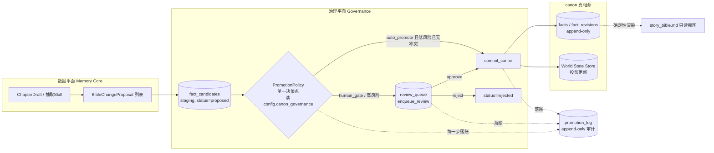

## 3. Canon治理与双模式

> 本节属于 NovelForge 三平面中的**治理平面(Governance)**，承接数据平面产出的结构化提案，给出"候选 → 审校 → canon"的完整生命周期、单一晋升决策点、append-only 审计与回滚机制，以及模式1(human_gate)/模式2(auto_promote)在同一闸门处的分叉规则。
>
> 核心立场(呼应硬原则 2/5/8/9)：**canon 是只追加的结构化账本**(`facts`/`fact_revisions`)，不是 LLM 重写的 markdown；**双模式是同一条管线在一个晋升闸门处分叉**，而非两套系统；**防漂移靠 append-only 审计 + 单条回滚，不靠 LLM 自觉**。LLM 永远只产出结构化提案进入 staging，能否进入 canon 完全由确定性的 `PromotionPolicy` 决策点裁定。
>
> 主循环定位：`Plan→Recall→Draft→Check(continuity‖craft)→Revise(≤N轮)→**Gate(PromotionPolicy)→Commit**`。本节聚焦最后两步 Gate 与 Commit；World State 投影详见第2节，工艺层 craft_check 详见第5节，continuity validators 详见第4节，存储栈详见第2节、prompt cache 详见第8节。

---

### 3.1 治理对象与数据流总览

LLM(ChapterDraftSkill / 抽取 Skill)在 Check 阶段之后，针对一章产出一批 **BibleChangeProposal**(结构化 fact diff，绝不写回 bible，见硬原则2)：

`BibleChangeProposal` 的**单一权威 Pydantic 契约定义见第10节**(`op: Literal["add","update","deprecate","retcon"]`、`target_id: Optional[str]`(add 时 None；update/deprecate/retcon 必填，指向 `facts.id`)、`entity`、`fact_type`、`old: Optional[dict]`、`new: dict`、`reason`、`evidence_refs: list[str]`(非空)、`valid_from_chapter`、`risk_class`)。本节不再重复字段定义，治理流程一律以第10节契约为准。要点：

- `op ∈ {add, update, deprecate, retcon}`；`add` 禁带 `target_id`，`update/deprecate/retcon` 必填 `target_id`(指向 `facts.id`，TEXT 前缀化 ID)。
- `evidence_refs` 非空(章节锚点 `chap:42#para:7` / `fact:fact_000123` / `draft:L0` 路径，可程序校验)——晋升依据=可程序校验的 `evidence_strength`(硬原则8)。
- `valid_from_chapter` 绑定 canon 生效章(硬原则2)；`risk_class` 由 `classify_risk` 填。

数据流(三平面视角)：



要点：

- `fact_candidates`(staging)是**所有** LLM 产出的唯一入口，无论模式1还是模式2(硬原则5)。
- `PromotionPolicy` 是**唯一**决定 `enqueue_review` 还是 `commit_canon` 的代码点；两种模式共用此函数，差异完全由 `config.canon_governance` 驱动。
- 任何状态迁移都同步向 `promotion_log` 追加一条审计记录(硬原则9)。
- `story_bible.md` 是从 `facts`/`fact_revisions` **确定性渲染的只读产物**，不参与治理写路径(硬原则2/11)。

---

### 3.2 `fact_candidates` 状态机

候选条目的生命周期是一个**显式状态机**，状态只能沿合法边迁移，每条边都落 `promotion_log`：

```
                          ┌──────────────────────────────────────────┐
                          │                                          │
   (LLM 产出提案)          ▼                                          │
  ─────────────►  proposed ──policy: auto_promote 且低风险且无冲突──► promoted (commit_canon，新fact→canon)
                     │  │                                             ▲
                     │  └──policy: human_gate / 高风险 / 有冲突──► pending_review
                     │                                  │  │          │
                     │                                  │  └─approve──┘  (人审通过 → commit_canon → promoted)
                     │                                  │
                     │                                  └────reject────► rejected
                     │
                     └──────────冲突检测命中既有 canon──────────────────► (新候选指向旧 fact)
                                                                          旧 fact 经 retcon → retconned
```

合法状态集合与语义：

| status | 含义 | 可达后继 | 写入位置 |
|---|---|---|---|
| `proposed` | LLM 刚产出、尚未经 PromotionPolicy 裁定(HOLD 停留于此) | `pending_review` / `promoted` | `fact_candidates` |
| `pending_review` | 已入 `review_queue`，等待人工审校 | `promoted`(approve) / `rejected`(reject) / `superseded` | `fact_candidates` + `review_queue` |
| `promoted` | 已 commit，候选离开 staging 进入 canon(对应新 fact 写入 `facts`/`fact_revisions` 与 World State，`facts.status='canon'`) | (终态) | `fact_candidates` |
| `rejected` | 人审否决，不进入 canon | (终态；可重新产出新候选，但本条不复活) | `fact_candidates` |
| `superseded` | 该**候选**已被后续候选取代，**逻辑失效但物理保留**(注意：事实自身失效用 `facts.status='retconned'`，不是 `superseded`) | (终态) | `fact_candidates` |

> 状态边界(硬原则区分，详见第10节 R3/R4)：候选"已晋升"= `promoted`；事实"是真相"= `canon`(`facts.status`)。候选"被取代"= `superseded`；事实"失效"= `retconned`(`facts.status`)。`promoted ≠ canon`，`superseded ≠ retconned`。

> 状态机不变量：
> 1. `proposed` 是唯一入口态(HOLD 停留于此待证据)；`promoted`/`rejected`/`superseded` 是终态。
> 2. 不存在从终态返回的边——"撤销"已晋升的 canon 不是改回 candidate，而是一次**新的 append**(见 3.7 revert)。
> 3. canon 内容永不物理删除(硬原则2/9)，retcon 只把旧 `facts.status` 置 `retconned` + 追加新 fact。

DDL：

> **`fact_candidates` 的唯一权威 DDL 在第2节 §2.3.1**（主键 `candidate_id TEXT`；`proposal_json`、`op CHECK IN (add,update,deprecate,retcon)`、`target_fact_id REFERENCES facts(id)`、`entity_id REFERENCES entities(id)`、`risk_tier CHECK IN (low,medium,high)`、`conflict_flags`(JSON，空=无冲突)、`evidence_strength`、`confidence`、`status CHECK IN (proposed,pending_review,promoted,rejected,superseded)` 等），命名权威见第10节。本节不再重复建表，仅说明治理用法。

> `risk_tier`、`conflict_flags`、`evidence_strength` 三个字段由**确定性 Python validator**(纯 SQL + 算术 + networkx + 状态机，无 LLM)在入 staging 时计算并写入：`risk_tier ∈ {low, medium, high}`（`high` 即命中 `require_human_for` 的类型），`conflict_flags` 为 validator 检出的冲突摘要 JSON 数组（空数组 `[]` = 无冲突）。`confidence` 来自 LLM，仅用于审校队列排序，**绝不参与晋升判定**(硬原则8)。

---

### 3.3 单一决策点 `PromotionPolicy`(伪代码)

`PromotionPolicy.decide()` 是整个治理平面**唯一**决定候选去向的函数。模式1与模式2调用的是同一段代码，唯一的差异来源是传入的 `config.canon_governance`。

```python
class Route(str, Enum):                # 决策枚举(权威见第10节 R5)
    COMMIT = "commit_canon"      # 候选→promoted，新 fact→canon
    REVIEW = "enqueue_review"    # 入 review_queue 等人审，候选→pending_review
    HOLD   = "hold_staging"      # 留 staging(候选保持 proposed)待证据积累
    REJECT = "reject"            # 拒绝，候选→rejected

class PromotionPolicy:
    def __init__(self, config: CanonGovernanceConfig, log: PromotionLog,
                 validators: DeterministicValidators):
        self.cfg = config            # config.canon_governance
        self.log = log               # append-only promotion_log
        self.v   = validators        # 纯确定性：冲突/风险/出处强度

    def decide(self, cand: FactCandidate) -> Route:
        """单一晋升决策点。读 config.canon_governance，返回 Route(COMMIT|REVIEW|HOLD|REJECT)。"""
        # —— 1) 确定性预判(无 LLM)：风险分级 + 冲突检测 + 出处强度 ——
        cand.risk_tier        = self.v.classify_risk(cand)        # low|medium|high，依 fact_type 触及 World State(见第11节G3)
        cand.conflict_flags   = self.v.detect_conflict(cand)      # 冲突摘要列表，空[]=无冲突(见第11节G1)
        cand.evidence_strength= self.v.score_evidence(cand)       # 出处可验权重最高

        # —— 2) 全模式强制人审清单(硬原则5)：require_human_for 在 auto 模式下仍走人审 ——
        if cand.fact_type in self.cfg.require_human_for:
            return self._route(cand, Route.REVIEW, "require_human_for 命中")

        # —— 3) 有冲突一律人审(防漂移；冲突需 retcon 决断，不可自动) ——
        if cand.conflict_flags:
            return self._route(cand, Route.REVIEW, "与既有 canon 冲突")

        # —— 4) 按 mode 分叉 ——
        if self.cfg.mode == "human_gate":
            # 模式1：人审定 canon，一切候选入队
            return self._route(cand, Route.REVIEW, "mode=human_gate")

        if self.cfg.mode == "auto_promote":
            # 模式2：尽量少打断；高风险仍需人审(硬原则8)
            if cand.risk_tier == "high":
                return self._route(cand, Route.REVIEW, "auto 模式高风险回退人审")
            # 晋升依据 = evidence_strength + 无冲突 + 非高风险(confidence 不参与)
            if cand.evidence_strength >= self.cfg.auto_promote_threshold:
                return self._route(cand, Route.COMMIT, "auto 低风险且证据充分")
            # 证据不足阈值：留 staging 待证据积累(HOLD)，候选保持 proposed
            return self._route(cand, Route.HOLD, "证据不足阈值，留 staging 待证据积累")

        if self.cfg.mode == "hybrid":
            # 混合：低风险 auto、高风险 human，等价于 auto_promote + 全 require_human_for 高风险
            if cand.risk_tier == "low" and cand.evidence_strength >= self.cfg.auto_promote_threshold:
                return self._route(cand, Route.COMMIT, "hybrid 低风险 auto")
            return self._route(cand, Route.REVIEW, "hybrid 中/高风险或证据不足走人审")

        raise ValueError(f"未知 mode: {self.cfg.mode}")

    def _route(self, cand, route: Route, reason: str) -> Route:
        # 任何裁定都先落审计(硬原则9)，再执行副作用
        self.log.append(actor="PromotionPolicy", op=f"decide:{route.value}",
                        candidate_id=cand.candidate_id, target=cand.target_fact_id,
                        old=None, new={"decision": route.value, "reason": reason},
                        reason=reason, evidence_refs=cand.evidence_refs,
                        policy_mode=self.cfg.mode)
        cand.policy_mode = self.cfg.mode
        if route == Route.COMMIT:
            commit_canon(cand)        # 见 3.6：写 facts/fact_revisions + World State，候选→promoted
        elif route == Route.REVIEW:
            enqueue_review(cand)      # 见 3.5：入 review_queue，status→pending_review
        elif route == Route.HOLD:
            pass                      # 留 staging：候选保持 proposed，不迁移，待证据再裁
        elif route == Route.REJECT:
            cand.status = "rejected"  # 终态，不进入 canon
        return route
```

`commit_canon` 与 `enqueue_review` 的副作用契约：

```python
def commit_canon(cand: FactCandidate) -> str:
    """单事务：写 facts/fact_revisions(facts.status=canon)，更新 World State 投影，落 promotion_log。
       候选自身置 promoted(离开 staging 进 canon)。"""
    with db.transaction():                       # 单 .db 文件、同库同事务(硬原则11)
        fact_id = facts.apply(cand)              # add→新 fact(status=canon)；update→新 revision；retcon→retcon
        if cand.op in ("deprecate", "retcon") and cand.target_fact_id:
            facts.mark_retconned(cand.target_fact_id)    # 旧 fact.status→retconned，不物理删除(3.6)
        world_state.project(cand)                # 更新 power_log/knowledge_edges/item_log...
        cand.status = "promoted"; cand.committed_revision_id = fact_id; cand.decided_at = now()
        promotion_log.append(actor=cand.policy_mode, op="commit_canon",
                             candidate_id=cand.candidate_id, target=fact_id,
                             old=cand.old, new=cand.new, reason=cand.reason,
                             evidence_refs=cand.evidence_refs, policy_mode=cand.policy_mode)
    return fact_id

def enqueue_review(cand: FactCandidate) -> str:
    with db.transaction():
        cand.status = "pending_review"
        rid = review_queue.insert(candidate_id=cand.candidate_id,
                                  risk_tier=cand.risk_tier,
                                  priority=_priority(cand))    # 按 confidence/风险排序
        promotion_log.append(actor=cand.policy_mode, op="enqueue_review",
                             candidate_id=cand.candidate_id, target=cand.target_fact_id,
                             old=None, new={"review_id": rid}, reason="入审校队列",
                             evidence_refs=cand.evidence_refs, policy_mode=cand.policy_mode)
    return rid
```

> 设计要点：`PromotionPolicy.decide()` **完全确定性、纯函数式可单测**(硬原则7)——给定 `(candidate, config, world_state)` 必产同一裁定，不调用 LLM。这是双模式正确性的核心保证。

---

### 3.4 `promotion_log`：append-only 审计账本

防漂移的物理基础：一个**只增不改**的审计表，记录每一次裁定/晋升/审校/回滚(硬原则9)。

> **`promotion_log` 的唯一权威 DDL 在第2节(主键 `id TEXT`，`plog_xxx`；列含 `candidate_id TEXT`、`fact_id TEXT`、`entity_id TEXT`、`decision TEXT CHECK IN ('commit_canon','enqueue_review','hold_staging','reject','revert')`、`policy_mode`、`risk_tier`、`evidence_strength`、`chapter`、`conflict_summary`、`old_value`、`new_value`、`reason NOT NULL`、`actor NOT NULL`、`reverts_log_id TEXT REFERENCES promotion_log(id)`、`created_at`)，命名权威见第10节。本节不再重复建表，仅说明治理用法。**

字段约束(append-only 强制)：`promotion_log` 只 INSERT，禁止任何 `UPDATE` / `DELETE`(由第2节定义的 append-only 触发器兜底)。每一次 `decide:*` / `enqueue_review` / `commit_canon` / `approve` / `reject` / `batch_approve` / `retcon` / `revert` 都向 `promotion_log` 追加一条记录；`decision` 字段取值与第3.3节 `Route`(`commit_canon`/`enqueue_review`/`hold_staging`/`reject`)及 `revert` 对齐。

> `promotion_log` 记**治理动作流**(谁在什么模式下做了什么裁定)，`facts`/`fact_revisions`(详见第2节)记**内容变更流**(fact 值如何演化)。二者均 append-only，可交叉对账。内容变更流职责由 `fact_revisions` 承担(不存在 `canon_changelog` 表)。

---

### 3.5 `review_queue` 表与审校 API

`enqueue_review` 将候选挂入审校队列。队列只负责"待人审"集合与排序，真相仍在 `fact_candidates` + `facts`。

> **`review_queue` 的唯一权威 DDL 在第2节 §2.4.2**（主键 `id TEXT`，`rq_xxx`；列含 `candidate_id TEXT REFERENCES fact_candidates(candidate_id)`、`risk_tier`、`priority`、`status CHECK IN (pending,approved,rejected)`、`source_chapter`、`enqueued_at`、`reviewed_at`、`reviewer`、`review_note`），命名权威见第10节。本节不再重复建表，仅说明审校 API 用法。下文 API 的路径参数 `review_id` 即对应 `review_queue.id`。

审校 API(FastAPI 签名，本地优先；返回体省略了通用包装)：

```python
# ── 查询待审 ──────────────────────────────────────────────
@router.get("/reviews")
def list_reviews(
    status: Literal["pending","approved","rejected"] = "pending",
    risk_tier: Optional[Literal["low","medium","high"]] = None,
    chapter: Optional[int] = None,
    limit: int = 50, offset: int = 0,
) -> list[ReviewItem]:
    """按 status/risk/章节过滤，priority DESC 排序。
       ReviewItem 内联候选 payload + evidence_refs，供前端展示 diff。"""

# ── 单条批准：pending_review → promoted(候选)；新 fact→canon ─
@router.post("/reviews/{review_id}/approve")
def approve_review(review_id: str, note: str = "", reviewer: str = "human") -> ApproveResult:
    """1) review_queue.status=approved；
       2) 调 commit_canon(候选)：写 facts/fact_revisions(facts.status=canon) + World State；
       3) fact_candidates.status=promoted；
       4) promotion_log.append(op=approve, actor=reviewer:<reviewer>, policy_mode=...)
       全部单事务。"""

# ── 单条否决：pending_review → rejected ────────────────────
@router.post("/reviews/{review_id}/reject")
def reject_review(review_id: str, reason: str, reviewer: str = "human") -> RejectResult:
    """1) review_queue.status=rejected；
       2) fact_candidates.status=rejected(不进入 canon)；
       3) promotion_log.append(op=reject, reason=必填, actor=reviewer:<reviewer>)。
       注意：reject 是终态，本候选不复活；如需重提需 LLM 产出新候选。"""

# ── 批量批准：一组 review_id 一次性 approve ─────────────────
@router.post("/reviews/batch_approve")
def batch_approve(ids: list[str], reviewer: str = "human") -> BatchResult:
    """逐条复用 approve 逻辑(单事务包裹整批)；每条独立落 promotion_log(op=batch_approve)。
       任一条冲突检测复查失败则整批回滚并返回失败明细(防止批量误提冲突项)。"""

# ── 按章一键批准低风险：网文连写高频操作 ───────────────────
@router.post("/reviews/chapter/{chapter}/approve_low_risk")
def approve_chapter_low_risk(chapter: int, reviewer: str = "human") -> BatchResult:
    """筛选 review_queue WHERE source_chapter=? AND status='pending' AND risk_tier='low'，
       批量 approve。高风险项**保留在队列**，必须人工逐条处理(硬原则8)。
       典型场景：模式1作者审完一章，低风险软记忆(场景摘要/文风)一键放行，
       只对世界规则/境界/金手指/知情者图/伏笔兑现等高风险项逐条把关。"""
```

> 审校 API 的设计目标是**最小化模式1的打断成本**：作者主路径是"按章一键批准低风险 + 逐条裁决高风险"，把人的注意力集中在真正影响硬一致性的少数变更上(硬原则6/8)。所有 approve/reject 均经 `commit_canon`/状态机，**不存在绕过 PromotionPolicy 的写 canon 旁路**。

---

### 3.6 模式1 与 模式2 在晋升闸门处的差异表

两种模式是同一条管线、同一个 `PromotionPolicy.decide()`、同一组表，**唯一差异是 `config.canon_governance` 取值**导致闸门处的分叉走向不同：

| 维度 | 模式1：AI起草 + 人审定 canon | 模式2：全自动小说家 |
|---|---|---|
| `config.mode` | `human_gate` | `auto_promote`(或 `hybrid`) |
| 闸门处行为 | 所有 `proposed` 候选 → `enqueue_review` | 低风险且证据达阈 → `commit_canon`；其余 → `enqueue_review` |
| 低风险软记忆(场景摘要/文风) | 入队，"按章一键批准低风险"快速放行 | `evidence_strength ≥ auto_promote_threshold` 时**自动晋升**，不打断 |
| 高风险(world_rule/power_system/character_death/foreshadow_payoff/知情者图变更) | 入队，逐条人审 | **仍强制人审**(`require_human_for`，硬原则5)——auto 模式**不**自动晋升高风险 |
| 与既有 canon 冲突的候选 | 入队人审(retcon 决断) | 入队人审(冲突一律回退人审，硬原则9) |
| 证据不足(`< auto_promote_threshold`) | 入队人审 | 回退人审 |
| `continuity_gate=block` 命中 hard issue | Revise(≤N轮)后仍未解 → 入队人审/拒绝 | Revise(≤N轮)后仍未解 → circuit breaker 暂停 + 入队人审(详见第7节) |
| 人的介入频率 | 每章高频(审定 canon 是模式1核心价值) | 仅高风险/冲突/证据不足时(尽量少打断) |
| `policy_mode` 落账值 | `human_gate` | `auto_promote` / `hybrid` |
| 成本/熔断 | 由作者节奏自然限速 | 必须有 `budget_per_chapter` token/美元上限 + `revise_max_rounds` 上限(硬原则10) |
| 共享不变量 | 都走 `fact_candidates(proposed)` → `PromotionPolicy` → `promotion_log`；canon 永远 append-only；高风险永远人审 | 同左 |

> 关键结论：从 human_gate 切到 auto_promote 是**改一行 config**，不改任何代码、不换任何表。`require_human_for` 是横跨两模式的"安全底座"——即使全自动，触及 World State 的高风险变更也绝不会在无人审的情况下进 canon。

#### `config.canon_governance` 完整示例

配置根(术语表 `配置根`)是双模式分叉的唯一开关。三种 `mode` 共用同一份字段，仅取值不同。Pydantic 定义与三套示例如下：

```python
# config 模型(随 novel.db 同目录的 config.toml/yaml 加载，启动时校验)
class CanonGovernanceConfig(BaseModel):
    mode: Literal["human_gate", "auto_promote", "hybrid"] = "human_gate"
    auto_promote_threshold: float = 0.85       # evidence_strength 阈值；仅在 auto/hybrid 生效；confidence 不参与
    require_human_for: list[str] = [           # 全模式强制人审清单(硬原则5)，auto 下仍走人审
        "world_rule", "power_system", "character_death",
        "foreshadow_payoff", "knowledge_edge_change",  # 知情者图变更
    ]
    continuity_gate: Literal["block", "warn"] = "block"  # hard issue 命中：block=拦截入审/拒绝；warn=放行但标注
    revise_max_rounds: int = 3                  # Revise 循环上限(硬原则10 circuit breaker 之一)
    budget_per_chapter: BudgetConfig = BudgetConfig()    # token/美元上限，详见第7节

class BudgetConfig(BaseModel):
    max_tokens: int = 120_000        # 单章总 token 硬上限
    max_usd: float = 1.50            # 单章美元硬上限
    on_exceed: Literal["pause", "enqueue_review"] = "pause"  # 超限熔断动作
```

```toml
# ── 模式1：AI起草 + 人审定 canon（作者把关，每章审定） ──
[canon_governance]
mode = "human_gate"
auto_promote_threshold = 0.85          # human_gate 下不生效（一切入审），保留以便随时切换
require_human_for = ["world_rule", "power_system", "character_death", "foreshadow_payoff", "knowledge_edge_change"]
continuity_gate = "block"              # hard issue 必须先解再入审
revise_max_rounds = 3
[canon_governance.budget_per_chapter]
max_tokens = 120000
max_usd = 1.5
on_exceed = "pause"

# ── 模式2：全自动小说家（尽量少打断，仍守高风险底线） ──
[canon_governance]
mode = "auto_promote"
auto_promote_threshold = 0.90          # 自动晋升门槛调高，减少误晋升
require_human_for = ["world_rule", "power_system", "character_death", "foreshadow_payoff", "knowledge_edge_change"]
continuity_gate = "block"              # 全自动更需硬拦截，Revise 仍未解则熔断+入审
revise_max_rounds = 4
[canon_governance.budget_per_chapter]
max_tokens = 100000
max_usd = 1.2
on_exceed = "pause"                    # 超预算暂停而非降级，避免脏 canon

# ── hybrid：低风险 auto、高风险 human（折中长期连写） ──
[canon_governance]
mode = "hybrid"
auto_promote_threshold = 0.88
require_human_for = ["world_rule", "power_system", "character_death", "foreshadow_payoff", "knowledge_edge_change"]
continuity_gate = "warn"              # 软提示放行，靠事后兜底 + 队列复核
revise_max_rounds = 3
[canon_governance.budget_per_chapter]
max_tokens = 110000
max_usd = 1.3
on_exceed = "enqueue_review"
```

> 字段语义对照：
> - `mode`：唯一的双模式开关，由 `PromotionPolicy.decide()` 在闸门处读取分叉(见 3.3)。
> - `auto_promote_threshold`：自动晋升的 `evidence_strength` 下限——**只比对程序可校验的出处强度，不看 LLM 的 confidence**(硬原则8)。
> - `require_human_for`：全模式强制人审的 `fact_type` 清单，是 auto/hybrid 模式的安全底座。
> - `continuity_gate`：continuity_check 产出 hard issue 时的处置——`block` 拦截(Revise 后仍未解则入审/拒绝)，`warn` 放行但标注(详见第4节)。
> - `revise_max_rounds` + `budget_per_chapter`：全自动模式的 circuit breaker，防止无限修订/烧钱(硬原则10，详见第7节)。

---

### 3.7 防漂移机制：retcon、按 entity 时间线、单条 revert

防漂移的三件套，全部建立在"canon 只追加、永不物理删除"(硬原则2/9)之上。

#### 3.7.1 retcon 只标 `retconned`，不物理删除

当新候选与既有 canon fact 矛盾(改设定 / 改结局 / 修订前文)时，**不修改也不删除旧 fact**，而是：

1. 旧 `facts.status` 由 `canon` 置为 `retconned`(只改状态位；事实"失效"用 `retconned`，与候选"被取代"的 `superseded` 严格区分，见第10节 R4)；
2. 追加一条新 fact(`add`)或新 `fact_revision`(`update`)承载新值，绑定新的 `valid_from_chapter`；
3. `promotion_log.append(decision="retcon", old=旧fact, new=新fact, reason=..., reverts_log_id=NULL)`。

```python
def apply_retcon(old_fact_id: str, new_proposal: BibleChangeProposal, actor: str):
    with db.transaction():
        old = facts.get(old_fact_id)
        facts.update_status(old_fact_id, "retconned")         # 不删除，仅标记(事实失效)
        new_id = facts.insert(new_proposal)                   # append 新真相(facts.id=fact_xxx)
        new_id and facts.link_supersedes(new_id, old_fact_id) # 新 fact.supersedes = old_fact_id
        promotion_log.append(actor=actor, op="retcon",
                             target_fact_id=new_id, entity_id=new_proposal.entity,
                             old_json=old.snapshot(), new_json=new_proposal.new,
                             reason=new_proposal.reason, evidence_refs=new_proposal.evidence_refs,
                             policy_mode=current_mode())
```

效果：`get_world_state(as_of_chapter=N)`(详见第2节)只读取 `status='canon'` 且 `valid_from_chapter ≤ N` 的 fact，被 retcon 的旧 fact(`status='retconned'`)自动从 as-of 投影中消失，但物理记录与审计链完整保留，可随时追溯"何时、为何、由谁改了什么"。

#### 3.7.2 按 entity 的 fact 变更时间线

任一实体(角色/物品/规则)的全部 fact 演化可一条 SQL 还原，无需 LLM(硬原则1/4)：

```sql
-- 按 entity 拉取完整变更时间线(含被 retconned 的历史)
SELECT f.id, f.fact_type, f.status, f.valid_from_chapter,
       f.supersedes, fr.rev_no, fr.value_json, fr.created_at
FROM facts f
LEFT JOIN fact_revisions fr ON fr.fact_id = f.id
WHERE f.entity_id = :entity_id
ORDER BY f.valid_from_chapter, fr.rev_no;

-- 治理动作时间线(谁在什么模式下改的)，与上表对账
SELECT id, created_at, actor, decision, old_value, new_value, reason, policy_mode, reverts_log_id
FROM promotion_log
WHERE entity_id = :entity_id
ORDER BY created_at;
```

提供 API：

```python
@router.get("/entities/{entity_id}/timeline")
def entity_timeline(entity_id: str) -> EntityTimeline:
    """合并 facts/fact_revisions(内容演化) 与 promotion_log(治理动作)，
       按 valid_from_chapter / created_at 排序，标注每条 fact 的 canon/retconned 状态。
       供作者排查'这个设定是什么时候被谁改成现在这样的'。"""
```

#### 3.7.3 单条 revert(revert 也是一次新 append)

回滚不是"删掉那条记录"，而是**追加一次逆操作**(硬原则9)——审计链永远只增不减，可无限追溯：

```python
@router.post("/canon/revert")
def revert(target_log_id: str, reason: str, reviewer: str = "human") -> RevertResult:
    """撤销 promotion_log 中某一次 commit/retcon，方式是 append 一条逆操作记录。"""
    with db.transaction():
        target = promotion_log.get(target_log_id)         # 被回滚的那次动作(plog_xxx)
        if target.decision == "commit_canon":
            # 逆操作：把当时晋升的 fact 置 retconned(不删除)
            facts.update_status(target.fact_id, "retconned")
            new_old, new_new = target.new_value, {"status": "retconned"}
        elif target.decision == "retcon":
            # 逆操作：恢复被 retcon 标 retconned 的旧 fact 为 canon，新 fact 置 retconned
            facts.update_status(json.loads(target.old_value)["id"], "canon")
            facts.update_status(target.fact_id, "retconned")
            new_old, new_new = target.new_value, target.old_value
        else:
            raise ValueError("仅可 revert commit_canon / retcon")

        world_state.reproject_affected(target.entity_id)  # 重投影受影响 entity 的 World State
        # 关键：revert 本身是一次新 append，reverts_log_id 指向被撤销的 promotion_log.id
        promotion_log.append(actor=f"revert:{reviewer}", op="revert",
                             target_fact_id=target.fact_id,
                             entity_id=target.entity_id,
                             old_json=new_old, new_json=new_new,
                             reason=reason, reverts_log_id=target_log_id,
                             policy_mode=current_mode())
    return RevertResult(new_log_id=..., reverted=target_log_id)
```

> 三条铁律(防漂移核心)：
> 1. **永不物理删除** canon 内容——retcon/revert 都只改 `facts.status` 位(置 `retconned`)+ append 新记录。
> 2. **审计单向增长**——`promotion_log` 禁 UPDATE/DELETE(触发器兜底，DDL 见第2节)；revert 通过 `reverts_log_id` 形成可追溯的撤销链。
> 3. **可重放/可重建**——索引(FTS5/sqlite-vec/networkx 视图)可丢，从 `facts`/`fact_revisions`/`promotion_log` 一键重放重建(详见第11节)；networkx 仅查询期内存 build，跑完即弃。

---

### 3.8 canon 注入策略字段：NovelCrafter Codex 的 always/detected/never 三态

借鉴 NovelCrafter Codex 的注入控制思想：并非所有 canon fact 在每章起草时都该注入 prompt。为 `facts` 增加一个**注入策略字段** `injection_mode`，控制该 fact 在 Recall/Draft 阶段如何进入起草 prompt(呼应硬原则3/4/10)：

| `injection_mode` | 语义 | 典型 fact | 注入路径 |
|---|---|---|---|
| `always` | 始终硬注入 system(always-on)，不走检索 | 全局世界规则、否定型禁忌("20章前不暴露反派身份")、金手指铁律、力量体系总纲 | 直接拼入稳定前缀 system，享受 1h prompt cache(硬原则4/10) |
| `detected` | 仅当本章 Recall 命中相关 entity/关键词时按需注入 | 角色细节、局部设定、特定物品/地点属性、关系状态 | 经实体优先 SQL + as-of 投影召回后注入动态段(硬原则4) |
| `never` | 永不注入起草 prompt(仅作 canon 记录/校验用) | 已 `retconned` 的历史 fact、纯元数据、仅供 continuity validator 核对而不应影响行文的内部账目 | 不进 prompt，仅供确定性 validator 读取 |

DDL 增量(挂在 canon 真相源上)：

```sql
ALTER TABLE facts ADD COLUMN injection_mode TEXT NOT NULL DEFAULT 'detected'
    CHECK (injection_mode IN ('always','detected','never'));
-- 候选阶段即可携带建议值，commit 时落入 facts
ALTER TABLE fact_candidates ADD COLUMN injection_mode TEXT NOT NULL DEFAULT 'detected'
    CHECK (injection_mode IN ('always','detected','never'));
```

注入装配伪代码(Recall/Draft 阶段调用，召回详见第6节、prompt 组装详见第5节、prompt cache 详见第8节)：

```python
def assemble_canon_injection(as_of_chapter: int, recalled_entity_ids: list[str]) -> Injection:
    # 1) always：全量硬注入稳定前缀(进 prompt cache，不被章节号/检索结果污染，硬原则10)
    always = facts.query(status="canon", injection_mode="always")
    # 2) detected：仅本章召回命中的 entity 的 detected fact，经 as-of 投影裁剪
    detected = facts.query(status="canon", injection_mode="detected",
                           entity_id__in=recalled_entity_ids,
                           valid_from_chapter__lte=as_of_chapter)
    # 3) never：不注入(仅 validator 读取)
    return Injection(system_stable=render(always),       # 稳定前缀，1h cache
                     dynamic=render(detected))           # 动态段，随章变化
```

> 与硬原则的呼应：
> - `always` 把否定型/全局禁忌**直接 always-on 硬注入 system**，不走检索(硬原则4)，且作为稳定前缀进 1h prompt cache，**绝不被章节号/时间戳/uuid/检索结果污染**(硬原则10 的头号 silent invalidator)。
> - `detected` 落在"实体优先 + as-of 投影"的召回主路上(硬原则3/4)，零漏召回、可解释。
> - `never` 让"仅供校验、不应影响行文"的内部账目(库存/数值/已 retcon 历史)与起草 prompt 解耦——既保留 canon 完整性，又不污染创作上下文。
> - `injection_mode` 是 canon fact 的**注入策略字段**，由作者在审校(模式1)或 LLM 提案(模式2，经 PromotionPolicy)设定，与状态机/晋升闸门正交：它控制"已 canon 的 fact 如何被读出注入"，不影响"候选能否成为 canon"。

---

### 3.9 本节产出清单(交叉引用)

- 状态机/表：`fact_candidates`(staging) → `review_queue` → `facts`/`fact_revisions`(canon，详见第2节)。
- 审计：`promotion_log`(append-only，触发器禁改禁删，DDL 权威见第2节/命名见第10节)；与第2节 `fact_revisions` 对账(内容变更流由 `fact_revisions` 承担，无 `canon_changelog`)。
- 决策点：单一 `PromotionPolicy.decide()`，纯确定性可单测(硬原则7)，读 `config.canon_governance` 分叉，返回 `Route ∈ {COMMIT, REVIEW, HOLD, REJECT}`。
- 契约：`BibleChangeProposal` 单一权威定义见第10节(本节仅引用)。
- API：`GET /reviews`、`POST /reviews/{id}/approve|reject`、`/reviews/batch_approve`、`/reviews/chapter/{n}/approve_low_risk`、`/entities/{id}/timeline`、`/canon/revert`(API 落地细节见第8节)。
- 注入策略：`facts.injection_mode ∈ {always, detected, never}`，对接第6节召回与第5节 prompt 组装、第8节 prompt cache。
- World State 投影(`get_world_state(as_of_chapter)`)表定义见第2节、确定性 validator 细节见第4节；circuit breaker/budget 见第7节；存储栈/渲染只读视图见第2节。
