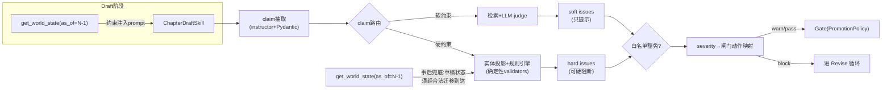

## 4. 一致性引擎(确定性validators + LLM-judge)

> 本节是 NovelForge 相对"裸 LLM 写作"的最大价值点。裸 LLM 靠注意力跨上下文"记忆"设定,本质是相似度联想,无法做全序比较、缺失边检测、状态机推演与算术守恒——而这恰恰是网文连载崩设定的高发区(境界倒退/越级、说漏不该知道的事、三天的路程一章走完、灵石越花越多、伏笔挖了不填)。本节给出一条把"事后纠错"升级为"写时约束 + 事后兜底"的双轨流水线,严格遵循硬原则 1/3/7。
>
> 全局术语、表名、状态机命名与第 10 节《数据契约与命名权威》一致;World State Store 的完整 DDL 详见第 2 节《存储与数据模型》,本节只在算法需要时引用字段,不重复建表语句(凡本节出现的 `CREATE TABLE` 均为本节新增的"一致性引擎专属"表)。检索路由(FTS5/sqlite-vec/RRF)详见第 6 节《记忆管线与召回》;晋升闸门 PromotionPolicy、staging、审计详见第 3 节《Canon 治理与双模式》;工艺层 craft_check 与本节 continuity_check 在 Check 阶段并行,详见第 5 节《网文工艺层》。

### 4.0 设计目标与在主循环中的位置

主循环 `Plan→Recall→Draft→Check(continuity‖craft)→Revise(≤N轮)→Gate→Commit` 中,本节负责 **Check 阶段的 continuity 流水线** 与 **Draft 阶段的写时约束注入**。



四条核心设计承诺:

1. **claim 分流而非一刀切**(§4.2):硬约束(确定性事实/算术/时序/全序/状态机/缺失边)走"实体投影 + 规则引擎",按 entity 直接拉全量历史、**不走 top_k 检索**(零漏召回);软约束(文风/氛围/动机/模糊设定)才走"检索 + LLM-judge"。
2. **确定性 validator 纯 Python、可单测**(§4.3):无 LLM、无网络、无随机,输入(world_state, claims)→输出(issues)是纯函数,每个 validator 配独立单测样例集。
3. **as-of 世界状态投影双用途**(§4.4):写时注入 prompt + 事后兜底校验。
4. **误报治理 + severity 闸门**(§4.5/§4.6):只有确定性硬约束可硬阻断;LLM 软判定一律只提示;白名单豁免 + 双指标小评测集防止"过度报警"反噬可用性。

### 4.1 claim 数据模型(Pydantic)

Check 阶段第一步是把章节草稿(L0)抽取为**结构化 claim 列表**。抽取用 `instructor + Pydantic`,`field_validator` 自愈重试(硬原则 11),抽取模型用 Haiku/Sonnet(硬原则 10),Opus 不参与抽取。

```python
from enum import Enum
from typing import Optional, Literal
from pydantic import BaseModel, Field, field_validator

class ClaimType(str, Enum):
    # —— 硬约束(确定性 validator)——
    POWER_LEVEL      = "power_level"       # 角色当前境界/修为
    KNOWLEDGE        = "knowledge"         # 角色言行所泄露/引用的信息
    TIMELINE         = "timeline"          # 事件发生的(相对/绝对)时间
    LOCATION_MOVE    = "location_move"     # 角色从 A 地移动到 B 地
    NUMERIC          = "numeric"           # 带单位的数值事实(年龄/距离/数量)
    ITEM_OWNERSHIP   = "item_ownership"    # 道具归属/获得/失去/消耗
    GIMMICK          = "gimmick"           # 金手指(系统/外挂)的使用
    FORESHADOW       = "foreshadow"        # 触及某条伏笔(强化/回收)
    # —— 软约束(LLM-judge)——
    TONE             = "tone"              # 文风/氛围
    MOTIVATION       = "motivation"        # 角色动机合理性
    SETTING_FUZZY    = "setting_fuzzy"     # 模糊世界设定的呼应

HARD_CLAIM_TYPES = {
    ClaimType.POWER_LEVEL, ClaimType.KNOWLEDGE, ClaimType.TIMELINE,
    ClaimType.LOCATION_MOVE, ClaimType.NUMERIC, ClaimType.ITEM_OWNERSHIP,
    ClaimType.GIMMICK, ClaimType.FORESHADOW,
}

class Claim(BaseModel):
    claim_id: str
    chapter: int                          # 该 claim 出现的章节号 N
    ctype: ClaimType
    subject_entity: Optional[str] = None  # 主体实体 canonical_name(路由用,见 §4.2)
    object_entity: Optional[str] = None   # 客体实体(如道具名、目的地)
    span: str                             # 原文片段(证据/可解释)
    span_offset: int = 0                  # 在 L0 草稿中的字符偏移(定位)
    # 结构化载荷(按 ctype 解释,validator 各取所需)
    payload: dict = Field(default_factory=dict)
    # 作者豁免/白名单标记(§4.5),由 ChapterDraftSkill 或人工显式打上
    exempt_tags: list[str] = Field(default_factory=list)

    @field_validator("subject_entity", "object_entity")
    @classmethod
    def normalize_entity(cls, v):
        # 别名归一化:统一映射到 entities.canonical_name(详见 §4.3.0)
        return EntityResolver.canonical(v) if v else v
```

`payload` 约定(validator 据此解析,抽取 prompt 中固定 schema):

| ctype | payload 关键字段 |
|---|---|
| `power_level` | `{rank_label:str, direction:"up"/"down"/"state", reason_tag?:str}` |
| `knowledge` | `{info_key:str, act:"reveal"/"reference"/"act_on"}` |
| `timeline` | `{event_key:str, rel_expr?:"三天后", rel_to_event?:str, abs_story_time?:iso}` |
| `location_move`| `{from_loc:str, to_loc:str, claimed_duration?:str}` |
| `numeric` | `{key:str, value:float, unit:str, op:"set"/"add"/"sub"}` |
| `item_ownership`| `{item:str, op:"gain"/"lose"/"consume"/"transfer", qty:int, counterparty?:str}` |
| `gimmick` | `{gimmick:str, action:str, cost?:dict}` |
| `foreshadow` | `{foreshadow_id:str, act:"reinforce"/"pay_off"/"mislead"}` |

### 4.2 claim 路由:硬约束 vs 软约束

路由是本节的"分诊台"。它决定每个 claim 用哪套机制核验,直接落实硬原则 1 与硬原则 4。

```python
def route_claim(claim: Claim) -> Literal["hard", "soft"]:
    """硬约束走实体投影+规则引擎;软约束走检索+LLM-judge。"""
    return "hard" if claim.ctype in HARD_CLAIM_TYPES else "soft"
```

两条路的取数策略**根本不同**:

* **硬约束路:实体投影 + 规则引擎(不走 top_k)。**
  关键点——硬约束**绝不用相似度检索取证据**。给定 `subject_entity`,直接按 entity 从 World State Store 拉**全量相关历史**(全序结构,SQL `WHERE entity=? ORDER BY chapter`),再喂给确定性 validator。理由:相似度检索是概率召回,会漏(top_k 截断 = 漏召回 = 漏报),而境界越级/缺失边这类问题恰恰要求"看全所有历史才能判定"。例如检测"角色泄露了不该知道的信息",必须拿到该角色**完整**的 `knowledge_edges` 集合,缺一条边就误判。

  ```python
  def gather_hard_context(claim: Claim, conn) -> "EntityProjection":
      ent = claim.subject_entity
      return EntityProjection(
          power_log   = sql_all(conn,
              "SELECT * FROM character_power_log WHERE entity=? AND chapter<=? ORDER BY chapter",
              ent, claim.chapter),
          knowledge   = sql_all(conn,
              "SELECT * FROM knowledge_edges WHERE knower=? AND learned_chapter<=?",
              ent, claim.chapter),
          timeline    = sql_all(conn,
              "SELECT * FROM timeline_events WHERE story_time IS NOT NULL ORDER BY story_time"),
          item_log    = sql_all(conn,
              "SELECT * FROM item_log WHERE owner=? AND chapter<=? ORDER BY chapter",
              ent, claim.chapter),
          # …其余 validator 各自需要的全量切片
      )
  ```

* **软约束路:检索 + LLM-judge。**
  软约束(文风一致、动机是否突兀、模糊设定呼应)无法用规则表达,走第 6 节的检索主路(实体/章节/status 结构化 SQL 为主、FTS5 关键词补充、sqlite-vec 查相似桥段为辅、RRF k=60 客户端只用排名),取回相关上下文后交 LLM-judge。LLM-judge 用 Sonnet 批量判定(硬原则 10:批量校验替代 per-claim fan-out),**产出一律是 soft issue,只提示不阻断**(§4.6)。

  ```python
  def check_soft_claims(soft_claims: list[Claim], conn, llm) -> list[Issue]:
      # 按 ctype 分桶,一次 prompt 批量判多个 claim(省 token、命中前缀缓存)
      ctx = retrieve_for_soft(soft_claims, conn)   # 第6节:实体优先+FTS5+vec+RRF
      verdicts = llm.judge_batch(soft_claims, ctx) # Sonnet,结构化输出
      return [Issue.from_soft(c, v) for c, v in zip(soft_claims, verdicts)
              if v.has_issue]
```

continuity_check 顶层编排:

```python
def continuity_check(draft_claims: list[Claim], chapter: int, conn, llm) -> "CheckReport":
    hard = [c for c in draft_claims if route_claim(c) == "hard"]
    soft = [c for c in draft_claims if route_claim(c) == "soft"]

    world = get_world_state(as_of_chapter=chapter - 1, conn=conn)   # §4.4
    hard_issues = run_all_validators(hard, world, conn)             # §4.3,纯Python
    hard_issues += reconcile_drafted_state(draft_claims, world, conn)  # §4.4 事后兜底

    soft_issues = check_soft_claims(soft, conn, llm)               # 检索+LLM-judge

    issues = apply_whitelist(hard_issues + soft_issues, conn)      # §4.5 误报治理
    return CheckReport(chapter=chapter, issues=issues,
                       gate_action=decide_gate(issues, config))    # §4.6
```

### 4.3 逐个确定性 validator(纯 Python,可单测)

所有 validator 共享统一签名,无副作用、无 LLM、无随机——这是它们"最易单测、最易维护"的根本原因(硬原则 7)。`networkx` 仅在查询期从 SQLite 实时 build 内存视图,跑完即弃、不持久化(硬原则 11)。

```python
class Issue(BaseModel):
    code: str                # 机器码,如 "POWER_NONMONOTONIC"
    severity: Literal["critical", "major", "minor", "info"]
    kind: Literal["hard", "soft"]
    claim_id: str
    chapter: int
    message: str             # 人读说明(含证据 span 与历史出处)
    evidence_refs: list[str] # 指向 facts/fact_revisions/*_log 行,可点击溯源
    suggested_fix: Optional[str] = None

# validator 协议:纯函数 (claims, world, conn) -> list[Issue]
Validator = Callable[[list[Claim], "WorldState", "Connection"], list[Issue]]
```

#### 4.3.0 前置:名字规范化(EntityResolver)

最早做、最易测(硬原则 7 的 MVP 第一项)。`entities(canonical_name, aliases)` 提供别名→规范名映射;所有 validator 在比对前先归一化,避免"叶凡/凡哥/叶天帝"被当成三个人。

```python
class EntityResolver:
    @staticmethod
    def canonical(name: str) -> str:
        # 命中 aliases JSON 则返回 canonical_name,否则原样(并可记一条 unknown_entity info)
        row = ALIAS_INDEX.get(name.strip())
        return row.canonical_name if row else name.strip()
```

#### 4.3.1 境界单调性 / 越级检测 — `validate_power_monotonicity`

**模型**:`power_ranks` 是**有序枚举**(`rank_order` 整数全序,如 炼气=10 < 筑基=20 < 金丹=30 …);`character_power_log(entity, chapter, rank_label, delta_reason, author_flag)` 记录每次境界变化。

**规则**:
1. **单调性**:正常情况下角色境界随章节非递减。出现下降时,必须有合法标注(`author_flag ∈ {重伤跌境, 自废修为, 封印, 境界跌落_情节合法}`),否则 `POWER_NONMONOTONIC`(critical)。
2. **越级**:相邻两条境界记录的 `rank_order` 跨度超过 `max_jump_per_step`(config,默认 1 级)且无合法理由(顿悟/丹药/外挂,需 `gimmick_usage_log` 或 `item_log` 佐证)时,报 `POWER_LEVEL_SKIP`(major)。
3. **claim 一致**:本章 claim 的 `rank_label` 必须 ≥ 历史最新合法境界(扣除合法下降),否则角色"无故倒退",报 `POWER_REGRESSION`(critical)。

```python
def validate_power_monotonicity(claims, world, conn) -> list[Issue]:
    issues = []
    rank_order = world.rank_order_map  # {rank_label: int}, 来自 power_ranks
    for c in [c for c in claims if c.ctype == ClaimType.POWER_LEVEL]:
        ent = c.subject_entity
        history = world.power_history(ent)            # 全量,已 ORDER BY chapter
        cur_label = c.payload["rank_label"]
        cur = rank_order.get(cur_label)
        if cur is None:
            issues.append(Issue(code="POWER_UNKNOWN_RANK", severity="major",
                kind="hard", claim_id=c.claim_id, chapter=c.chapter,
                message=f"未知境界标签『{cur_label}』,不在 power_ranks 枚举中",
                evidence_refs=[c.claim_id])); continue
        if not history:
            continue  # 首次出现,无历史可比
        prev = history[-1]
        prev_order = rank_order[prev.rank_label]
        # —— 下降检测 ——
        if cur < prev_order:
            if c.payload.get("reason_tag") in LEGAL_DOWN_REASONS \
               or "intentional_power_drop" in c.exempt_tags:
                continue  # 合法跌境(作者标注),放行
            issues.append(Issue(code="POWER_REGRESSION", severity="critical",
                kind="hard", claim_id=c.claim_id, chapter=c.chapter,
                message=(f"{ent} 境界从『{prev.rank_label}』(第{prev.chapter}章)"
                         f"倒退到『{cur_label}』,无合法跌境标注"),
                evidence_refs=[prev.ref, c.claim_id],
                suggested_fix="若为重伤跌境,请在草稿打 reason_tag=重伤跌境"))
        # —— 越级检测 ——
        elif cur - prev_order > world.config.max_jump_per_step * world.rank_step:
            justified = world.has_breakthrough_aid(ent, c.chapter)  # 丹药/外挂佐证
            if not justified and "intentional_leap" not in c.exempt_tags:
                issues.append(Issue(code="POWER_LEVEL_SKIP", severity="major",
                    kind="hard", claim_id=c.claim_id, chapter=c.chapter,
                    message=(f"{ent} 从『{prev.rank_label}』直跳『{cur_label}』,"
                             f"跨度超 max_jump_per_step,且无丹药/外挂/顿悟佐证"),
                    evidence_refs=[prev.ref, c.claim_id]))
    return issues
```

#### 4.3.2 知情者越权检测 — `validate_knowledge_edges`

网文最隐蔽的崩点:角色说出/表现出**他不该知道**的信息("不该知道" = 知情者图里**缺失的边**,硬原则 1 的"缺失边检测")。

**模型**:`knowledge_edges(knower, info_key, learned_chapter, source, public_from_chapter, secrecy_level)` 是**只增**的知情者图(完整 DDL 含 `public_from_chapter INTEGER NULL`、`secrecy_level TEXT` 两列详见第 2 节);角色 `ent` 在第 N 章的知情集 = `{info_key | edge(ent, info_key).learned_chapter <= N}`。

**规则**:对每个 `knowledge` 类 claim,若 `act ∈ {reveal, reference, act_on}` 涉及 `info_key`,而 `info_key ∉ knowledge_set(ent, N)`,则报 `KNOWLEDGE_LEAK`(critical)——除非该 info 已转为公共知识(`is_public(info, N)` ⟺ `public_from_chapter IS NOT NULL AND public_from_chapter <= N`;多边取 `MIN(public_from_chapter)`,详见第 2 节)或带 `planted_misdirection`/`unreliable_narrator` 豁免(§4.5)。

```python
def validate_knowledge_edges(claims, world, conn) -> list[Issue]:
    issues = []
    for c in [c for c in claims if c.ctype == ClaimType.KNOWLEDGE]:
        ent, info = c.subject_entity, c.payload["info_key"]
        known = world.knowledge_set(ent, c.chapter)     # 全量边,集合查询
        if info in known or world.is_public(info, c.chapter):
            continue
        if {"planted_misdirection", "unreliable_narrator"} & set(c.exempt_tags):
            continue  # 故意误导/不可靠叙述者,放行(§4.5)
        issues.append(Issue(code="KNOWLEDGE_LEAK", severity="critical",
            kind="hard", claim_id=c.claim_id, chapter=c.chapter,
            message=(f"{ent} 在第{c.chapter}章{c.payload['act']}了信息『{info}』,"
                     f"但其知情集中缺失该边(从未习得)。"
                     f"已知:{sorted(known)[:8]}…"),
            evidence_refs=[c.claim_id],
            suggested_fix=f"若合理,请补一条 knowledge_edges({ent},{info},≤{c.chapter})"))
    return issues
```

#### 4.3.3 时间线一致性 — `validate_timeline`

**模型**:`timeline_events(event_key, story_time, abs_lo, abs_hi, source_chapter)`,**绝对 story_time** 是唯一真相;相对时间("三天后")在**入库时即解析为绝对区间**(见下 `resolve_relative`),不在校验期才算。`networkx` 拓扑排序做**环检测**(A 在 B 后、B 在 C 后、C 又在 A 后)。

**入库解析(写时,非校验期)**:

```python
def resolve_relative(rel_expr: str, rel_to_event: str, world) -> tuple[ISO, ISO]:
    """'三天后' + 锚点事件 → 绝对区间 [lo, hi];存入 timeline_events.abs_lo/abs_hi。"""
    anchor = world.event_abs(rel_to_event)          # 锚点的绝对区间
    delta = parse_cn_duration(rel_expr)             # '三天后'->timedelta(days=3) 等
    return (anchor.lo + delta, anchor.hi + delta)
```

**校验规则**:
1. **环检测**:用 `before/after` 偏序边 build `networkx.DiGraph`,`nx.find_cycle` 命中即 `TIMELINE_CYCLE`(critical)。
2. **绝对序矛盾**:claim 声称的事件绝对时间与已存事件冲突(区间不相容),报 `TIMELINE_CONTRADICTION`(major)。
3. **回拨**:本章事件 story_time 早于角色在场的上一事件(同主体时间倒流),报 `TIMELINE_BACKWARD`(major)。

```python
import networkx as nx

def validate_timeline(claims, world, conn) -> list[Issue]:
    issues = []
    # 1) 拓扑环检测:查询期实时 build,跑完即弃(硬原则11)
    g = nx.DiGraph()
    for e in world.timeline_order_edges():           # (before, after)
        g.add_edge(e.before, e.after)
    try:
        cyc = nx.find_cycle(g, orientation="original")
        issues.append(Issue(code="TIMELINE_CYCLE", severity="critical",
            kind="hard", claim_id="-", chapter=world.as_of + 1,
            message=f"时间线存在环:{[u for u,_,_ in cyc]}",
            evidence_refs=[u for u, _, _ in cyc]))
    except nx.NetworkXNoCycle:
        pass
    # 2/3) 绝对序与回拨
    for c in [c for c in claims if c.ctype == ClaimType.TIMELINE]:
        if c.payload.get("rel_expr"):
            lo, hi = resolve_relative(c.payload["rel_expr"],
                                      c.payload["rel_to_event"], world)
        else:
            lo = hi = c.payload.get("abs_story_time")
        ev = c.payload["event_key"]
        if (clash := world.abs_clash(ev, lo, hi)):
            issues.append(Issue(code="TIMELINE_CONTRADICTION", severity="major",
                kind="hard", claim_id=c.claim_id, chapter=c.chapter,
                message=f"事件『{ev}』绝对时间[{lo},{hi}] 与既有[{clash}]不相容",
                evidence_refs=[c.claim_id]))
    return issues
```

#### 4.3.4 地理移动耗时预算 — `validate_travel_budget`

**模型**:`geo_locations(loc, x, y, region)` + `travel_edges(from_loc, to_loc, min_hours, mode)`。角色从 A 到 B 的**最短耗时下界**用 `networkx.shortest_path`(权 `min_hours`)算;若 claim 给出的可用时间 < 下界,即"瞬移嫌疑"。

**规则**:`location_move` claim 的 `claimed_duration`(或由相邻时间线推出的可用时长)< `shortest_hours(from,to) / speed_factor(mode/外挂)`,报 `TRAVEL_TOO_FAST`(major);目的地不可达(图中无路径)报 `TRAVEL_UNREACHABLE`(major)。

```python
def validate_travel_budget(claims, world, conn) -> list[Issue]:
    issues = []
    g = world.travel_graph()  # networkx,权=min_hours
    for c in [c for c in claims if c.ctype == ClaimType.LOCATION_MOVE]:
        a, b = c.payload["from_loc"], c.payload["to_loc"]
        try:
            min_h = nx.shortest_path_length(g, a, b, weight="min_hours")
        except nx.NetworkXNoPath:
            issues.append(Issue(code="TRAVEL_UNREACHABLE", severity="major",
                kind="hard", claim_id=c.claim_id, chapter=c.chapter,
                message=f"{a}→{b} 在 travel_edges 中无可达路径", evidence_refs=[c.claim_id]))
            continue
        avail = world.available_hours(c)                    # 由时间线推/claim 给
        speed = world.speed_factor(c.subject_entity, c.chapter)  # 飞剑/传送阵/外挂
        if avail is not None and avail < min_h / speed:
            issues.append(Issue(code="TRAVEL_TOO_FAST", severity="major",
                kind="hard", claim_id=c.claim_id, chapter=c.chapter,
                message=(f"{c.subject_entity} 从{a}到{b}最少需{min_h:.0f}h(speed×{speed}),"
                         f"但可用仅{avail:.0f}h,疑似瞬移"),
                evidence_refs=[c.claim_id],
                suggested_fix="补传送手段(填 travel_edges 或 gimmick)或拉长时间线"))
    return issues
```

#### 4.3.5 数值守恒 — `validate_numeric_conservation`

**模型**:`numeric_facts(entity, key, value, unit, chapter, op)`,**带 unit**。同一 `(entity,key)` 的 `set/add/sub` 序列须自洽:不可既"年龄 18 岁"又"年方二八(16)";累加型(灵石、贡献点)不可凭空出现负余额。单位不一致(`里` vs `公里`)先归一再比。

**规则**:`NUMERIC_UNIT_MISMATCH`(minor,单位无法换算)、`NUMERIC_CONTRADICTION`(major,`set` 冲突)、`NUMERIC_NEGATIVE_BALANCE`(major,累加余额 < 0)。

```python
def validate_numeric_conservation(claims, world, conn) -> list[Issue]:
    issues = []
    for c in [c for c in claims if c.ctype == ClaimType.NUMERIC]:
        ent, key = c.subject_entity, c.payload["key"]
        unit, val, op = c.payload["unit"], c.payload["value"], c.payload["op"]
        base = world.numeric_state(ent, key)        # {value, unit} 当前累计
        if base and not units_convertible(base.unit, unit):
            issues.append(Issue(code="NUMERIC_UNIT_MISMATCH", severity="minor",
                kind="hard", claim_id=c.claim_id, chapter=c.chapter,
                message=f"{ent}.{key} 单位『{unit}』与既有『{base.unit}』无法换算",
                evidence_refs=[c.claim_id])); continue
        v = to_unit(val, unit, base.unit) if base else val
        if op == "set" and base and abs(v - base.value) > EPS:
            issues.append(Issue(code="NUMERIC_CONTRADICTION", severity="major",
                kind="hard", claim_id=c.claim_id, chapter=c.chapter,
                message=f"{ent}.{key} 声称={v}{base.unit},与既有{base.value}冲突",
                evidence_refs=[c.claim_id]))
        if op in ("sub", "add"):
            new = (base.value if base else 0) + (v if op == "add" else -v)
            if new < 0:
                issues.append(Issue(code="NUMERIC_NEGATIVE_BALANCE", severity="major",
                    kind="hard", claim_id=c.claim_id, chapter=c.chapter,
                    message=f"{ent}.{key} 余额将为负({new}{base.unit})", evidence_refs=[c.claim_id]))
    return issues
```

#### 4.3.6 道具库存 — `validate_item_inventory`

**模型**:`item_ownership(owner, item, qty)`(当前快照,投影产物)+ `item_log(owner, item, op, qty, counterparty, chapter)`(只增账本)。

**规则**:不能消耗/失去未持有的道具(`ITEM_NOT_OWNED`,major);转赠后原主仍使用(双花,`ITEM_DOUBLE_SPEND`,major);数量越界(`ITEM_QTY_UNDERFLOW`,major)。投影 `item_ownership` = 对 `item_log` 按章节回放求和(§4.4 同一套 `replay` 逻辑)。

```python
def validate_item_inventory(claims, world, conn) -> list[Issue]:
    issues = []
    for c in [c for c in claims if c.ctype == ClaimType.ITEM_OWNERSHIP]:
        owner, item = c.subject_entity, c.payload["item"]
        op, qty = c.payload["op"], c.payload["qty"]
        held = world.item_qty(owner, item)          # = replay(item_log) 截至 N-1
        if op in ("lose", "consume", "transfer") and held < qty:
            code = "ITEM_DOUBLE_SPEND" if held == 0 and world.ever_owned(owner, item) \
                   else "ITEM_NOT_OWNED"
            issues.append(Issue(code=code, severity="major",
                kind="hard", claim_id=c.claim_id, chapter=c.chapter,
                message=(f"{owner} 试图{op} {qty}×『{item}』,但持有仅{held}"),
                evidence_refs=[c.claim_id],
                suggested_fix="补 item_log 获得记录,或修正情节"))
    return issues
```

#### 4.3.7 金手指规则(状态机) — `validate_gimmick`

**模型**:`gimmick_rules(gimmick, fsm_json, cooldown, cost_schema, preconditions)` 定义**状态机**(如"系统未激活→已激活→升级中→冷却");`gimmick_usage_log(gimmick, action, chapter, cost, resulting_state)` 记每次使用。

**规则**:
1. **非法迁移**:`action` 在当前 FSM 状态下无对应转移边 → `GIMMICK_ILLEGAL_TRANSITION`(critical)。
2. **冷却违反**:距上次使用 < `cooldown` → `GIMMICK_COOLDOWN_VIOLATION`(major)。
3. **代价不符 / 资源不足**:`cost` 不满足 `cost_schema` 或扣减后资源为负(联动 §4.3.5)→ `GIMMICK_COST_VIOLATION`(major)。
4. **前置未满足**:`preconditions` 未达(如"未达金丹不可解锁三层")→ `GIMMICK_PRECONDITION`(major)。

```python
def validate_gimmick(claims, world, conn) -> list[Issue]:
    issues = []
    for c in [c for c in claims if c.ctype == ClaimType.GIMMICK]:
        g = c.payload["gimmick"]; action = c.payload["action"]
        fsm = world.gimmick_fsm(g)                   # 从 gimmick_rules 反序列化
        state = world.gimmick_state(g, c.chapter)    # = replay(usage_log)
        if action not in fsm.transitions.get(state, {}):
            issues.append(Issue(code="GIMMICK_ILLEGAL_TRANSITION", severity="critical",
                kind="hard", claim_id=c.claim_id, chapter=c.chapter,
                message=f"金手指『{g}』在状态『{state}』下不允许动作『{action}』",
                evidence_refs=[c.claim_id])); continue
        if (last := world.gimmick_last_use(g, c.chapter)) is not None \
           and c.chapter - last < fsm.cooldown:
            issues.append(Issue(code="GIMMICK_COOLDOWN_VIOLATION", severity="major",
                kind="hard", claim_id=c.claim_id, chapter=c.chapter,
                message=f"『{g}』冷却{fsm.cooldown}章未到(上次第{last}章)", evidence_refs=[c.claim_id]))
        if not fsm.cost_ok(c.payload.get("cost"), world, c):
            issues.append(Issue(code="GIMMICK_COST_VIOLATION", severity="major",
                kind="hard", claim_id=c.claim_id, chapter=c.chapter,
                message=f"『{g}』使用代价不满足 cost_schema 或资源不足", evidence_refs=[c.claim_id]))
    return issues
```

#### 4.3.8 伏笔到期扫描(状态机自动置 overdue) — `scan_foreshadow_overdue`

与上面 7 个不同,这是**主动扫描型** validator:不只校验本章 claim,还**每章扫全表**,把超期未回收的伏笔自动置 `overdue`。

**模型**:`foreshadow(id, label, planted_chapter, deadline_chapter, status, reinforced_chapters)`,状态机 `planted→reinforced→misled→paid_off→overdue`。

**规则**:
* 本章 claim 触及伏笔(`reinforce`/`pay_off`/`mislead`)→ 推进状态机,非法迁移报 `FORESHADOW_ILLEGAL_STATE`(minor)。
* 扫描:`status ∉ {paid_off, abandoned}` 且 `chapter > deadline_chapter` → **自动置 `overdue`** 并产 `FORESHADOW_OVERDUE`(major,提醒"挖了坑没填")。注意:这是工艺/追更力问题但用确定性表达,issue 进 continuity_check 流;与第 5 节工艺层 `foreshadow` 表共用同一张表。

```python
def scan_foreshadow_overdue(claims, world, conn) -> list[Issue]:
    issues, n = [], world.as_of + 1
    # 1) 本章 claim 推进状态机
    for c in [c for c in claims if c.ctype == ClaimType.FORESHADOW]:
        fs = world.foreshadow(c.payload["foreshadow_id"])
        if not fs.can_transition(c.payload["act"]):
            issues.append(Issue(code="FORESHADOW_ILLEGAL_STATE", severity="minor",
                kind="hard", claim_id=c.claim_id, chapter=n,
                message=f"伏笔『{fs.label}』状态{fs.status}不可执行{c.payload['act']}",
                evidence_refs=[c.claim_id]))
    # 2) 全表到期扫描(主动),写回 status=overdue(append 一条状态变更,非物理改)
    for fs in world.all_open_foreshadows():
        if fs.status not in ("paid_off", "abandoned") and n > fs.deadline_chapter:
            mark_overdue(conn, fs.id, n)   # append-only 状态变更(详见第3节审计)
            issues.append(Issue(code="FORESHADOW_OVERDUE", severity="major",
                kind="hard", claim_id="-", chapter=n,
                message=(f"伏笔『{fs.label}』第{fs.planted_chapter}章埋下,"
                         f"deadline 第{fs.deadline_chapter}章已过仍未回收,自动置 overdue"),
                evidence_refs=[fs.id]))
    return issues
```

#### 4.3.9 validator 注册与单测约定

```python
ALL_VALIDATORS: list[Validator] = [
    validate_power_monotonicity, validate_knowledge_edges, validate_timeline,
    validate_travel_budget, validate_numeric_conservation, validate_item_inventory,
    validate_gimmick, scan_foreshadow_overdue,
]
def run_all_validators(claims, world, conn) -> list[Issue]:
    out = []
    for v in ALL_VALIDATORS:
        out.extend(v(claims, world, conn))   # 纯函数,可独立 fuzz/单测
    return out
```

单测约定:每个 validator 配 `tests/validators/test_<name>.py`,用 in-memory SQLite(`:memory:`)+ 固定 fixture(无 LLM、无网络),覆盖"正例放行 / 反例命中 / 合法豁免放行"三类。这是 MVP 第一批落地物(硬原则 7)。

### 4.4 as-of 世界状态投影 `get_world_state(as_of_chapter=N)`

落实硬原则 3:一致性靠**世界状态模拟**而非相似度检索。投影把 World State Store 的只增账本(`*_log`)按章节**回放(replay)**到某一时点,得到该时点的世界快照。

```python
class WorldState(BaseModel):
    as_of: int
    rank_order_map: dict                     # power_ranks 全序
    _power: dict                             # entity -> 当前境界
    _knowledge: dict                         # entity -> set(info_key)
    _items: dict                             # (owner,item) -> qty
    _numeric: dict                           # (entity,key) -> {value,unit}
    _gimmick: dict                           # gimmick -> state
    _timeline: list                          # 绝对序事件
    config: "EngineConfig"
    # … 便捷查询方法:power_history/knowledge_set/item_qty/gimmick_state/…

def get_world_state(as_of_chapter: int, conn) -> WorldState:
    """把各 *_log 回放到第 N 章末,得到 as-of(N) 快照。同库同事务读,可缓存。"""
    return WorldState(
        as_of=as_of_chapter,
        rank_order_map=load_rank_order(conn),
        _power   = replay_power(conn, as_of_chapter),
        _knowledge=replay_knowledge(conn, as_of_chapter),
        _items   = replay_items(conn, as_of_chapter),     # 同 §4.3.6 的 replay
        _numeric = replay_numeric(conn, as_of_chapter),
        _gimmick = replay_gimmick(conn, as_of_chapter),   # 同 §4.3.7 的 replay
        _timeline= load_timeline(conn),
        config=load_engine_config(conn),
    )
```

**用途一:写时约束注入 prompt(Draft 阶段)。** 起草第 N 章前,取 `get_world_state(as_of_chapter=N-1)`,把与本章 beat sheet 相关实体的**当前硬状态**渲染成简洁约束块,注入 ChapterDraftSkill 的 prompt——让 LLM 一开始就知道"叶凡现在是金丹期、身上有 3 块灵石、还不知道反派身份"。注意缓存纪律(硬原则 10):该约束块属于**易变内容**,必须放在 prompt 的**可变区**,绝不污染 bible/风格/约束的 1h 稳定前缀。

```python
def build_constraint_block(world: WorldState, beat_entities: list[str]) -> str:
    lines = ["## 写时硬约束(as-of 第%d章,不得违反)" % world.as_of]
    for e in beat_entities:
        lines.append(f"- {e}: 境界={world.power(e)}; "
                     f"知情集={sorted(world.knowledge_set(e, world.as_of))[:6]}…; "
                     f"持有={world.items_of(e)}; 关键数值={world.numeric_of(e)}")
    return "\n".join(lines)   # 注入 prompt 可变区,不进稳定前缀
```

**用途二:事后兜底——草稿状态须从 as-of(N) 经合法迁移到达(Check 阶段)。** 即使写时注入了约束,LLM 仍可能写飞。事后兜底把"草稿声称的世界状态"与"从 as-of(N-1) 出发、应用本章合法迁移后的预期状态"做差,任何"凭空跳变"都暴露:

```python
def reconcile_drafted_state(draft_claims, world_prev: WorldState, conn) -> list[Issue]:
    """草稿终态 = as-of(N-1) ⊕ 本章合法迁移。若草稿声称的状态无法由合法迁移到达,报错。"""
    expected = world_prev.copy()
    issues = []
    for c in topo_order(draft_claims):           # 按因果/时间序应用
        transition = as_transition(c)            # claim -> 状态迁移算子
        if not expected.can_apply(transition):   # 非法迁移(越级/双花/越权…)
            issues.append(Issue(code="STATE_UNREACHABLE", severity="critical",
                kind="hard", claim_id=c.claim_id, chapter=c.chapter,
                message=(f"草稿声称的状态变更『{transition}』无法由 as-of(第{world_prev.as_of}章)"
                         f"经合法迁移到达"),
                evidence_refs=[c.claim_id]))
        else:
            expected.apply(transition)
    return issues
```

写时注入是"防",事后兜底是"补"——两者用**同一套 replay/迁移逻辑**,所以不会出现"注入时按规则 A、校验时按规则 B"的偏差。

### 4.5 误报治理:白名单豁免 + 双指标评测集

一致性引擎最大的反作用力是**误报**(把作者有意为之的设定当 bug 报),误报多了作者就关掉它。三道闸:

**(1)白名单豁免(intentional contradiction / unreliable narrator / planted misdirection)。**
作者可在草稿、章节卡或 fact 上显式打豁免标记,validator 命中后**主动放行并降级为 info**(留痕但不阻断)。

```sql
-- 一致性引擎专属表:作者声明的"故意不一致",优先于所有硬阻断
CREATE TABLE consistency_exemptions (
    id              INTEGER PRIMARY KEY,
    scope           TEXT NOT NULL,     -- 'chapter' | 'entity' | 'claim' | 'info_key'
    scope_ref       TEXT NOT NULL,     -- 章节号 / canonical_name / claim_id / info_key
    exempt_tag      TEXT NOT NULL,     -- 'intentional_contradiction'|'unreliable_narrator'
                                       -- |'planted_misdirection'|'intentional_power_drop'|…
    rule_codes      TEXT,              -- JSON: 仅豁免这些 Issue.code(NULL=全部)
    reason          TEXT NOT NULL,     -- 必填理由(审计可读)
    valid_from_chapter INTEGER,
    valid_to_chapter   INTEGER,        -- NULL=长期;"反派身份"误导到回收章自动失效
    created_by      TEXT NOT NULL,     -- actor
    created_at      TEXT NOT NULL
);
CREATE INDEX idx_exempt_scope ON consistency_exemptions(scope, scope_ref);
```

```python
def apply_whitelist(issues: list[Issue], conn) -> list[Issue]:
    out = []
    for it in issues:
        ex = match_exemption(conn, it)       # 按 scope/ref/rule_codes/章节区间匹配
        if ex:
            it = it.copy(update={"severity": "info",
                "message": it.message + f"  [已豁免:{ex.exempt_tag} — {ex.reason}]"})
        out.append(it)
    return out
```

`planted_misdirection` 的妙处:它带 `valid_to_chapter`——误导只在"反派真身揭晓前"豁免;一旦过了回收章仍有矛盾,豁免自动失效、重新报错,防止"用豁免掩盖真 bug"。

**(2)硬/软分权:只有确定性硬约束能硬阻断,LLM 软判定一律只提示。**
这是误报治理的体制性保障:LLM-judge 本身概率性、会幻觉,**绝不允许它 block 一章**。即便 LLM-judge 报 critical,经 `decide_gate` 也最多映射为 `warn`(§4.6)。

```python
def cap_soft_severity(issues):
    for it in issues:
        if it.kind == "soft" and it.severity == "critical":
            it.severity = "major"     # 软判定封顶,永不触发硬阻断
    return issues
```

**(3)误报/漏报双指标小评测集。**
维护一个**人工标注的金标准评测集**(`eval/consistency_gold/`):每条样例 = (章节草稿片段 + world_state fixture + 期望 issues)。CI 跑回归,产**双指标**:

* **误报率(False Positive Rate)** = 报了但金标准里没有的 issue 数 / 报告总数 —— 衡量"扰民程度"。
* **漏报率(False Negative Rate / miss rate)** = 金标准有但没报的 / 金标准总数 —— 衡量"漏抓程度"。

```python
def evaluate(gold_set, conn_factory) -> dict:
    tp = fp = fn = 0
    for case in gold_set:
        conn = conn_factory(case.world_fixture)
        got = {(i.code, i.claim_id) for i in
               continuity_check(case.claims, case.chapter, conn, NoopLLM()).issues
               if i.severity != "info"}
        want = {(c, r) for c, r in case.expected}
        tp += len(got & want); fp += len(got - want); fn += len(want - got)
    return {"false_positive_rate": fp / max(tp + fp, 1),
            "miss_rate":           fn / max(tp + fn, 1),
            "tp": tp, "fp": fp, "fn": fn}
```

阈值在 CI 设守门(如硬约束 miss_rate=0 必须保持、FPR 回归超过基线则 fail),保证"加规则不引入新误报、改规则不放过老 bug"。LLM-judge 部分用 `NoopLLM` 替身使确定性部分可复现。

### 4.6 severity → 闸门动作映射(可配置)

issue 算出后,`decide_gate` 把它们映射为本章的**闸门动作**,落实硬原则 8 与术语表 `config.canon_governance`。核心铁律:**硬约束(hard)的 critical 在 auto 模式下也必须阻断该章 commit,强制进 Revise 循环**——这正是双模式"同一管线在闸门处分叉,但硬一致性不分叉"的体现(硬原则 5)。

```yaml
# config.canon_governance.continuity_gate(可配置)
continuity_gate:
  mode: hybrid                 # 与 canon_governance.mode 联动
  severity_action:            # severity → 动作(hard 与 soft 分别可配)
    hard:
      critical: block          # 必阻断;auto 模式同样阻断,进 revise
      major:    block          # 默认阻断,可调 warn
      minor:    warn
      info:     pass
    soft:
      critical: warn           # 软判定封顶 warn(§4.5 cap)
      major:    warn
      minor:    warn
      info:     pass
  revise_max_rounds: 3         # circuit breaker:超轮即升级人审(auto 也是)
  on_max_rounds: enqueue_review
```

```python
def decide_gate(issues: list[Issue], config) -> "GateAction":
    issues = cap_soft_severity(issues)
    sa = config.continuity_gate.severity_action
    actions = {sa[i.kind][i.severity] for i in issues}
    if "block" in actions:
        return GateAction.BLOCK          # → Revise 循环;硬 critical 即便 auto 也在此
    if "warn" in actions:
        return GateAction.WARN           # 放行进 Gate,但附警告供 PromotionPolicy 排序
    return GateAction.PASS
```

与双模式的接口:`decide_gate` 只决定"是否阻断 commit / 是否进 revise";**晋升到 canon 的最终决策由第 3 节 PromotionPolicy 负责**(读 `mode`、`require_human_for[]`、evidence_strength)。即:本节保证"草稿在硬一致上站得住",治理平面保证"站得住的才晋升,且高风险变更即便 auto 也走人审"。Revise 超 `revise_max_rounds` 触发 circuit breaker → `enqueue_review`(硬原则 10)。

### 4.7 端到端示例:境界越级如何被抓出

设定:`power_ranks` = 炼气(10) < 筑基(20) < 金丹(30) < 元婴(40);`max_jump_per_step=1`(即 rank_step=10,单步最多升一级)。叶凡(canonical_name)`character_power_log` 截至第 40 章:第 12 章=炼气、第 28 章=筑基、第 39 章=金丹。第 41 章草稿写道:"叶凡周身气息暴涨,一举突破至元婴期,俯瞰众人。"——且**无丹药/外挂/顿悟**佐证、无合法跌境/越级豁免。

**① Draft 写时注入(本应预防)。** 起草第 41 章前注入 `get_world_state(as_of_chapter=40)`:

```
## 写时硬约束(as-of 第40章,不得违反)
- 叶凡: 境界=金丹; 知情集={师门秘辛, 灵石矿脉…}…; 持有={灵石:3}; 关键数值={年龄:24岁}
```

LLM 仍写飞(注意力没守住约束)。

**② claim 抽取(Sonnet + instructor)。**

```json
{ "claim_id":"c41-07", "chapter":41, "ctype":"power_level",
  "subject_entity":"叶凡", "span":"一举突破至元婴期,俯瞰众人",
  "payload":{ "rank_label":"元婴", "direction":"up" }, "exempt_tags":[] }
```

**③ 路由。** `route_claim` → `ctype=power_level ∈ HARD_CLAIM_TYPES` → **hard**。走实体投影,**不走 top_k**:`gather_hard_context` 按 `entity='叶凡'` 拉 `character_power_log` 全量历史(三条)。

**④ 确定性 validator 命中。** `validate_power_monotonicity`:`prev=金丹(30)`,`cur=元婴(40)`,`cur - prev_order = 10`,而 `max_jump_per_step * rank_step = 1*10 = 10`——等于阈值不报;但**本例阈值设为单步≤1级即差值≤10 视合法、>10 越级**。改设第 39 章=筑基(更典型):`prev=20, cur=40, 差=20 > 10` → 越级。`has_breakthrough_aid('叶凡',41)` 查无丹药/外挂佐证、`exempt_tags` 无 `intentional_leap`,产出:

```json
{ "code":"POWER_LEVEL_SKIP", "severity":"major", "kind":"hard",
  "claim_id":"c41-07", "chapter":41,
  "message":"叶凡 从『筑基』直跳『元婴』,跨度超 max_jump_per_step,且无丹药/外挂/顿悟佐证",
  "evidence_refs":["plog:叶凡:ch39", "c41-07"] }
```

**⑤ 事后兜底交叉验证。** `reconcile_drafted_state`:`expected=as-of(40)` 中叶凡=筑基;应用迁移"筑基→元婴",`expected.can_apply` 检查相邻枚举发现跨 2 级且无外挂转移,返回 False → 额外产 `STATE_UNREACHABLE(critical)`("无法由 as-of(40) 经合法迁移到达")。两条 issue 相互印证,杜绝漏报。

**⑥ 白名单。** `apply_whitelist` 查 `consistency_exemptions`:`scope=claim/c41-07` 或 `scope=chapter/41` 无 `intentional_leap`/`intentional_power_drop` 记录 → 不豁免,severity 不变。

**⑦ 闸门。** `decide_gate`:hard 集合含 `critical`(STATE_UNREACHABLE)→ `sa.hard.critical = block` → `GateAction.BLOCK`。**即便 config.mode=auto_promote,本章 commit 也被阻断,进 Revise 循环**(硬原则 5/8)。Revise 时把这两条 issue 的 `message + suggested_fix` 回灌给 ChapterDraftSkill:或改写为"借飞升丹突破"(并补 `item_log` 飞升丹消耗,使 `has_breakthrough_aid` 为真)、或降为"金丹后期",或作者显式加 `intentional_leap` 豁免并填理由。修订后重跑 continuity_check 通过,方可进 Gate→Commit。若连续超 `revise_max_rounds=3` 仍 block → circuit breaker → `enqueue_review` 转人审。

**结论:** 同一个越级问题被两条独立确定性路径(单调性 validator + as-of 兜底)抓住,无需任何 LLM 判定、可单测可复现、有完整证据链(指向 `character_power_log` 第 39 章行),并在全自动模式下也强制阻断——这正是 NovelForge 相对裸 LLM 的核心价值。

> 交叉引用:World State Store 表结构详见第 2 节;claim 抽取所用检索与软约束召回详见第 6 节;PromotionPolicy/staging/promotion_log/审计与单条回滚详见第 3 节;craft_check(payoff/hook/tension)与本节并行详见第 5 节;Prompt 缓存纪律详见第 8 节、circuit breaker 预算详见第 7 节。
