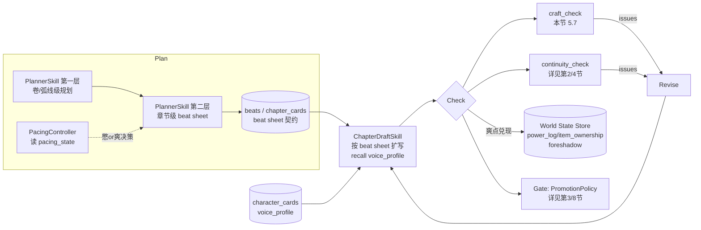

## 5. 网文工艺层(追更力得分系统)

> 本节对应硬原则 6(一致性是不扣分项、追更力是得分项——正交且都要建)。一致性引擎(World State Store + 确定性 validator,详见第 2、4 节)只负责"不写崩";本节定义的**网文工艺层**负责"写得让人想追更"。二者在主循环 `Check` 阶段以 `continuity_check ‖ craft_check` 双流水线**并行**运行,互不阻塞、各自产出 issues。
>
> 工艺层的一等数据(`beats / chapter_cards / character_cards / foreshadow / pacing_state`)与 canon 真相源(`facts / fact_revisions`)、World State Store 表(`power_ranks / item_ownership / ...`)**同库同事务**(单一 `novel.db`,WAL),由 `PlannerSkill` 产出、由 `ChapterDraftSkill` 消费、由 `PacingController` 维护、由 `craft_check` 校验。
>
> 设计主线:**规划即契约**——`PlannerSkill` 产出的逐章 beat sheet 是 `ChapterDraftSkill` 的强契约,扩写**不得改节拍**;爽点兑现**强制与 World State 联动**杜绝假爽点;`craft_check` 把"追更力"从主观感受降维成**可程序校验的得分项**。

---

### 5.1 总览:工艺层在主循环中的位置

主循环 `Plan → Recall → Draft → Check(continuity ‖ craft) → Revise(≤N轮) → Gate → Commit` 中,工艺层介入四个阶段:



要点:
- **Plan 两层**:卷/弧线级先定大结构与大爽点位置;章节级把每章拆成 beat sheet。`PacingController` 在章节级规划前介入,给出"下一章憋 or 爽"的决策。
- **Draft 受契约约束**:`ChapterDraftSkill` 拿 beat sheet 当契约扩写,**只能在 beat 之间填血肉,不能增删/重排/改极性 beat**;写对话必须先 `recall` 对应角色的 `voice_profile`。
- **Check 并行**:`craft_check` 与 `continuity_check` 并行,前者校验工艺得分(value_shift / 钩子强度 / 节奏 / 对话区分度),后者校验硬一致性。
- **爽点兑现写回 World State**:`craft_check` 通过后,爽点 beat 的兑现动作(升级/获得/打脸消费伏笔)以结构化提案进 staging,经 `Gate` 晋升后写 `character_power_log / item_ownership / item_log / foreshadow`——这是杜绝"假爽点"的机制根。

---

### 5.2 PlannerSkill 升级为两层规划

#### 5.2.1 第一层:卷/弧线级规划(arc plan)

第一层只在**卷开篇或大结构调整**时运行(对应 `PipelineManager` 的 L2 触发档:按卷或 3-5 章),产出:

- 本卷主弧线(arc)与子弧线:每弧线绑定 `start_chapter / end_chapter`、核心冲突、价值主轴(如"被轻视 → 被认可")。
- **大爽点(big payoff)位置**:每卷高潮处放 1 个大爽点,锚定章节区间;并在其前标记"足够蓄力"窗口(供 `PacingController` 使用)。
- 弧线级伏笔规划:哪些 `foreshadow` 在本卷 planted、哪些到期 paid_off(伏笔生命周期详见第 2 节)。

弧线级产物落 `chapter_cards`(卷头摘要)与 `beats`(粗粒度 tension_point / payoff_beat 标记),不展开到 beat sheet。

#### 5.2.2 第二层:章节级 beat sheet(逐章契约)

第二层为**每一章**产出一份 beat sheet——它是 `ChapterDraftSkill` 的**强契约**。每个 beat 含 6 个槽位:

| 槽位 | 字段 | 说明 |
|---|---|---|
| 目的 | `purpose` | 该 beat 在本章承担的叙事功能(铺垫/冲突升级/转折/兑现/留钩) |
| 价值极性起点 | `value_start` | beat 开始时主导价值的极性(见下方枚举) |
| 价值极性终点 | `value_end` | beat 结束时主导价值的极性;`value_start != value_end` 即一次 value_shift |
| 涉及角色 | `characters` | 引用 `character_cards.id` 列表(主导者/对手/旁观) |
| 信息差状态 | `knowledge_state` | 该 beat 后知情者图的变化引用(联动 `knowledge_edges`,详见第 2 节) |
| 预期情绪强度 | `intensity` | 1-5,供 `PacingController` 校验 tension_curve 是否符合"憋or爽"决策 |

**价值极性枚举(`polarity`)**:网文价值轴通常成对出现,beat sheet 用归一化极性表达,避免每章自造词:

```python
class Polarity(str, Enum):
    POS = "+"      # 正向(被认可/掌控/安全/胜)
    NEG = "-"      # 负向(被轻视/失控/危险/败)
    DPOS = "++"    # 强正向(碾压/大爽)
    DNEG = "--"    # 强负向(绝境/大憋)
    # 价值轴本身记在 value_axis 字段(如 "认可 vs 轻视" / "强 vs 弱" / "安全 vs 危险")
```

**强约束(由 `PlannerSkill` 自检 + `craft_check` 兜底,见 5.7):**

1. **每章 ≥ 1 个 value_shift**:本章至少存在一个 beat 满足 `value_start != value_end`(极性发生翻转或强度跨档)。
2. **章首尾极性相反**:本章第一个 beat 的 `value_start` 与最后一个 beat 的 `value_end` **极性方向必须相反**(`+`/`++` 视为正、`-`/`--` 视为负;正↔负 即满足)。这保证每章自身是一个"价值翻转"的最小单元,而非平铺直叙。
3. **章末 beat 必为 hook**:本章最后一个 beat 的 `beat_type` 必须是 `hook`,并携带 `hook_type` 与 `hook_strength`(见 5.5)。

#### 5.2.3 按 genre 可配置的节拍模板

`PlannerSkill` 第二层按 `config.craft.genre` 选择节拍模板。模板是 beat sheet 的**骨架**(beat 序列 + 推荐极性 + 推荐强度),`PlannerSkill` 在其上填具体内容。内置四套:

| genre | 模板代号 | 典型 beat 序列(极性走向) | 节奏特征 |
|---|---|---|---|
| 打脸流 | `face_slap` | 被轻视(-) → 隐忍蓄力(--) → 摊牌(±) → 实力碾压(++) → 旁观者震惊/收尾钩(hook) | 首尾极性强反转,大爽前必有"被轻视"伏笔可消费 |
| 种田 | `cozy_build` | 现状(±) → 小目标(+) → 小挫折(-) → 攻坚(+) → 小成就落地写 World State(++) → 余韵钩 | 强度平缓(多 2-3 档),爽点小而高频,重资源/库存增长 |
| 悬疑 | `mystery` | 异常(-) → 调查(±) → 误导/红鲱鱼(misled) → 信息差扩大(-) → 半解(+) → 更大谜团钩(hook,强度高) | 强依赖 `knowledge_edges` 与 `foreshadow.misled`,章末钩多为悬念型 |
| 无敌碾压 | `invincible` | 挑衅(-) → 出手(+) → 碾压(++) → 装逼/反差(++) → 新挑战者登场钩(hook) | 高频大爽,蓄力窗口短,强度长期高位,需 `PacingController` 防"爽到麻木" |

模板存为只读配置(JSON,从代码仓加载,非 SQLite),`PlannerSkill` 选模板后产出**实例化**的 beat sheet 写入 `beats` 表。模板缺省走 `face_slap`。

#### 5.2.4 beat sheet 的 JSON Schema

beat sheet 是 `PlannerSkill` → `ChapterDraftSkill` 的契约载体,落库到 `beats` 表(DDL 见 5.6),传递时序列化为如下结构(Pydantic 模型 + JSON Schema):

```python
from pydantic import BaseModel, Field, model_validator
from typing import Literal
from enum import Enum

class BeatType(str, Enum):
    setup         = "setup"          # 铺垫
    turn          = "turn"           # 转折
    payoff_beat   = "payoff_beat"    # 爽点兑现(必须联动 World State,见 5.4)
    tension_point = "tension_point"  # 冲突升级/蓄力/憋
    hook          = "hook"           # 章末断章钩子(每章末尾强制)

class Beat(BaseModel):
    beat_id: str
    seq: int                              # 章内顺序,从 0 起
    beat_type: BeatType
    purpose: str                          # 目的
    value_axis: str                       # 价值轴,如 "认可 vs 轻视"
    value_start: Literal["+","-","++","--"]   # 起点极性
    value_end:   Literal["+","-","++","--"]   # 终点极性
    characters: list[str] = Field(default_factory=list)      # character_cards.id
    knowledge_state: list[str] = Field(default_factory=list) # knowledge_edges 变更引用 (详见第2节)
    intensity: int = Field(ge=1, le=5)    # 预期情绪强度 1-5
    # 仅 payoff beat 必填:兑现联动(杜绝假爽点,见 5.4)
    payoff_binding: "PayoffBinding | None" = None
    # 仅 hook beat 必填:
    hook_type: "HookType | None" = None
    hook_strength: int | None = Field(default=None, ge=0, le=5)

class PayoffBinding(BaseModel):
    kind: Literal["power_up", "item_gain", "face_slap", "reveal"]
    # power_up → 写 character_power_log; item_gain → 写 item_ownership/item_log
    # face_slap → 必须消费一个先前 status="planted/reinforced" 且语义为"被轻视"的 foreshadow
    # reveal → 改 knowledge_edges
    target_entity: str | None = None      # entities.canonical_name
    consumes_foreshadow_id: str | None = None   # face_slap 必填
    expected_effect: str                  # 程序可校验的预期写回(如 "rank: 炼气→筑基")

class BeatSheet(BaseModel):
    chapter_no: int
    genre_template: str                   # face_slap / cozy_build / mystery / invincible
    arc_id: str
    beats: list[Beat]

    @model_validator(mode="after")
    def _enforce_contract(self):
        assert self.beats, "beat sheet 不可为空"
        # 约束3:章末必为 hook
        last = self.beats[-1]
        assert last.beat_type == BeatType.hook, "章末 beat 必须为 hook"
        assert last.hook_type is not None and last.hook_strength is not None
        # 约束1:每章 ≥1 个 value_shift
        shifts = [b for b in self.beats if _sign(b.value_start) != _sign(b.value_end)]
        assert len(shifts) >= 1, "每章至少 1 个 value_shift"
        # 约束2:章首尾极性相反
        assert _sign(self.beats[0].value_start) != _sign(last.value_end), \
            "章首极性与章尾极性必须相反"
        # payoff beat 必须带兑现联动
        for b in self.beats:
            if b.beat_type == BeatType.payoff_beat:
                assert b.payoff_binding is not None, "payoff beat 必须绑定 World State 兑现"
        return self

def _sign(p: str) -> int:               # 极性归一化为 +1 / -1
    return 1 if p.startswith("+") else -1
```

> **契约不可变约束**:`ChapterDraftSkill` 接收 `BeatSheet` 后,扩写产物必须**逐 beat 对齐**——不得增删 beat、不得改 `beat_type / value_start / value_end / payoff_binding / hook_type`。`craft_check` 通过把草稿与 beat sheet 做结构对齐来强制此约束(见 5.7)。若起草确需偏离(罕见),走"修订提案"回到 `PlannerSkill` 重规划,而非在 Draft 阶段私改。

---

### 5.3 PacingController:跨章节奏与爽点节拍

`PacingController` 是无 LLM 的确定性组件(纯算术 + 状态读写),在章节级规划**之前**运行,产出"下一章憋 or 爽"的决策注入 `PlannerSkill`。它维护 `pacing_state` 表(DDL 见 5.6),核心维护两条数据:

- **跨章 tension_curve**:逐章的张力值序列(由各章 beat 的 `intensity` 聚合而来),用于判断曲线是否单调、是否长期高位(麻木)或长期低位(平淡)。
- **爽点节拍表**:`chapters_since_big_payoff`(距上次大爽点的章数)、`buildup`(蓄力值,憋的章节累加、放爽时清零)、`chapters_since_small_payoff`(距上次小爽点章数,以"千字"折算)。

#### 5.3.1 爽点分级与目标节奏

| 爽点级别 | 频率目标 | 触发 | 写回 World State |
|---|---|---|---|
| 小爽点(small payoff) | **高频**:每 2-3 千字一个 | 单 beat 的局部 value_shift 到 `+` | 轻量(可选写 item/knowledge) |
| 大爽点(big payoff) | **低频**:每卷高潮 1 个 | 弧线级规划锚定的 payoff beat,到 `++` | **强制**写回(见 5.4) |

**蓄力规则**:大爽点前必须有"足够蓄力"——`buildup >= buildup_threshold_for_big`(按 genre 配置,如 `face_slap=8`、`invincible=3`)。蓄力不足时 `PacingController` 即使到了规划的大爽点章,也会**推迟**并强制插入 1-2 章 `tension`(憋),反之蓄力过久(`buildup` 超上限)则强制提前放爽,防"太监式憋屈"。

#### 5.3.2 决策伪代码

```python
def decide_next_chapter(ps: PacingState, cfg: GenrePacingConfig, arc: ArcPlan, ch: int) -> PacingDecision:
    near_arc_climax = arc.is_big_payoff_window(ch)          # 弧线级规划标记的大爽点窗口

    # 1) 大爽点优先级最高,但门槛是足够蓄力
    if near_arc_climax:
        if ps.buildup >= cfg.buildup_threshold_for_big:
            return PacingDecision(mode="BIG_PAYOFF", reason="到达高潮窗口且蓄力充足")
        else:
            return PacingDecision(mode="TENSION", reason="高潮窗口但蓄力不足,先憋",
                                  force_extra_tension_chapters=cfg.buildup_threshold_for_big - ps.buildup)

    # 2) 防麻木:tension_curve 长期高位 → 强制回落(给个喘息/小憋)
    if ps.recent_high_streak >= cfg.max_high_streak:
        return PacingDecision(mode="EASE", reason="张力长期高位,防爽到麻木")

    # 3) 小爽点高频兜底:距上次小爽点太久 → 必须放小爽
    if ps.kchars_since_small_payoff >= cfg.small_payoff_every_kchars:
        return PacingDecision(mode="SMALL_PAYOFF", reason="小爽点间隔到点,高频兑现")

    # 4) 默认按弧线推进:有蓄力空间则继续憋,积累 buildup
    if ps.buildup < cfg.buildup_soft_cap:
        return PacingDecision(mode="TENSION", reason="蓄力中")
    return PacingDecision(mode="SMALL_PAYOFF", reason="蓄力达软上限,先放小爽避免憋过头")


def update_pacing_state_after_commit(ps: PacingState, chapter_card: ChapterCard) -> PacingState:
    intensity = chapter_card.aggregate_intensity      # 本章 beat intensity 的聚合(如末值或加权)
    ps.tension_curve.append((chapter_card.chapter_no, intensity))
    ps.kchars_since_small_payoff += chapter_card.kchars
    if chapter_card.had_big_payoff:
        ps.chapters_since_big_payoff = 0; ps.buildup = 0
        ps.kchars_since_small_payoff = 0
    elif chapter_card.had_small_payoff:
        ps.kchars_since_small_payoff = 0
        ps.buildup = max(0, ps.buildup - 1)           # 小爽轻度消耗蓄力
    else:
        ps.chapters_since_big_payoff += 1
        ps.buildup += 1                               # 憋一章 +1 蓄力
    ps.recent_high_streak = ps.recent_high_streak + 1 if intensity >= 4 else 0
    return ps
```

`PacingDecision.mode` 反向约束 `PlannerSkill` 章节级 beat sheet 的强度分布:`BIG_PAYOFF` → 本章须含 `payoff_beat` 且 `value_end="++"`;`TENSION` → 末值压在 `--/-`、不得出现 `++`;`SMALL_PAYOFF` → 含一个到 `+` 的 value_shift;`EASE` → 强度回落到 1-2。

---

### 5.4 爽点兑现强制与 World State 联动(杜绝假爽点)

**问题**:LLM 容易写"口头爽点"——主角嘴上赢了、读者却没看到实质改变(没升级、没拿到东西、打脸对象毫发无损)。这是"假爽点",追更力杀手。

**机制根**:任何 `payoff` beat 的 `payoff_binding` 都**必须**对应一次**可程序校验的 World State 写回**。`craft_check` 在草稿阶段校验"草稿是否兑现了 binding",`Gate` 晋升时把兑现动作写回对应 World State 表(同库同事务)。映射如下:

| `payoff_binding.kind` | 必须写回的 World State(详见第 2 节) | 程序校验点 |
|---|---|---|
| `power_up`(升级) | `character_power_log`(新增一行,`power_ranks` 单调递增) + `numeric_facts`(如战力值) | 草稿须出现境界/战力跃迁;`continuity_check` 校验单调性 |
| `item_gain`(获得) | `item_ownership`(归属变更) + `item_log`(获得事件) | 草稿须明确"获得 X";库存守恒由 validator 校验 |
| `face_slap`(打脸) | **消费一个先前 `foreshadow`**:把 `consumes_foreshadow_id` 指向的、语义为"被轻视/被看扁"的伏笔从 `planted/reinforced` 推进到 `paid_off` | 该 foreshadow 必须存在且未 paid_off;打脸对象须是当初轻视者 |
| `reveal`(揭示) | `knowledge_edges`(知情者图变更,信息差兑现) | 草稿须真正改变某角色的"知道/不知道" |

**`face_slap` 的强约束**(打脸流核心):大爽点若是打脸,**必须消费一个先前埋设的"被轻视"伏笔**。`PlannerSkill` 在弧线级规划时,会为每个 `face_slap` 大爽点反向检查:`foreshadow` 表里是否存在 `valid_from_chapter < 当前章` 且语义标签含"被轻视"且 `status in (planted, reinforced)` 的条目;不存在则**拒绝排这个打脸爽点**(或要求先补埋)。这把"无源打脸"(读者没见过主角被轻视,突然就打脸了)挡在规划期。

```python
def validate_payoff_against_world_state(beat: Beat, draft: ChapterDraft, ws: WorldStateProjection) -> list[CraftIssue]:
    issues = []
    if beat.beat_type != BeatType.payoff_beat:
        return issues
    pb = beat.payoff_binding
    if pb is None:
        return [CraftIssue("FAKE_PAYOFF", beat.beat_id, "payoff beat 无 World State 兑现绑定")]
    if pb.kind == "power_up":
        if not draft.mentions_power_change(pb.target_entity):
            issues.append(CraftIssue("FAKE_PAYOFF", beat.beat_id, "升级爽点未在正文体现境界/战力跃迁"))
    elif pb.kind == "item_gain":
        if not draft.mentions_item_gain(pb.target_entity):
            issues.append(CraftIssue("FAKE_PAYOFF", beat.beat_id, "获得爽点未在正文体现拿到道具"))
    elif pb.kind == "face_slap":
        fs = ws.get_foreshadow(pb.consumes_foreshadow_id)
        if fs is None or fs.status not in ("planted", "reinforced"):
            issues.append(CraftIssue("FAKE_PAYOFF", beat.beat_id, "打脸未消费有效的'被轻视'伏笔"))
        elif "被轻视" not in fs.semantic_tags:
            issues.append(CraftIssue("FAKE_PAYOFF", beat.beat_id, "消费的伏笔语义非'被轻视',打脸无源"))
    elif pb.kind == "reveal":
        if not draft.changes_knowledge_edges():
            issues.append(CraftIssue("FAKE_PAYOFF", beat.beat_id, "揭示爽点未真正改变信息差"))
    return issues
```

> 写回遵循硬原则 5/8:兑现动作先进 staging(`fact_candidates`,状态 proposed),由 `PromotionPolicy` 决策晋升;`power_up / character_death / foreshadow_payoff` 属 `require_human_for[]`,即使 `auto_promote` 模式也强制人审(详见第 3、8 节)。

---

### 5.5 黄金三章 + 章末断章钩子

#### 5.5.1 黄金三章(golden opening)

前三章是留存生死线。`PlannerSkill` 对 `chapter_no in (1,2,3)` 启用 `golden_opening` 加严模板:

- 第 1 章首个 value_shift 必须在前 1 千字内发生(快速给"钩子/反差/代入感"),`config.craft.golden_opening.first_shift_within_kchars` 默认 1.0。
- 三章内必须 planted 至少一个贯穿主线的 `foreshadow` 与一个核心 want(角色目标)。
- 每章 `hook_strength >= golden_opening.min_hook_strength`(默认 4,高于常规阈值)。

由 `craft_check` 对前三章施加更高阈值(见 5.7)。

#### 5.5.2 章末断章钩子(hook)

每章末尾 beat 强制为 `hook`,携带 `hook_type`(枚举)与 `hook_strength`(0-5)。

```python
class HookType(str, Enum):
    cliffhanger   = "cliffhanger"    # 危机悬置(命悬一线/战斗中断)
    revelation    = "revelation"     # 突然揭示(身份/真相一角)
    new_threat    = "new_threat"     # 新威胁/新对手登场
    mystery       = "mystery"        # 抛出新谜团/疑问
    reversal      = "reversal"       # 形势反转(刚爽完又危)
    promise       = "promise"        # 承诺爽点(预告下一章大事件)
    emotional     = "emotional"      # 情感钩(关系/抉择悬置)
```

**约束**:
1. `hook_strength >= config.craft.min_hook_strength`(默认 3;黄金三章 4)。
2. **相邻章钩子类型不重复**:第 N 章与第 N-1 章的 `hook_type` 不得相同(防"章章都是 cliffhanger"的疲劳)。`PlannerSkill` 排章时即检查上一章 `chapter_cards.hook_type`,`craft_check` 兜底。

```python
def check_hook(curr: BeatSheet, prev_card: ChapterCard | None, cfg) -> list[CraftIssue]:
    last = curr.beats[-1]
    issues = []
    min_strength = cfg.golden_opening.min_hook_strength if curr.chapter_no <= 3 else cfg.min_hook_strength
    if last.hook_strength < min_strength:
        issues.append(CraftIssue("WEAK_HOOK", last.beat_id,
            f"章末钩强度 {last.hook_strength} < 阈值 {min_strength}"))
    if prev_card and prev_card.hook_type == last.hook_type:
        issues.append(CraftIssue("REPEATED_HOOK", last.beat_id,
            f"与上一章钩子类型重复: {last.hook_type}"))
    return issues
```

---

### 5.6 工艺层数据模型(SQLite DDL)

工艺层表与 canon/World State 表同库(`novel.db`,WAL)、同事务写入。L0 草稿存文件、表里只存路径(硬原则 11)。

```sql
-- ============ beats:beat sheet 的逐 beat 落库(payoff_beat/hook/tension_point 一等数据;value_shift 不是 beat_type,是 beat 属性 value_start/value_end) ============
CREATE TABLE IF NOT EXISTS beats (
    beat_id          TEXT PRIMARY KEY,
    chapter_no       INTEGER NOT NULL,
    arc_id           TEXT NOT NULL,
    seq              INTEGER NOT NULL,              -- 章内顺序
    beat_type        TEXT NOT NULL CHECK(beat_type IN
                       ('setup','turn','payoff_beat','tension_point','hook')),
    purpose          TEXT NOT NULL,
    value_axis       TEXT NOT NULL,                 -- 价值轴 "认可 vs 轻视"
    value_start      TEXT NOT NULL CHECK(value_start IN ('+','-','++','--')),
    value_end        TEXT NOT NULL CHECK(value_end  IN ('+','-','++','--')),
    intensity        INTEGER NOT NULL CHECK(intensity BETWEEN 1 AND 5),
    characters_json  TEXT NOT NULL DEFAULT '[]',    -- character_cards.id 列表
    knowledge_json   TEXT NOT NULL DEFAULT '[]',    -- knowledge_edges 变更引用
    -- payoff 专用兑现绑定(杜绝假爽点)
    payoff_kind      TEXT CHECK(payoff_kind IN ('power_up','item_gain','face_slap','reveal')),
    payoff_target    TEXT,                          -- entities.canonical_name
    consumes_fshadow TEXT,                          -- 打脸消费的 foreshadow.id
    payoff_effect    TEXT,                          -- 预期写回描述(可校验)
    -- hook 专用
    hook_type        TEXT CHECK(hook_type IN
                       ('cliffhanger','revelation','new_threat','mystery','reversal','promise','emotional')),
    hook_strength    INTEGER CHECK(hook_strength BETWEEN 0 AND 5),
    created_at       TEXT NOT NULL DEFAULT (datetime('now')),
    UNIQUE(chapter_no, seq)
);
CREATE INDEX IF NOT EXISTS idx_beats_chapter ON beats(chapter_no);
CREATE INDEX IF NOT EXISTS idx_beats_arc     ON beats(arc_id);

-- ============ chapter_cards:逐章卡片(规划摘要 + 节奏指标 + 钩子记录) ============
CREATE TABLE IF NOT EXISTS chapter_cards (
    chapter_no        INTEGER PRIMARY KEY,
    arc_id            TEXT NOT NULL,
    genre_template    TEXT NOT NULL,                -- face_slap/cozy_build/mystery/invincible
    pacing_mode       TEXT NOT NULL,                -- PacingDecision.mode
    aggregate_intensity INTEGER NOT NULL,           -- 进 tension_curve 的聚合张力
    kchars            REAL NOT NULL DEFAULT 0,       -- 本章千字数
    had_small_payoff  INTEGER NOT NULL DEFAULT 0,
    had_big_payoff    INTEGER NOT NULL DEFAULT 0,
    hook_type         TEXT,                          -- 供相邻章钩子去重
    hook_strength     INTEGER,
    summary           TEXT,                          -- 章摘要(软记忆,可入 RAG)
    l0_draft_path     TEXT,                          -- L0 草稿文件路径(表只存路径)
    craft_score       REAL,                          -- 5.7 综合工艺得分
    created_at        TEXT NOT NULL DEFAULT (datetime('now'))
);

-- ============ character_cards:角色双轨建模(核心标签 + voice_profile + arc_stages) ============
CREATE TABLE IF NOT EXISTS character_cards (
    id                TEXT PRIMARY KEY,             -- 与 entities.canonical_name 对齐/外键
    canonical_name    TEXT NOT NULL,
    role              TEXT,                          -- protagonist/antagonist/support
    -- 轨道一:动机内核
    want              TEXT,                          -- 表层目标
    need              TEXT,                          -- 深层需要
    flaw              TEXT,                          -- 缺陷
    contradiction     TEXT,                          -- 内在矛盾
    values_redline_json TEXT NOT NULL DEFAULT '[]', -- 价值观底线清单(不可逾越)
    -- 轨道二:声音
    voice_profile_json TEXT NOT NULL DEFAULT '{}',  -- {catchphrases, sentence_style, few_shots[]}
    created_at        TEXT NOT NULL DEFAULT (datetime('now')),
    updated_at        TEXT NOT NULL DEFAULT (datetime('now'))
);

-- arc_stages:角色弧线阶段,绑定章节(用于纸片人告警)
CREATE TABLE IF NOT EXISTS character_arc_stages (
    id                INTEGER PRIMARY KEY AUTOINCREMENT,
    character_id      TEXT NOT NULL REFERENCES character_cards(id),
    stage_no          INTEGER NOT NULL,
    inner_state       TEXT NOT NULL,                -- 该阶段的内在状态(want/need/flaw 的当前态)
    bound_chapter     INTEGER NOT NULL,             -- 绑定生效章节
    note              TEXT,
    UNIQUE(character_id, stage_no)
);
CREATE INDEX IF NOT EXISTS idx_arc_char ON character_arc_stages(character_id, bound_chapter);

-- ============ pacing_state:跨章张力曲线 + 爽点节拍(PacingController 维护,单行/单作品) ============
CREATE TABLE IF NOT EXISTS pacing_state (
    id                       INTEGER PRIMARY KEY CHECK(id = 1),  -- 单作品单行
    tension_curve_json       TEXT NOT NULL DEFAULT '[]',         -- [[chapter_no, intensity], ...]
    chapters_since_big_payoff INTEGER NOT NULL DEFAULT 0,
    kchars_since_small_payoff REAL NOT NULL DEFAULT 0,
    buildup                  INTEGER NOT NULL DEFAULT 0,         -- 蓄力值
    recent_high_streak       INTEGER NOT NULL DEFAULT 0,
    updated_at               TEXT NOT NULL DEFAULT (datetime('now'))
);

-- foreshadow 表(悬念生命周期状态机)由第 2 节定义,本节仅引用其
--   status: planted→reinforced→misled→paid_off→overdue 与 semantic_tags(含 "被轻视")。
```

> `craft_check` 输出的逐章 issues 不单独建表,与 `continuity_check` 的 issues 共用治理平面的 `review_queue`(详见第 3、8 节),以便人审/auto 闸门统一处理。`craft_score` 直接回写 `chapter_cards`。

---

### 5.7 character_cards 双轨建模与对话区分度

#### 5.7.1 双轨模型

每个角色用两条正交轨道建模(落 `character_cards` + `character_arc_stages`):

- **轨道一(动机内核)**:`want`(表层想要)/ `need`(深层需要)/ `flaw`(缺陷)/ `contradiction`(内在矛盾)/ `arc_stages`(弧线阶段,**每阶段绑定章节**)/ `values_redline`(价值观底线清单——角色绝不会做的事,用于行为一致性兜底)。
- **轨道二(声音)**:`voice_profile = { catchphrases:[口头禅], sentence_style:[句式特征], few_shots:[样本对白] }`。

#### 5.7.2 ChapterDraftSkill 写对话必须 recall voice_profile

`ChapterDraftSkill` 在 `Recall` 阶段,对本章 beat sheet 涉及的每个角色(`beats.characters_json`),**强制召回**其 `voice_profile`,并把 `catchphrases / sentence_style / few_shots` 作为对话生成的硬注入(few-shot 样本进 prompt,稳定部分走 prompt cache,详见第 8 节成本控制)。这是把"角色声音"从"LLM 自由发挥"变成"按卡复刻"的关键。

```python
def build_dialogue_context(beat_sheet: BeatSheet) -> dict:
    cards = {}
    for cid in beat_sheet.all_character_ids():
        card = load_character_card(cid)            # 结构化召回(实体优先,零漏召回)
        cards[cid] = {
            "catchphrases": card.voice_profile["catchphrases"],
            "sentence_style": card.voice_profile["sentence_style"],
            "few_shots": card.voice_profile["few_shots"],   # 进 prompt 作 few-shot
            "values_redline": card.values_redline,          # 行为底线硬约束
            "current_arc_stage": card.arc_stage_as_of(beat_sheet.chapter_no),
        }
    return cards
```

#### 5.7.3 纸片人告警(主角线连续 N 章内在无变化)

`arc_stages` 绑定章节后,可程序检测"主角连续 N 章内在状态无推进"——若主角 `arc_stage` 在连续 `N`(`config.craft.flat_character_window`,默认 5)章内未发生绑定阶段切换、且这些章的主角主导 beat 的 `value_axis` 一直未触及其 `need`,则触发 **FLAT_CHARACTER(纸片人)告警**(craft soft issue)。

```python
def check_flat_character(card: CharacterCard, recent: list[ChapterCard], cfg) -> CraftIssue | None:
    if card.role != "protagonist":
        return None
    window = recent[-cfg.flat_character_window:]
    if len(window) < cfg.flat_character_window:
        return None
    stages = {card.arc_stage_as_of(c.chapter_no).stage_no for c in window}
    if len(stages) == 1:   # 整个窗口都停在同一弧线阶段
        return CraftIssue("FLAT_CHARACTER", card.id,
            f"主角连续 {cfg.flat_character_window} 章内在无推进(滞留弧线阶段 {stages.pop()}),疑似纸片人")
    return None
```

#### 5.7.4 对话区分度(dialogue distinctiveness)

判断角色对白是否"千人一面"。轻量做法(无 embedding 也可跑):对本章每个角色的对白提取**特征向量**(口头禅命中率、平均句长、句式标记 n-gram 分布、标点风格),两两计算区分度;若两个**性格差异应当明显**的角色对白特征过近(相似度超 `dialogue_sim_threshold`),报 `INDISTINCT_DIALOGUE`。可选增强用 `scene_vec`(sqlite-vec)做对白块向量相似度,但默认走确定性特征法(快、可单测、可解释)。

```python
def check_dialogue_distinctiveness(draft: ChapterDraft, cards: dict, cfg) -> list[CraftIssue]:
    feats = {cid: extract_voice_features(draft.dialogues_of(cid), cards[cid])
             for cid in draft.speaking_character_ids()}
    issues = []
    for a, b in combinations(feats, 2):
        if not cards[a].should_sound_different_from(cards[b]):
            continue
        if cosine(feats[a], feats[b]) > cfg.dialogue_sim_threshold:
            issues.append(CraftIssue("INDISTINCT_DIALOGUE", f"{a},{b}",
                f"角色 {a} 与 {b} 对白区分度不足(相似度过高)"))
    # 口头禅复刻校验:voice_profile 有 catchphrases 的角色,本章对白应体现其声音特征
    for cid, f in feats.items():
        if cards[cid].voice_profile["catchphrases"] and f.catchphrase_hit_rate == 0:
            issues.append(CraftIssue("OFF_VOICE", cid, f"角色 {cid} 对白未体现其 voice_profile"))
    return issues
```

---

### 5.8 craft_check:工艺校验流水线(与 continuity_check 并行)

`craft_check` 在主循环 `Check` 阶段与 `continuity_check` **并行**运行。`continuity_check` 产 hard issues(一致性,不扣分项),`craft_check` 产 craft issues(追更力,得分项)。`craft_check` 校验四类 + 兑现/纸片人,聚合为 `craft_score` 回写 `chapter_cards`。

| 校验项 | 规则 | issue 类型 | 默认门控 |
|---|---|---|---|
| value_shift | 本章 ≥ 1 个 value_shift 且章首尾极性相反 | `NO_VALUE_SHIFT` / `NO_POLARITY_FLIP` | block |
| 章末钩子 | `hook_strength >= 阈值`(黄金三章加严)+ 相邻章类型不重复 | `WEAK_HOOK` / `REPEATED_HOOK` | warn(钩弱 warn,无钩 block) |
| 节奏类型符合规划 | 草稿强度分布符合 `PacingDecision.mode`;`tension_curve` 不长期高位/低位 | `PACING_MISMATCH` | warn |
| 对话区分度 | 应有差异的角色对白不得过近;voice_profile 须被复刻 | `INDISTINCT_DIALOGUE` / `OFF_VOICE` | warn |
| 爽点兑现 | payoff beat 必须写回 World State(打脸须消费"被轻视"伏笔) | `FAKE_PAYOFF` | block |
| 纸片人 | 主角连续 N 章内在无推进 | `FLAT_CHARACTER` | warn |
| 契约对齐 | 草稿 beat 序列与 beat sheet 逐一对齐,未私改节拍 | `BEAT_CONTRACT_VIOLATION` | block |

```python
def craft_check(draft: ChapterDraft, sheet: BeatSheet, ctx: CraftContext) -> CraftReport:
    issues: list[CraftIssue] = []
    # 1) 契约对齐:扩写不得改节拍
    issues += check_beat_contract(draft, sheet)
    # 2) value_shift + 首尾极性(beat sheet 已强约束,这里对草稿落地兜底)
    issues += check_value_shift(draft, sheet, ctx.cfg)
    # 3) 章末钩子(强度阈值 + 相邻去重)
    issues += check_hook(sheet, ctx.prev_chapter_card, ctx.cfg)
    # 4) 节奏符合规划
    issues += check_pacing(draft, ctx.pacing_decision, ctx.pacing_state, ctx.cfg)
    # 5) 对话区分度 + voice_profile 复刻
    issues += check_dialogue_distinctiveness(draft, ctx.character_cards, ctx.cfg)
    # 6) 爽点兑现(杜绝假爽点,联动 World State as-of 投影)
    for b in sheet.beats:
        issues += validate_payoff_against_world_state(b, draft, ctx.world_state)
    # 7) 纸片人(主角线)
    flat = check_flat_character(ctx.protagonist_card, ctx.recent_chapter_cards, ctx.cfg)
    if flat: issues.append(flat)

    score = compute_craft_score(sheet, draft, issues, ctx.cfg)   # 加权:value_shift/钩强/节奏/区分度
    blocking = [i for i in issues if ctx.cfg.gate_of(i.type) == "block"]
    return CraftReport(issues=issues, craft_score=score, has_blocking=bool(blocking))
```

**与主循环衔接**:
- `craft_check` 与 `continuity_check` 的 issues 汇入 `Revise` 阶段,触发不超过 `config.canon_governance.revise_max_rounds` 轮修订(全自动模式下与 token/美元 circuit breaker 共用上限,详见第 7 节)。
- block 类 craft issue(`NO_VALUE_SHIFT / FAKE_PAYOFF / BEAT_CONTRACT_VIOLATION` 等)会阻断 `Commit`,与 `continuity_gate:block` 同级;warn 类只记录进 `review_queue` 并扣 `craft_score`,不阻断(对应硬原则 6:追更力是得分项,弱钩/纸片人扣分但不必崩管线)。
- `craft_score` 与爽点兑现写回(`character_power_log / item_ownership / foreshadow.paid_off`)在 `Gate` 通过后于**同一事务**提交,保证"得分"与"World State 变化"原子一致。

#### 5.8.1 craft_score 配置片段

```yaml
config:
  craft:
    genre: face_slap                 # face_slap | cozy_build | mystery | invincible
    min_hook_strength: 3
    flat_character_window: 5
    dialogue_sim_threshold: 0.85
    golden_opening:
      first_shift_within_kchars: 1.0
      min_hook_strength: 4
    pacing:
      small_payoff_every_kchars: 2.5     # 小爽点高频
      buildup_threshold_for_big: 8       # 大爽点前足够蓄力(打脸流)
      buildup_soft_cap: 12
      max_high_streak: 4                 # 防爽到麻木
    gates:                               # craft issue 门控(block 阻断 Commit / warn 仅扣分)
      NO_VALUE_SHIFT: block
      NO_POLARITY_FLIP: block
      FAKE_PAYOFF: block
      BEAT_CONTRACT_VIOLATION: block
      WEAK_HOOK: warn
      REPEATED_HOOK: warn
      PACING_MISMATCH: warn
      INDISTINCT_DIALOGUE: warn
      OFF_VOICE: warn
      FLAT_CHARACTER: warn
    score_weights:                       # craft_score 加权(0-100)
      value_shift: 0.25
      hook: 0.20
      pacing: 0.20
      dialogue: 0.20
      payoff_real: 0.15
```

> 交叉引用:World State 表(`character_power_log / item_ownership / knowledge_edges / foreshadow`)定义见第 2 节;`continuity_check` 双流水线与确定性 validator 见第 4 节;`PromotionPolicy / review_queue / require_human_for` 晋升闸门见第 3、8 节;prompt cache 与 circuit breaker 成本控制见第 7、8 节;Skill Registry 与 `PlannerSkill / ChapterDraftSkill` 的注册见第 7 节。
