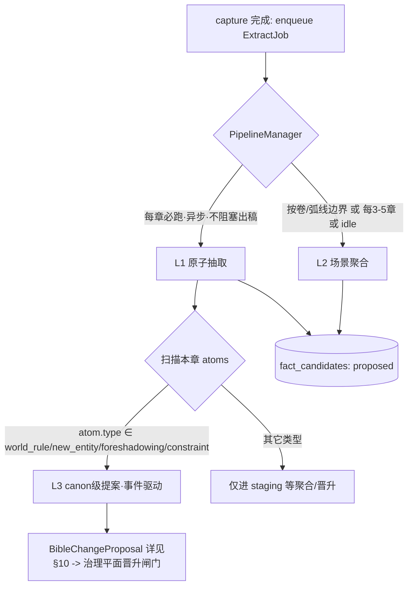
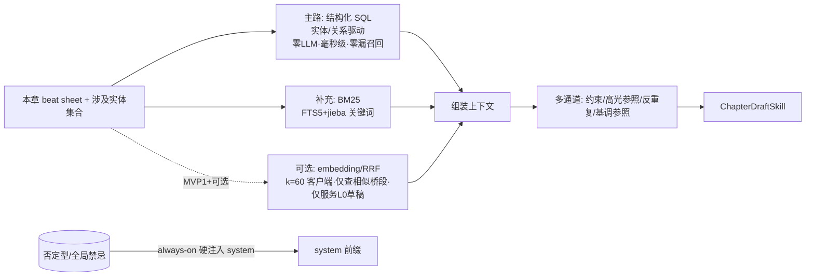

## 6. 记忆管线与召回

本节定义 NovelForge 数据平面（Memory Core）的写入侧（capture/extract 的 L0→L1→L2 抽取管线）与读取侧（Recall 多通道召回），以及贯穿读写的 token 预算、prompt caching 与模型分层成本治理。本节严格遵守第 0 节【11 条重设计硬原则】，尤其是原则 1（软记忆走 RAG、硬状态走关系表）、原则 4（检索以实体/关系为主、语义为辅）、原则 8（confidence 不作晋升闸门只作排序）、原则 10（成本/缓存是连写形态的生死线）、原则 11（单一存储栈、索引可丢可重放）。

设计立场一句话：**记忆管线只做"忠实搬运 + 结构化抽取"，绝不做"事实裁决"**。真相裁决在治理平面（晋升闸门，详见第 3 节）；硬一致性检查在 World State Store + 确定性 validator（详见第 2、4 节）；本节产出的 L1/L2 全部进 staging，状态 `proposed`，等待晋升。

---

### 6.1 capture 与 extract 的拆分：出稿不被抽取阻塞

核心约束：**作者按"生成下一章"按钮后，任何抽取/索引/校验都不得卡在出稿关键路径上**。因此把"记忆写入"拆成两段，以 L0 落盘为同步原子边界：

| 阶段 | 同步性 | 内容 | 失败后果 |
|---|---|---|---|
| **capture（轻量同步）** | 同步、毫秒级、必须成功 | ① L0 草稿写入文件；② 在 `drafts` 表插入路径与元数据；③ 建/更新 `drafts_fts`（FTS5+jieba）对 L0 的索引；④ 向 PipelineManager 投递抽取任务（仅入队，不执行） | 阻塞出稿 → 必须成功，否则整章回滚 |
| **extract（异步）** | 异步、秒~分钟级、可重试可重放 | L1 原子抽取、L2 场景聚合、L3 canon 级提案，全部走后台 worker | 不影响本章出稿；失败只是"这章暂时没进记忆"，可重放补抽 |

capture 之所以能保持轻量：L0 草稿存文件、表里只存路径与索引（原则 11）；FTS5 建索引是纯本地 SQLite 写、与正文写在**同一事务**提交（原则 11 同库同事务）。索引可丢可从 L0/L1 一键重放重建，所以即便 capture 的 FTS 写失败也可降级为"先落盘、索引后台补"（但默认放在同事务里，因为它足够便宜）。

```python
# 控制平面 Orchestrator 调用，capture 是 Commit 阶段的一部分（见主循环 Gate→Commit）
def capture(draft: ChapterDraft, conn: sqlite3.Connection) -> CaptureResult:
    """轻量同步：L0 落盘 + 建 FTS 索引 + 通知 pipeline。绝不调用 LLM。"""
    # 1) L0 草稿写文件（表里只存路径）
    l0_path = L0_DIR / f"ch{draft.chapter_no:05d}_{draft.draft_id}.md"
    l0_path.write_text(draft.body, encoding="utf-8")

    # 2) 同一事务：drafts 元数据 + FTS 索引
    with conn:  # 单 SQLite 文件 + WAL，业务表与 FTS5 同库同事务
        conn.execute(
            "INSERT INTO drafts(draft_id, chapter_no, l0_path, char_count, created_at, status) "
            "VALUES (?,?,?,?,?, 'captured')",
            (draft.draft_id, draft.chapter_no, str(l0_path), len(draft.body),
             utcnow_iso()),
        )
        # FTS5 外部内容表：按"句/段行区间"切片入库，供 BM25 与 source_ref 行区间回指
        for line_span, text in iter_line_spans(draft.body):
            conn.execute(
                "INSERT INTO drafts_fts(rowid, draft_id, chapter_no, line_start, line_end, body) "
                "VALUES (?,?,?,?,?,?)",
                (next_fts_rowid(conn), draft.draft_id, draft.chapter_no,
                 line_span.start, line_span.end, text),
            )

    # 3) 仅入队，不执行任何抽取（异步由 PipelineManager 拉起）
    pipeline.enqueue(ExtractJob(draft_id=draft.draft_id, chapter_no=draft.chapter_no,
                                tiers=("L1",)))  # L1 必入队；L2/L3 由 PipelineManager 决策
    return CaptureResult(draft_id=draft.draft_id, l0_path=l0_path)
```

`drafts` 与 `drafts_fts` 的 DDL（最小集，FTS5 配 jieba 外部分词，详见第 2 节统一存储栈）：

```sql
-- L0 草稿索引：表里只存路径，正文在文件
CREATE TABLE IF NOT EXISTS drafts (
    draft_id     TEXT PRIMARY KEY,
    chapter_no   INTEGER NOT NULL,
    l0_path      TEXT NOT NULL,
    char_count   INTEGER NOT NULL,
    created_at   TEXT NOT NULL,
    status       TEXT NOT NULL DEFAULT 'captured'   -- captured | extracted_l1 | aggregated_l2
);

-- FTS5 关键词索引（jieba 应用层预分词后空格 join 写入 body）；line_start/line_end 用于 source_ref 行区间回指
CREATE VIRTUAL TABLE IF NOT EXISTS drafts_fts USING fts5(
    draft_id UNINDEXED,
    chapter_no UNINDEXED,
    line_start UNINDEXED,
    line_end UNINDEXED,
    body,
    tokenize = 'unicode61 remove_diacritics 2'   -- jieba 在应用层预分词；tokenizer_version 入 meta_kv
);
```

---

### 6.2 PipelineManager 三档触发

PipelineManager 是数据平面的写入调度器，决定何时跑 L1/L2/L3。三档触发频率与代价分级对齐原则 10（贵的留给少数高价值场景）。



#### 6.2.1 L1：每章必跑、异步、不阻塞出稿

每章 capture 后立即入队 L1，由后台 worker 拉起。L1 产出 `fact_candidates`（状态 `proposed`），是 L2 聚合与 World State 投影的原料。**L1 失败不影响出稿**，只把该 `draft` 标记为 `l1_pending`，可重放。

```python
@dataclass
class ExtractJob:
    draft_id: str
    chapter_no: int
    tiers: tuple[str, ...]      # ("L1",) | ("L1","L2") | ...
    trigger: str = "per_chapter"

class PipelineManager:
    def on_chapter_committed(self, chapter_no: int, draft_id: str) -> None:
        # L1 永远入队（每章必跑）
        self.enqueue(ExtractJob(draft_id, chapter_no, tiers=("L1",), trigger="per_chapter"))
        # L2 三个条件任一满足即触发
        if self._l2_should_trigger(chapter_no):
            self.enqueue(ExtractJob(draft_id, chapter_no, tiers=("L2",), trigger="l2_boundary"))

    def _l2_should_trigger(self, chapter_no: int) -> bool:
        return (
            self._is_volume_or_arc_boundary(chapter_no)            # 卷/弧线边界（来自 chapter_cards/beats）
            or (chapter_no - self._last_l2_chapter) >= self.cfg.l2_every_n_chapters   # 每 3-5 章
            or self._scheduler_is_idle()                            # 系统空闲窗口
        )
```

#### 6.2.2 L2：场景聚合，按卷/弧线边界 或 每 3-5 章 或 idle

L2 把若干章的 L1 原子聚合成"场景块"（L2 块），写场景摘要并对 L2 块建 sqlite-vec 向量索引（`scene_vec`，仅 L2 建索引，原则 11）。L2 是 embedding 召回的**唯一服务对象**（见 6.4），且仅服务 L0 草稿期"查相似桥段"，推到 MVP1+。

触发条件（任一满足）：
- **卷/弧线边界**：读 `chapter_cards`/`beats` 判断是否跨卷或跨弧线（语义边界优先，聚合质量最高）；
- **每 3-5 章**：`config.l2_every_n_chapters`（默认 4）兜底，避免长卷迟迟不聚合；
- **idle**：调度器空闲窗口顺手聚合，摊平负载。

#### 6.2.3 L3：仅在 canon 级变更时事件驱动

L3 不是定时任务，而是**由 L1 抽出的原子类型触发**的事件。规则明确：

> **触发条件：`atom.type ∈ {world_rule, new_entity, foreshadowing, constraint}`**

即仅当本章 L1 抽出了"世界规则 / 新人物（首次登场实体）/ 新伏笔 / canon 级约束变更"时，才把这些原子打包成 `BibleChangeProposal` 提案（契约详见第 10 节），推给治理平面的晋升闸门（详见第 3 节）。其余类型（人物状态变化、道具增减、时间推进等）只进 staging，等 World State 投影与晋升按需消费，不触发 L3。

```python
L3_TRIGGER_TYPES = {"world_rule", "new_entity", "foreshadowing", "constraint"}

def maybe_trigger_l3(atoms: list[Atom]) -> list[BibleChangeProposal]:
    canon_atoms = [a for a in atoms if a.type in L3_TRIGGER_TYPES]
    if not canon_atoms:
        return []   # 绝大多数章节走这里，零 L3 开销
    # 结构化 fact diff 提案，LLM 绝不写回 bible（原则 2）
    return [
        BibleChangeProposal(
            op="add",                       # add | update | deprecate | retcon
            target_id=a.proposed_target_id, # 命中已有实体则 update，否则 add（add 时须为 None）
            old=None,
            new=a.normalized_payload,
            reason=a.reason,
            evidence_refs=a.source_refs,    # 必带 L0 行区间出处，供晋升校验 evidence_strength
        )
        for a in canon_atoms
    ]
```

`BibleChangeProposal` 是单一权威 Pydantic 契约，字段定义详见第 10 节（含 `op: Literal["add","update","deprecate","retcon"]`、`target_id`/`entity`/`fact_type`/`old`/`new`/`reason`/`evidence_refs`/`valid_from_chapter`/`risk_class` 及 `op∈{update,deprecate,retcon}` 须带 `target_id`、`add` 禁 `target_id`、`evidence_refs` 非空等校验）；本节不再重复定义其字段，统一引用第 10 节。

---

### 6.3 L1 抽取：防幻觉与防漏召回

L1 是整条管线最容易"编造事实"和"漏掉关键锚点"的环节。NovelForge 用六条工程规则把它从"让 LLM 自由总结"改造成"受约束、可验证、不漏锚点"的抽取器。

#### 6.3.1 规则一：每条原子必须 source_ref 回指 L0 真实行区间，无则丢弃

每个抽出的原子必须带 `source_ref`，回指它在 L0 草稿中的真实行区间（`draft_id` + `line_start` + `line_end`）。**抽取后做后验校验**：把 `source_ref` 指向的 L0 原文取出，验证它确实支撑该原子的断言（最小校验：原子涉及的关键 token——实体名/数值/地名——必须出现在该行区间内）。无 `source_ref` 或校验不过的原子**直接丢弃**，不进 staging。这把"幻觉原子"挡在数据平面之外，也为后续晋升的 `evidence_strength`（原则 8，出处可验权重最高）提供原料。

```python
class SourceRef(BaseModel):
    draft_id: str
    line_start: int
    line_end: int

class Atom(BaseModel):
    type: str                  # character_state | location | knowledge | prop | item | relation | world_rule | new_entity | foreshadowing | constraint
    payload: dict
    source_refs: list[SourceRef]   # 必填且非空
    confidence: float = 0.5        # 仅排序，绝不作晋升（原则 8）
    dimension: str                 # 来自哪一趟抽取，见 6.3.2

def validate_and_filter(atoms: list[Atom], l0_lines: list[str]) -> list[Atom]:
    kept = []
    for a in atoms:
        if not a.source_refs:
            log.debug("drop atom: no source_ref %s", a.payload)
            continue
        if not _evidence_supports(a, l0_lines):   # 关键 token 必须出现在回指行区间内
            log.debug("drop atom: evidence mismatch %s", a.payload)
            continue
        kept.append(a)
    return kept
```

#### 6.3.2 规则二：分维度多趟抽取，每维度一个专门 prompt

不让一个 prompt 同时抽所有东西（会顾此失彼、漏召回）。改为**分维度多趟**，每趟一个聚焦的专门 prompt，各自只抽一类信息：

| 抽取趟 | 专门职责 | 产出原子 type |
|---|---|---|
| 人物状态趟 | 角色境界/状态/情绪/位置/伤势 | `character_state` |
| 时空趟 | 绝对/相对时间推进、地点、移动 | `location`、`timeline` |
| 知识/信息差趟 | 谁知道了什么、谁仍被蒙在鼓里（知情者图） | `knowledge` |
| 道具趟 | 道具获得/失去/使用/转移 | `prop`、`item` |
| 关系趟 | 人物关系建立/变化/破裂 | `relation` |

多趟可并行（互不依赖），用 Haiku/Sonnet 初筛（见 6.7）。每趟 prompt 都强约束"只抽你负责的维度，每条带 source_ref，不确定就不抽"。

> **补全 prop / item 类型**：道具趟同时产出 `prop`（场景道具、剧情道具）与 `item`（角色库存物品），二者分别对应 World State Store 的 `item_ownership`/`item_log`。不要把二者混为一类，否则库存守恒 validator（第 4 节）无法对账。

#### 6.3.3 规则三：高风险类型先正则+词表扫锚点，保证不漏，再交 LLM 归一化

对"漏一个就出事"的高风险类型（**境界、数值、地名、时间词**），不能只依赖 LLM 召回。流程改为两段：

1. **锚点扫描（确定性，保不漏）**：用正则 + 外部词表先扫 L0 原文，把所有候选锚点（带行号）**穷举**出来。例如境界用有序境界词表逐词匹配；数值用 `\d+(?:\.\d+)?\s*(?:两|斤|里|年|岁|阶|层|品)` 类正则；地名用地名词表；时间词用时间正则词表。这一步召回率优先、宁可多不可漏。
2. **LLM 归一化（语义，保对齐）**：把扫到的锚点连同上下文喂给 LLM，让它**归一化**（把"金丹中期""结丹境"统一到 `power_rank` 枚举；把"三个月后"换算成绝对 story_time；把别名地名映射到 `geo_locations` canonical）。LLM 在这里只做"对齐/消歧/换算"，不负责"发现"——发现由正则+词表兜底，所以不漏。

```python
def extract_high_risk(l0_text: str, vocab: VocabConfig) -> list[Atom]:
    # 1) 确定性扫锚点，召回率优先
    anchors = []
    anchors += scan_by_vocab(l0_text, vocab.power_ladder, kind="power_rank")   # 有序境界词表
    anchors += scan_by_regex(l0_text, NUMERIC_RE, kind="numeric")
    anchors += scan_by_vocab(l0_text, vocab.locations, kind="location")
    anchors += scan_by_regex(l0_text, TIME_WORD_RE, kind="time")
    if not anchors:
        return []
    # 2) LLM 仅做归一化/消歧/换算，不负责发现
    return llm_normalize_anchors(anchors, vocab, model="claude-haiku-4-5")
```

#### 6.3.4 规则四：confidence 仅排序，不作晋升

`Atom.confidence` 只用于**同一维度内多个候选的排序与去重打分**，绝不作为进 staging 或晋升的闸门（原则 8）。是否进 staging 由"有合法 source_ref 且后验校验通过"决定；是否晋升由治理平面按 `evidence_strength`（出处可验，权重最高）+ 无冲突 + 非高风险决定（第 3、4 节）。代码层面：任何分支都不得出现 `if atom.confidence > threshold: promote`。

#### 6.3.5 规则五：有序词表（境界阶梯）作外部配置注入，不让模型临场推断

境界阶梯这类**全序枚举**绝不让模型临场推断顺序（模型会把"练气""筑基"的高低判错，破坏境界单调性校验）。它作为外部配置注入：

- 写时注入 L1 归一化 prompt（让 LLM 把别名映射到枚举，但顺序由配置定义）；
- 同一份配置进 World State Store 的 `power_ranks`（有序枚举表，第 2 节），供境界越级 validator 做全序比较（第 4 节）。

```yaml
# config/vocab/power_ladder.yaml —— 外部有序词表，单一真相源
power_ladder:
  - rank: 0
    canonical: 练气
    aliases: [炼气, 练气期]
  - rank: 1
    canonical: 筑基
    aliases: [筑基期, 筑基境]
  - rank: 2
    canonical: 金丹
    aliases: [结丹, 金丹境, 结丹期]
  - rank: 3
    canonical: 元婴
    aliases: [元婴境, 婴变]
numeric_units: [两, 斤, 里, 年, 岁, 阶, 层, 品, 颗, 枚]
```

> 结构化抽取统一用 instructor + Pydantic `field_validator` 自愈重试（原则 11）：归一化结果若不在枚举内，validator 报错并让模型重试一次再降级丢弃，避免脏枚举污染 World State。

`fact_candidates`（staging）DDL（权威定义在第 2 节，治理消费见第 3 节）：

```sql
CREATE TABLE IF NOT EXISTS fact_candidates (
    candidate_id  TEXT PRIMARY KEY,
    chapter_no    INTEGER NOT NULL,
    draft_id      TEXT NOT NULL,
    atom_type     TEXT NOT NULL,
    dimension     TEXT NOT NULL,         -- 来自哪一趟抽取
    payload       TEXT NOT NULL,         -- JSON，归一化后
    source_refs   TEXT NOT NULL,         -- JSON 数组，至少 1 条 SourceRef
    confidence    REAL NOT NULL DEFAULT 0.5,   -- 仅排序
    status        TEXT NOT NULL DEFAULT 'proposed'
                  CHECK (status IN ('proposed','pending_review','promoted','rejected','superseded')),
    created_at    TEXT NOT NULL
);
CREATE INDEX IF NOT EXISTS idx_fc_chapter ON fact_candidates(chapter_no);
CREATE INDEX IF NOT EXISTS idx_fc_status  ON fact_candidates(status, atom_type);
```

---

### 6.4 Recall：多通道召回

Recall 是 Draft 阶段为起草 prompt 组装"上下文"的读取侧。遵循原则 4：**实体/关系驱动的结构化 SQL 是主路，BM25 是补充，embedding 仅可选且推后，否定型/全局禁忌 always-on 硬注入**。



#### 6.4.1 主路：实体/关系驱动的结构化 SQL（稳定上下文主力）

按本章 beat sheet 涉及的实体集合，从 World State Store 与工艺层确定性取出：人物卡、未回收伏笔、能力清单、时间线锚点。**零 LLM、毫秒级、零漏召回、可解释**——这是上下文的稳定主力，不依赖任何相似度。

```python
def recall_structured(chapter_no: int, entity_ids: list[str],
                      conn: sqlite3.Connection) -> StructuredContext:
    """主路召回：按本章涉及实体取结构化事实。零 LLM。"""
    q = ",".join("?" * len(entity_ids))
    # 人物卡（含 voice_profile / arc_stages，工艺层）
    cards = conn.execute(
        f"SELECT * FROM character_cards WHERE entity_id IN ({q})", entity_ids
    ).fetchall()
    # 未回收伏笔：状态机非终态且涉及本章实体或已到期
    foreshadow = conn.execute(
        f"SELECT * FROM foreshadow "
        f"WHERE status IN ('planted','reinforced','misled') "
        f"  AND (owner_entity IN ({q}) OR overdue_chapter <= ?)",
        (*entity_ids, chapter_no),
    ).fetchall()
    # 能力清单：as-of 投影（境界/金手指当前合法状态，第 2/4 节）
    powers = conn.execute(
        f"SELECT entity_id, MAX(rank) AS cur_rank FROM character_power_log "
        f"WHERE entity_id IN ({q}) AND valid_from_chapter <= ? GROUP BY entity_id",
        (*entity_ids, chapter_no),
    ).fetchall()
    # 时间线锚点：本章之前最近的绝对 story_time
    timeline = conn.execute(
        "SELECT * FROM timeline_events WHERE chapter_no < ? "
        "ORDER BY story_time DESC LIMIT 5", (chapter_no,)
    ).fetchall()
    return StructuredContext(cards=cards, foreshadow=foreshadow,
                             powers=powers, timeline=timeline)
```

#### 6.4.2 补充：BM25（FTS5 + jieba）关键词召回

对 beat sheet 中的关键词（人名、地名、专有名词、招式名）跑 BM25（capture 阶段建好的 `drafts_fts`），补回结构化 SQL 没覆盖的"上次怎么写的"原文片段。BM25 召回结果按行区间回指 L0/L1，可追溯。

```python
def recall_bm25(keywords: list[str], conn: sqlite3.Connection, limit: int = 8):
    query = " OR ".join(jieba_tokenize_query(k) for k in keywords)
    return conn.execute(
        "SELECT draft_id, chapter_no, line_start, line_end, body, "
        "       bm25(drafts_fts) AS score "
        "FROM drafts_fts WHERE drafts_fts MATCH ? ORDER BY score LIMIT ?",
        (query, limit),
    ).fetchall()
```

#### 6.4.3 可选：embedding / RRF（k=60，客户端），仅服务 L0 草稿"查相似桥段"，推到 MVP1+

embedding 召回**降级为可选增强**，且只在一个狭窄场景启用：作者在 L0 草稿期想"查历史中相似的桥段"找灵感/避免自我重复。它只对 `scene_vec`（L2 场景块的 sqlite-vec 索引）检索，**不进起草 prompt 的稳定上下文主力**。MVP 不做，推到 MVP1+。

RRF（Reciprocal Rank Fusion）在**客户端**融合 BM25 与向量两路结果，**k=60，只用排名不归一化分数**（原则 4）：

```python
def rrf_fuse(rank_lists: list[list[str]], k: int = 60) -> list[tuple[str, float]]:
    """客户端 RRF：只用排名（1-based），不归一化原始分数。"""
    scores: dict[str, float] = {}
    for ranked in rank_lists:
        for rank, doc_id in enumerate(ranked, start=1):
            scores[doc_id] = scores.get(doc_id, 0.0) + 1.0 / (k + rank)
    return sorted(scores.items(), key=lambda x: x[1], reverse=True)
```

#### 6.4.4 否定型 / 全局禁忌：always-on 硬注入 system，不走检索

否定型约束（如"20 章前不暴露反派身份""主角不得使用 X 能力直到某节点""禁止出现某词")**不能依赖检索召回**——检索可能漏，而漏一次就破设定。它们 always-on **硬注入 system 前缀**（与 bible 一起进 prompt cache，见 6.5），每次起草都在场。这类约束来自 `gimmick_rules`/`constraint` 类 fact，由治理平面维护其生效区间（`valid_from_chapter`）。

#### 6.4.5 多通道召回

除主路结构化上下文外，起草 prompt 还按通道分别组装，各通道有独立预算上限（见 6.6）：

| 通道 | 取自 | 作用 |
|---|---|---|
| **约束通道** | 否定型/全局禁忌 + 本章硬约束（境界上限、已知信息差） | 写时约束注入，**不可裁剪**（见 6.6） |
| **高光参照通道** | `beats` 中 `payoff_beat`/`value_shift` 高分历史片段 | 给本章提供"该有的爽点强度"参照 |
| **反重复通道** | 近 N 章已用过的桥段/比喻/转场（可借 BM25 或 L2 相似度） | 避免自我重复，提示"别再这么写" |
| **基调参照通道** | `character_cards.voice_profile` + `pacing_state.tension_curve` | 维持人物口吻与节奏基调 |

---

### 6.5 prompt caching：固定前缀打 cache_control，TTL=1h，绝不污染

成本/缓存是连写形态的生死线（原则 10）。NovelForge 的起草请求把**固定 system + bible 前缀**打 `cache_control`，避免每章重复支付大前缀的全价输入。

渲染顺序固定为 `tools → system → messages`（prompt 缓存是前缀匹配，任何字节变化都会让其后全部失效）。NovelForge 的分层：

- **稳定前缀（打 cache，TTL=1h）**：固定 system（角色设定、写作规范、否定型/全局禁忌硬注入）+ 当前卷 bible 段。
- **易变后缀（不打 cache，放在最后）**：本章 beat sheet、检索结果（结构化上下文/BM25/反重复）、章节号、时间戳。

**头号 silent invalidator 必须根除**：绝不把章节号、时间戳、uuid、每次变化的检索结果插进 system 或 bible 前缀。它们一旦混进前缀，缓存每次失效，等于没缓存。验证手段：用 `usage.cache_read_input_tokens` 检查命中。

```python
# 起草请求骨架（Python SDK；模型见 6.7）
STABLE_SYSTEM = render_stable_system(bible_volume_segment, always_on_constraints)
# 注意：STABLE_SYSTEM 内绝不含章节号/时间戳/uuid/检索结果

resp = client.messages.create(
    model="claude-opus-4-8",          # 正文创作用 Opus
    max_tokens=16000,
    system=[{
        "type": "text",
        "text": STABLE_SYSTEM,        # 固定 system + bible 前缀
        "cache_control": {"type": "ephemeral", "ttl": "1h"},   # TTL=1h
    }],
    messages=[{
        "role": "user",
        "content": render_dynamic_block(    # 易变内容全部放这里，cache 断点之后
            beat_sheet=beat_sheet,
            structured_ctx=structured_ctx,
            bm25_hits=bm25_hits,
            anti_repeat=anti_repeat,
            chapter_no=chapter_no,           # 易变，绝不进 system
        ),
    }],
)

# 验证缓存命中（原则 10：用 cache_read_input_tokens 验证）
assert resp.usage.cache_read_input_tokens > 0 or first_request, \
    "缓存未命中：检查 system 前缀是否被章节号/时间戳/检索结果污染"
```

注意：Opus 4.8 最小可缓存前缀为 4096 token——若某卷 bible 段不足，缓存会静默不生效（`cache_creation_input_tokens` 为 0 且 `cache_read_input_tokens` 恒为 0），此时应合并 system 与 bible 段以越过门槛。

> **bible 分段冷热分离**：bible 按卷分段，只把"当前卷 + 必要的全局设定"放进活跃缓存前缀；**已回收伏笔、已退场人物移冷存储**（单独的归档表/段），不进起草前缀。这既缩小前缀（降低缓存写入与读取成本），又减少无关上下文干扰。冷存储仍可被结构化 SQL 按需查回（如某退场人物意外回归）。

---

### 6.6 分层 token 预算

为每次起草请求设三类预算上限，超限按"可裁/不可裁"规则裁剪。这是把成本上限落到组装层（与原则 10 的 circuit breaker 互补；circuit breaker 在第 7 节管整章美元/轮数上限）。

| 预算桶 | 内容 | 上限（默认） | 裁剪策略 |
|---|---|---|---|
| `stable_context` | 固定 system + bible 前缀（走 cache） | 例 12000 tok | 越界则推进 bible 冷存储分段，不裁约束 |
| `dynamic_recall` | 结构化上下文 + BM25 + 高光/反重复/基调通道 | 例 8000 tok | **环境描写、相似桥段可裁；约束类不可裁** |
| `task` | 本章 beat sheet + 出稿指令 | 例 4000 tok | 一般不裁；超长则拆分 beat |

裁剪的硬规则：**约束类（否定型/全局禁忌/境界上限/信息差）永不裁剪**；环境描写、风格参照、相似桥段等"软"召回可按 score 从低到高裁到预算内。

```python
def fit_budget(channels: dict[str, list[Snippet]], cfg: BudgetConfig) -> dict:
    out = {}
    # 不可裁通道：约束通道整体保留，若它本身超限则报警而非静默丢弃
    out["constraints"] = channels["constraints"]
    if tok(out["constraints"]) > cfg.dynamic_recall:
        log.warning("约束通道已占满 dynamic_recall 预算，需人工复核约束数量")
    remaining = cfg.dynamic_recall - tok(out["constraints"])
    # 可裁通道：按 score 升序裁剪（先裁最弱的环境描写/相似桥段）
    soft = sorted(channels["high_light"] + channels["anti_repeat"] + channels["tone"],
                  key=lambda s: s.score)
    kept = []
    for s in reversed(soft):                # 高分优先保留
        if tok(kept) + tok([s]) > remaining:
            continue
        kept.append(s)
    out["soft"] = kept
    return out
```

---

### 6.7 模型分层与 Batches API

把贵的算力（Opus）只留给正文创作与冲突复核，便宜的（Haiku/Sonnet）做高频的抽取/初筛；非延迟敏感的后台任务走 Batches API 拿 50% 折扣（原则 10）。

| 任务 | 模型 | 同步/批量 | 理由 |
|---|---|---|---|
| L1 分维度抽取、高风险归一化 | `claude-haiku-4-5` | 异步，可走 Batches | 高频、结构化、对延迟不敏感 |
| 去重、连续性软初筛、L2 场景摘要 | `claude-sonnet-4-6` | 异步，可走 Batches | 中等难度、量大 |
| 章节正文创作（ChapterDraftSkill） | `claude-opus-4-8` | 同步（作者等结果） | 质量决定追更力，延迟敏感 |
| 冲突复核 / soft issue LLM-judge 终裁 | `claude-opus-4-8` | 同步或近线 | 高判断力，错判代价高 |

**非延迟敏感后台走 Batches API**：批量 L1 抽取（如一次性补抽整卷）、L2 聚合、批量去重，用 `client.messages.batches.create` 提交，50% 成本、最长 24h 完成。批内复用同一稳定前缀仍可叠加 prompt cache 收益。

```python
from anthropic.types.message_create_params import MessageCreateParamsNonStreaming
from anthropic.types.messages.batch_create_params import Request

# 整卷补抽 L1：后台批量，非延迟敏感 -> Batches API（50% 成本）
batch = client.messages.batches.create(
    requests=[
        Request(
            custom_id=f"l1-extract-ch{ch}-{dim}",
            params=MessageCreateParamsNonStreaming(
                model="claude-haiku-4-5",
                max_tokens=4000,
                system=[{"type": "text", "text": STABLE_EXTRACT_SYSTEM,
                         "cache_control": {"type": "ephemeral"}}],  # 批内共享前缀仍可缓存
                messages=[{"role": "user", "content": render_extract_prompt(ch, dim)}],
            ),
        )
        for ch in chapters_to_backfill
        for dim in ("character_state", "location", "knowledge", "prop", "relation")
    ]
)
```

---

### 6.8 与其它节的接口

- 抽出的 `fact_candidates`（proposed）→ 治理平面晋升闸门 `PromotionPolicy` 决策 `enqueue_review`/`commit_canon`（详见第 3 节）。
- 高风险归一化用的有序境界词表 / 数值单位词表 → 同步进 World State Store 的 `power_ranks` 等表（详见第 2 节），供确定性 validator 做全序比较与守恒检查（详见第 4 节）。
- 主路结构化召回依赖的 `get_world_state(as_of_chapter=N)` as-of 投影 → 详见第 2、4 节。
- 整章 token/美元/修订轮数 circuit breaker（全自动模式）→ 详见第 7 节；本节只管单请求的分层预算与缓存。
- 工艺层通道（高光参照/基调参照）依赖的 `beats`/`character_cards`/`pacing_state` → 详见第 5 节（网文工艺层）。
