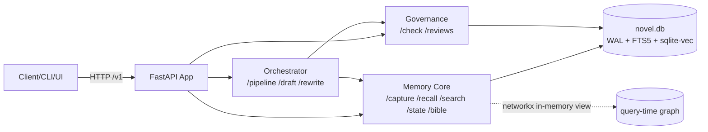

## 8. API、配置与工程落地

本节给出 NovelForge 的实现级落地方案：FastAPI 端点全集（含请求/响应示例）、`config.yaml` 全量示例、项目目录结构、确定版技术选型与最小依赖清单。所有命名严格遵循统一术语表（三平面、canon 真相源表、World State Store 表、工艺层表、检索表、主循环、配置根），各项约束呼应【11 条重设计硬原则】。本节只描述"接口契约 + 配置 + 工程结构 + 选型"，业务逻辑细节（validator 实现详见第 4 节、PromotionPolicy 决策详见第 3 节、Recall 召回算法详见第 6 节、数据契约权威详见第 10 节）交叉引用。

---

### 8.1 设计总纲：HTTP 边界与三平面映射

NovelForge 是本地优先单进程服务，但所有跨平面调用都走显式 HTTP 契约（即使 Memory Core 当前是进程内 Python 包，也保留 FastAPI 边界——见 8.6 选型说明，呼应硬原则 11 "保留 FastAPI 边界以便未来拆分"）。端点按三平面归类：

| 平面 | 端点前缀 | 职责 |
|---|---|---|
| 控制平面（Orchestrator + Skill Registry） | `/pipeline/*`、`/draft/*`、`/rewrite`、`/session/end` | 编排主循环、调度 Skill |
| 数据平面（Memory Core + World State Store） | `/capture`、`/recall`、`/state`、`/search/*`、`/bible` | 软记忆召回、硬状态投影、检索、只读渲染 |
| 治理平面（Governance） | `/check/*`、`/reviews/*` | 一致性/工艺校验、晋升闸门人审队列 |
| 项目管理 | `/projects/*` | 项目 CRUD（多 novel.db 路由，见 8.4） |

**统一约定：**

- **基址**：`http://127.0.0.1:8787`（本地默认），所有路径前缀 `/v1`。
- **项目作用域**：除 `/projects` 自身外，所有端点通过路径参数 `/v1/projects/{project_id}/...` 绑定到单一 `novel.db`（单文件存储栈，硬原则 11）。为简洁起见，下文示例省略 `/v1/projects/{project_id}` 前缀，仅写相对子路径。
- **as-of 语义**：凡涉及硬状态的查询/写时约束，均接受 `as_of_chapter` 参数，对应 World State Store 的 `get_world_state(as_of_chapter=N)` 投影（硬原则 3）。
- **错误体**：统一 `{"error": {"code": str, "message": str, "details": {...}}}`，HTTP 4xx/5xx。
- **幂等**：写端点（`/capture`、`/reviews/approve` 等）接受 `Idempotency-Key` 头，重复提交返回首次结果。
- **追加而非删除**：所有 canon/治理写操作落到 append-only 表（`fact_revisions`、`promotion_log`），永不物理删除（硬原则 2、9）。



---

### 8.2 FastAPI 端点全集

下列端点用 Pydantic 模型描述请求/响应。所有模型用 `instructor + Pydantic` 复用同一套类型（见 8.6、8.7）。

#### 8.2.1 项目 CRUD `/projects`

管理多部小说，每部对应一个 `novel.db`。

```python
# POST /v1/projects  —— 创建项目（初始化 novel.db + schema + 索引）
class ProjectCreateRequest(BaseModel):
    name: str
    genre: str                      # 对应 config.genre 节拍模板键
    power_system: str | None = None # 对应 config.power_ranks 境界词表键
    config_overrides: dict | None = None

class ProjectResponse(BaseModel):
    project_id: str
    name: str
    genre: str
    db_path: str                    # novel.db 绝对路径
    created_at: datetime
    chapter_count: int
    canon_fact_count: int
```

| 方法 | 路径 | 说明 |
|---|---|---|
| `POST` | `/projects` | 创建项目，初始化 `novel.db`（建表 + FTS5 + vec0 + WAL）|
| `GET` | `/projects` | 列出全部项目 |
| `GET` | `/projects/{project_id}` | 项目详情 + 统计 |
| `PATCH` | `/projects/{project_id}` | 更新元信息 / config 覆盖 |
| `DELETE` | `/projects/{project_id}` | 归档项目（仅标记 archived，不物理删 db；保留可回放）|

请求/响应示例：

```jsonc
// POST /v1/projects
// req
{ "name": "万古剑帝", "genre": "xuanhuan", "power_system": "xianxia_9" }
// resp 201
{
  "project_id": "prj_01H...", "name": "万古剑帝", "genre": "xuanhuan",
  "db_path": "D:/novelforge/data/prj_01H.../novel.db",
  "created_at": "2026-06-05T10:00:00Z", "chapter_count": 0, "canon_fact_count": 0
}
```

#### 8.2.2 `/capture` —— 软记忆/候选事实捕获（写入 staging）

把 LLM 抽取产物写入 `fact_candidates`（状态 `proposed`），不直接进 canon（硬原则 5、8）。同时写软记忆到 L1/L2、更新 FTS5/vec0 索引。结构化抽取 diff 为 `BibleChangeProposal`（硬原则 2）。`BibleChangeProposal` 字段契约以第 10 节为唯一权威定义（op/target_id/entity/fact_type/old/new/reason/evidence_refs/valid_from_chapter/risk_class），本节不再重复定义，直接引用。

```python
from .contracts import BibleChangeProposal   # 单一权威契约见第 10 节

class CaptureRequest(BaseModel):
    source_chapter: int
    source_kind: Literal["draft", "canon_text", "manual"]
    proposals: list[BibleChangeProposal]
    soft_memories: list[SoftMemoryItem] = []   # 文风/场景摘要，写 L2 + scene_vec

class CaptureResponse(BaseModel):
    candidate_ids: list[str]                # fact_candidates.id（status=proposed）
    soft_memory_ids: list[str]
    indexed: dict                           # {"facts_fts": n, "scene_vec": m}
```

```jsonc
// POST /v1/.../capture
// resp 202
{
  "candidate_ids": ["fc_001", "fc_002"],
  "soft_memory_ids": ["l2_553"],
  "indexed": { "facts_fts": 2, "scene_vec": 1 }
}
```

#### 8.2.3 `/recall` —— 实体优先 + as-of 投影召回

主路是按 entity/章节范围/status 的结构化 SQL（零漏召回、可解释），BM25 关键词补充，embedding/RRF 可选增强（硬原则 4）。否定型/全局禁忌不走此端点（always-on 硬注入，见 `/draft/chapter`）。

```python
class RecallRequest(BaseModel):
    entities: list[str] = []               # canonical_name；主召回键
    chapter_range: tuple[int, int] | None = None
    status_filter: list[Literal["canon","tentative"]] = ["canon"]
    as_of_chapter: int                     # 投影时点（硬原则 3）
    keyword_query: str | None = None       # 触发 BM25(facts_fts)
    enable_semantic: bool = False          # 触发 scene_vec + RRF（推后，默认关）
    top_k: int = 20

class RecallItem(BaseModel):
    source: Literal["structured_sql","bm25","semantic_rrf"]
    fact_id: str | None
    scene_id: str | None
    content: str
    entity: str
    valid_from_chapter: int
    score: float | None                    # 仅 bm25/rrf 有；structured 为 None（确定性零分）
    evidence_refs: list[str]

class RecallResponse(BaseModel):
    items: list[RecallItem]
    world_state_snapshot: WorldStateSnapshot  # as-of(N) 投影，供写时注入
```

```jsonc
// POST /v1/.../recall
// req
{ "entities": ["林尘"], "as_of_chapter": 47, "keyword_query": "断剑", "top_k": 10 }
// resp 200
{
  "items": [
    { "source":"structured_sql","fact_id":"f_120","content":"林尘当前境界=筑基九层",
      "entity":"林尘","valid_from_chapter":42,"score":null,
      "evidence_refs":["42:0-180"] },
    { "source":"bm25","scene_id":"l2_88","content":"断剑在血池中重铸…",
      "entity":"林尘","valid_from_chapter":45,"score":7.31,
      "evidence_refs":["45:300-520"] }
  ],
  "world_state_snapshot": { "as_of_chapter":47, "power_ranks":{"林尘":"筑基九层"}, "...": "..." }
}
```

#### 8.2.4 `/draft/chapter` —— AI 起草章节

按 PlannerSkill 产出的逐章 beat sheet 作为契约起草（硬原则 6）。写时约束：注入 as-of(N) World State + always-on 全局禁忌（硬原则 3、4）。稳定前缀（bible 渲染/风格/约束）走 1h prompt cache，绝不被章节号/检索结果污染（硬原则 10）。

```python
class DraftChapterRequest(BaseModel):
    chapter_no: int
    beat_sheet_id: str                      # PlannerSkill 契约
    as_of_chapter: int                      # = chapter_no - 1
    style_profile_id: str | None = None
    target_word_count: int = 3000

class DraftChapterResponse(BaseModel):
    draft_id: str
    l0_path: str                            # L0 草稿存文件，表里只存路径（硬原则 11）
    chapter_no: int
    word_count: int
    beats_covered: list[str]
    usage: TokenUsage                       # 含 cache_read_input_tokens 验证命中
    model: str                              # "claude-opus-4-8"

class TokenUsage(BaseModel):
    input_tokens: int
    output_tokens: int
    cache_creation_input_tokens: int
    cache_read_input_tokens: int           # 硬原则 10：用此字段验证缓存命中
```

```jsonc
// POST /v1/.../draft/chapter
// resp 200
{
  "draft_id":"d_048","l0_path":"data/prj_01H.../l0/ch048.md","chapter_no":48,
  "word_count":3120,"beats_covered":["b1_hook","b2_conflict","b3_value_shift"],
  "usage":{"input_tokens":1840,"output_tokens":4200,
           "cache_creation_input_tokens":0,"cache_read_input_tokens":15360},
  "model":"claude-opus-4-8"
}
```

> 实现注：正文创作用 `claude-opus-4-8`，`thinking={"type":"adaptive"}`、`output_config={"effort":"high"}`；抽取/去重/初筛用 `claude-haiku-4-5` 或 `claude-sonnet-4-6`（硬原则 10 分层）。Opus 4.8/4.7 禁用 prefill、禁用 `temperature/top_p/top_k/budget_tokens`（详见 8.6、8.7）。

#### 8.2.5 `/rewrite` —— 按 issue 修订（Revise 阶段）

接收 Check 阶段产出的 hard/soft issues，定向修订草稿（主循环 Revise，≤N 轮，N 由 `config.canon_governance.revise_max_rounds` 控制）。

```python
class RewriteRequest(BaseModel):
    draft_id: str
    issues: list[IssueRef]                  # 来自 /check/continuity & /check/craft
    revise_round: int                       # 当前轮次，受 revise_max_rounds 约束
    preserve_beats: bool = True

class RewriteResponse(BaseModel):
    draft_id: str                           # 同 id，新 L0 版本路径
    l0_path: str
    revise_round: int
    resolved_issue_ids: list[str]
    remaining_issue_ids: list[str]
    usage: TokenUsage
```

#### 8.2.6 `/check/continuity` —— 一致性双流水线

确定性 validators 产 hard issues（纯 SQL+算术+networkx+状态机，无 LLM）‖ LLM-judge 产 soft issues，按 claim 类型路由（硬原则 1、7；架构改动第 3 项）。批量校验替代 per-claim fan-out（硬原则 10）。

```python
class ContinuityCheckRequest(BaseModel):
    draft_id: str
    as_of_chapter: int                      # 草稿须从 as-of(N) 经合法迁移到达
    claim_types: list[str] = ["power_monotonic","timeline","geo_travel",
                              "knowledge_edge","item_inventory","gimmick",
                              "numeric_conservation","name_norm"]
    run_soft_judge: bool = True

class HardIssue(BaseModel):
    issue_id: str
    validator: str                          # 如 "power_monotonic"
    severity: Literal["block","warn"]       # 受 continuity_gate 配置影响
    claim: str
    expected: str                           # 确定性期望值（可解释）
    actual: str
    evidence_refs: list[str]
    suggested_fix: str | None

class SoftIssue(BaseModel):
    issue_id: str
    dimension: Literal["tone","motivation","atmosphere","fuzzy_setting"]
    severity: Literal["warn","info"]
    note: str
    judge_confidence: float                 # 仅排序，不作晋升闸门（硬原则 8）

class ContinuityCheckResponse(BaseModel):
    hard_issues: list[HardIssue]            # 确定性，零漏（validator）
    soft_issues: list[SoftIssue]            # LLM-judge
    state_reachable: bool                   # 草稿状态能否从 as-of(N) 合法到达
```

```jsonc
// POST /v1/.../check/continuity
// resp 200（发现境界越级）
{
  "hard_issues":[
    {"issue_id":"hi_01","validator":"power_monotonic","severity":"block",
     "claim":"林尘第48章=金丹期","expected":"筑基九层→金丹初期(允许)",
     "actual":"筑基九层→金丹后期(越2级)","evidence_refs":["48:1200-1260"],
     "suggested_fix":"降为金丹初期或补突破桥段"}],
  "soft_issues":[],
  "state_reachable": false
}
```

#### 8.2.7 `/check/craft` —— 网文工艺校验

与 continuity 并行的独立工艺层校验（硬原则 6）。payoff_beat/hook/value_shift/tension_curve 为一等数据。

```python
class CraftCheckRequest(BaseModel):
    draft_id: str
    chapter_no: int

class CraftIssue(BaseModel):
    issue_id: str
    metric: Literal["hook_strength","value_shift_present","tension_curve",
                    "payoff_due","pacing"]
    severity: Literal["warn","info"]
    measured: float | str
    target: float | str
    note: str

class CraftCheckResponse(BaseModel):
    craft_issues: list[CraftIssue]
    tension_point: float                    # 写回 pacing_state.tension_curve
    overdue_foreshadow: list[str]           # foreshadow 状态机 overdue 扫描
```

#### 8.2.8 `/search/facts` & `/search/drafts`

`/search/facts` 走 `facts_fts`（FTS5+应用层 jieba 预分词，索引 canon facts）；`/search/drafts` 走 `drafts_fts`（索引 L0 草稿正文行）。二者均为关键词/语义检索补充，主召回仍走 `/recall`（硬原则 4）。

```python
class SearchRequest(BaseModel):
    query: str
    mode: Literal["bm25","semantic","hybrid_rrf"] = "bm25"  # semantic 推后
    chapter_range: tuple[int,int] | None = None
    status_filter: list[str] = ["canon"]    # 仅 facts
    top_k: int = 20

class SearchHit(BaseModel):
    id: str
    snippet: str
    rank: int                               # RRF 用排名，不归一化（k=60，客户端）
    bm25_score: float | None
    chapter: int

class SearchResponse(BaseModel):
    hits: list[SearchHit]
    mode: str
```

```jsonc
// GET /v1/.../search/facts?query=玄铁令&mode=bm25&top_k=5
{ "mode":"bm25","hits":[
  {"id":"f_77","snippet":"…<b>玄铁令</b>为宗门信物…","rank":1,"bm25_score":9.2,"chapter":12}
]}
```

#### 8.2.9 `/reviews` —— 人审队列（晋升闸门治理面）

`require_human_for`（world_rule/power_system/character_death/foreshadow_payoff/knowledge_edge_change）在 auto 模式下仍强制入队（硬原则 5、8）。每次决策写 `promotion_log`（append-only，硬原则 9）。

| 方法 | 路径 | 说明 |
|---|---|---|
| `GET` | `/reviews` | 列出 `review_queue`（按 risk_class/evidence_strength 排序）|
| `POST` | `/reviews/{candidate_id}/approve` | 晋升候选→canon（`commit_canon`），写 `facts`+`fact_revisions`+`promotion_log` |
| `POST` | `/reviews/{candidate_id}/reject` | 驳回，候选标记 rejected，写 `promotion_log` |
| `POST` | `/reviews/batch_approve` | 批量晋升（批量校验替代 fan-out，硬原则 10）|

```python
class ReviewQueueItem(BaseModel):
    candidate_id: str
    proposal: BibleChangeProposal
    risk_class: str
    evidence_strength: float                # 晋升主依据（出处可验，权重最高，硬原则 8）
    conflict_flags: list[str]               # 非空 = 与现有 canon 冲突，禁止 auto
    policy_mode: Literal["human_gate","auto_promote","hybrid"]

class ApproveRequest(BaseModel):
    actor: str                              # 审定人/agent，写入 promotion_log
    note: str | None = None
    valid_from_chapter_override: int | None = None

class ApproveResponse(BaseModel):
    candidate_id: str
    fact_id: str                            # 新晋升的 facts.id
    fact_revision_id: str
    promotion_log_id: str
    new_status: Literal["canon"]

class BatchApproveRequest(BaseModel):
    candidate_ids: list[str]
    actor: str
    require_no_conflict: bool = True        # 有冲突项整批失败或跳过

class BatchApproveResponse(BaseModel):
    approved: list[ApproveResponse]
    skipped: list[dict]                     # {candidate_id, reason}
```

```jsonc
// POST /v1/.../reviews/fc_001/approve
// req
{ "actor": "editor:cha", "note": "突破桥段已补，证据充分" }
// resp 200
{ "candidate_id":"fc_001","fact_id":"f_201","fact_revision_id":"fr_201",
  "promotion_log_id":"pl_330","new_status":"canon" }
```

#### 8.2.10 `/state` —— as-of 世界状态投影查询

直读 World State Store，`get_world_state(as_of_chapter=N)` 的 HTTP 暴露（硬原则 3）。纯确定性，无 LLM。

```python
class StateQueryRequest(BaseModel):
    as_of_chapter: int
    facets: list[str] = ["power_ranks","knowledge_edges","timeline_events",
                         "geo_locations","item_ownership","gimmick_rules",
                         "numeric_facts"]
    entity_filter: list[str] | None = None

class WorldStateSnapshot(BaseModel):
    as_of_chapter: int
    power_ranks: dict[str, str]             # entity -> rank（有序枚举）
    knowledge_edges: list[dict]            # 知情者图（who-knows-what）
    timeline_events: list[dict]            # 绝对 story_time
    geo_locations: dict
    item_ownership: dict
    gimmick_rules: list[dict]
    numeric_facts: dict[str, dict]         # name -> {value, unit}
```

```jsonc
// POST /v1/.../state
// req
{ "as_of_chapter": 47, "facets": ["power_ranks","item_ownership"], "entity_filter":["林尘"] }
// resp 200
{ "as_of_chapter":47,"power_ranks":{"林尘":"筑基九层"},
  "item_ownership":{"林尘":["断剑","玄铁令"]}, "knowledge_edges":[], "...":"..." }
```

#### 8.2.11 `/pipeline/run` —— 主循环编排

驱动 Plan→Recall→Draft→Check(continuity‖craft)→Revise(≤N)→Gate(PromotionPolicy)→Commit。PipelineManager 三档触发（L1 每章异步/L2 按卷或 3-5 章/L3 仅 canon 级事件驱动；架构改动第 8 项）。全自动模式有 token/美元上限 + 修订轮数上限的 circuit breaker（硬原则 10）。

```python
class PipelineRunRequest(BaseModel):
    chapter_no: int
    mode: Literal["human_gate","auto_promote","hybrid"] | None = None  # None=读config
    stages: list[str] | None = None         # 默认全主循环；可指定子集
    budget_override: BudgetConfig | None = None

class StageResult(BaseModel):
    stage: str
    status: Literal["ok","blocked","skipped","circuit_broken"]
    detail: dict

class PipelineRunResponse(BaseModel):
    run_id: str
    chapter_no: int
    stages: list[StageResult]
    final_gate: Literal["committed_canon","enqueued_review","blocked"]
    budget_spent: BudgetSpent               # tokens/usd/revise_rounds
    circuit_breaker_tripped: bool
```

```jsonc
// POST /v1/.../pipeline/run
// req
{ "chapter_no": 48, "mode": "auto_promote" }
// resp 200（自动模式，命中高风险被强制人审）
{
  "run_id":"run_048","chapter_no":48,
  "stages":[
    {"stage":"plan","status":"ok","detail":{"beat_sheet_id":"bs_48"}},
    {"stage":"recall","status":"ok","detail":{"items":14}},
    {"stage":"draft","status":"ok","detail":{"draft_id":"d_048"}},
    {"stage":"check.continuity","status":"ok","detail":{"hard":0,"soft":1}},
    {"stage":"check.craft","status":"ok","detail":{"craft":0}},
    {"stage":"revise","status":"skipped","detail":{}},
    {"stage":"gate","status":"ok","detail":{"required_human":["power_system"]}}
  ],
  "final_gate":"enqueued_review",
  "budget_spent":{"tokens":48210,"usd":0.41,"revise_rounds":0},
  "circuit_breaker_tripped": false
}
```

#### 8.2.12 `/bible` —— 只读视图渲染

`story_bible.md` 是从 `facts`/`fact_revisions` 表确定性渲染的只读产物，不可手改、不被 LLM 写回（硬原则 2、11）。

```python
class BibleRenderRequest(BaseModel):
    as_of_chapter: int | None = None        # None=最新 canon
    sections: list[str] | None = None       # 如 ["characters","world_rules","timeline"]
    format: Literal["markdown","json"] = "markdown"

class BibleRenderResponse(BaseModel):
    content: str                            # 渲染产物（只读）
    rendered_from: dict                     # {"facts": n, "as_of_chapter": N}
    is_readonly: Literal[True] = True
```

```jsonc
// GET /v1/.../bible?as_of_chapter=47&format=markdown
{ "content":"# Story Bible (as of ch.47)\n## 角色\n### 林尘\n- 境界: 筑基九层…",
  "rendered_from":{"facts":201,"as_of_chapter":47}, "is_readonly": true }
```

#### 8.2.13 `/session/end` —— 会话收尾

触发本会话的索引刷新校验、缓存命中统计汇报、circuit breaker 复位、L1 异步任务 flush。

```python
class SessionEndRequest(BaseModel):
    session_id: str
    flush_async: bool = True                # flush 待处理 L1 抽取任务

class SessionEndResponse(BaseModel):
    session_id: str
    cache_stats: dict                       # 汇总 cache_read/creation tokens
    budget_total: BudgetSpent
    pending_reviews: int
    index_integrity: Literal["ok","rebuild_recommended"]
```

---

### 8.3 config.yaml 全量示例

配置根 `canon_governance` 与统一术语表一致。`embedding` 默认 `enabled: false`（语义检索推后，硬原则 4）。

```yaml
# ========================= NovelForge config.yaml =========================
version: 1

# --- 治理 / 晋升闸门（配置根，硬原则 5/8）---
canon_governance:
  mode: hybrid                       # human_gate | auto_promote | hybrid
  auto_promote_threshold: 0.82       # evidence_strength 阈值（仅低风险软记忆可 auto）
  require_human_for:                 # 高风险触及 World State，auto 模式仍强制人审
    - world_rule
    - power_system
    - character_death
    - foreshadow_payoff
    - knowledge_edge_change          # 知情者图变更
  continuity_gate: block             # block | warn —— hard issue 是否阻断晋升
  revise_max_rounds: 3               # Revise ≤N 轮
  budget_per_chapter:                # 单章预算（被 budget.circuit_breaker 兜底）
    max_tokens: 120000
    max_usd: 1.20
  # confidence 不作晋升闸门，只作排序（硬原则 8）
  promotion_ranking:
    weights:
      evidence_strength: 0.6         # 出处可验，权重最高
      no_conflict: 0.3
      non_high_risk: 0.1

# --- 检索（硬原则 4：实体优先，语义推后）---
retrieval:
  primary: structured_sql            # 主召回：entity/章节/status 结构化 SQL（零漏）
  bm25:
    enabled: true
    tokenizer: jieba                 # FTS5 预分词（见 8.6）
    fallback_trigram: true           # unicode61 处理英数 + trigram 子串兜底
  rrf:
    enabled: false                   # RRF 仅作语义增强，推后
    k: 60                            # 客户端融合，只用排名不归一化
  always_on_constraints:             # 否定型/全局禁忌：硬注入 system，不走检索
    - "20章前不得暴露反派真实身份"
    - "金手指不可主动告知他人"
  recall_default_top_k: 20

# --- PipelineManager 三档触发阈值（架构改动第8项）---
pipeline:
  triggers:
    l1_atomic:
      mode: per_chapter_async        # L1 每章异步抽取
    l2_scene:
      mode: by_volume_or_n_chapters
      every_n_chapters: 4            # 3-5 章
    l3_canon:
      mode: event_driven             # 仅 canon 级变更事件
  stages_default: [plan, recall, draft, check, revise, gate, commit]

# --- 预算 / 熔断（硬原则 10：连写生死线）---
budget:
  prompt_cache:
    enabled: true
    ttl: 1h                          # 稳定前缀（bible/风格/约束）1h cache
    verify_field: cache_read_input_tokens   # 用此字段验证命中
    # 头号 silent invalidator 防护：稳定前缀禁止含章节号/时间戳/uuid/每次变化的检索结果
    stable_prefix_only: [bible_render, style_profile, always_on_constraints]
  circuit_breaker:
    enabled: true                    # 全自动模式必须有上限
    max_tokens_per_run: 200000
    max_usd_per_run: 2.00
    max_revise_rounds: 3
    max_tokens_per_session: 5000000
    on_trip: halt_and_enqueue_review # 熔断后转人审，不静默继续

# --- 模型分层（硬原则 10）---
models:
  draft:        claude-opus-4-8      # 正文创作 + 冲突复核（最强）
  conflict_review: claude-opus-4-8
  judge_soft:   claude-sonnet-4-6    # 连续性 LLM-judge 软维度
  extract:      claude-haiku-4-5     # 抽取 / 去重 / 连续性初筛
  dedup:        claude-haiku-4-5
  params:                            # Opus 4.8/4.7 约束（见 8.6/8.7）
    thinking: { type: adaptive }     # 禁用 budget_tokens；禁用 temperature/top_p/top_k
    effort: high                     # output_config.effort
    # 结构化抽取用 output_config.format（与 citations 互斥，禁 prefill）

# --- embedding 开关（硬原则 4：默认关，推后）---
embedding:
  enabled: false                     # 开启后才建/用 scene_vec
  provider: local                    # local | api
  model: bge-small-zh                # 本地中文向量模型示例
  dim: 512
  index_scope: l2_scene_only         # vec0 仅对 L2 场景块建索引
  backend: sqlite-vec                # vec0（首选）；LanceDB 仅超百万 chunk 才考虑

# --- 体裁节拍模板（硬原则 6：工艺层契约）---
genre:
  xuanhuan:                          # 玄幻
    beats_per_chapter: [hook, conflict_escalation, value_shift, cliffhanger]
    tension_curve_target: 0.65
    min_value_shifts_per_chapter: 1
    payoff_max_overdue_chapters: 30  # 伏笔到期上限
  dushi:                             # 都市
    beats_per_chapter: [hook, social_conflict, reveal, hook_next]
    tension_curve_target: 0.55

# --- 境界 / 力量等级词表（World State Store: power_ranks 有序枚举）---
power_ranks:
  xianxia_9:                         # 修仙九境（有序，索引即等级，用于单调性校验）
    - 炼气
    - 筑基
    - 金丹
    - 元婴
    - 化神
    - 炼虚
    - 合体
    - 大乘
    - 渡劫
    sub_levels: [一层,二层,三层,四层,五层,六层,七层,八层,九层]  # 阶内细分
    monotonic: true                  # 仅可升不可无故降（power_monotonic validator）
    max_jump_per_breakthrough: 1     # 单次突破最多跨1大境
  wudao_5:                           # 武道五阶
    - 后天
    - 先天
    - 宗师
    - 大宗师
    - 武圣
    monotonic: true
    max_jump_per_breakthrough: 1
```

> **缓存污染红线（硬原则 10）**：`budget.prompt_cache.stable_prefix_only` 列出的内容必须按 `tools → system → messages` 渲染顺序置于稳定前缀；任何章节号、时间戳、uuid、每次变化的检索结果都必须放在最后一个 `cache_control` 断点之后，否则前缀字节变化导致缓存全失效。上线后用响应 `usage.cache_read_input_tokens` 验证：若跨相同前缀的重复请求该值恒为 0，即存在 silent invalidator。

---

### 8.4 项目目录结构

单 `novel.db` + L0 草稿文件 + 渲染产物 + skills + config。索引可丢可从 L0/L1 一键重放重建（硬原则 11）。

```
novelforge/
├─ pyproject.toml
├─ requirements.txt                  # 见 8.8
├─ config.yaml                       # 全局默认（见 8.3）
├─ app/
│  ├─ main.py                        # FastAPI app 装配（lifespan: 打开 db / WAL）
│  ├─ deps.py                        # 依赖注入：project_id -> novel.db 连接
│  ├─ api/                           # 控制平面 HTTP 边界（端点路由）
│  │  ├─ projects.py                 # /projects CRUD
│  │  ├─ memory.py                   # /capture /recall /search /state /bible
│  │  ├─ orchestrator.py             # /pipeline /draft /rewrite /session
│  │  └─ governance.py               # /check /reviews
│  ├─ orchestrator/                  # 控制平面：Orchestrator
│  │  ├─ pipeline.py                 # Plan→Recall→Draft→Check→Revise→Gate→Commit
│  │  ├─ pipeline_manager.py         # 三档触发（L1/L2/L3）
│  │  ├─ promotion_policy.py         # 单一晋升决策点 Route（commit_canon|enqueue_review|hold_staging|reject）
│  │  └─ circuit_breaker.py          # token/usd/轮数熔断
│  ├─ skills/                        # Skill Registry（与 Memory 平级，架构改动第12项）
│  │  ├─ registry.py                 # 注册/发现
│  │  ├─ planner_skill.py            # 产 beat sheet
│  │  ├─ chapter_draft_skill.py      # 起草（消费 beat sheet 契约）
│  │  ├─ extract_skill.py            # instructor+Pydantic 结构化抽取
│  │  └─ judge_skill.py              # LLM-judge 软维度
│  ├─ memory/                        # 数据平面：Memory Core（进程内包，保留 HTTP 边界）
│  │  ├─ l0_store.py                 # L0 草稿：文件读写，表只存路径
│  │  ├─ l1_atomic.py               # L1 原子事实
│  │  ├─ l2_scene.py                # L2 场景块（scene_vec 索引宿主）
│  │  ├─ recall.py                  # 实体优先 + as-of 投影召回
│  │  └─ render_bible.py            # 从 facts 确定性渲染 story_bible.md（只读）
│  ├─ world_state/                  # 数据平面：World State Store（确定性硬状态层）
│  │  ├─ projection.py              # get_world_state(as_of_chapter=N)
│  │  ├─ graph_view.py              # networkx 查询期内存视图（跑完即弃，不持久化）
│  │  └─ validators/               # 确定性 validator（纯 SQL+算术+networkx+状态机）
│  │     ├─ power_monotonic.py     # 境界单调性 / 越级
│  │     ├─ timeline.py            # 绝对时间线 + 移动耗时
│  │     ├─ knowledge_edge.py      # 知情者图 / 信息差
│  │     ├─ item_inventory.py      # 道具 / 金手指库存
│  │     ├─ numeric.py             # 数值守恒（带 unit）
│  │     └─ name_norm.py           # 名字规范化
│  ├─ governance/                   # 治理平面
│  │  ├─ staging.py                # fact_candidates 写入/状态机
│  │  ├─ review_queue.py           # review_queue 排序/出队
│  │  └─ audit.py                  # promotion_log（append-only）+ revert；内容变更流由 fact_revisions 承担
│  ├─ db/
│  │  ├─ schema.sql                # 业务表 + facts/fact_revisions + World State 表
│  │  ├─ fts.sql                   # facts_fts + drafts_fts (FTS5 + 应用层 jieba 预分词)
│  │  ├─ vec.sql                   # scene_vec (vec0) —— 仅 embedding.enabled 时建
│  │  ├─ connection.py             # WAL pragma、.backup 调度
│  │  └─ reindex.py                # 从 L0/L1 一键重放重建 FTS5/vec0
│  └─ llm/
│     ├─ client.py                 # Anthropic SDK 封装（分层模型、cache、usage 校验）
│     └─ structured.py             # instructor + Pydantic field_validator 自愈重试
├─ data/                            # 运行时数据（每项目一目录）
│  └─ {project_id}/
│     ├─ novel.db                   # 单一 SQLite 文件（WAL）—— 唯一真相源
│     ├─ novel.db-wal               # WAL（运行时）
│     ├─ novel.db-shm
│     ├─ backups/                   # 定期 .backup 产物
│     │  └─ novel-2026-06-05.db
│     ├─ l0/                        # L0 草稿文件（表里只存路径，硬原则 11）
│     │  ├─ ch001.md
│     │  └─ ch048.md
│     └─ render/                    # 渲染只读产物（从表确定性生成，不可手改）
│        ├─ story_bible.md
│        └─ story_bible_asof_047.md
└─ tests/
   ├─ test_validators/              # validator 单测（最易单测，硬原则 7）
   ├─ test_promotion_policy.py
   └─ test_api/                     # 端点契约测试
```

**关键工程约束：**

- `novel.db` 是唯一真相源；`l0/` 是草稿源文件；`render/` 与 FTS5/vec0 索引均为可丢弃派生物，由 `db/reindex.py` 从 L0/L1 一键重放重建（硬原则 11）。
- networkx 视图只在 `world_state/graph_view.py` 查询期从 SQLite 实时 build，跑完即弃，不落盘（硬原则 1、11）。
- `render/*.md` 永不被 LLM 写回，只读（硬原则 2）。

---

### 8.5 存储栈落地：DDL 与索引要点

单 `.db` 内：业务表 + FTS5(jieba) + sqlite-vec(vec0) 同库同事务，WAL + 定期 `.backup`（硬原则 11）。完整 DDL 详见第 2 节，这里给出与本节端点直接相关的真相源表、FTS5、vec0 与 WAL 配置骨架。

```sql
-- ---------- canon 真相源（只追加，硬原则 2）----------
CREATE TABLE facts (
  id              TEXT PRIMARY KEY,
  entity_canonical_name TEXT NOT NULL,
  field_path      TEXT NOT NULL,
  status          TEXT NOT NULL CHECK(status IN ('canon','tentative','retconned')),
  valid_from_chapter INTEGER NOT NULL,
  current_revision_id TEXT,           -- 指向最新 fact_revisions
  created_at      TEXT NOT NULL DEFAULT (datetime('now'))
);
-- 条目只追加 + 状态变更，永不物理删除
CREATE TABLE fact_revisions (
  id              TEXT PRIMARY KEY,
  fact_id         TEXT NOT NULL REFERENCES facts(id),
  op              TEXT NOT NULL CHECK(op IN ('add','update','deprecate','retcon','revert')),
  old_value       TEXT,               -- JSON
  new_value       TEXT,               -- JSON
  reason          TEXT NOT NULL,
  evidence_refs   TEXT NOT NULL,      -- JSON array of chapter:span
  valid_from_chapter INTEGER NOT NULL,
  created_at      TEXT NOT NULL DEFAULT (datetime('now'))
);

-- ---------- staging + 治理（硬原则 5/9）----------
CREATE TABLE fact_candidates (
  candidate_id    TEXT PRIMARY KEY,   -- cand_xxx
  proposal        TEXT NOT NULL,      -- BibleChangeProposal JSON（契约见第 10 节）
  status          TEXT NOT NULL CHECK(status IN ('proposed','pending_review','promoted','rejected','superseded')),
  risk_class      TEXT NOT NULL,
  evidence_strength REAL NOT NULL,
  conflict_flags  TEXT,               -- JSON
  source_chapter  INTEGER NOT NULL,
  created_at      TEXT NOT NULL DEFAULT (datetime('now'))
);
CREATE TABLE promotion_log (         -- append-only，记 actor/op/old/new/reason/evidence/policy_mode
  id TEXT PRIMARY KEY, candidate_id TEXT, fact_id TEXT,
  actor TEXT NOT NULL, op TEXT NOT NULL,
  old_value TEXT, new_value TEXT, reason TEXT,
  evidence_refs TEXT, policy_mode TEXT NOT NULL,
  created_at TEXT NOT NULL DEFAULT (datetime('now'))
);

-- ---------- FTS5 + jieba 预分词（硬原则 4，见 8.6；权威 DDL 见第 2/10 节）----------
-- 业务侧用 jieba 应用层预分词（写入前空格 join，查询同口径），tokenizer_version 入 meta_kv
-- facts_fts 索引 canon facts 文本列；drafts_fts 索引 L0 草稿正文行
CREATE VIRTUAL TABLE facts_fts USING fts5(
  fact_id UNINDEXED,
  subject_tok, predicate_tok, object_tok, detail_tok,
  tokenize = "unicode61 remove_diacritics 2"
);
CREATE VIRTUAL TABLE drafts_fts USING fts5(
  draft_id UNINDEXED, chapter_no UNINDEXED, line_start UNINDEXED, line_end UNINDEXED,
  body,
  tokenize = "unicode61 remove_diacritics 2"
);
-- 可选子串兜底（精确名词/数字检索）：
CREATE VIRTUAL TABLE facts_fts_tri USING fts5(
  fact_id UNINDEXED, content, tokenize = 'trigram'
);

-- ---------- sqlite-vec（vec0）：仅 L2 场景块（硬原则 4/11，embedding.enabled 时才建）----------
CREATE VIRTUAL TABLE scene_vec USING vec0(
  scene_id TEXT PRIMARY KEY,
  chapter INTEGER,                    -- 元数据内过滤（vec0 metadata 列）
  status TEXT,
  embedding FLOAT[512]
);
-- vec0 支持元数据列内过滤，可在向量检索时直接按 chapter/status 限定（避免后置过滤）
```

WAL + 备份（`db/connection.py`）：

```python
def open_db(path: str) -> sqlite3.Connection:
    conn = sqlite3.connect(path)
    conn.execute("PRAGMA journal_mode=WAL;")     # 单文件，读写并发
    conn.execute("PRAGMA synchronous=NORMAL;")
    conn.execute("PRAGMA foreign_keys=ON;")
    conn.enable_load_extension(True)
    conn.load_extension("vec0")                   # sqlite-vec
    return conn

def backup(conn: sqlite3.Connection, dst: str) -> None:
    # 在线热备：.backup 不阻塞 WAL 写
    with sqlite3.connect(dst) as bck:
        conn.backup(bck)
```

---

### 8.6 确定版技术选型与理由

| 维度 | 选型 | 理由 / 注意 |
|---|---|---|
| **全文检索** | SQLite **FTS5 + jieba 预分词**；`unicode61` 处理英数；`trigram` 子串兜底 | FTS5 内置无中文分词器；业务侧先用 jieba 切词再写入 `content`（空格分隔），`tokenize=unicode61` 负责英数/标点。中文精确名词（人名/物品名/数字）易被分词切碎，故额外建 `trigram` 表做子串兜底，保证"玄铁令""金丹九层"等专名零漏。同库同事务，无外部检索服务。 |
| **向量检索** | **sqlite-vec（vec0）首选**；LanceDB 仅超百万 chunk 才考虑 | vec0 与业务表同库同事务、支持**元数据列内过滤**（`chapter`/`status` 在向量查询时直接限定，避免后置过滤丢召回），契合单 `.db` 收口（硬原则 11）。NovelForge 单部小说 L2 场景块通常数千～数万级，远未到百万；LanceDB 引入独立存储/进程，仅在确需超百万 chunk 时才评估。embedding 默认关（硬原则 4）。 |
| **结构化抽取** | **instructor + Pydantic**（`field_validator` 自愈重试） | LLM 产 `BibleChangeProposal` 等结构化 diff，用 instructor 约束输出 + Pydantic 校验，校验失败自动带错误重试（自愈）。**关键约束（Opus 4.8/4.7）**：① 禁用 prefill（最后 assistant 轮 prefill 返回 400）；② 禁用 `temperature/top_p/top_k/budget_tokens`（均 400）；③ 结构化输出走 `output_config.format`（json_schema），**与 citations 互斥**（同时启用返回 400）——若某抽取需要引文溯源，改用工具调用 strict schema 或把 evidence_refs 作为 schema 字段由模型填充，而非启用 citations。思考用 `thinking={"type":"adaptive"}` + `output_config.effort`。 |
| **实体/关系/时间线** | **SQLite 唯一真相源** + **networkx 查询期内存视图** | 知情者图、travel 图等关系数据持久化在 `entities`/`knowledge_edges`/`travel_edges` 等表；查询/校验时由 `graph_view.py` 实时 build networkx 图跑算法（路径、可达、环检测），跑完即弃不持久化（硬原则 1、11）。避免引入图数据库，避免双写漂移。 |
| **持久化/备份** | **WAL + 在线 `.backup`** | WAL 支持读写并发（起草同时校验/检索）；`conn.backup()` 在线热备不阻塞写。索引（FTS5/vec0）与渲染产物可丢，从 L0/L1 重放重建。 |
| **Memory Core 形态** | **先做进程内 Python 包，保留 FastAPI 边界** | 单人开发期 Memory Core 直接 import 调用（零网络开销）；但所有跨平面交互按 8.2 的 HTTP 契约设计，`memory/` 模块函数签名与 `/capture`/`/recall`/`/state` 一一对应。未来若需多进程/分布式，只需把进程内调用换成 HTTP client，业务层无感（硬原则 11、架构改动第 11 项）。 |
| **正文/校验模型分层** | Opus 4.8 正文+冲突复核；Sonnet 4.6 软 judge；Haiku 4.5 抽取/去重/初筛 | 成本生死线（硬原则 10）。Opus 只留给创作与冲突复核；批量校验替代 per-claim fan-out。稳定前缀 1h prompt cache，用 `usage.cache_read_input_tokens` 验证命中。 |

---

### 8.7 LLM 调用与缓存落地骨架

`llm/structured.py`（instructor + Pydantic 自愈抽取，Opus 4.8 约束）：

```python
import anthropic, instructor
from pydantic import BaseModel, field_validator

client = instructor.from_anthropic(anthropic.Anthropic())

def extract_proposals(chapter_text: str, power_ranks: list[str]) -> list[BibleChangeProposal]:
    # 注意：Opus 4.8/4.7 —— 无 prefill、无 temperature/top_p/top_k/budget_tokens
    # 结构化输出走 instructor（底层 output_config.format / 工具 schema），勿与 citations 同用
    return client.messages.create(
        model="claude-haiku-4-5",                 # 抽取走 Haiku（分层，硬原则10）
        max_tokens=4096,
        response_model=list[BibleChangeProposal],  # instructor 约束 + 校验失败自愈重试
        thinking={"type": "adaptive"},
        messages=[{"role": "user", "content": build_extract_prompt(chapter_text, power_ranks)}],
    )

class BibleChangeProposal(BaseModel):
    # 字段以第 10 节为唯一权威契约（op/target_id/entity/fact_type/old/new/
    # reason/evidence_refs/valid_from_chapter/risk_class）；此处仅示意自愈校验器
    @field_validator("evidence_refs")
    @classmethod
    def must_have_evidence(cls, v):
        if not v:
            raise ValueError("evidence_refs 不可为空：晋升依据需出处可验")  # 触发自愈重试
        return v
```

`llm/client.py`（正文起草 + 1h 稳定前缀缓存 + 命中验证）：

```python
def draft_chapter(stable_prefix: str, volatile_suffix: str) -> tuple[str, dict]:
    # 稳定前缀（bible渲染/风格/always-on禁忌）置于 system，打 cache_control；
    # 章节号/检索结果等 volatile 内容放最后断点之后，避免污染缓存（硬原则10）
    resp = anthropic.Anthropic().messages.create(
        model="claude-opus-4-8",                  # 正文创作（最强）
        max_tokens=8000,
        thinking={"type": "adaptive"},
        output_config={"effort": "high"},
        system=[{"type": "text", "text": stable_prefix,
                 "cache_control": {"type": "ephemeral", "ttl": "1h"}}],
        messages=[{"role": "user", "content": volatile_suffix}],
    )
    usage = resp.usage
    assert usage.cache_read_input_tokens >= 0     # 监控：恒为0 即存在 silent invalidator
    text = next(b.text for b in resp.content if b.type == "text")
    return text, {"cache_read": usage.cache_read_input_tokens,
                  "cache_create": usage.cache_creation_input_tokens}
```

> Opus 4.8/4.7 行为提示：思考内容默认 `display: omitted`；若需把推理展示给审定人，设 `thinking={"type":"adaptive","display":"summarized"}`。正文 `max_tokens>16000` 时须用 streaming 避免 HTTP 超时。

---

### 8.8 最小依赖清单（requirements）

```txt
# ---- Web / API ----
fastapi>=0.115
uvicorn[standard]>=0.32
pydantic>=2.9                # 端点模型 + field_validator 自愈

# ---- LLM / 结构化抽取 ----
anthropic>=0.40             # Claude SDK（Opus 4.8 / Sonnet 4.6 / Haiku 4.5）
instructor>=1.6             # instructor + Pydantic 结构化输出/自愈重试

# ---- 存储 / 检索（单 .db 栈）----
sqlite-vec>=0.1.6           # vec0 向量扩展（首选；LanceDB 仅超百万chunk再评估）
jieba>=0.42                 # 中文分词（FTS5 预分词）
# 注：SQLite/FTS5 随 Python 标准库 sqlite3 提供（需确认编译含 FTS5；
#     否则用 pysqlite3-binary 替代以获得 FTS5+trigram+load_extension 能力）
pysqlite3-binary>=0.5       # 可选：保证 FTS5/trigram/extension 加载一致性

# ---- 图算法（查询期内存视图）----
networkx>=3.3               # 知情者图/travel 图，查询期 build、跑完即弃

# ---- 工具 ----
pyyaml>=6.0                 # config.yaml 解析
python-ulid>=2.7            # 有序 ID（fact/candidate/promotion_log）

# ---- 测试 ----
pytest>=8.3
httpx>=0.27                 # 端点契约测试 / 未来 Memory Core HTTP 化
```

> 依赖最小化原则：无独立检索服务（ES/向量库进程）、无图数据库、无消息队列。全部能力收口在单进程 + 单 `novel.db`，符合"单人可开发可维护、长期可扩展"（保留 FastAPI 与 HTTP 契约边界以备拆分）。LanceDB 不在最小清单内，仅作超百万 chunk 时的备选，届时新增 `lancedb` 依赖并把 `embedding.backend` 切到 `lancedb`。

---

本节确立了 NovelForge 的 HTTP 契约、配置全集、目录结构与确定版选型，全部对齐 11 条硬原则与统一术语表。validator 算法、PromotionPolicy 决策细节、Recall 召回排序、各 DDL 完整字段分别详见第 4 节（一致性引擎 / 确定性 validator）、第 3 节（Canon 治理与双模式 / 晋升）、第 6 节（记忆管线与召回 / 检索）、第 2 节（存储与数据模型 / DDL）。
