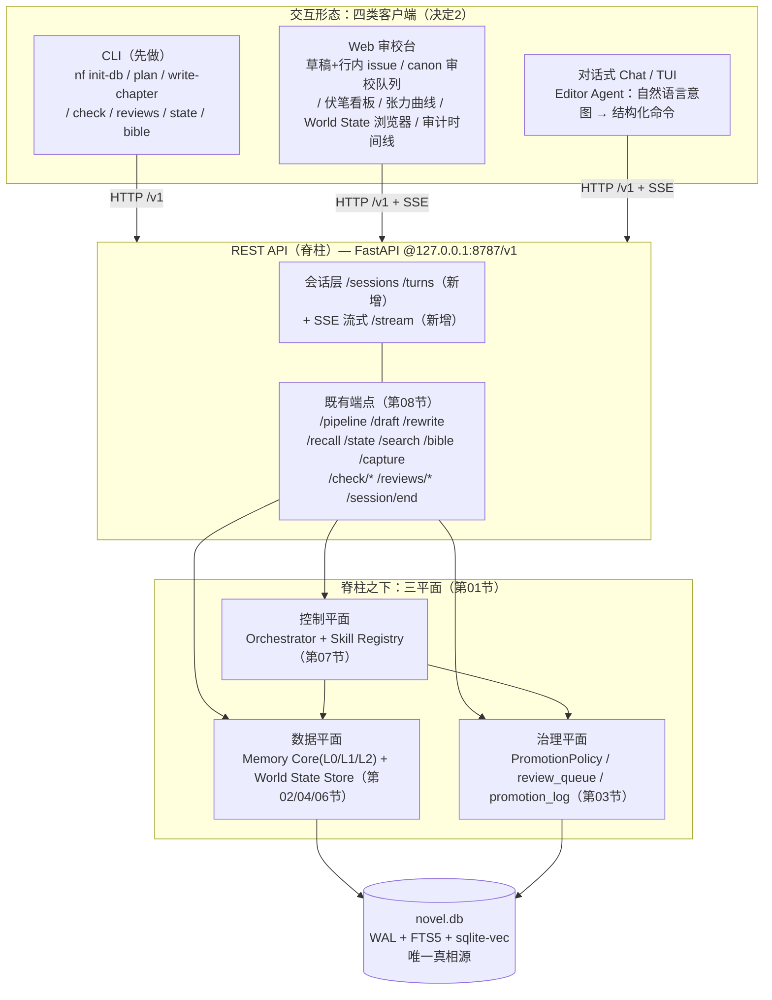
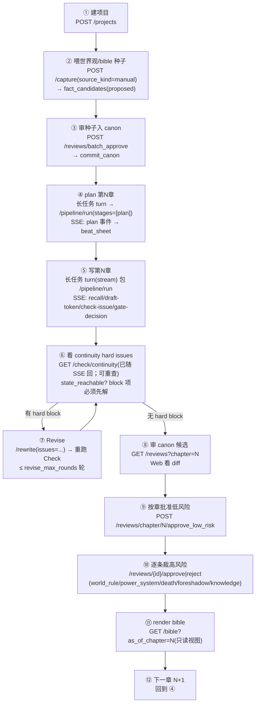
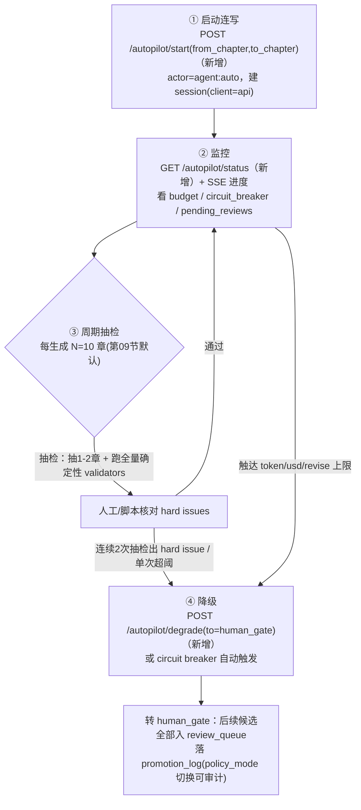
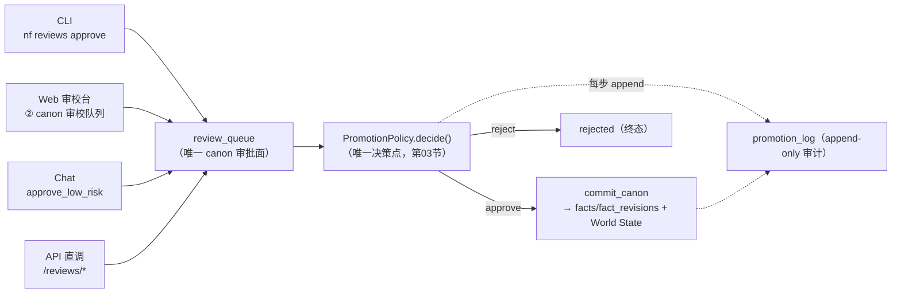

## 13. 交互模型与形态（CLI/REST/Web审校台/对话式）

> 本节落实【决定 2】：交互形态 = **CLI（先做）+ REST API（脊柱）+ Web 审校台 + 对话式（Chat/TUI）**，四者建在同一套 REST API 之上——**REST API 是唯一脊柱，CLI / Web / Chat 都是它的客户端**，不存在任何绕过 API 直连数据库或直写 canon 的旁路。
>
> 本节只设计"交互层"，不重复编排与治理细节：主循环 `Plan→Recall→Draft→Check(continuity‖craft)→Revise(≤N)→Gate→Commit` 详见第 07 节；`PromotionPolicy`/`Route`/`review_queue`/双模式分叉详见第 03 节；FastAPI 端点全集（`/pipeline`、`/draft`、`/rewrite`、`/recall`、`/state`、`/check/*`、`/reviews/*`、`/bible`、`/capture`、`/search/*`、`/session/end`）详见第 08 节；World State 表与 `as_of` 投影 `get_world_state(as_of_chapter=N)` 详见第 02/04 节；命名权威详见第 10 节。本节凡涉既有端点一律**复用、不改名**；新增端点逐一标注「**新增**」。
>
> 三条贯穿本节的硬约束：
> - **REST API 为脊柱**：任何客户端动作 = 一次或多次 HTTP 调用，无第二真相源（硬原则 11）。
> - **对话式不是写 canon 的后门**：自然语言意图最终都被翻译为既有结构化端点；任何 canon 变更一律经 `fact_candidates`→`PromotionPolicy`→`review_queue`，对话式**不得**自带提权（硬原则 5）。
> - **一切交互动作可审计**：CLI/Web/Chat 的每个写动作都带 `actor`，落 `promotion_log` / `tool_call_log` / `sessions·turns`（硬原则 9）。

---

### 13.1 分层架构：REST API 为唯一脊柱

四种形态全部是 REST API 的客户端，API 之下才是 Orchestrator / 治理 / Memory。客户端之间**不互相调用**、不共享内存状态，只通过 `novel.db`（经 API）这一真相源交换数据（硬原则 11）。



> 设计立场：CLI 先做是因为它最薄、最易端到端验证脊柱契约（MVP0 即可用，第 09 节）；Web 审校台与对话式在脊柱稳定后增量叠加，**不新增业务逻辑、只新增表现层**。新增的只有「会话/turn 模型 + SSE 流式包装」两块横切能力（13.2），业务端点全部复用第 08 节。

---

### 13.2 REST API：会话（sessions）与 turn 模型 + 流式

#### 13.2.1 为什么需要 sessions/turns

第 08 节端点是**无会话的单次请求**（除 `/session/end` 收尾）。但三类新客户端都需要"一段连续工作"的载体：CLI 一次连写跨多章、Web 一个审校工作台周期、Chat 一轮多 turn 对话。`sessions`/`turns` 提供：

1. **审计锚点**：把散落的 `pipeline.run` / `reviews.approve` / `chat.turn` 串到同一 `session_id`，回答"这一章是谁、在哪个会话、点了哪几下做出来的"（硬原则 9）。
2. **流式宿主**：长任务（写章/连写）的 SSE 事件流挂在某个 turn 上，断线可按 `turn_id` 续传。
3. **预算归集**：`budget_per_chapter` 的会话级累加（第 07 节 `BudgetLedger.session_*`）以 `session_id` 为键。

> sessions/turns **只记交互流水，不是 canon**：它们与 `promotion_log`（治理动作流）/ `fact_revisions`（内容变更流）正交，canon 真相源不变（第 03/10 节）。

#### 13.2.2 最小 DDL（新增表，同库同事务）

```sql
-- 交互会话（新增）：一段连续工作的载体；客户端类型决定来源
CREATE TABLE IF NOT EXISTS sessions (
    id            TEXT PRIMARY KEY,                 -- sess_xxx
    client        TEXT NOT NULL                     -- 来源客户端
                     CHECK(client IN ('cli','web','chat','api')),
    mode          TEXT                              -- 本会话治理模式快照(human_gate|auto_promote|hybrid)
                     CHECK(mode IN ('human_gate','auto_promote','hybrid')),
    actor         TEXT NOT NULL,                    -- 主体：editor:cha / agent:auto / cli:local
    started_at    TEXT NOT NULL DEFAULT (datetime('now')),
    ended_at      TEXT,
    budget_spent_tokens INTEGER NOT NULL DEFAULT 0, -- 会话累计(第07节 BudgetLedger.session_*)
    budget_spent_usd    REAL    NOT NULL DEFAULT 0.0,
    summary       TEXT                              -- /session/end 收尾摘要
);

-- 会话内的一次交互(新增)：一条命令/一轮对话/一次长任务
CREATE TABLE IF NOT EXISTS turns (
    id            TEXT PRIMARY KEY,                 -- turn_xxx
    session_id    TEXT NOT NULL REFERENCES sessions(id),
    seq           INTEGER NOT NULL,                 -- 会话内序号(从1递增)
    kind          TEXT NOT NULL                     -- 交互类型
                     CHECK(kind IN ('command','chat','long_task')),
    intent        TEXT,                             -- 对话式:解析出的意图码(见13.6)；命令式:子命令名
    request_json  TEXT NOT NULL,                    -- 归一化后的结构化请求(路由到的端点+参数)
    routed_endpoint TEXT,                           -- 实际命中的 REST 端点(可审计:对话最终走了哪个API)
    status        TEXT NOT NULL DEFAULT 'running'
                     CHECK(status IN ('running','done','error','canceled')),
    stream        INTEGER NOT NULL DEFAULT 0,       -- 1=该 turn 走 SSE
    result_json   TEXT,                             -- 同步结果或长任务终态摘要
    started_at    TEXT NOT NULL DEFAULT (datetime('now')),
    finished_at   TEXT,
    UNIQUE(session_id, seq)
);
CREATE INDEX IF NOT EXISTS idx_turns_session ON turns(session_id, seq);
```

> `turns.routed_endpoint` 是"对话式绝不绕过脊柱"的可审计证据：任何 chat turn 必然落一条记录，标明它最终翻译成了哪个既有 REST 端点（硬原则 5/9）。

#### 13.2.3 同步小操作 vs 长任务流式：判定准则

| 类别 | 典型操作 | 传输 | 端点 |
|---|---|---|---|
| **同步小操作**（毫秒～秒级，确定性查询/单次治理动作） | 查 `as_of` 状态、看 review 列表、审校 approve/reject、render bible、查实体时间线 | 普通 JSON（`200`） | `/state`、`/recall`、`/reviews*`、`/bible`、`/entities/{id}/timeline` 等（第 03/08 节，**复用**） |
| **长任务**（数十秒～分钟级，含 LLM 创作/多阶段管线） | 写第 N 章、连写多章、Revise 重跑 Check | **SSE 流式**（`text/event-stream`），实时回 plan/recall/draft-token/tool-call/check-issue/gate-decision 进度事件 | `/sessions/{id}/turns` + `/stream`（**新增**，包装 `/pipeline/run`、`/draft/chapter`、`/rewrite`） |

#### 13.2.4 关键端点签名（新增流式与会话端点；业务端点复用第 08 节）

```python
# ===== 会话端点（新增）=====================================================
# POST /v1/projects/{project_id}/sessions —— 开会话
class SessionCreateRequest(BaseModel):
    client: Literal["cli", "web", "chat", "api"]
    actor: str                                  # editor:cha / agent:auto / cli:local
    mode: Literal["human_gate","auto_promote","hybrid"] | None = None  # None=读config(第03节)

class SessionResponse(BaseModel):
    session_id: str
    client: str
    mode: str
    actor: str
    started_at: datetime

# POST /v1/.../sessions/{session_id}/turns —— 起一个 turn（同步或流式）
class TurnCreateRequest(BaseModel):
    kind: Literal["command", "chat", "long_task"]
    # command/long_task：直接给结构化请求；chat：给自然语言，由 Editor Agent 解析(见13.6)
    intent: str | None = None                   # 子命令名 或 解析出的意图码
    payload: dict                               # 归一化后的端点参数；chat 时含 {"utterance": "..."}
    stream: bool = False                        # True → 返回 SSE；长任务必为 True

class TurnSyncResponse(BaseModel):              # stream=False 时
    turn_id: str
    seq: int
    routed_endpoint: str                        # 最终命中的既有 REST 端点（可审计）
    status: Literal["done", "error"]
    result: dict                                # 透传被路由端点的响应体

# GET /v1/.../sessions/{session_id}/turns/{turn_id}/stream —— SSE 进度流（新增）
#   Content-Type: text/event-stream；stream=True 的 long_task turn 用它续读
#   断线续传：客户端带 Last-Event-ID 头，服务端从该事件序号之后补发

# POST /v1/.../sessions/{session_id}/end —— 会话收尾（复用第08节 /session/end 语义）
#   触发缓存命中统计、circuit breaker 复位、L1 异步 flush、pending_reviews 汇报
```

**SSE 事件协议**（长任务进度事件，逐阶段对应主循环第 07 节）：

```python
class StreamEvent(BaseModel):
    """SSE data 体。event 类型映射主循环阶段 + token 级增量 + 工具调用 + 校验 + 闸门。"""
    seq: int                                    # 事件序号（断线续传锚点，对应 SSE id:）
    type: Literal[
        "plan",            # PlannerSkill 产出 beat_sheet（携 beat_sheet_id）
        "recall",          # 实体优先召回完成（携命中 entity 数 / facts 数）
        "draft-token",     # ChapterDraftSkill 正文流式 token 增量（delta）
        "tool-call",       # Draft/Check 内受限只读工具调用（决定1：有界 ReAct，携 tool 名/入参摘要）
        "check-issue",     # continuity/craft 产出一条 issue（hard/soft/craft）
        "gate-decision",   # PromotionPolicy 对某变更的 Route（commit/review/hold/reject）
        "stage-done",      # 某阶段完成（plan/recall/draft/check/revise/gate/commit）
        "budget",          # 预算/熔断进度（spent_tokens/usd，circuit_breaker_tripped）
        "final",           # 终态：chapter_no + final_gate + 残留 issue + 是否进 review_queue
        "error",
    ]
    stage: Literal["plan","recall","draft","check","revise","gate","commit"] | None = None
    data: dict                                  # 各类型的负载（如 draft-token: {"delta": "..."}）
```

```
# 一次"写第48章"的 SSE 流示例（text/event-stream）
event: plan
id: 1
data: {"seq":1,"type":"plan","stage":"plan","data":{"beat_sheet_id":"bs_48","beats":4}}

event: recall
id: 2
data: {"seq":2,"type":"recall","stage":"recall","data":{"entities":["林尘"],"facts":14}}

event: tool-call
id: 3
data: {"seq":3,"type":"tool-call","stage":"draft","data":{"tool":"query_world_state","args":{"as_of":47}}}

event: draft-token
id: 4
data: {"seq":4,"type":"draft-token","stage":"draft","data":{"delta":"林尘握紧断剑，"}}

event: check-issue
id: 88
data: {"seq":88,"type":"check-issue","stage":"check","data":{"kind":"hard","validator":"power_monotonic","severity":"block","claim":"第48章=金丹后期"}}

event: gate-decision
id: 95
data: {"seq":95,"type":"gate-decision","stage":"gate","data":{"target":"power_system","route":"enqueue_review","reason":"require_human_for"}}

event: final
id: 96
data: {"seq":96,"type":"final","data":{"chapter_no":48,"final_gate":"enqueued_review","pending_reviews":1,"has_unresolved_conflicts":false}}
```

> 流式实现注：`/stream` 内部就是把第 08 节 `/pipeline/run` 的 `StageResult` 序列 + Draft 的 token 增量（第 08 节注「正文 max_tokens>16000 须 streaming」）+ Check 的 `HardIssue/SoftIssue/CraftIssue` + Gate 的 `Route` 实时转译为 SSE 事件，**不引入新业务逻辑**。`tool-call` 事件对应【决定 1】Draft/Check 内部受限只读工具调用的有界 ReAct 循环（最多 K 步，详见第 07/14 节），让作者看见"模型在补取哪些上下文"。

---

### 13.3 作者日常循环（核心）

#### 13.3.1 模式 1（人审为主，`mode=human_gate`）——"作者的一天"步骤流

这是产品核心路径：AI 起草、作者审定 canon。每一步对应脊柱端点，全程 `actor=editor:<name>`，可审计（硬原则 9）。



**详细步骤（一天 = 若干章循环）：**

| # | 动作 | 端点（第 03/08 节，复用） | 要点 |
|---|---|---|---|
| ① | 建项目 | `POST /projects` | 初始化 `novel.db` + schema + 索引（第 08 节） |
| ② | 喂世界观/bible 种子 | `POST /capture`（`source_kind=manual`） | 种子写成 `BibleChangeProposal[]` 进 `fact_candidates(proposed)`，**不直写 canon**（硬原则 2/5） |
| ③ | 审种子入 canon | `POST /reviews/batch_approve` | 首次铺底 canon，经 `commit_canon` 落 `facts`/`fact_revisions` |
| ④ | plan 第 N 章 | `/pipeline/run`（`stages=[plan]`） | PlannerSkill 产 beat sheet（写 `beats`/`chapter_cards`），SSE `plan` 事件 |
| ⑤ | 写第 N 章 | 长任务流式 turn 包 `/pipeline/run` | 走 Plan→Recall→Draft→Check→Revise→Gate，SSE 实时回进度 |
| ⑥ | 看 continuity hard issues | 随 SSE `check-issue` 返回；可 `POST /check/continuity` 重查 | `state_reachable=false` 或 `severity=block` 必须先解（`continuity_gate=block`，第 03/04 节） |
| ⑦ | Revise（如有 block） | `POST /rewrite` → 重跑 Check | ≤ `revise_max_rounds` 轮；**改完必重跑 Check**（第 07 节循环不变量） |
| ⑧ | 审 canon 候选 | `GET /reviews?chapter=N` | Web 审校台看每条候选的 diff + `evidence_refs` |
| ⑨ | 按章批准低风险 | `POST /reviews/chapter/{N}/approve_low_risk` | 一键放行场景摘要/文风等低风险候选（第 03.5 节高频操作） |
| ⑩ | 逐条裁高风险 | `POST /reviews/{id}/approve\|reject` | `require_human_for` 五类（world_rule/power_system/character_death/foreshadow_payoff/knowledge_edge_change）必须人工逐条 |
| ⑪ | render bible | `GET /bible?as_of_chapter=N` | 从 `facts` 确定性渲染**只读视图**，核对本章后 canon 全貌 |
| ⑫ | 下一章 | 回到 ④ | 下一章 Recall 的 `as_of(N)` 只读已 commit 的 canon，错误候选不污染基准（第 07.7 节） |

> 模式 1 的设计目标是**把人的注意力集中在少数高风险变更上**：⑨ 一键放行低风险 + ⑩ 逐条把关高风险，使"审定 canon"这个模式 1 核心价值不被低风险噪声淹没（第 03.5 节）。

#### 13.3.2 模式 2（全自动，`mode=auto_promote`）——启动连写 → 监控 → 周期抽检 → 降级



| # | 动作 | 端点 | 要点 |
|---|---|---|---|
| ① | 启动连写 | `POST /autopilot/start`（**新增**，包装循环调用 `/pipeline/run`） | 建 `session(client=api, actor=agent:auto)`；高风险变更即便 auto 仍强制入 `review_queue`（硬原则 5） |
| ② | 监控 | `GET /autopilot/status`（**新增**）+ SSE | 实时 budget/熔断/积压；任何 `require_human_for` 命中都在 `gate-decision` 事件可见 |
| ③ | 周期抽检 | 每 **N=10** 章（第 09.5 默认）抽 1-2 章 + 跑全量确定性 validators（`/check/continuity`） | 抽检以**确定性 hard issue** 为准（可程序判定，不靠 LLM 自觉，硬原则 9/10） |
| ④ | 降级 | `POST /autopilot/degrade`（**新增**）或 circuit breaker 自动触发 | 触发条件（第 09.5）：连续 2 次抽检出 hard issue / 单次超阈 / 触达 token·usd·`revise_max_rounds` 上限 → 切回 `human_gate`，`policy_mode` 切换落 `promotion_log` 可审计 |

> 模式 1↔模式 2 的切换是"改一行 config / 调一个 `/autopilot/degrade`"，**同一条管线、同一个 `PromotionPolicy`、同一组表**（第 03 节核心结论）。`require_human_for` 五类是横跨两模式的安全底座，全自动下也绝不 auto commit。

---

### 13.4 CLI（先做）：完整命令集 → API 映射

CLI 是脊柱最薄的客户端（一个 `httpx` 包装 + 参数解析），MVP0 即可端到端验证契约。命名前缀 `nf`（NovelForge）。每条子命令开一个 `turn`，写动作带 `--actor`（默认 `cli:local`），可审计。

| CLI 命令 | 作用 | 对应 REST 端点（**复用**第 08 节，除注明） | 同步/流式 |
|---|---|---|---|
| `nf init-db --name --genre [--power-system]` | 建项目 + 初始化 novel.db | `POST /projects` | 同步 |
| `nf seed --file bible_seed.yaml [--auto-approve-low]` | 喂世界观/bible 种子进 staging | `POST /capture`（→ 可选 `/reviews/batch_approve`） | 同步 |
| `nf plan --chapter N` | 规划第 N 章 beat sheet | `POST /pipeline/run`（`stages=[plan]`） | 流式（`plan` 事件） |
| `nf write-chapter --chapter N [--mode]` | 起草第 N 章（走完整主循环到 Gate） | `POST /sessions/{id}/turns`（`long_task`,`stream`）包 `POST /pipeline/run` | **流式 SSE** |
| `nf check --chapter N [--craft]` | 单独重跑一致性/工艺校验 | `POST /check/continuity`（`+ /check/craft`） | 同步 |
| `nf reviews list [--chapter N] [--risk]` | 列待审 canon 候选 | `GET /reviews` | 同步 |
| `nf reviews approve <review_id> [--note]` | 单条批准候选 → canon | `POST /reviews/{id}/approve` | 同步 |
| `nf reviews reject <review_id> --reason` | 单条否决候选 | `POST /reviews/{id}/reject` | 同步 |
| `nf reviews approve-chapter N --low-risk` | 按章一键批准低风险 | `POST /reviews/chapter/{N}/approve_low_risk` | 同步 |
| `nf reviews batch-approve <id...>` | 批量批准 | `POST /reviews/batch_approve` | 同步 |
| `nf state query --as-of N [--entity] [--facet]` | 查 as-of 世界状态投影 | `POST /state`（`get_world_state(as_of_chapter=N)`） | 同步 |
| `nf bible render [--as-of N] [--format]` | 渲染只读 story_bible | `GET /bible` | 同步 |
| `nf rebuild-fts [--vec]` | 从 L0/L1 重放重建 FTS5/vec0 索引 | `POST /admin/reindex`（**新增**，包装 `db/reindex.py`，第 08 节，硬原则 11） | 流式（进度） |
| `nf serve [--host --port]` | 启动 FastAPI 脊柱本体 | （进程：`uvicorn app.main`，第 08 节） | — |
| `nf autopilot start --from --to` | 启动模式 2 连写 | `POST /autopilot/start`（**新增**） | 流式 |
| `nf autopilot status` | 监控连写 | `GET /autopilot/status`（**新增**） | 同步 |

CLI 调用骨架（脊柱客户端，零业务逻辑）：

```python
# cli/main.py —— CLI 只做：解析参数 → 调 REST → 渲染输出。无任何直连 db。
import httpx, typer
app = typer.Typer()
BASE = "http://127.0.0.1:8787/v1"

@app.command("write-chapter")
def write_chapter(chapter: int, mode: str | None = None, actor: str = "cli:local"):
    with httpx.Client(base_url=BASE) as c:
        sess = c.post(f"/projects/{PRJ}/sessions",
                      json={"client": "cli", "actor": actor, "mode": mode}).json()
        # 长任务：流式读 SSE，逐事件打印进度（plan/recall/draft-token/check-issue/gate-decision）
        with c.stream("POST", f"/projects/{PRJ}/sessions/{sess['session_id']}/turns",
                      json={"kind": "long_task", "intent": "write_chapter",
                            "payload": {"chapter_no": chapter}, "stream": True}) as r:
            for line in r.iter_lines():
                render_sse_event(line)     # check-issue→红字，gate-decision→标注 review_queue

@app.command("reviews")
def reviews(action: str, review_id: str = None, chapter: int = None, reason: str = None):
    # approve/reject/list/approve-chapter/batch-approve → 一一映射 /reviews* 端点（第03节）
    ...
```

> CLI 的 `write-chapter` 与 Web、Chat 走的是**完全相同的脊柱端点**（`/pipeline/run`）；三客户端在治理上无差别——CLI 也不能绕过 `review_queue` 写 canon。

---

### 13.5 Web 审校台：列视图

Web 审校台是模式 1 的主力 GUI，纯前端 SPA + 调脊柱端点（无独立后端）。七个核心视图，全部只读展示或经治理端点写：

| 视图 | 内容 | 数据来源端点（**复用**，除注明） | 写动作 |
|---|---|---|---|
| **① 章节草稿 + 行内一致性问题** | L0 草稿正文，按 `evidence_refs` 的 `chap:span` 行内高亮 hard/soft/craft issue | `GET /bible` 草稿（L0）+ `POST /check/continuity` + `/check/craft`（第 08 节）；issue 的 `evidence_refs` 定位行内锚点 | 无（跳转到 Revise 走 `/rewrite`） |
| **② canon 审校队列** | 待审候选列表，每条展开 **diff**（`old`→`new`）+ `evidence_refs` + `risk_tier`，支持 approve/reject/**batch**/按章批准低风险 | `GET /reviews`（第 03.5 节） | `POST /reviews/{id}/approve\|reject`、`/reviews/batch_approve`、`/reviews/chapter/{N}/approve_low_risk` |
| **③ 伏笔看板** | `foreshadow` 状态机泳道：`planted→reinforced→misled→paid_off`，**overdue 红标**（`due_chapter` 已过未 paid_off） | `GET /state`（facet 含 foreshadow）或 `/check/craft` 的 `overdue_foreshadow`（第 08 节，第 02.6.4 节状态机） | 无（payoff 属高风险，仍走 review_queue） |
| **④ 张力曲线** | `pacing_state.tension_curve`（每章 `tension_level` 1-10）折线 + value_shift 净向标注 | `GET /state`（facet=pacing）/ `/check/craft` 的 `tension_point`（第 02.6.5 / 08 节） | 无（只读监控） |
| **⑤ World State 浏览器** | as-of(N) 浏览：**实体**（entities/aliases）、**境界**（power_ranks 有序枚举 + character_power_log）、**知情者图**（knowledge_edges who-knows-what，networkx 视图渲染）、**库存**（item_ownership） | `POST /state`（`get_world_state(as_of_chapter=N)`，facets=power_ranks/knowledge_edges/item_ownership/...，第 02/04 节） | 无（确定性查询，零 LLM） |
| **⑥ 审计 + entity 变更时间线** | `promotion_log`（治理动作流）+ `fact_revisions`（内容变更流）合并时间线，标注每条 fact 的 canon/retconned 状态 | `GET /entities/{id}/timeline`（第 03.7.2 节） | 无 |
| **⑦ 单条 revert** | 在时间线上对某次 commit/retcon 追加逆操作（**append 而非删除**） | `POST /canon/revert`（第 03.7.3 节） | `POST /canon/revert`（revert 也是一次新 append，写 `promotion_log.reverts_log_id`） |

> Web 审校台**不发明任何新数据写路径**：所有 canon 写动作都经 `/reviews*` / `/canon/revert`，即经 `PromotionPolicy` / append-only 审计（硬原则 2/9）。⑤ World State 浏览器的知情者图用第 08 节"networkx 查询期内存视图（跑完即弃）"渲染，前端只拿 `/state` 的结构化结果绘图，不持久化图。

---

### 13.6 对话式层（Editor Agent）：意图 → 结构化命令/工具 → 既有管线

对话式（Chat/TUI）是最高层的便利皮肤。**Editor Agent 是一个意图解析+路由器，不是 canon 写入者**：它把自然语言翻译为既有结构化端点调用，绝不自带提权（硬原则 5）。

#### 13.6.1 意图清单 → 解析与路由表

| 自然语言（utterance 示例） | 解析意图码（`turns.intent`） | 归一化为 | 路由到的 REST 端点（**复用**） | 类别 |
|---|---|---|---|---|
| "写第 5 章" | `write_chapter` | `{chapter_no:5}` | `POST /pipeline/run`（long_task,stream） | 创作（长任务） |
| "继续连写到第 30 章" | `autopilot_run` | `{from:N,to:30}` | `POST /autopilot/start`（新增） | 创作（长任务） |
| "把苏眠改神秘" | `propose_canon_change` | `BibleChangeProposal{op:update, entity:"苏眠", fact_type:"persona", new:{...}}` | `POST /capture` → `fact_candidates(proposed)` → `PromotionPolicy` | **canon 变更（必走 review_queue）** |
| "叶凡现在什么境界" | `query_state` | `{as_of_chapter:当前, entity:"叶凡", facet:["power_ranks"]}` | `POST /state`（确定性 SQL） | 事实查询（同步） |
| "第 3 章钥匙伏笔回收没" | `query_foreshadow` | `{label:"钥匙", as_of:当前}` | `POST /state`（facet=foreshadow）/ `GET /check/craft` overdue | 事实查询（同步） |
| "第 12 章这段有没有矛盾" | `run_check` | `{chapter_no:12}` | `POST /check/continuity` | 校验（同步） |
| "把第 7 章这几条低风险都过了" | `approve_low_risk` | `{chapter:7}` | `POST /reviews/chapter/{7}/approve_low_risk` | 治理（同步） |
| "苏眠的设定是什么时候改的" | `entity_timeline` | `{entity:"苏眠"}` | `GET /entities/{id}/timeline` | 审计查询（同步） |

#### 13.6.2 Editor Agent 解析→路由骨架

```python
# chat/editor_agent.py —— 自然语言 → 结构化端点调用。绝不直写 canon。
INTENT_ROUTES = {                                  # 意图码 → (端点, 是否长任务, 是否canon变更)
    "write_chapter":         ("/pipeline/run",                      True,  False),
    "autopilot_run":         ("/autopilot/start",                   True,  False),
    "propose_canon_change":  ("/capture",                           False, True),   # 必走治理
    "query_state":           ("/state",                             False, False),
    "query_foreshadow":      ("/state",                             False, False),
    "run_check":             ("/check/continuity",                  False, False),
    "approve_low_risk":      ("/reviews/chapter/{chapter}/approve_low_risk", False, True),
    "entity_timeline":       ("/entities/{id}/timeline",            False, False),
}

def handle_turn(session_id: str, utterance: str, actor: str) -> dict:
    intent, params = parse_intent(utterance)       # LLM 解析为意图码 + 结构化参数（受限 schema）
    endpoint, is_long, is_canon = INTENT_ROUTES[intent]

    # —— 铁律：对话式绝不能成为绕过 Gate 直写 canon 的后门（硬原则5）——
    if is_canon and intent == "propose_canon_change":
        # 只能产 BibleChangeProposal 进 fact_candidates(proposed)，由 PromotionPolicy 裁定；
        # human_gate 下必进 review_queue；require_human_for 命中即便 auto 也人审。
        assert endpoint == "/capture"              # 不存在 chat→facts 直写旁路
    # 记 turn（含 routed_endpoint），任何 chat 动作可审计（硬原则9）
    turn = open_turn(session_id, kind="chat", intent=intent,
                     request=params, routed_endpoint=endpoint, stream=is_long)
    return route_to_rest(endpoint, params, stream=is_long, actor=actor)
```

#### 13.6.3 铁律：对话式不是绕过 Gate 的后门

1. **canon 变更一律走 `review_queue`**：任何"改设定/改人物/改结局"类意图只能被翻译成 `BibleChangeProposal` 进 `fact_candidates(proposed)`，交 `PromotionPolicy` 裁定（第 03 节）。Editor Agent **没有**直写 `facts`/`fact_revisions` 的端点可调——这类端点在脊柱上**根本不存在**（硬原则 2/5）。
2. **事实查询必须确定性**：`query_state`/`query_foreshadow`/`entity_timeline` 路由到确定性 SQL 端点（`/state`、`/entities/{id}/timeline`），LLM 只决定"调哪个端点、传什么参数"，**不亲自回答事实**（硬原则 1）。
3. **`require_human_for` 不可被对话绕过**：即便用户说"直接把这条境界变更定了"，命中 `require_human_for`（power_system 等）的候选在 auto 模式下也强制入 `review_queue`，对话式无提权（硬原则 5/8）。
4. **全程可审计**：每个 chat turn 落 `turns`（含 `intent`、`routed_endpoint`），canon 相关动作另落 `promotion_log`（硬原则 9）。

---

### 13.7 人审统一入口：review_queue 是所有客户端共同的 canon 审批面

四种形态在"canon 能否进真相源"这件事上**完全等价**：CLI 的 `nf reviews approve`、Web 的②审校队列、Chat 的 `approve_low_risk`、API 的 `/reviews/*`，最终都打到**同一个** `review_queue` + `PromotionPolicy` + `commit_canon`（第 03 节）。



统一入口的三条保证：

1. **唯一审批面**：不存在"某客户端有自己的批准逻辑"——所有 approve/reject/batch/按章批准都复用第 03.5 节同一组 `/reviews*` 端点与同一 `commit_canon` 事务。换客户端不改变治理语义。
2. **所有交互动作可审计**（硬原则 9）：每次审批写 `promotion_log`（`actor`=客户端主体如 `editor:cha`/`cli:local`/`agent:auto`、`op`、`old`/`new`、`reason`、`evidence_refs`、`policy_mode`）；交互层另有 `sessions`/`turns`（本节 13.2.2）/`tool_call_log`（决定 1 的受限工具调用，DDL 权威见第 12 节 §12.5）三本流水，与治理/内容两本账本交叉对账。
3. **无后门**（硬原则 2/5）：脊柱上根本不提供"绕过 `PromotionPolicy` 写 `facts`"的端点；CLI/Web/Chat 都是同一脊柱的客户端，因此**任何形态都无法**让 LLM 产物未经 Gate 进 canon。`require_human_for` 五类在四种形态、两种模式下一律强制人审。

---

### 13.8 本节产出清单（交叉引用）

- **新增表**：`sessions` / `turns`（13.2.2，交互流水，与 canon 正交）；`tool_call_log`（决定 1 受限工具调用记录，DDL 与字段权威见第 12 节 §12.5）。
- **新增端点**：`POST /sessions`、`POST /sessions/{id}/turns`、`GET /sessions/{id}/turns/{tid}/stream`（SSE）、`POST /autopilot/start`、`GET /autopilot/status`、`POST /autopilot/degrade`、`POST /admin/reindex`。其余全部**复用**第 08 节既有端点。
- **复用端点**：`/projects`、`/capture`、`/recall`、`/state`、`/check/continuity`、`/check/craft`、`/reviews*`、`/reviews/chapter/{N}/approve_low_risk`、`/bible`、`/entities/{id}/timeline`、`/canon/revert`、`/pipeline/run`、`/draft/chapter`、`/rewrite`、`/session/end`、`/search/*`（第 03/08 节）。
- **SSE 事件协议**：`plan/recall/draft-token/tool-call/check-issue/gate-decision/stage-done/budget/final/error`，逐阶段映射主循环（第 07 节）。
- **四形态映射**：CLI（13.4，先做）、Web 审校台（13.5，七视图）、对话式 Editor Agent（13.6，意图→路由表）、REST 脊柱（13.2）。
- **统一治理面**：`review_queue` + `PromotionPolicy`（13.7），四客户端等价、无后门、全可审计（硬原则 2/5/9）。
- **交叉引用**：主循环与受限工具调用详见第 07/14 节；`PromotionPolicy`/双模式/`/reviews*`/revert 详见第 03 节；端点契约/config 详见第 08 节；World State 表/`as_of` 投影详见第 02/04 节；抽检 N=10 与降级条件详见第 09.5 节；命名权威详见第 10 节。
