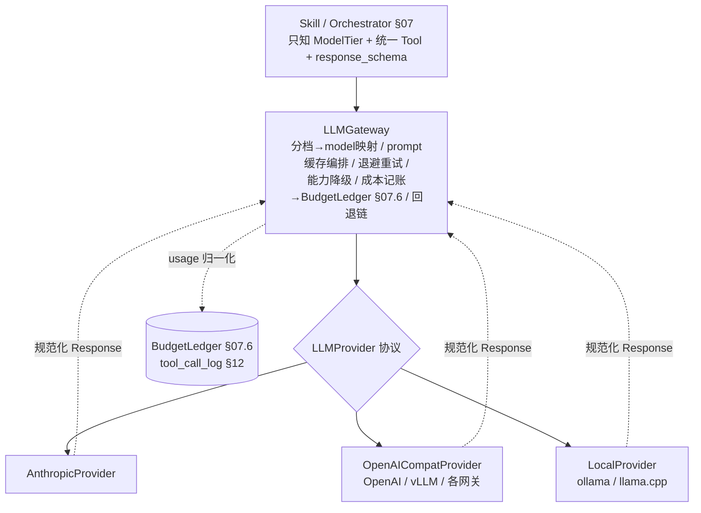

## 14. LLM接入层（多供应商 Provider 抽象）

本节落实【决定 3：多供应商】——把 §07.6.2 现有的单供应商 `LLMGateway`（分档调用 / 1h prompt cache / 429-5xx 指数退避 / 用 `cache_read_input_tokens` 验证命中）扩成**厂商无关**的多供应商接入层。`LLMGateway` 对上仍是 Skill 唯一拿到的 LLM 句柄（`SkillContext.llm`，§07.2.2 不变），对下新增一层 `LLMProvider` 厂商适配，把 Anthropic / OpenAI 兼容（含 vLLM 及各网关）/ 本地（ollama、llama.cpp）的差异收敛成统一接口。

设计立场：**Skill 与主循环（§07）完全不感知供应商**。Skill 只声明语义模型档（FAST/MID/STRONG）与统一的 `Tool`（JSON Schema）/`response_schema`；由 config 把语义档映射到各供应商的具体 model ID，由 `LLMProvider` 把统一请求翻译成各厂商 SDK 调用、把各厂商响应**归一化**回统一 `LLMResponse`。能力差异（tool_use / structured_output / prompt_caching / vision / streaming 等）由 `LLMGateway` 读**能力矩阵**决定降级路径，绝不把降级逻辑散落进 Skill。

> 字段名/价格红线：本节给出的各厂商 SDK 字段名、模型 ID、定价均为**工程结构示意**，落地时以各厂商官方最新文档为准（已用 Context7 核对 Anthropic / OpenAI 兼容 / Ollama 的请求与 usage 字段，见各小节标注）。`LLMProvider` 的职责就是把这些**易变细节**封死在适配层内，使上层稳定。

---

### 14.1 分层架构

四层，自上而下职责单一、依赖单向（上层只依赖下层接口、不依赖实现）：



| 层 | 组件 | 职责 | 不做什么 |
|---|---|---|---|
| 调用方 | `Skill` / `Orchestrator`（§07） | 声明语义档、统一 `Tool`、`response_schema`、`cache_hint`、是否 `stream` | 不知供应商、不写降级/重试/记账 |
| 网关 | `LLMGateway` | 档→model 映射、能力降级、prompt 缓存编排、退避重试、回退链、usage 归一化→§07.6 `BudgetLedger`、§09 流式事件桥接 | 不直接调任何厂商 SDK |
| 适配 | `LLMProvider`（协议） | 把统一请求翻译为某厂商 SDK 调用、把响应/usage/工具调用/流式事件归一化回统一形态 | 不做重试/记账/降级决策（那是 Gateway 的事） |
| 实现 | `AnthropicProvider` / `OpenAICompatProvider` / `LocalProvider` | 各自厂商的具体翻译与字段映射 | 不持有跨调用状态 |

**与现有设计的归并**：§07.6.2 的 `LLMGateway.call(...)` 保留为薄包装，内部转调本节 `LLMGateway.generate(...)`；§07.6.2 处文档改为「详见第 14 节」。`LLMUsage`（§07.2.2 `SkillResult.usage`）、`BudgetLedger.charge(usage)`（§07.6.1）、`ModelTier`（§07.2.1）继续沿用，本节只**扩充其语义**（多供应商 usage 归一化、语义档别名），不改名。

#### 14.1.1 LLMProvider 协议

```python
# control_plane/llm/provider.py
from __future__ import annotations
from typing import Protocol, Iterator, Literal, Any
from pydantic import BaseModel

# ---- 统一请求侧类型（厂商无关）----
class Message(BaseModel):
    role: Literal["user", "assistant", "tool"]
    content: str | list["ContentPart"]          # str 或多模态分块（vision）
    tool_call_id: str | None = None             # role="tool" 时回填，关联某次 tool_use

class ContentPart(BaseModel):
    type: Literal["text", "image"]
    text: str | None = None
    image_b64: str | None = None                # vision：base64；Gateway 按能力矩阵决定是否允许
    media_type: str | None = None               # 如 "image/png"

class Tool(BaseModel):
    """统一工具定义：一份 JSON Schema，由各 Provider 翻译成厂商格式（见 14.3）。"""
    name: str
    description: str
    parameters: dict[str, Any]                  # 标准 JSON Schema（type=object）
    strict: bool = True                         # 可强约束时启用（Anthropic strict / OpenAI strict）

class ToolCall(BaseModel):
    """归一化工具调用——§12 受限工具循环消费的就是它（厂商无关）。"""
    id: str                                     # 厂商各自的 id，无则 Provider 生成
    name: str
    arguments: dict[str, Any]                   # 已解析为 dict（Provider 负责 JSON 解析/兜底）

class Usage(BaseModel):
    """归一化用量。本地模型 cost≈0，但仍记 token（14.8）。"""
    input: int = 0
    output: int = 0
    cache_read: int = 0                         # 命中缓存读入的 token（厂商字段映射见 14.6）
    cache_write: int = 0                        # 写入/创建缓存的 token（计价不同）
    provider: str = ""                          # 实际承接此次调用的供应商（回退后可能非主供应商）
    model: str = ""                             # 实际 model ID

class Response(BaseModel):
    """规范化响应——Gateway 与 Skill 只认这个形态。"""
    text: str = ""                              # 文本输出（无文本时为空串）
    tool_calls: list[ToolCall] = []
    usage: Usage = Usage()
    stop_reason: Literal["stop", "tool_use", "max_tokens", "error"] = "stop"
    raw: dict | None = None                     # 调试用原始响应（不入库、不入日志，14.9）

class CapabilitySet(BaseModel):
    """单个供应商的能力声明（14.2 能力矩阵的运行时形态）。"""
    tool_use: bool = False
    parallel_tool_calls: bool = False
    structured_output: bool = False             # 原生 json_schema 约束
    prompt_caching: Literal["explicit", "auto", "none"] = "none"
    streaming: bool = False
    system_prompt: bool = True
    vision: bool = False

class LLMProvider(Protocol):
    name: str
    def capabilities(self, model: str) -> CapabilitySet: ...

    def generate(
        self, *,
        messages: list[Message],
        system: str | None = None,
        tools: list[Tool] | None = None,
        response_schema: dict | None = None,    # JSON Schema；走结构化输出归一化（14.4）
        stream: bool = False,
        cache_hint: "CacheHint | None" = None,  # 稳定前缀断点提示（14.6）
        model: str,                             # 已由 Gateway 完成档→model 映射
        max_tokens: int = 4096,
    ) -> Response | Iterator["ProviderStreamEvent"]: ...
```

`LLMProvider` 是**无状态适配器**（同 §07 Skill 的无状态纪律）：不持有预算、不重试、不记账、不做能力降级——这些全在 `LLMGateway`。Provider 只做「翻译进、归一化出」。

---

### 14.2 能力矩阵与按能力降级

每个供应商按 model 声明 `CapabilitySet`。`LLMGateway` 在每次调用前查矩阵，对**缺失能力**走声明式降级，绝不让 Skill 因换供应商而失败。

#### 14.2.1 能力矩阵表（参考值，落地以官方文档与实测为准）

| 能力 | AnthropicProvider | OpenAICompatProvider（OpenAI / vLLM / 网关） | LocalProvider（ollama / llama.cpp） |
|---|---|---|---|
| `tool_use` | ✅ 原生（`tools[].input_schema`） | ✅ 原生（`tools`，function calling） | 视模型：ollama 新模型 `/api/chat` 支持 `tools`；不支持者→提示式兜底（14.3） |
| `parallel_tool_calls` | ✅ | ✅（可显式开关） | 多为否；兜底协议串行处理 |
| `structured_output`（json_schema） | ✅ `output_config.format=json_schema` 或工具强制 | ✅ `response_format=json_schema`（部分网关/vLLM 经 guided decoding） | ollama `format=<JSON Schema>`；llama.cpp grammar/JSON-mode；否则 JSON-mode+Pydantic 校验修复（14.4） |
| `prompt_caching` | `explicit`（`cache_control` 断点） | `auto`（自动前缀缓存，无显式断点） | `none`（本地无缓存计费，但稳定前缀纪律仍执行，14.6） |
| `streaming` | ✅（SSE message/content_block 事件） | ✅（`stream=true`，`stream_options.include_usage`） | ✅（逐 chunk `message.content`） |
| `system_prompt` | ✅（`system` 顶层） | ✅（`role:"system"` 消息） | ✅（`role:"system"` 消息） |
| `vision` | ✅（image content block） | 视模型（gpt-4o 等 ✅） | 视模型（llava 等 ✅） |

> 矩阵不写死在代码常量里——而是从 `config.providers.<id>.capabilities` 读取（14.9 示例），便于换 model/网关时只改 config。Provider 的 `capabilities(model)` 返回该声明，Gateway 不自行猜测。

#### 14.2.2 降级规则（Gateway 实施）

| 缺失能力 | 降级动作 | 兜底实现 |
|---|---|---|
| `tool_use` | 工具走「提示式 JSON 协议」 | 把 `tools` 渲染进 system + 用户消息，解析模型返回的 JSON 工具调用为 `ToolCall`（14.3） |
| `parallel_tool_calls` | 串行 | §12 工具循环本就按步消费 `ToolCall`，并行缺失仅影响吞吐不影响正确性 |
| `structured_output` | JSON-mode + 校验修复重试 | instructor 式：Pydantic 校验失败→带错误回灌重试 ≤R 次（14.4） |
| `prompt_caching=auto` | 不打显式断点，只保稳定前缀纪律 | 仅靠前缀字节稳定吃自动缓存；用 usage 缓存字段验证（14.6） |
| `prompt_caching=none` | no-op | 仍按稳定前缀渲染（前缀污染纪律全供应商一致，硬原则 10） |
| `vision` | 拒绝或转文字描述 | 默认抛 `CapabilityUnsupported`；NovelForge 正文链路不依赖 vision，安全 |

降级是**确定性查表**，不是模型自适应；每次降级写一条 `tool_call_log`/调用审计的 `degraded=true` 标记（§12 表，硬原则 9）。

---

### 14.3 工具调用归一化

统一 `Tool`（一份 JSON Schema）是唯一事实源。各 Provider 负责**双向翻译**：请求时统一 `Tool` → 厂商工具格式；响应时厂商工具调用 → 统一 `ToolCall`。§12 的受限工具循环只消费 `ToolCall`，与供应商解耦。

#### 14.3.1 请求侧翻译

```python
# AnthropicProvider：统一 Tool → Anthropic tools（input_schema + strict）
def _to_anthropic_tools(tools: list[Tool]) -> list[dict]:
    return [{
        "name": t.name,
        "description": t.description,
        "input_schema": t.parameters,          # JSON Schema 直接落 input_schema
        **({"strict": True} if t.strict else {}),
    } for t in tools]

# OpenAICompatProvider：统一 Tool → OpenAI function tools
def _to_openai_tools(tools: list[Tool]) -> list[dict]:
    return [{
        "type": "function",
        "function": {
            "name": t.name,
            "description": t.description,
            "parameters": t.parameters,
            **({"strict": True} if t.strict else {}),
        },
    } for t in tools]

# LocalProvider(ollama 原生 /api/chat)：与 Anthropic 同形（name/description/parameters）
def _to_ollama_tools(tools: list[Tool]) -> list[dict]:
    return [{"type": "function",
             "function": {"name": t.name, "description": t.description,
                          "parameters": t.parameters}} for t in tools]
```

#### 14.3.2 无原生 tool-use 的本地模型：提示式 JSON 协议兜底

当 `capabilities(model).tool_use == False`（如旧 llama.cpp 模型），Gateway 走兜底：把工具清单注入 prompt，约束模型只输出一个工具调用 JSON，由解析器还原成 `ToolCall`。

```python
# control_plane/llm/tool_fallback.py
TOOL_PROTOCOL_SYSTEM = """你可调用以下只读工具补取上下文。需要调用时，只输出一个 JSON：
{{"tool":"<name>","arguments":{{...}}}}
不要输出任何其它文字。不需要工具时输出：{{"tool":null,"answer":"<最终答复>"}}
可用工具:
{tool_specs}"""

def render_tool_protocol(tools: list[Tool]) -> str:
    specs = "\n".join(f"- {t.name}: {t.description}\n  参数 schema: {json.dumps(t.parameters, ensure_ascii=False)}"
                      for t in tools)
    return TOOL_PROTOCOL_SYSTEM.format(tool_specs=specs)

def parse_tool_protocol(text: str) -> tuple[list[ToolCall], str]:
    """从模型文本里抽出 JSON 工具调用；解析失败→空 tool_calls（Gateway 触发修复重试）。"""
    obj = _extract_first_json_object(text)          # 容错：剥 code fence / 前后噪声
    if not obj or obj.get("tool") in (None, "null"):
        return [], (obj or {}).get("answer", text)
    return [ToolCall(id=f"tcfb_{uuid4().hex[:8]}",
                     name=obj["tool"], arguments=obj.get("arguments", {}))], ""
```

兜底协议产出的 `ToolCall` 与原生路径**形态完全一致**——§12 工具循环无需分支。兜底失败（连续解析不出合法 JSON）按 14.4 的修复重试上限处理，超限则该步降级为「无工具直接生成」并标 `degraded=true`。

> NovelForge 受限工具集是只读的（§12：as-of 状态查询、实体召回、禁忌查询等确定性 SQL，硬原则 1），所以兜底协议即便偶发解析失败也不会污染 canon——最坏只是少补一次上下文，由后续 Check 兜底。

#### 14.3.3 响应侧归一化

| 供应商 | 工具调用出处 | 归一化为 `ToolCall` |
|---|---|---|
| Anthropic | `content[]` 中 `type=="tool_use"` 块（`id`/`name`/`input`） | `ToolCall(id, name, arguments=input)` |
| OpenAI 兼容 | `choices[0].message.tool_calls[]`（`id`/`function.name`/`function.arguments` 为 JSON 串） | 解析 `arguments` 串为 dict |
| ollama 原生 | `message.tool_calls[]`（`function.name`/`function.arguments` 已是对象） | 直接取 |
| 提示式兜底 | 模型文本里的 JSON | `parse_tool_protocol` |

回灌工具结果时反向翻译：统一 `Message(role="tool", tool_call_id=...)` → Anthropic `tool_result` 块 / OpenAI `role:"tool"` 消息 / ollama `role:"tool"` 消息。

---

### 14.4 结构化输出归一化

统一入口 `generate_structured(schema)`：调用方给一份 JSON Schema（或 Pydantic 模型 → `model_json_schema()`），拿回校验通过的对象。各供应商走各自最强约束路径，本地兜底用 instructor 式校验-修复重试。**这是 §07 抽取（`ExtractSkill` 产 `BibleChangeProposal`）、Check 初筛、PromotionPolicy 输入的统一产出口**（呼应 §08.7 instructor+Pydantic 自愈）。

| 供应商 | 首选结构化路径 | 退路 |
|---|---|---|
| Anthropic | `output_config.format = {type:"json_schema", schema}`；或工具强制（`tool_choice` 指定单一 strict 工具，模型只能产该工具入参） | 工具强制 |
| OpenAI 兼容 / vLLM | `response_format = {type:"json_schema", json_schema:{name, schema, strict:true}}`（vLLM 经 guided decoding 等价） | `response_format={type:"json_object"}` JSON-mode + Pydantic |
| 本地（ollama） | `format = <JSON Schema 对象>`（ollama `/api/chat` 支持传 schema）；llama.cpp 用 grammar/JSON-mode | JSON-mode + Pydantic 校验修复 |

```python
# control_plane/llm/structured.py
from pydantic import BaseModel, ValidationError

def generate_structured(
    gw: "LLMGateway", *, tier: "ModelTier", schema_model: type[BaseModel],
    messages: list[Message], system: str | None = None,
    cache_hint: "CacheHint | None" = None, max_repair: int = 2,
) -> BaseModel:
    schema = schema_model.model_json_schema()
    last_err = None
    for attempt in range(max_repair + 1):
        resp = gw.generate(tier=tier, messages=messages, system=system,
                           response_schema=schema, cache_hint=cache_hint)
        try:
            return schema_model.model_validate_json(resp.text)
        except ValidationError as e:                 # 自愈：带错误回灌重试（instructor 式）
            last_err = e
            messages = messages + [
                Message(role="assistant", content=resp.text),
                Message(role="user",
                        content=f"上次输出不满足 schema，错误：{e}\n请只输出修正后的合法 JSON。"),
            ]
    raise StructuredOutputError(f"structured output failed after repairs: {last_err}")
```

要点：①原生 `structured_output=true` 的供应商，`max_repair` 通常用不到（一次过），重试是本地/弱网关的安全网；②修复重试的 token 计入会话预算（§07.6 `BudgetLedger`），并受 §07.6 断路器约束，防止「修复风暴」烧预算（硬原则 10）；③`schema` 是**稳定前缀**的一部分（不随章节变），可进缓存断点（14.6）。

---

### 14.5 语义模型档与 model 映射

把 §07.2.1 的 `ModelTier`（厂商相关的 HAIKU/SONNET/OPUS）抽象为**厂商无关语义档** FAST/MID/STRONG，旧三档保留为别名（不破坏 §07 已写的 Skill 契约 `model_tier`）。

```python
# control_plane/llm/tiers.py
from enum import Enum

class ModelTier(str, Enum):
    FAST   = "fast"     # 抽取 / 去重 / 连续性初筛 / 格式化（§07 原 HAIKU 位）
    MID    = "mid"      # beat sheet / 风格改写 / 对白 / 软 judge（§07 原 SONNET 位）
    STRONG = "strong"   # 正文创作 + 冲突复核（§07 原 OPUS 位，硬原则 10：只留这两件事）
    # —— 兼容别名（§07.2.1 既有契约直接可用）——
    HAIKU  = "fast"
    SONNET = "mid"
    OPUS   = "strong"
```

档→model 由 config 映射（每供应商一套），Gateway 在 `generate` 前完成解析：

```python
def resolve_model(cfg: "ProvidersConfig", provider_id: str, tier: ModelTier) -> str:
    return cfg.providers[provider_id].models[ModelTier(tier.value)]   # 别名先归一到 fast/mid/strong
```

**哪步用哪档**沿用 §06/§07，与供应商无关：

| 阶段 / Skill（§07.4） | 语义档 | 说明 |
|---|---|---|
| 抽取 / 去重 / 连续性初筛（`ExtractSkill`、`ContinuityCheckSkill` 初筛） | **FAST** | 确定性判断仍走 SQL validator（硬原则 1），LLM 只做软抽取 |
| beat sheet / 风格改写 / 对白 / 软 judge（`PlannerSkill`、`StyleRewriteSkill`、`CraftCheckSkill`、`CharacterDialogueSkill`） | **MID** | 中等创作与软维度 |
| 正文创作 + 冲突复核（`ChapterDraftSkill`、冲突复核） | **STRONG** | 硬原则 10：STRONG 只留正文与复核，吃满 prompt 缓存 |

各供应商具体 model ID 在 14.9 config 示例填写（Anthropic 填 Haiku/Sonnet/Opus 当代 ID；OpenAI 兼容/本地各自填）。

---

### 14.6 prompt 缓存归一化（硬原则 10）

缓存机制分三类，但**「稳定前缀不被污染」的纪律对所有供应商一致**——这是硬原则 10 的核心，与是否有显式缓存 API 无关。Gateway 统一暴露 `cache_hint`，由 Provider 翻译。

```python
# control_plane/llm/cache.py
from pydantic import BaseModel

class CacheHint(BaseModel):
    """稳定前缀断点提示。stable_blocks 必须只含不随章节变的内容
    （bible 渲染视图 / 风格 profile / always-on 禁忌 / 工具定义 / response schema）。
    任何章节号/uuid/时间戳/每次变化的检索结果一律放 dynamic（断点之后）。"""
    stable_blocks: list[str] = []               # 渲染顺序：tools → system → 稳定 messages
    ttl: str = "1h"                             # 仅 explicit 缓存用
```

| 供应商 | 缓存类型 | Provider 动作 | 命中验证字段（以官方文档为准） |
|---|---|---|---|
| Anthropic | `explicit` | 在 `stable_blocks` 末尾打 `cache_control={"type":"ephemeral","ttl":hint.ttl}` 断点 | `usage.cache_read_input_tokens`（>0=命中）、`cache_creation_input_tokens`（写入） |
| OpenAI 兼容 | `auto` | 不打断点，仅保证前缀字节稳定（顺序固定、动态内容后置） | usage 中的缓存命中字段（如 `prompt_tokens_details.cached_tokens`，命名随网关，以文档为准） |
| 本地（ollama/llama.cpp） | `none` | no-op；仍按稳定前缀渲染 | 无缓存计费字段；Usage.cache_read=0 |

统一渲染纪律（全供应商执行，承接 §07.5 不变量 2 与 §08.3 缓存红线）：

```python
def render_prompt(hint: CacheHint | None, dynamic_suffix: str) -> tuple[list[str], str]:
    stable = hint.stable_blocks if hint else []
    # 不变量：stable 内不得含章节号/时间戳/uuid/检索结果——由调用侧 Skill 契约 cache_prefix_keys 保证（§07.2.1）
    assert all(not _has_volatile_token(b) for b in stable), "stable prefix polluted (硬原则10)"
    return stable, dynamic_suffix                # dynamic 永远拼在最后断点之后
```

命中监控统一进 §07.6 记账：Gateway 把各供应商 usage 的缓存字段归一到 `Usage.cache_read`/`cache_write`；若同一稳定前缀的重复请求 `cache_read` 恒为 0，记一条 warning（silent invalidator 告警，同 §07.6.2）。本地供应商 `cache_read` 恒 0 属正常，不告警（按 `prompt_caching=="none"` 抑制）。

---

### 14.7 流式归一化

统一流式事件接口，经 Orchestrator 转译聚合后喂给第 13 节（§13.2.4）的业务级 SSE（端点契约见第 08 节；CLI/Web/Chat 客户端共用）。各 Provider 把厂商流式事件归一成同一 `ProviderStreamEvent` 序列。

> 命名区分：本节 `ProviderStreamEvent` 是 **Provider 层**的细粒度流（text/tool 增量）；第 13 节 §13.2.4 的业务级 `StreamEvent`（`plan/recall/draft-token/tool-call/check-issue/gate-decision/...`）是 **API/SSE 层**事件，由 Orchestrator 把本层事件转译聚合而成，二者分属两层、不可混用。

```python
# control_plane/llm/stream.py
from pydantic import BaseModel
from typing import Literal

class ProviderStreamEvent(BaseModel):
    type: Literal["text_delta", "tool_call_delta", "tool_call_done", "usage", "done", "error"]
    text: str | None = None                     # text_delta
    tool_call: ToolCall | None = None           # tool_call_done（参数完整）
    partial_args: str | None = None             # tool_call_delta（增量 JSON 片段）
    usage: Usage | None = None                  # usage / done 末尾
    stop_reason: str | None = None
```

归一化映射：

| 供应商 | 厂商事件 | → `ProviderStreamEvent` |
|---|---|---|
| Anthropic | `content_block_delta`(`text_delta`) | `text_delta` |
| | `content_block_delta`(`input_json_delta`) → `content_block_stop` | `tool_call_delta` → `tool_call_done` |
| | `message_delta`(usage) / `message_stop` | `usage` → `done` |
| OpenAI 兼容 | `choices[].delta.content` | `text_delta` |
| | `choices[].delta.tool_calls[]`（增量）→ 结束 | `tool_call_delta` → `tool_call_done` |
| | 末块（`stream_options.include_usage`）usage | `usage` → `done` |
| ollama 原生 | 逐 chunk `message.content` | `text_delta` |
| | 末 chunk `done=true` + `prompt_eval_count`/`eval_count` | `usage` → `done` |

`LLMGateway.generate(stream=True)` 返回 `Iterator[ProviderStreamEvent]`；Orchestrator 转译为第 13 节业务级 SSE 后由端点逐事件转 `event:`/`data:`（SSE 协议见 §13.2.4、端点见第 08 节）。流式收尾（`done`/`usage`）触发 `BudgetLedger.charge`（同非流式）。

---

### 14.8 成本记账（多供应商 usage 归一化）

config 各供应商定价表 → Provider 归一化 `Usage` → §07.6 `BudgetLedger.charge`。**本地模型成本 ≈ 0，但仍记 token**（用于配额观测、缓存命中分析、§12 工具循环步数与上下文体量审计）。

```python
# control_plane/llm/pricing.py
from pydantic import BaseModel

class Pricing(BaseModel):
    """每百万 token 美元价。本地供应商全填 0。"""
    input_per_mtok: float = 0.0
    output_per_mtok: float = 0.0
    cache_read_per_mtok: float = 0.0            # 命中缓存读入价（通常远低于 input）
    cache_write_per_mtok: float = 0.0           # 写缓存价（通常略高于 input）

def cost_usd(u: Usage, p: Pricing) -> float:
    return (u.input * p.input_per_mtok
            + u.output * p.output_per_mtok
            + u.cache_read * p.cache_read_per_mtok
            + u.cache_write * p.cache_write_per_mtok) / 1_000_000
```

各供应商 usage 字段 → 归一 `Usage`：

| 供应商 | 原始字段 | → `Usage` |
|---|---|---|
| Anthropic | `usage.input_tokens` / `output_tokens` / `cache_read_input_tokens` / `cache_creation_input_tokens` | `input` / `output` / `cache_read` / `cache_write` |
| OpenAI 兼容 | `usage.prompt_tokens` / `completion_tokens`；缓存命中明细（如 `prompt_tokens_details.cached_tokens`，以网关文档为准） | `input`=prompt−cached / `output` / `cache_read`=cached |
| ollama 原生 | `prompt_eval_count` / `eval_count` | `input` / `output`（无缓存字段→cache_read=0） |

`Usage` 转 §07.2.2 既有 `LLMUsage`（`billable_tokens()`/`usd()`）：Gateway 用 `cost_usd(u, pricing)` 填 `LLMUsage.usd`，`u.input+u.output+u.cache_write+u.cache_read` 填 token 维度。每次调用同时写 §07.3.1 `skill_run_log` 的 token/cost 列与 §12 `tool_call_log`（含 `provider`/`model`/`degraded`），供成本溯源与审计（硬原则 9）。

---

### 14.9 config.providers 段与 key 管理

新增 `config.providers` 段（承接 §08.3 config 根，与 `models` 段并存：`models` 段保留为「默认供应商的档别名」向后兼容，新部署用 `providers` 段）。**API key 仅从环境变量读，绝不入库、不入日志、不入 `Response.raw` 审计**（硬原则 9、11）。

```yaml
# ========== config.providers（多供应商接入，决定3）==========
providers:
  default: anthropic                 # 主供应商（档→此供应商的 model）
  fallback: [local_ollama]           # 回退链：主供应商不可用时按序尝试（14.10）

  anthropic:
    type: anthropic                  # → AnthropicProvider
    base_url: https://api.anthropic.com
    api_key_env: ANTHROPIC_API_KEY   # 仅 env 变量名，值不入库（14.9 红线）
    models:                          # 语义档 → 厂商 model ID（ID 以官方最新为准）
      fast:   claude-haiku-4-5
      mid:    claude-sonnet-4-6
      strong: claude-opus-4-8
    capabilities:                    # 覆盖能力矩阵（14.2）
      tool_use: true
      parallel_tool_calls: true
      structured_output: true
      prompt_caching: explicit
      streaming: true
      vision: true
    pricing:                         # 每百万 token 美元（以官方价目为准）
      fast:   { input_per_mtok: 1.0,  output_per_mtok: 5.0,  cache_read_per_mtok: 0.1,  cache_write_per_mtok: 1.25 }
      mid:    { input_per_mtok: 3.0,  output_per_mtok: 15.0, cache_read_per_mtok: 0.3,  cache_write_per_mtok: 3.75 }
      strong: { input_per_mtok: 15.0, output_per_mtok: 75.0, cache_read_per_mtok: 1.5,  cache_write_per_mtok: 18.75 }
    timeout: { connect_s: 10, read_s: 600 }     # 正文 max_tokens 大时用流式避免超时
    retry:   { max_attempts: 5, base_ms: 500, max_ms: 30000, jitter: true }

  openai_compat:                     # OpenAI / vLLM / 各网关共用此适配器
    type: openai_compat              # → OpenAICompatProvider
    base_url: https://api.openai.com/v1   # vLLM: http://127.0.0.1:8000/v1；网关填各自地址
    api_key_env: OPENAI_API_KEY
    models:
      fast:   gpt-4o-mini
      mid:    gpt-4o
      strong: gpt-4o                 # 或换为更强 model；自托管 vLLM 填本地模型名
    capabilities:
      tool_use: true
      parallel_tool_calls: true
      structured_output: true        # response_format=json_schema（vLLM 经 guided decoding）
      prompt_caching: auto           # 自动前缀缓存，无显式断点
      streaming: true
      vision: true                   # 视具体 model
    pricing:
      fast:   { input_per_mtok: 0.15, output_per_mtok: 0.60 }
      mid:    { input_per_mtok: 2.5,  output_per_mtok: 10.0 }
      strong: { input_per_mtok: 2.5,  output_per_mtok: 10.0 }
    timeout: { connect_s: 10, read_s: 600 }
    retry:   { max_attempts: 5, base_ms: 500, max_ms: 30000, jitter: true }

  local_ollama:
    type: local_ollama               # → LocalProvider（ollama /api/chat）
    base_url: http://127.0.0.1:11434
    api_key_env: null                # 本地无需 key
    models:
      fast:   qwen3:4b
      mid:    qwen3:14b
      strong: qwen3:32b
    capabilities:
      tool_use: true                 # 新模型支持；旧模型置 false → 提示式兜底(14.3)
      parallel_tool_calls: false
      structured_output: true        # ollama format=<JSON Schema>
      prompt_caching: none
      streaming: true
      vision: false                  # 视模型（llava 等置 true）
    pricing:                         # 本地 cost≈0，但仍记 token（14.8）
      fast:   { input_per_mtok: 0.0, output_per_mtok: 0.0 }
      mid:    { input_per_mtok: 0.0, output_per_mtok: 0.0 }
      strong: { input_per_mtok: 0.0, output_per_mtok: 0.0 }
    timeout: { connect_s: 5, read_s: 600 }
    retry:   { max_attempts: 3, base_ms: 300, max_ms: 10000, jitter: true }
```

key 管理硬纪律：①只存 `api_key_env`（环境变量**名**），运行时 `os.environ[name]` 取值；②`Response.raw` 与任何日志（`skill_run_log`/`tool_call_log`/告警）落库前过滤 `Authorization`/`x-api-key` 等头与 key 值；③config 文件本身不含明文 key，可安全入 git。

---

### 14.10 退避与回退链

两层韧性：**同供应商重试**（429/5xx 指数退避，承接 §07.6.2）+ **跨供应商回退**（主供应商整体不可用→按 `providers.fallback` 顺序换供应商）。

#### 14.10.1 错误码归一化

各厂商错误 → 统一分类，决定重试 or 回退 or 直接失败：

| 统一类 | Anthropic | OpenAI 兼容 | ollama | 处置 |
|---|---|---|---|---|
| `rate_limited` | 429 | 429 | 429 / 模型忙 | 同供应商指数退避重试 |
| `server_error` | 5xx / `overloaded_error` | 5xx | 5xx | 同供应商退避重试，超次→回退 |
| `timeout` | 读超时 | 读超时 | 读超时 | 退避重试，超次→回退 |
| `auth_error` | 401/403 | 401/403 | —— | 不重试、不回退（配置错，直接抛） |
| `bad_request` | 400（schema/参数） | 400 | 400 | 不重试（除非结构化修复，14.4）；记 `degraded` |
| `unavailable` | 连接失败 | 连接失败 | 进程未起 | 直接触发回退链 |

```python
# control_plane/llm/gateway.py（退避+回退链骨架；与 §07.6 BudgetLedger/CircuitBreaker 协作）
class LLMGateway:
    def __init__(self, cfg: ProvidersConfig, budget: "BudgetLedger"):
        self.cfg = cfg; self.budget = budget
        self.providers = build_providers(cfg)          # {id: LLMProvider}

    def generate(self, *, tier: ModelTier, **req) -> Response:
        chain = [self.cfg.default] + self.cfg.fallback  # 主→回退供应商
        last = None
        for pid in chain:
            prov = self.providers[pid]
            model = resolve_model(self.cfg, pid, tier)
            caps = prov.capabilities(model)
            plan = degrade_plan(caps, req)              # 14.2.2 查表降级，记 degraded
            rp = self.cfg.providers[pid].retry
            for attempt in range(rp.max_attempts):
                try:
                    resp = prov.generate(model=model, **plan.req)
                    self.budget.charge(to_llm_usage(resp.usage,
                                                    self.cfg.providers[pid].pricing[tier]))
                    return self._normalize_caching_warn(resp, caps)
                except ProviderError as e:
                    last = e
                    cls = classify_error(pid, e)        # 14.10.1 归一
                    if cls in ("auth_error", "bad_request"):
                        raise                           # 不重试不回退
                    if cls in ("rate_limited", "server_error", "timeout") and attempt + 1 < rp.max_attempts:
                        sleep_backoff(rp, attempt)      # 指数退避+jitter；耗时计会话预算(§07.6)
                        continue
                    break                               # 退避用尽 → 跳出，换下一供应商
            # 此供应商失败，回退链继续
        raise AllProvidersFailed(chain, last)
```

回退纪律：①回退只在「供应商整体不可用/退避用尽」时触发，单次 `bad_request` 不回退（避免把 schema 错误扩散到所有供应商）；②回退后实际 `provider`/`model` 写入 `Usage` 与审计，使「这一章哪段用了哪个供应商」可追（硬原则 9，承接 §07.3.1 审计可复现）；③回退与 §07.6 断路器叠加——回退重试的 token/耗时仍计会话预算，超限照样熔断（硬原则 10），不会因回退绕过成本生死线。

---

### 14.11 本节与其他节的衔接

- **网关归并与既有契约**：§07.6.2 `LLMGateway` 扩为本节多供应商版，§07.6.2 处改为「详见第 14 节」；`ModelTier`（§07.2.1）增 FAST/MID/STRONG 与别名；`LLMUsage`/`BudgetLedger`（§07.2.2/§07.6.1）继续用，本节只做多供应商 usage 归一化。
- **受限工具循环**：归一化 `ToolCall` 由第 12 节（受限工具调用循环）消费；`tool_call_log` 表与 `degraded` 标记定义见第 12 节。
- **流式输出**：Provider 层 `ProviderStreamEvent` 序列经 Orchestrator 转译为第 13 节业务级 SSE `StreamEvent`（§13.2.4）；SSE 协议见第 13 节、端点契约见第 08 节；CLI/Web/Chat 四客户端（决定 2）共用同一 REST/SSE 边界。
- **结构化产物去向**：`generate_structured` 产出的 `BibleChangeProposal` 等结构化 diff 入 §08.7 抽取链 → §03 治理（`fact_candidates`/PromotionPolicy），LLM 绝不直写 canon（硬原则 2）。
- **config 根**：`config.providers` 段承接第 8 节 config 全集；`models` 段保留兼容。
- **缓存与预算纪律**：稳定前缀不污染（硬原则 10）承接 §07.5 不变量 2 与 §08.3 缓存红线，本节扩为全供应商一致执行。
