# 16 投影应用器（Projection Applier）— canon / StateTransition → World State `*_log` 写回

> 本节补齐设计中唯一**「连权威裁定都缺」**的地基缺口（评审 BL-1 / `AUDIT-遗漏与冲突.md` 主题 A1）。它定义「真相落地链」的下半段：**晋升通过的 `fact` 与草稿声明的 `state_transition` 如何确定性地写入 World State `*_log`**，使 `get_world_state(as_of_chapter=N)`（§04.4）不再 replay 空表、8 个确定性 validator（§04.3）不再读到空历史。
>
> §10 R13 已把 `apply_gate_routes` / `apply_state_transition` / `reproject_affected` 的**接口名**留好（多处标「见 §16」），本节给出其**函数体与逐列映射**。
>
> **本节已对照 `novelforge/db/schema.sql` 逐列核验**（一轮对抗性核验，4 视角）。§16.3 的 `source_fact_id` 增列**已并入 `schema.sql`（`SCHEMA_VERSION=3`）**，本节代码可直接对 `:memory:` 库跑通。
>
> **硬约束**：全部逻辑**纯确定性、零 LLM、单事务原子**（硬原则 1/2/9/11）。`*_log` 是 World State 的只增账本（非真相源，可由 canon facts 全量重放重建）。

---

## 16.1 问题定位（为什么必须有本节）

| 现状（缺口） | 位置 | 后果 |
|---|---|---|
| `commit_canon` 只写 `facts`/`fact_revisions`/`promotion_log`，**零 `*_log` INSERT** | §11.7 line475-505 | as-of 投影从 MVP1 起 replay 空表 |
| `world_state.project(cand)` 仅占位注释 | §03.3 line185 | 投影写回从未实现 |
| `apply_gate_routes(ctx, gate, …)` 仅被调用、无函数体 | §07.5 line318 | 路由副作用（commit/入队/拒绝）无执行体 |
| `reproject_affected(entity_id)` 被 `revert()` 引用、无定义 | §03.7.3 / line448 | retcon/revert 后 `*_log` 不级联反做 |
| `replay_*` 不 `JOIN facts.status` | §04.4 | 即便有数据，retcon 的 fact 行仍被投影读入（漂移，A4） |

**净效果**：没有本节，整条一致性引擎**「能跑但空转」**——validator 全绿不是因为没崩设定，而是因为根本没有世界状态可校验。这是 MVP1 的真 blocker。

---

## 16.2 单一写者不变量与数据流

```mermaid
flowchart LR
  DRAFT["ChapterDraftSkill (Draft)"] -->|"state_transitions[] + proposals[]"| WRAP
  WRAP["state_transition_to_candidate()<br/>(R13.3, impl/00 §B.3)"] -->|"fact_candidate(proposed)"| GATE
  GATE["decide_batch / GatePlanner<br/>循环调 decide() 内核 (R13.1)"] -->|"routes[]"| AGR
  AGR["apply_gate_routes() §16.7<br/>(R13.1 副作用落点)"] -->|"Route.COMMIT"| CC
  AGR -->|"REVIEW / HOLD / REJECT"| GOV["review_queue / promotion_log"]
  CC["commit_canon() §16.6<br/>(单事务)"] -->|"① facts/fact_revisions ② promotion_log"| LEDGER[(canon 账本)]
  CC -->|"③ project_to_world_state()"| AST["apply_state_transition() §16.5"]
  AST -->|"INSERT (source_fact_id=fact_id)"| LOG[("World State *_log")]
  LEDGER -.->|"retcon/revert"| RP["reproject_affected() §16.8"]
  RP -->|"删除派生行 + 按 canon 全量重放"| LOG
  LOG -->|"replay_* JOIN facts.status='canon' §16.9"| WS["get_world_state(as_of=N) §04.4"]
  WS -->|"hard 约束注入 / 事后兜底"| DRAFT
```



**不变量 I-PROJ（本节确立，全局生效）**

1. **`*_log` 唯一写者 = `commit_canon` 内的 `project_to_world_state()`。** 任何进程不得直接 `INSERT`/`UPDATE` World State `*_log`。凡落 `*_log` 的行，**必先成为 `status='canon'` 的 `fact`**，并以 `source_fact_id` 回指其 canon 来源（对齐 §07.7 草稿/canon 隔离、HP2）。
2. **草稿声明的状态迁移与 fact 提案走同一治理路。** `state_transitions[]` 在进 Gate 前经 `state_transition_to_candidate()`（R13.3）封装为候选；commit 时由 `project_to_world_state()` 反解回投影。两者最终都经 `apply_state_transition()` 落 `*_log`。
3. **`*_log` 是可重建派生物，不是真相源。** 删除某 scope 的派生行后，可由其 `status='canon'` facts 按章序全量重放重建（§16.8）。这正是 retcon/revert 级联反做、备份恢复、索引重建的共同基础。为支持无损重放，**commit 时把投影 payload 原样存入 `facts.detail_json`**（§16.6 `_insert_fact`），重放时读回。

---

## 16.3 DDL 前置（R12 第 4 项 / A4 — 已落地）

每张被写的 `*_log` 须有 `source_fact_id TEXT REFERENCES facts(id)`（retcon 级联 / 重投影依据）。原 `schema.sql` 仅 `character_power_log` 有此列；本节落地时**已为其余 6 张表补列 + 索引并并入 `schema.sql`**（`SCHEMA_VERSION 2→3`）。落地清单（已应用，留作审计）：

```sql
-- 已并入 schema.sql：knowledge_edges / item_log / numeric_facts / timeline_events
--                    / gimmick_usage_log / gimmick_rules 各增：
source_fact_id  TEXT,                              -- 列
FOREIGN KEY(source_fact_id) REFERENCES facts(id)   -- 外键（timeline 等前向引用，DML 时校验，OK）
-- 各增索引：idx_<tbl>_srcfact ON <tbl>(source_fact_id)
```

> 既有库（已写若干章）须经迁移器（评审 BL-6）跑等价 `ALTER TABLE … ADD COLUMN`；新库直接由 `schema.sql` 建出。`SCHEMA_VERSION` 已 bump 至 `3`。

`StateTransition`（impl/00 §B.3）需新增一个可选载荷列以承载各域结构化字段（见 §16.13 回写清单）：

```python
class StateTransition(BaseModel):
    model_config = ConfigDict(populate_by_name=True)
    entity_id: str
    facet: str                                    # power/knowledge/item/numeric/timeline/gimmick_rule/gimmick_use
    from_value: Optional[str] = Field(default=None, alias="from")
    to_value: str = Field(alias="to")
    at_chapter: int
    kind: Optional[str] = None
    evidence_span: Optional[str] = None
    payload: dict = Field(default_factory=dict)   # 【§16 新增】各域结构化字段（见 16.4.1）
```

---

## 16.4 facet → `*_log` 表 / 列 确定性映射（核心）

本节覆盖 **6 个硬状态域**（`gimmick` 拆「规则」与「使用」两 facet）。craft 层 `foreshadow`/`beats`/`pacing` 写回属 §05 工艺层，复用 §16.7 同一派发骨架（见 §16.10）。

### 16.4.0 总表

| facet | 目标 `*_log`（账本） | 游标 / 末态 | 枚举约束（如有） | 章列 |
|---|---|---|---|---|
| `power` | `character_power_log` | replay 取末 `rank_order` | `change_type ∈ breakthrough/injury_drop/seal/unseal/init` | `change_chapter` |
| `knowledge` | `knowledge_edges` | replay 取末 `knowledge_state` | `knowledge_state ∈ knows/suspects/unaware/misinformed`；`secrecy_level ∈ public/open_secret/secret/top_secret` | `learned_chapter` |
| `item` | `item_log` | `item_ownership`（按物品折叠） | `change_type ∈ acquire/transfer/consume/destroy/craft/lose` | `change_chapter` |
| `numeric` | `numeric_facts` | replay 取末 `value` | `monotonic ∈ none/non_decreasing/non_increasing` | `as_of_chapter` |
| `timeline` | `timeline_events` | 绝对序读取 | N/A（无 change_type 列） | `chapter` |
| `gimmick_rule` | `gimmick_rules`（即定义表） | UPSERT by `gimmick_name` | N/A（`valid_from_chapter` 起效） | `valid_from_chapter` |
| `gimmick_use` | `gimmick_usage_log` | replay 计冷却/次数 | N/A（`outcome` 自由文本） | `use_chapter` |

> 章列一律取**故事内叙事章** = `StateTransition.at_chapter`（commit-from-fact 路径取 `BibleChangeProposal.valid_from_chapter`）。

### 16.4.1 `new` / `payload` 双载荷契约（重要）

走投影的提案，其 `BibleChangeProposal.new`（= 封装后候选的 `new`，= `StateTransition.payload`）**必须同时携带两类键**，否则 commit 会 `KeyError` 或投影取不到字段：

- **(A) 游标值**：`object`（写 `facts.object`，NOT NULL）；可选 `subject`/`predicate`（缺省 = `entity`/`fact_type`）。
- **(B) facet 结构化字段**：`facet` + 下列各域键（供 `apply_state_transition` 与无损重放）。

`commit` 把整个 `new` 原样存入 `facts.detail_json`（§16.6），重放时读回——故 `new` 是投影的**唯一真相载体**。各域 `new` 形态：

```python
# power（object 给人读的境界串；结构化键给投影）
{"facet": "power", "object": "金丹·初期", "system_name": "练气体系",
 "rank_name": "金丹·初期", "change_type": "breakthrough"}          # to_value 亦可写 "练气体系::金丹·初期"
# knowledge
{"facet": "knowledge", "object": "知晓反派真实身份", "secret_key": "反派真实身份",
 "knowledge_state": "knows", "source": "亲眼所见", "public_from_chapter": None, "secrecy_level": "secret"}
# item（注意：item 提案的 entity = 物品实体本身；owner 走 from/to）
{"facet": "item", "object": "叶凡获得灵石×3", "item_entity": "ent_lingshi",
 "from_owner": None, "to_owner": "ent_yefan", "quantity_delta": 3, "change_type": "acquire"}
# numeric
{"facet": "numeric", "object": "灵石=1200枚", "metric_key": "灵石", "value": 1200,
 "unit": "枚", "delta_from": 900, "monotonic": "none"}
# timeline（location 指向 geo_locations，不是 entities！见 §16.5 resolve_location_id）
{"facet": "timeline", "object": "宗门大比", "title": "宗门大比", "story_time_start": 240,
 "story_time_end": 360, "time_unit": "minute", "location": "宗门广场", "participants": ["ent_yefan"]}
# gimmick 规则
{"facet": "gimmick_rule", "object": "九秘·斗字诀规则", "gimmick_name": "九秘·斗字诀",
 "owner": "ent_yefan", "activation_cond": "需消耗源气", "cost_json": {"源气": 100}, "cooldown_chapters": 3}
# gimmick 使用
{"facet": "gimmick_use", "object": "施展斗字诀重创对手", "gimmick_name": "九秘·斗字诀",
 "user_entity": "ent_yefan", "use_story_time": 250, "outcome": "重创对手", "paid_cost_json": {"源气": 100}}
```

> `entity` / `*_entity` / `owner` / `user_entity` 填 `ent_xxx` / `canonical_name` / 别名，经 `resolve_entity_id()` 归一到 `entities.id`；**`location` 例外**，经 `resolve_location_id()` 归一到 `geo_locations.id`。被引实体/地点须**先存在**（seed 或更早 `add` fact），否则 fail-fast（§16.10）。

---

## 16.5 `apply_state_transition(t, source_fact_id, conn)` — 单条迁移落 `*_log`

R13 钦定的核心函数。**每 facet 一个确定性 `_apply_<facet>`，逐列对照 `schema.sql`。** 模块落地 `novelforge/world/projection.py`（依赖方向：`world/* → db/*`，不反依赖 `skills/tools`）。

```python
# novelforge/world/projection.py
from __future__ import annotations
import json, sqlite3
from ..ids import new_id
from ..contracts import StateTransition


class ProjectionError(Exception):
    """投影前置不满足（实体/地点未建 / rank 未注册 / change_type 非法 / 双花）。Gate 前应已拦，此处 fail-fast。"""


# —— 公共解析助手 ——
def resolve_entity_id(ref: str, conn: sqlite3.Connection) -> str:
    if ref and conn.execute("SELECT 1 FROM entities WHERE id=?", (ref,)).fetchone():
        return ref
    row = conn.execute("SELECT id FROM entities WHERE canonical_name=?", (ref,)).fetchone()
    if row:
        return row["id"]
    row = conn.execute("SELECT entity_id FROM entity_aliases WHERE alias=?", (ref,)).fetchone()
    if row:
        return row["entity_id"]
    raise ProjectionError(f"未知实体 '{ref}'：实体须由 entities 表/seed/更早的 add-fact 先建")


def resolve_location_id(ref: str, conn: sqlite3.Connection) -> str:
    """timeline_events.location_id 外键指向 geo_locations(id)，不能用 resolve_entity_id。"""
    if ref and conn.execute("SELECT 1 FROM geo_locations WHERE id=?", (ref,)).fetchone():
        return ref
    row = conn.execute("SELECT id FROM geo_locations WHERE name=?", (ref,)).fetchone()   # name UNIQUE
    if row:
        return row["id"]
    raise ProjectionError(f"未知地点 '{ref}'：geo_locations 须先建（地点不是 entity）")


def _check_enum(col: str, value: str, allowed: set[str]) -> str:
    if value not in allowed:
        raise ProjectionError(f"{col}='{value}' 不在合法集 {sorted(allowed)}")
    return value


def _resolve_rank(system_name, rank_name, conn):
    rows = conn.execute(
        "SELECT id, rank_order, system_name FROM power_ranks WHERE rank_name=?", (rank_name,)).fetchall()
    if system_name:
        rows = [r for r in rows if r["system_name"] == system_name]
    if not rows:
        raise ProjectionError(f"power_ranks 未注册：{system_name or '?'}/{rank_name}（境界须先 seed）")
    if len(rows) > 1:
        raise ProjectionError(f"境界名 '{rank_name}' 跨多体系，须用 'system::rank' 限定")
    return rows[0]["id"], rows[0]["rank_order"], rows[0]["system_name"]


# —— 单条迁移派发 ——
def apply_state_transition(t: StateTransition, source_fact_id: str, conn: sqlite3.Connection) -> str:
    """把一条 StateTransition 落到对应 World State *_log，回填 source_fact_id。返回新 log 行 id。
    调用方必须已在事务内（commit_canon 的 with conn:）。"""
    p = dict(t.payload or {})
    facet = p.get("facet", t.facet)
    dispatch = {
        "power": _apply_power, "knowledge": _apply_knowledge, "item": _apply_item,
        "numeric": _apply_numeric, "timeline": _apply_timeline,
        "gimmick_rule": _apply_gimmick_rule, "gimmick_use": _apply_gimmick_use,
    }
    fn = dispatch.get(facet)
    if fn is None:
        raise ProjectionError(f"facet '{facet}' 无硬状态投影（craft 层 foreshadow/beats/pacing 见 §05）")
    return fn(t, p, source_fact_id, conn)


def _apply_power(t, p, sfid, conn) -> str:
    eid = resolve_entity_id(t.entity_id, conn)
    rank_label = p.get("rank_name") or t.to_value
    system_name = p.get("system_name")
    if "::" in rank_label:
        system_name, rank_label = rank_label.split("::", 1)
    rank_id, rank_order, system_name = _resolve_rank(system_name, rank_label, conn)
    ctype = _check_enum("character_power_log.change_type", t.kind or p.get("change_type") or "breakthrough",
                        {"breakthrough", "injury_drop", "seal", "unseal", "init"})
    lid = new_id("cpl")
    conn.execute(
        "INSERT INTO character_power_log"
        "(id, entity_id, system_name, rank_id, rank_order, change_chapter, change_type, fact_id, source_fact_id)"
        " VALUES(?,?,?,?,?,?,?,?,?)",
        (lid, eid, system_name, rank_id, rank_order, t.at_chapter, ctype, sfid, sfid))
    return lid


def _apply_knowledge(t, p, sfid, conn) -> str:
    knower = resolve_entity_id(t.entity_id, conn)
    secret_key = p.get("secret_key") or t.to_value
    kstate = _check_enum("knowledge_edges.knowledge_state", p.get("knowledge_state", t.kind or "knows"),
                         {"knows", "suspects", "unaware", "misinformed"})
    sec = p.get("secrecy_level")
    if sec is not None:
        _check_enum("knowledge_edges.secrecy_level", sec, {"public", "open_secret", "secret", "top_secret"})
    lid = new_id("know")
    conn.execute(
        "INSERT INTO knowledge_edges"
        "(id, knower_entity_id, secret_key, secret_fact_id, knowledge_state, learned_chapter, source,"
        " public_from_chapter, secrecy_level, fact_id, source_fact_id)"
        " VALUES(?,?,?,?,?,?,?,?,?,?,?)",
        (lid, knower, secret_key, p.get("secret_fact_id"), kstate, t.at_chapter, p.get("source"),
         p.get("public_from_chapter"), sec, sfid, sfid))
    return lid


def _apply_item(t, p, sfid, conn) -> str:
    item = resolve_entity_id(p.get("item_entity") or t.entity_id, conn)
    from_owner = resolve_entity_id(p["from_owner"], conn) if p.get("from_owner") else None
    to_owner = resolve_entity_id(p["to_owner"], conn) if p.get("to_owner") else None
    ctype = _check_enum("item_log.change_type", p.get("change_type", t.kind or "acquire"),
                        {"acquire", "transfer", "consume", "destroy", "craft", "lose"})
    qty_delta = int(p.get("quantity_delta", 1))
    lid = new_id("ilog")
    conn.execute(
        "INSERT INTO item_log"
        "(id, item_entity_id, from_owner_id, to_owner_id, quantity_delta, change_chapter, change_type, fact_id, source_fact_id)"
        " VALUES(?,?,?,?,?,?,?,?,?)",
        (lid, item, from_owner, to_owner, qty_delta, t.at_chapter, ctype, sfid, sfid))
    _upsert_item_ownership(conn, item, ctype, from_owner, to_owner, qty_delta, t.at_chapter, lid)
    return lid


def _upsert_item_ownership(conn, item, ctype, from_owner, to_owner, qty_delta, chapter, log_id):
    cur = conn.execute("SELECT owner_entity_id, quantity FROM item_ownership WHERE item_entity_id=?",
                       (item,)).fetchone()
    cur_qty = cur["quantity"] if cur else 0
    if ctype in ("acquire", "craft"):
        new_owner, new_qty = to_owner, cur_qty + abs(qty_delta)
    elif ctype == "transfer":
        new_owner, new_qty = to_owner, (cur_qty if cur else abs(qty_delta) or 1)
    else:  # consume / destroy / lose
        remain = cur_qty - abs(qty_delta)
        if remain < 0:
            raise ProjectionError(f"ITEM_DOUBLE_SPEND: {item} 余量不足（双花）")
        new_owner = (cur["owner_entity_id"] if cur else from_owner) if remain > 0 else None
        new_qty = max(remain, 0)
    conn.execute(
        "INSERT INTO item_ownership(id, item_entity_id, owner_entity_id, quantity, since_chapter, current_log_id)"
        " VALUES(?,?,?,?,?,?)"
        " ON CONFLICT(item_entity_id) DO UPDATE SET"
        "   owner_entity_id=excluded.owner_entity_id, quantity=excluded.quantity,"
        "   since_chapter=excluded.since_chapter, current_log_id=excluded.current_log_id",
        (new_id("iown"), item, new_owner, new_qty, chapter, log_id))


def _apply_numeric(t, p, sfid, conn) -> str:
    eid = resolve_entity_id(t.entity_id, conn) if t.entity_id else None
    mono = _check_enum("numeric_facts.monotonic", p.get("monotonic", "none"),
                       {"none", "non_decreasing", "non_increasing"})
    lid = new_id("numf")
    conn.execute(
        "INSERT INTO numeric_facts"
        "(id, entity_id, metric_key, value, unit, delta_from, as_of_chapter, as_of_story_time, monotonic, fact_id, source_fact_id)"
        " VALUES(?,?,?,?,?,?,?,?,?,?,?)",
        (lid, eid, p["metric_key"], float(p["value"]), p["unit"], p.get("delta_from"),
         t.at_chapter, p.get("as_of_story_time"), mono, sfid, sfid))
    return lid


def _apply_timeline(t, p, sfid, conn) -> str:
    loc = resolve_location_id(p["location"], conn) if p.get("location") else None   # geo_locations，非 entities
    parts = p.get("participants")
    lid = new_id("tl")
    conn.execute(
        "INSERT INTO timeline_events"
        "(id, title, chapter, story_time_start, story_time_end, time_unit, location_id, participants, fact_id, source_fact_id)"
        " VALUES(?,?,?,?,?,?,?,?,?,?)",
        (lid, p.get("title") or t.to_value, t.at_chapter,
         int(p["story_time_start"]), int(p["story_time_end"]), p.get("time_unit", "minute"),
         loc, json.dumps(parts, ensure_ascii=False) if parts is not None else None, sfid, sfid))
    return lid


def _apply_gimmick_rule(t, p, sfid, conn) -> str:
    owner = resolve_entity_id(p["owner"], conn) if p.get("owner") else None
    lid = new_id("gim")
    conn.execute(
        "INSERT INTO gimmick_rules"
        "(id, gimmick_name, owner_entity_id, activation_cond, cost_json, cooldown_chapters,"
        " cooldown_story_time, constraint_json, valid_from_chapter, fact_id, source_fact_id)"
        " VALUES(?,?,?,?,?,?,?,?,?,?,?)"
        " ON CONFLICT(gimmick_name) DO UPDATE SET"
        "   owner_entity_id=excluded.owner_entity_id, activation_cond=excluded.activation_cond,"
        "   cost_json=excluded.cost_json, cooldown_chapters=excluded.cooldown_chapters,"
        "   constraint_json=excluded.constraint_json, valid_from_chapter=excluded.valid_from_chapter,"
        "   source_fact_id=excluded.source_fact_id",
        (lid, p["gimmick_name"], owner, p.get("activation_cond"),
         json.dumps(p.get("cost_json"), ensure_ascii=False) if p.get("cost_json") is not None else None,
         p.get("cooldown_chapters"), p.get("cooldown_story_time"),
         json.dumps(p.get("constraint_json"), ensure_ascii=False) if p.get("constraint_json") is not None else None,
         t.at_chapter, sfid, sfid))
    return lid


def _apply_gimmick_use(t, p, sfid, conn) -> str:
    user = resolve_entity_id(p.get("user_entity") or t.entity_id, conn)
    row = conn.execute("SELECT id FROM gimmick_rules WHERE gimmick_name=?", (p["gimmick_name"],)).fetchone()
    if row is None:
        raise ProjectionError(f"gimmick '{p['gimmick_name']}' 未定义（须先有 gimmick_rule fact）")
    lid = new_id("gimu")
    conn.execute(
        "INSERT INTO gimmick_usage_log"
        "(id, gimmick_id, user_entity_id, use_chapter, use_story_time, outcome, paid_cost_json, fact_id, source_fact_id)"
        " VALUES(?,?,?,?,?,?,?,?,?)",
        (lid, row["id"], user, t.at_chapter, p.get("use_story_time"), p.get("outcome"),
         json.dumps(p.get("paid_cost_json"), ensure_ascii=False) if p.get("paid_cost_json") is not None else None,
         sfid, sfid))
    return lid
```

---

## 16.6 `commit_canon` 改写（替换 §11.7） — 同事务既写账本又写 `*_log`

在 §11.7 原四步 ①`fact_revisions` ②`facts` 游标 ③`promotion_log` ④候选→`promoted` 之上，新增 **⑤ `project_to_world_state()`**，**全部在同一 `with conn:` 事务内**。并按 §03.7.1 修正 `retcon` 物理实现（评审 A3：retcon ≠ 就地改 object，而是「标旧 retconned + append 新 fact」）。

> **关键修正（核验结论）**：① `policy_mode` / `actor` **来自运行期 config/ctx，不在 `fact_candidates` 表**（该表无此列），经签名传入（R13.5「policy_mode 取自 config」）；② facts 表**无 `revision_no` 列**，`_read_fact` 经 `fact_revisions` 派生；③ facts 的 `subject/predicate/object` 三列 NOT NULL，由 `_object_of` / `_insert_fact` 从 `new` 派生；④ `new` 同时承载 `object`（游标）与 facet payload（投影），整体存入 `facts.detail_json` 供无损重放。

```python
# novelforge/governance/commit.py
import json, sqlite3
from dataclasses import dataclass
from ..contracts import BibleChangeProposal, StateTransition
from ..world.projection import apply_state_transition, resolve_entity_id
from ..ids import new_id

# fact_type → 硬状态域（None = 纯叙事/软记忆 fact，不投影）。gimmick 由 new['facet'] 细分。
_HARD_FACET = {"power_system": "power", "knowledge": "knowledge", "item": "item",
               "numeric": "numeric", "event": "timeline"}


class OptimisticLockError(Exception):
    pass


@dataclass
class _FactCursor:
    id: str; entity_id: str | None; object: str; status: str
    version: int; valid_from_chapter: int; revision_no: int


def _read_fact(conn, fact_id) -> _FactCursor:
    """facts 无 revision_no 列——经 fact_revisions 派生当前修订号。"""
    f = conn.execute("SELECT id, entity_id, object, status, version, valid_from_chapter FROM facts WHERE id=?",
                     (fact_id,)).fetchone()
    if f is None:
        raise ProjectionError(f"facts 无此行: {fact_id}")
    rn = conn.execute("SELECT COALESCE(MAX(revision_no), 0) AS rn FROM fact_revisions WHERE fact_id=?",
                      (fact_id,)).fetchone()["rn"]
    return _FactCursor(f["id"], f["entity_id"], f["object"], f["status"], f["version"], f["valid_from_chapter"], rn)


def _object_of(prop: BibleChangeProposal) -> str:
    """从 new 派生 facts.object（NOT NULL）。优先显式 object，否则取语义值，最后整体 JSON 兜底。"""
    n = prop.new or {}
    return str(n.get("object") or n.get("to") or n.get("rank_name") or n.get("value")
               or json.dumps(n, ensure_ascii=False))


def _insert_revision(conn, fact_id, revision_no, op, *, new_status, valid_from_chapter, reason, actor,
                     old_object=None, new_object=None, old_status=None, policy_mode=None, cand=None) -> str:
    rev_id = new_id("rev")
    conn.execute(
        "INSERT INTO fact_revisions(id, fact_id, revision_no, op, old_object, new_object, old_status,"
        " new_status, valid_from_chapter, reason, evidence_refs, actor, policy_mode, source_candidate_id)"
        " VALUES(?,?,?,?,?,?,?,?,?,?,?,?,?,?)",
        (rev_id, fact_id, revision_no, op, old_object, new_object, old_status, new_status,
         valid_from_chapter, reason, getattr(cand, "evidence_refs", None), actor, policy_mode,
         getattr(cand, "candidate_id", None)))
    return rev_id


def _insert_fact(conn, fact_id, prop: BibleChangeProposal, *, current_revision_id, status, version) -> None:
    eid = None
    if prop.entity:
        try:
            eid = resolve_entity_id(prop.entity, conn)
        except ProjectionError:
            eid = None                                  # 软记忆/无实体 fact 允许 entity_id NULL
    n = prop.new or {}
    conn.execute(
        "INSERT INTO facts(id, entity_id, fact_type, subject, predicate, object, detail_json, status,"
        " valid_from_chapter, current_revision_id, version)"
        " VALUES(?,?,?,?,?,?,?,?,?,?,?)",
        (fact_id, eid, prop.fact_type, n.get("subject") or prop.entity,
         n.get("predicate") or prop.fact_type, _object_of(prop),
         json.dumps(n, ensure_ascii=False), status, prop.valid_from_chapter, current_revision_id, version))


def proposal_to_transition(prop: BibleChangeProposal, fact_id: str, conn) -> StateTransition | None:
    """commit 时把 fact 提案反解为投影用 StateTransition。new 须含 'facet'（或 fact_type 可映射）。"""
    n = prop.new or {}
    facet = n.get("facet") or _HARD_FACET.get(prop.fact_type)
    if facet is None:
        return None                                     # 纯叙事/world_rule/style fact，无 *_log 投影
    return StateTransition(
        entity_id=prop.entity, facet=facet, to_value=str(n.get("to") or n.get("rank_name") or n.get("object") or ""),
        at_chapter=prop.valid_from_chapter, kind=n.get("change_type") or n.get("kind"),
        payload={**n, "facet": facet})


def project_to_world_state(fact_id: str, prop: BibleChangeProposal, conn) -> None:
    """⑤ 唯一的 *_log 写入口。纯叙事 fact 直接 no-op。"""
    t = proposal_to_transition(prop, fact_id, conn)
    if t is not None:
        apply_state_transition(t, source_fact_id=fact_id, conn=conn)


def commit_canon(cand, conn, *, policy_mode: str, actor: str) -> str:
    """原子晋升（替换 §11.7）：① fact_revisions ② facts 游标 ③ promotion_log ④ 候选→promoted ⑤ 投影 *_log。
    policy_mode/actor 由调用方（apply_gate_routes）从 config/ctx 传入，非取自 cand。"""
    with conn:                                          # BEGIN IMMEDIATE … COMMIT/ROLLBACK
        prop = BibleChangeProposal.model_validate_json(cand.proposal_json)   # R8
        reason = f"{prop.op}:{prop.fact_type}"
        entity_for_reproject = None

        if prop.op == "add":
            fact_id = new_id("fact")
            rev_id = _insert_revision(conn, fact_id, 1, "add", new_status="canon",
                                      valid_from_chapter=prop.valid_from_chapter, reason=reason,
                                      actor=actor, policy_mode=policy_mode, new_object=_object_of(prop), cand=cand)  # ①
            _insert_fact(conn, fact_id, prop, current_revision_id=rev_id, status="canon", version=0)               # ②
            project_to_world_state(fact_id, prop, conn)                                                            # ⑤

        elif prop.op == "update":
            fact_id = cand.target_fact_id
            cur = _read_fact(conn, fact_id)
            new_obj = _object_of(prop)
            rev_id = _insert_revision(conn, fact_id, cur.revision_no + 1, "update", old_object=cur.object,
                                      new_object=new_obj, new_status="canon",
                                      valid_from_chapter=prop.valid_from_chapter, reason=reason,
                                      actor=actor, policy_mode=policy_mode, cand=cand)                              # ①
            n = conn.execute(                                                                                      # ② 乐观锁
                "UPDATE facts SET current_revision_id=?, object=?, detail_json=?, status='canon', "
                "  valid_from_chapter=?, version=version+1, updated_at=datetime('now') "
                "WHERE id=? AND version=?",
                (rev_id, new_obj, json.dumps(prop.new, ensure_ascii=False), prop.valid_from_chapter,
                 fact_id, cur.version)).rowcount
            if n == 0:
                raise OptimisticLockError(fact_id)
            project_to_world_state(fact_id, prop, conn)        # ⑤ 追加新 *_log 行（单调，无需级联）

        elif prop.op == "deprecate":
            fact_id = cand.target_fact_id                      # 关闭有效区间（status 仍 canon，valid_to 之后投影不读）
            cur = _read_fact(conn, fact_id)
            rev_id = _insert_revision(conn, fact_id, cur.revision_no + 1, "deprecate", old_object=cur.object,
                                      new_object=cur.object, new_status="canon",
                                      valid_from_chapter=prop.valid_from_chapter, reason=reason,
                                      actor=actor, policy_mode=policy_mode, cand=cand)                              # ①
            conn.execute("UPDATE facts SET current_revision_id=?, valid_to_chapter=?, version=version+1, "
                         "updated_at=datetime('now') WHERE id=? AND version=?",
                         (rev_id, prop.valid_from_chapter, fact_id, cur.version))
            entity_for_reproject = cur.entity_id               # 关区间后须重投影裁掉越界 *_log 行

        elif prop.op == "retcon":                              # §03.7.1：标旧 retconned + append 新 fact
            old_id = cand.target_fact_id
            old = _read_fact(conn, old_id)
            _insert_revision(conn, old_id, old.revision_no + 1, "retcon", old_object=old.object,
                             new_object=old.object, old_status=old.status, new_status="retconned",
                             valid_from_chapter=prop.valid_from_chapter, reason=f"retcon←{old_id}",
                             actor=actor, policy_mode=policy_mode, cand=cand)                                       # ① 旧 fact 留痕
            conn.execute("UPDATE facts SET status='retconned', version=version+1, updated_at=datetime('now') "
                         "WHERE id=? AND version=?", (old_id, old.version))   # 旧游标仅改 status 位（object 不动）
            fact_id = new_id("fact")                                                                               # 新 fact
            rev_id = _insert_revision(conn, fact_id, 1, "add", new_status="canon",
                                      valid_from_chapter=prop.valid_from_chapter, reason=f"retcon→{old_id}",
                                      actor=actor, policy_mode=policy_mode, new_object=_object_of(prop), cand=cand)
            _insert_fact(conn, fact_id, prop, current_revision_id=rev_id, status="canon", version=0)
            entity_for_reproject = old.entity_id               # 级联：按 canon 全量重放（含新 fact、去旧 fact）

        _insert_promotion_log(conn, candidate_id=cand.candidate_id, fact_id=fact_id, entity_id=cand.entity_id,
                              decision="commit_canon", policy_mode=policy_mode, risk_tier=cand.risk_tier,
                              reason=reason, actor=actor, chapter=cand.source_chapter)                              # ③
        conn.execute("UPDATE fact_candidates SET status='promoted', committed_revision_id=?, "                     # ④
                     "decided_at=datetime('now') WHERE candidate_id=?", (rev_id, cand.candidate_id))

        if entity_for_reproject is not None:
            reproject_affected(entity_for_reproject, conn)                                                         # ⑤' 级联
    return fact_id
```

> **要点**：`add`/`update` 是**单调追加**（直接 `apply_state_transition` 追加一行 `*_log`，新行 `valid_from` 之后才进 as-of 投影，无需级联）；`deprecate`/`retcon` 改变既有 canon 的有效性，必须 `reproject_affected` 重建（§16.8）。`retcon` 的旧 fact retcon-revision 与新 fact 的 add-revision 都已落 `fact_revisions`（append-only 触发器满足）；`committed_revision_id` 指向**新 fact 的 add rev**（候选落地物 = 新 fact），溯源经 revision 的 `reason="retcon→/←old_id"` 关联。`commit_canon` 仍由 `with_retry`（§11.7 乐观锁/`SQLITE_BUSY`，落 `novelforge/db/write.py`，不依赖 skills 层）包裹，单写者串行。

---

## 16.7 `apply_gate_routes(ctx, gate, chapter_meta)` — 路由副作用执行（替换 §07.5 line318）

R13.1 把 `decide` 的副作用（staging 写 / `promotion_log` 落账 / `review_queue` 入队）**全部移到此处**。`decide()` 内核保持纯函数；`decide_batch`/`GatePlanner`（§07.7.2 改名版）只产 `routes[]`，由本函数落地。`policy_mode`/`actor` 由 `ctx`（运行期 config）提供。

```python
# novelforge/governance/gate.py
from ..ids import new_id
from ..world.projection import ProjectionError
from ..db.write import with_retry          # 与 commit 同层，不依赖 skills（impl/00 §6 分层）
from .commit import commit_canon, _insert_promotion_log


def apply_gate_routes(ctx, gate, chapter_meta: dict) -> "GateOutcome":
    """对 decide_batch 产出的每个 (candidate, route) 执行副作用。批量天然可续跑：
    已 promoted/rejected 的候选不再是 'proposed'，重跑自动跳过（幂等）。"""
    pm, actor = ctx.policy_mode, ctx.actor          # 来自运行期 config/ctx，非 cand
    committed, queued, held, rejected = [], [], [], []
    for cand, route in gate.routes:                 # route ∈ Route{COMMIT,REVIEW,HOLD,REJECT}
        if cand.status != "proposed":               # 续跑幂等：已处理过的跳过
            continue
        if route is Route.COMMIT:
            try:
                fact_id = with_retry(lambda c=cand: commit_canon(c, ctx.conn, policy_mode=pm, actor=actor))
                committed.append((cand.candidate_id, fact_id))
            except ProjectionError as e:            # 投影前置不满足 → 不静默吞，转人审
                _enqueue_review(ctx, cand, reason=f"projection_failed: {e}", pm=pm, actor=actor)
                queued.append(cand.candidate_id)
        elif route is Route.REVIEW:
            _enqueue_review(ctx, cand, reason="policy_review", pm=pm, actor=actor)
            queued.append(cand.candidate_id)
        elif route is Route.HOLD:
            with ctx.conn:
                _insert_promotion_log(ctx.conn, candidate_id=cand.candidate_id, fact_id=None,
                                      entity_id=cand.entity_id, decision="hold_staging", policy_mode=pm,
                                      risk_tier=cand.risk_tier, reason="hold_staging", actor=actor,
                                      chapter=cand.source_chapter)
            held.append(cand.candidate_id)          # 候选停留 'proposed'
        elif route is Route.REJECT:
            with ctx.conn:
                ctx.conn.execute("UPDATE fact_candidates SET status='rejected', decided_at=datetime('now') "
                                 "WHERE candidate_id=?", (cand.candidate_id,))
                _insert_promotion_log(ctx.conn, candidate_id=cand.candidate_id, fact_id=None,
                                      entity_id=cand.entity_id, decision="reject", policy_mode=pm,
                                      risk_tier=cand.risk_tier, reason="reject", actor=actor,
                                      chapter=cand.source_chapter)
            rejected.append(cand.candidate_id)
    return GateOutcome(committed=committed, queued=queued, held=held, rejected=rejected)


def _enqueue_review(ctx, cand, *, reason, pm, actor):
    with ctx.conn:
        ctx.conn.execute("UPDATE fact_candidates SET status='pending_review' WHERE candidate_id=?",
                         (cand.candidate_id,))
        ctx.conn.execute("INSERT INTO review_queue(id, candidate_id, priority, risk_tier, reason, status)"
                         " VALUES(?,?,?,?,?, 'pending')",
                         (new_id("rq"), cand.candidate_id, _priority(cand), cand.risk_tier, reason))
        _insert_promotion_log(ctx.conn, candidate_id=cand.candidate_id, fact_id=None, entity_id=cand.entity_id,
                              decision="enqueue_review", policy_mode=pm, risk_tier=cand.risk_tier,
                              reason=reason, actor=actor, chapter=cand.source_chapter)


def _priority(cand) -> int:
    return {"high": 10, "medium": 50, "low": 100}.get(cand.risk_tier, 100)
```

`_insert_promotion_log`（落 `governance/commit.py`，补齐 promotion_log 全部 NOT NULL 列）：

```python
def _insert_promotion_log(conn, *, candidate_id, fact_id, entity_id, decision, policy_mode, risk_tier,
                          reason, actor, chapter=None, conflict_summary=None, old_value=None,
                          new_value=None, reverts_log_id=None) -> str:
    plog_id = new_id("plog")
    conn.execute(
        "INSERT INTO promotion_log(id, candidate_id, fact_id, entity_id, decision, policy_mode, risk_tier,"
        " evidence_strength, chapter, conflict_summary, old_value, new_value, reason, actor, reverts_log_id)"
        " VALUES(?,?,?,?,?,?,?,?,?,?,?,?,?,?,?)",
        (plog_id, candidate_id, fact_id, entity_id, decision, policy_mode, risk_tier, None, chapter,
         conflict_summary, old_value, new_value, reason, actor, reverts_log_id))
    return plog_id
```

> **异步候选共用本入口（R13.5）**：`PipelineManager` worker 抽取出 L1/L3 候选后，对每个调 `decide(cand, world, config)` 再调 `apply_gate_routes`，`ctx.actor='system:pipeline'`、`ctx.policy_mode` 取自 config，附 `run_id` + `chapter`。这堵上「异步候选永停 proposed」的治理真空（评审 C2）。`Route`/`GateOutcome` 定义见 §07.7.2（`Route` 已在 §03.3/§07 钦定四态，本节 import 复用，不重定义）。

---

## 16.8 `reproject_affected(entity_id, conn)` — retcon/revert 级联重投影（A4）

`*_log` 不是真相源（I-PROJ.3），级联反做 = **删派生行 + 按当前 `status='canon'` facts 全量重放**。**实体维度域**（power/knowledge/numeric/gimmick）按 `entity_id` 重建；**物品域**按「受影响物品集」重建（item_log 以 `item_entity_id` 为键、转移涉及多方，不能按角色删——核验 #7）。`source_fact_id IS NULL` 的历史/种子行保守保留。

```python
# novelforge/world/projection.py（续）
@dataclass
class _ReplayProp:                       # 轻量提案：重放只需 new/fact_type/entity/valid_from，绕过 R8 evidence 校验
    op: str; entity: str; fact_type: str; new: dict; valid_from_chapter: int


def _fact_row_to_proposal(r) -> _ReplayProp:
    new = json.loads(r["detail_json"]) if r["detail_json"] else {}     # 投影 payload 存在 detail_json（§16.6）
    return _ReplayProp(op="add", entity=(r["entity_id"] or new.get("subject") or ""),
                       fact_type=r["fact_type"], new=new, valid_from_chapter=r["valid_from_chapter"])


def _canon_facts(conn, where_sql, params):
    return conn.execute(
        "SELECT id, entity_id, fact_type, object, detail_json, valid_from_chapter FROM facts "
        "WHERE status='canon' AND (valid_to_chapter IS NULL) AND " + where_sql +
        " ORDER BY valid_from_chapter, created_at", params).fetchall()


def _replay(rows, conn):
    for r in rows:
        prop = _fact_row_to_proposal(r)
        facet = (prop.new or {}).get("facet") or _HARD_FACET.get(prop.fact_type)
        if facet is None:
            continue
        t = StateTransition(entity_id=prop.entity, facet=facet,
                            to_value=str((prop.new or {}).get("to") or (prop.new or {}).get("rank_name") or ""),
                            at_chapter=prop.valid_from_chapter,
                            kind=(prop.new or {}).get("change_type"), payload={**(prop.new or {}), "facet": facet})
        apply_state_transition(t, source_fact_id=r["id"], conn=conn)


def reproject_affected(entity_id: str, conn: sqlite3.Connection) -> None:
    """retcon/revert 后重建该 entity（及其牵涉物品）的派生投影。须在调用方事务内。"""
    # 1) 实体维度域：删派生行
    for tbl, key in (("character_power_log", "entity_id"), ("knowledge_edges", "knower_entity_id"),
                     ("numeric_facts", "entity_id"), ("gimmick_usage_log", "user_entity_id"),
                     ("gimmick_rules", "owner_entity_id")):
        conn.execute(f"DELETE FROM {tbl} WHERE {key}=? AND source_fact_id IS NOT NULL", (entity_id,))
    # 2) 物品域：找出 entity 牵涉的所有物品，整账重建（核验 #7）
    item_ids = {row[0] for row in conn.execute(
        "SELECT DISTINCT item_entity_id FROM item_log WHERE source_fact_id IS NOT NULL "
        "AND (item_entity_id=? OR from_owner_id=? OR to_owner_id=?)", (entity_id, entity_id, entity_id))}
    item_ids.add(entity_id)                                       # entity 本身可能就是物品
    for iid in item_ids:
        conn.execute("DELETE FROM item_log WHERE item_entity_id=? AND source_fact_id IS NOT NULL", (iid,))
        conn.execute("DELETE FROM item_ownership WHERE item_entity_id=?", (iid,))
    # 3) timeline：删来源于该 entity facts 的事件
    conn.execute("DELETE FROM timeline_events WHERE source_fact_id IN "
                 "(SELECT id FROM facts WHERE entity_id=?)", (entity_id,))

    # 4) 按 canon facts 章序全量重放
    _replay(_canon_facts(conn, "entity_id=?", (entity_id,)), conn)                       # 实体维度 + timeline + 该 entity 名下物品
    for iid in item_ids:                                                                 # 物品维度（item 提案 entity=物品）
        if iid != entity_id:
            _replay(_canon_facts(conn, "entity_id=? AND fact_type='item'", (iid,)), conn)
```

`revert()`（§03.7.3）逆操作后同样调 `reproject_affected(target.entity_id, conn)`，使被恢复/被撤销的 fact 即时反映到投影。

---

## 16.9 `replay_*` — 读侧 as-of 折叠 + 防御式过滤（A4 双保险）

§04.4 的 6 个 replay 统一 **`LEFT JOIN facts ON source_fact_id` 过滤 `status='canon'` + as-of 有效区间**：即便某次 retcon 漏跑级联（崩溃/历史脏数据），读侧也不把已失效 fact 算进投影。

```python
# novelforge/world/replay.py
_AS_OF = ("(x.source_fact_id IS NULL OR (f.status='canon' AND f.valid_from_chapter<=? "
          "AND (f.valid_to_chapter IS NULL OR f.valid_to_chapter>?)))")   # 占位需绑定 (N, N)

def replay_power(conn, N):
    rows = conn.execute(
        "SELECT x.entity_id, x.rank_order, x.change_chapter FROM character_power_log x "  # 注意：rank_name 不在本表！
        "LEFT JOIN facts f ON f.id=x.source_fact_id "
        f"WHERE x.change_chapter<=? AND {_AS_OF} ORDER BY x.entity_id, x.change_chapter",
        (N, N, N)).fetchall()
    out = {}
    for r in rows:
        out[r["entity_id"]] = r["rank_order"]            # 末态 rank_order（如需名称：JOIN power_ranks ON rank_id）
    return out

def replay_knowledge(conn, N):
    rows = conn.execute(
        "SELECT x.knower_entity_id, x.secret_key, x.knowledge_state FROM knowledge_edges x "
        "LEFT JOIN facts f ON f.id=x.source_fact_id "
        f"WHERE x.learned_chapter<=? AND {_AS_OF} ORDER BY x.knower_entity_id, x.secret_key, x.learned_chapter",
        (N, N, N)).fetchall()
    out = {}
    for r in rows:
        out.setdefault(r["knower_entity_id"], {})[r["secret_key"]] = r["knowledge_state"]
    return out

def replay_items(conn, N):
    rows = conn.execute(
        "SELECT x.item_entity_id, x.from_owner_id, x.to_owner_id, x.quantity_delta, x.change_type "
        "FROM item_log x LEFT JOIN facts f ON f.id=x.source_fact_id "
        f"WHERE x.change_chapter<=? AND {_AS_OF} ORDER BY x.item_entity_id, x.change_chapter",
        (N, N, N)).fetchall()
    owner, qty = {}, {}
    for r in rows:                                        # 折叠：末持有者 + 净数量
        it = r["item_entity_id"]
        if r["change_type"] in ("acquire", "craft"):
            owner[it] = r["to_owner_id"]; qty[it] = qty.get(it, 0) + abs(r["quantity_delta"])
        elif r["change_type"] == "transfer":
            owner[it] = r["to_owner_id"]
        else:                                             # consume/destroy/lose
            qty[it] = max(qty.get(it, 0) - abs(r["quantity_delta"]), 0)
            if qty[it] == 0:
                owner[it] = None
    return {(owner.get(it), it): qty.get(it, 0) for it in qty}

def replay_numeric(conn, N):
    rows = conn.execute(
        "SELECT x.entity_id, x.metric_key, x.value, x.unit FROM numeric_facts x "
        "LEFT JOIN facts f ON f.id=x.source_fact_id "
        f"WHERE x.as_of_chapter<=? AND {_AS_OF} ORDER BY x.entity_id, x.metric_key, x.as_of_chapter",
        (N, N, N)).fetchall()
    out = {}
    for r in rows:
        out[(r["entity_id"], r["metric_key"])] = {"value": r["value"], "unit": r["unit"]}
    return out

def replay_gimmick(conn, N):
    rules = conn.execute(
        "SELECT x.id, x.gimmick_name, x.cooldown_chapters FROM gimmick_rules x "
        "LEFT JOIN facts f ON f.id=x.source_fact_id "
        f"WHERE x.valid_from_chapter<=? AND {_AS_OF}", (N, N, N)).fetchall()
    out = {r["gimmick_name"]: {"id": r["id"], "cooldown": r["cooldown_chapters"], "last_use": None} for r in rules}
    uses = conn.execute(
        "SELECT g.gimmick_name, MAX(x.use_chapter) AS last_use FROM gimmick_usage_log x "
        "JOIN gimmick_rules g ON g.id=x.gimmick_id LEFT JOIN facts f ON f.id=x.source_fact_id "
        f"WHERE x.use_chapter<=? AND {_AS_OF} GROUP BY g.gimmick_name", (N, N, N)).fetchall()
    for u in uses:
        if u["gimmick_name"] in out:
            out[u["gimmick_name"]]["last_use"] = u["last_use"]
    return out

def load_timeline(conn, N=None):
    sql = ("SELECT x.* FROM timeline_events x LEFT JOIN facts f ON f.id=x.source_fact_id "
           "WHERE (x.source_fact_id IS NULL OR f.status='canon')")
    params = ()
    if N is not None:
        sql += " AND x.chapter<=?"; params = (N,)
    return conn.execute(sql + " ORDER BY x.story_time_start", params).fetchall()
```

> **eager 重投影（写时即时一致）+ lazy replay 过滤（读时兜底）双保险**——确保「canon 与投影永不漂移」（评审 A4）。

---

## 16.10 边界与一致性清单

| 情形 | 处置 |
|---|---|
| 实体未建 / 地点未建（resolve 失败） | `ProjectionError` fail-fast；`apply_gate_routes` 捕获后转人审，**绝不静默吞**（评审 E5） |
| `rank_name` 未注册 / 跨体系歧义 | `ProjectionError`，提示 `system::rank`（境界须先 seed，§09 冷启动） |
| 枚举越界（change_type/knowledge_state/monotonic/secrecy_level） | `_check_enum` fail-fast（早于 SQLite CHECK，错误更友好） |
| 物品双花（consume 余量不足） | `ProjectionError("ITEM_DOUBLE_SPEND")`；与 §11.4 `can_apply` item 规则双路印证 |
| 纯叙事/world_rule/style fact | `proposal_to_transition` 返回 `None` → no-op，只写账本不写 `*_log`（软记忆走 RAG，正确） |
| craft 层 `foreshadow`/`beats`/`pacing` 写回 | 不属本节硬状态投影；由 §05 工艺层处理（爽点兑现写 `foreshadow.state='paid_off'` 等），复用 §16.7 `apply_gate_routes` 派发骨架 |
| 幂等/重试 | `with_retry` 仅重试 `{OptimisticLockError, sqlite3.OperationalError}`；`ProjectionError` **必须穿透到人审分支**，不得纳入重试。崩溃续跑靠候选状态机（已 `promoted` 不重投影）。如需防「同一候选误重 commit 重复 INSERT」，可在各 `*_log` 增 `UNIQUE(source_fact_id, change_chapter, …)` + `ON CONFLICT DO NOTHING`（见 §16.12 L3） |
| 事务/并发 | 全部写在 `commit_canon` / `revert` 的单 `with conn:` 内；单写者串行（§11.7）；乐观锁 `version`（§11.7）；`apply_gate_routes` 捕获 `ProjectionError` 后**另起独立事务**入队（commit 已回滚，无半提交） |

---

## 16.11 pytest 测试计划（落地 `tests/world/test_projection.py`）

```
# —— 端到端：真相落地链不空转（核心验收） ——
test_commit_power_lands_in_log_and_reads_back   # commit 金丹 → character_power_log+1(source_fact_id=fact) → get_world_state(N) 读到；as_of=N-1 读不到
# —— 各 facet 正例（逐列对照 schema.sql） ——
test_apply_knowledge_inserts_edge
test_apply_item_updates_ownership_cursor        # item_log+1 且 item_ownership UPSERT 末态
test_apply_item_double_spend_raises             # consume 超量 → ProjectionError
test_apply_numeric_records_value_unit
test_apply_numeric_monotonic_violation          # 单调违规负例（与 §11.4 印证）
test_apply_timeline_inserts_event_interval      # location 经 geo_locations 解析；story_time_start<=end
test_apply_timeline_location_not_entity_raises  # location 传 entity 引用 → ProjectionError（FK 防呆）
test_apply_gimmick_rule_then_use
# —— 软记忆不投影 ——
test_pure_lore_fact_no_log                      # world_rule/style fact → 0 行 *_log
# —— retcon / deprecate 级联（A3 + A4） ——
test_retcon_marks_old_retconned_appends_new     # 旧 fact.status=retconned(object 不变)+新 fact canon
test_retcon_is_append_only                      # fact_revisions 触发器：旧 fact retcon-rev + 新 fact add-rev 均 INSERT
test_retcon_reprojects_world_state              # retcon 金丹→筑基后 get_world_state 读筑基不读金丹
test_deprecate_closes_interval_and_reprojects   # valid_to 后投影不再读到
test_reproject_item_ledger_by_item_not_entity   # 转移 retcon 后按物品整账重建（核验 #7）
test_reproject_keeps_null_source_rows           # source_fact_id IS NULL 历史行保留
# —— replay 防御过滤（A4 lazy 兜底） ——
test_replay_filters_retconned_without_reproject # 手工置 retconned 但不跑级联 → replay 仍不读入
# —— apply_gate_routes 路由 ——
test_route_commit_lands_canon_and_log
test_route_review_enqueues_and_logs             # review_queue + promotion_log(enqueue_review) 全列齐
test_route_hold_keeps_proposed
test_route_reject_marks_rejected
test_apply_gate_routes_idempotent_on_rerun      # 已 promoted 候选重跑跳过
test_projection_error_routes_to_review_not_swallow  # 投影失败转人审，不静默吞（E5）
test_promotion_log_notnull_columns_filled       # decision/policy_mode/risk_tier/reason/actor 均非空
# —— 解析助手 ——
test_resolve_entity_by_id_name_alias
test_resolve_rank_ambiguous_system_raises
```

全部用 `connect(":memory:")` + seed fixture，零外网零 LLM（投影是纯 SQL，接入层 `FakeProvider` 在此用不到）。

---

## 16.12 为何这样裁定（rationale）

1. **单一写者 + 「先成 canon fact 再投影」+ payload 存 `detail_json`**：让 `*_log` 永远可由 canon facts 无损重放重建（retcon 级联、备份恢复、索引重建的共同基础，HP11）；`source_fact_id` 是这条链的回指键。
2. **`as-of(N)` 双用途共用同一套 replay**：写时约束注入与事后兜底校验读同一份投影（§04.4），故投影必须真有数据——本节正是供数的一端。
3. **retcon = 标旧 + append 新 + 重投影**（非就地改 object）：唯一同时满足「canon 只追加」（HP2）与「as-of 读对」的实现；§11.7 原就地 `UPDATE object` 分支对 `op='retcon'` 是错的（评审 A3），本节修正。
4. **policy_mode/actor 来自 config 而非候选**：`fact_candidates` 无此列，且 R13.5 明确 policy_mode 取自 config；由签名传入保证 `promotion_log` 的 NOT NULL + CHECK 满足、审计身份不可由候选伪造（呼应评审 G2 actor 绑定）。
5. **投影失败转人审、绝不静默吞**：漏投影 = 硬状态缺失 = 后续崩设定；`apply_gate_routes` 捕获 `ProjectionError` 入队（对齐评审 E5）。
6. **eager 重投影 + lazy replay 过滤双保险**：覆盖崩溃/历史脏数据，确保 canon 与投影不漂移（评审 A4）。

**可选优化（low，不阻塞）**：
- **L3 幂等键**：各 `*_log` 加 `UNIQUE(source_fact_id, change_chapter[, secret_key/metric_key])` + `INSERT … ON CONFLICT DO NOTHING`，彻底防误重试重复行（当前靠候选状态机 + 单事务已足够）。
- **L1**：`_resolve_rank` 已去除原死代码分支。**L2**：`_apply_gimmick_use` 已用 `p.get("user_entity")` 防裸 `KeyError`。

---

## 16.13 对其他节的回写清单（落地索引）

| 节/文件 | 原状 | 改为 | 状态 |
|---|---|---|---|
| `schema.sql` + §02.5.* | 仅 `character_power_log` 有 `source_fact_id` | 6 张表补 `source_fact_id` + 索引 + FK | ✅ 已应用（`SCHEMA_VERSION=3`） |
| `novelforge/__init__.py` | `SCHEMA_VERSION="2"` | `"3"` | ✅ 已应用 |
| §11.7 `commit_canon` | 四步、无 `*_log`、retcon 就地改 object、`prop.new["object"]` | 替换为 §16.6 五步版（含 ⑤ 投影 + retcon 修正 + `_object_of` + policy_mode/actor 入参） | ⏳ 待回写 |
| §03.3 line185 `world_state.project(cand)` | 占位注释 | 删占位，指向 §16.6 `project_to_world_state` | ⏳ |
| §03.7.1 line394 as-of 读取散文规则 | 「status=canon 且 valid_from≤N」 | 「status=canon 且 valid_from≤N 且 (valid_to IS NULL OR valid_to>N)」（与 R14/§16.9 对齐） | ⏳ |
| §07.5 line318 `apply_gate_routes` | 仅调用、无体 | 实现 = §16.7；`decide` 副作用移入（R13.1）；`ctx` 提供 `policy_mode`/`actor` | ⏳ |
| §03.7.3 / line448 `reproject_affected` | 仅引用、`world_state.` 前缀 | 实现 = §16.8；调用改 `reproject_affected(target.entity_id, conn)` | ⏳ |
| §04.4 `replay_*` | 不 join status、单示例 | 6 个 replay 全给（§16.9）+ `LEFT JOIN facts` + status/as-of 过滤 | ⏳ |
| impl/00 §B.3 `StateTransition` | 无 `payload`；facet 注释 6 项 | 增 `payload: dict`；facet 注释补 `gimmick_rule/gimmick_use`（与 §16.5 七 facet 对齐） | ⏳ |
| §11.7 `with_retry` 归属 | 文中与 budget 同处 | 落 `novelforge/db/write.py`（db 层，governance/skills 均可依赖，不反向） | ⏳ |
| §10 R13 facet→fact_type 表 | 5 facet | 注记：投影层扩 `gimmick_rule`(fact_type `power_system`/`world_rule`) / `gimmick_use`(fact_type `event`)，由 `new['facet']` 消歧；R13 governance 映射不变 | ⏳ |
| §10 SECTION_MAP / §00 导览 | 节号至 14 | 登记 §16（投影应用器）；§00 阅读顺序补一行 | ⏳ |

> **一句话**：本节把「被引用却从未撰写的 §16」从悬空变为**可编码且已过列级核验**——`apply_state_transition` / `commit_canon`(改写) / `apply_gate_routes` / `reproject_affected` / `replay_*` 五件套齐备，逐列对照 `schema.sql`，纯确定性可单测。`source_fact_id` DDL 已并入 `schema.sql`。一致性引擎自此从「空转」变为「真有世界状态可校验」。
