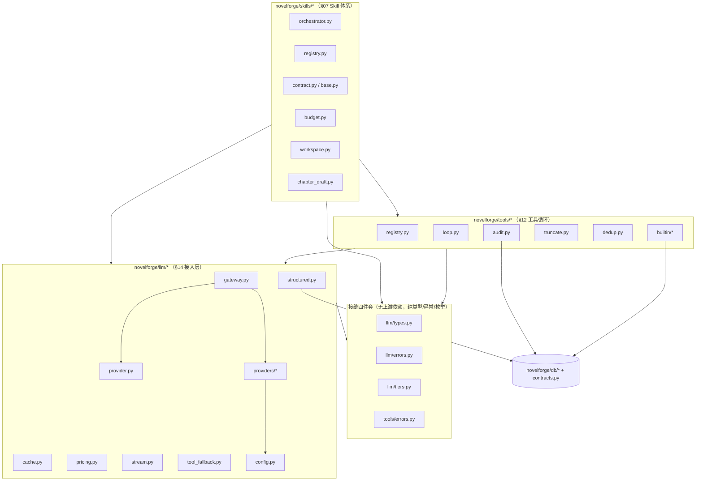

# NovelForge 运行时实现规格 · 接缝契约与文件布局

> 本篇是 §12（Agent 循环与工具调用）与 §14（LLM 接入层）两份**实现级规格**共享的**单一权威边界**（the seam）。
> 凡是被两节同时使用的"归一化类型 / 公开接口签名 / 调用契约 / 文件路径 / 依赖方向 / 测试分层"，**只在本篇定义一次**；另两篇规格一律 `import` 引用，**绝不各自重定义**。
>
> 命名严格对齐已落地包 `novelforge/` 与设计稿术语。设计稿 §07/§12/§14 中出现的 `control_plane/…`、`governance/…`、`skills/…`、`control_plane/llm/…` 等路径均为**示意**；本实现规格一律改用 `novelforge/` 包路径（见 §6 文件布局），**本篇即取代设计稿示意路径**。
>
> 运行环境（实测）：Python 3.13；SQLite 3.51（自带 FTS5）；已装 `pydantic`/`pyyaml`/`pytest`；**未装** `fastapi`/`jieba`/`uvicorn`/`networkx`/`anthropic`/`openai`/`httpx`。因此所有外部供应商 SDK（`anthropic`/`openai`）、`httpx`、`jieba` 一律为**可选依赖**：用能力探测 + 回退/Mock，保证**零外网、零安装即可 import 与单测**（`FakeProvider` + in-memory sqlite）。真实供应商调用仅在装了 SDK + key 时才走。

---

## 1. 共享归一化类型（唯一权威定义）

本章是接缝的核心。所有类型定义在 `novelforge/llm/types.py`（数据类型）与 `novelforge/llm/errors.py`（异常层级）+ `novelforge/tools/errors.py`（工具异常）。§12 与 §14 两份规格都从这里 `import`，**不得在别处重新 `class` 定义同名类型**。

设计取舍（与已落地包一致）：
- 全部 `from __future__ import annotations`；
- 数据载荷一律 **Pydantic v2 `BaseModel`**（与 §02.9 / §07.2 / §12.2 / §14.1.1 一致，便于 `model_validate` / `model_dump` / `model_json_schema`）；
- 枚举继承 `str, Enum`（DB 列与 JSON 友好，对齐 §02.9 / §07.2.1）；
- 异常是纯 `Exception` 层级，不带 Pydantic。

### 1.1 `ChatMessage` —— 厂商无关对话消息

> 设计稿 §14.1.1 命名为 `Message`；实现规格统一改名 **`ChatMessage`**（避免与 stdlib/第三方 `Message` 撞名，且语义更准）。设计稿 `Message` 即本类型，**取代设计稿示意名**。

```python
# novelforge/llm/types.py
from __future__ import annotations
from enum import Enum
from typing import Any, Literal
from pydantic import BaseModel, Field


class Role(str, Enum):
    USER = "user"
    ASSISTANT = "assistant"
    TOOL = "tool"            # 工具结果回灌（ToolLoop ⑦ 产出）
    SYSTEM = "system"        # 仅 OpenAI/local 用作消息；Anthropic 走顶层 system


class ContentPart(BaseModel):
    """多模态分块；MVP 正文链路只用 text，image 留作 vision 扩展。"""
    type: Literal["text", "image"] = "text"
    text: str | None = None
    image_b64: str | None = None        # vision：base64；Gateway 按能力矩阵决定是否允许
    media_type: str | None = None       # 如 "image/png"


class ChatMessage(BaseModel):
    role: Role
    content: str | list[ContentPart]            # str 或多模态分块
    tool_call_id: str | None = None             # role==TOOL 时回填，关联某次 ToolCall.id
    tool_calls: list["ToolCall"] | None = None  # role==ASSISTANT 携带本轮模型发起的调用
    name: str | None = None                     # 可选：工具名（部分 OpenAI 兼容端要求）
```

### 1.2 `Tool` —— 统一工具定义（JSON Schema 唯一事实源）

> 合并 §12.2.1 `ToolSpec`（执行侧：`handler`/`read_only`/`scope`/`cost_hint`/`cacheable`）与 §14.1.1 `Tool`（线协议侧：`name`/`description`/`parameters`/`strict`）的**线协议子集**为接缝的 `Tool`。
>
> 字段命名对齐要求：设计稿 §12 用 `input_schema`、§14 用 `parameters`。接缝**统一字段名为 `json_schema`**（语义最准；既不偏 Anthropic 的 `input_schema` 也不偏 OpenAI 的 `parameters`），并由 Provider 在 §14.3 翻译时各自映射。新增本任务要求的 `read_only` / `cost_hint`。**取代设计稿 `input_schema` 与 `parameters` 两个示意名。**
>
> 注意分层：接缝 `Tool` 只承载**喂给 LLM 的线协议字段**（§14 需要的）。`handler`/`scope`/`cacheable` 等**执行侧**字段不进 `Tool`，而在 §12 的 `ToolRegistry` 内部 `_ToolEntry` 持有（见 §3.1），因为它们与厂商无关、不该泄漏进 LLM 请求。

```python
class CostHint(BaseModel):
    """供 breaker 预扣与循环成本预测；SQL 工具开销主要是 observation token。
    对齐 §12.2.1 ToolCost。"""
    est_sql_ms: int = 5                  # 典型 SQLite 查询耗时（索引命中，毫秒级）
    est_result_tokens: int = 400         # observation 预估 token（预算与截断用）


class Tool(BaseModel):
    """统一工具定义：一份 JSON Schema，由各 Provider 翻译成厂商格式（§14.3）。
    §12 ToolRegistry.tool_definitions(skill) 产出的就是 list[Tool]，进稳定前缀（§12.6）。"""
    name: str                            # 全局唯一，如 "query_world_state"
    description: str                     # 给 LLM 看的用途（何时该调）
    json_schema: dict[str, Any]          # 标准 JSON Schema（type=object）— 入参契约
    read_only: bool = True               # MVP 一律 True；False 禁入自动循环（HP1/HP2）
    cost_hint: CostHint = Field(default_factory=CostHint)
    strict: bool = True                  # 可强约束时启用（Anthropic strict / OpenAI strict）
```

### 1.3 `ToolCall` —— 归一化工具调用（模型 → 循环）

> 合并 §12.4 注释里的 `{id, name, args}` 与 §14.1.1 `ToolCall(id/name/arguments)`。**字段名统一为 `args`**（对齐 §12 受限循环伪代码 `call["args"]`，且短）；设计稿 §14 的 `arguments` 即本字段，**取代设计稿示意名**。

```python
class ToolCall(BaseModel):
    """模型发起的一次工具调用。§12 受限循环消费它（厂商无关）。
    args 一定是已解析的 dict（Provider 负责 JSON 字符串→dict 与兜底）。"""
    id: str                              # 厂商各自 id；无则 Provider 用 new_id("tc") 生成
    name: str
    args: dict[str, Any] = Field(default_factory=dict)
```

### 1.4 `ToolResult` —— 工具执行结果（循环 → 模型）

> 对齐 §12.2.1 `ToolResult`。补全 `error`/`note`/`latency_ms`/`result_digest`（设计稿 §12.5 `write_tool_call_log` 引用了 `res.latency_ms`，但 §12.2.1 ToolResult 未列出 → 本篇补齐）。新增 `error` 字段以承载 §3 工具异常被 handler 捕获后的结构化错误（`ok=False` 时填）。

```python
class ToolResult(BaseModel):
    ok: bool
    content: Any = None                  # 结构化结果（dict/list）；交 §12.4 序列化+截断
    error: str = ""                      # ok=False 时的错误说明（异常被捕获后归一化进此）
    note: str = ""                       # 空结果/降级说明，如 "no_open_foreshadow"/"clean"
    result_digest: str = ""              # content 的 sha256 前 16（审计/去重键，§12.5）
    latency_ms: int = 0                  # handler 执行耗时（写 tool_call_log）
```

### 1.5 `Usage` —— 归一化用量（含 billable / usd 方法）

> 对齐 §14.1.1 `Usage` 字段 + §14.8 `cost_usd`。本任务要求 `Usage` 自带 `billable()` 与 `usd()` 方法（设计稿把 `billable_tokens()`/`usd()` 放在 §07.2.2 的 `LLMUsage` 上，并在 §14.8 用外部 `cost_usd(u, p)` 计价）。**接缝把这两件事内聚到 `Usage`**：`Usage` 成为唯一用量类型，`usd(pricing)` 取代 §14.8 的游离函数 `cost_usd`，`billable()` 取代 §07.2.2 `LLMUsage.billable_tokens()`。`LLMUsage`（§07.2.2）保留为 `Usage` 的别名（见 §1.5.1），不破坏 §07 既有契约。

```python
class Pricing(BaseModel):
    """每百万 token 美元价（§14.8）。本地供应商全填 0。"""
    input_per_mtok: float = 0.0
    output_per_mtok: float = 0.0
    cache_read_per_mtok: float = 0.0     # 命中缓存读入价（通常远低于 input）
    cache_write_per_mtok: float = 0.0    # 写/创建缓存价（通常略高于 input）


class Usage(BaseModel):
    """归一化用量。本地模型 cost≈0，但仍记 token（§14.8）。"""
    input: int = 0
    output: int = 0
    cache_write: int = 0                 # 写入/创建缓存的 token（计价不同）
    cache_read: int = 0                  # 命中缓存读入的 token（厂商字段映射见 §14.6/§14.8）
    provider: str = ""                   # 实际承接此次调用的供应商（回退后可能非主供应商）
    model: str = ""                      # 实际 model ID

    def billable(self) -> int:
        """计费 token 维度（§07.6.1 BudgetLedger.charge 消费）。
        含 cache 两路：命中省钱但仍占额度；写缓存也是真实 token。"""
        return self.input + self.output + self.cache_write + self.cache_read

    def usd(self, p: "Pricing") -> float:
        """折算美元（取代 §14.8 游离函数 cost_usd(u, p)）。"""
        return (
            self.input * p.input_per_mtok
            + self.output * p.output_per_mtok
            + self.cache_read * p.cache_read_per_mtok
            + self.cache_write * p.cache_write_per_mtok
        ) / 1_000_000

    def __add__(self, other: "Usage") -> "Usage":
        """同 run 内多次调用累加（保留首个非空 provider/model）。"""
        return Usage(
            input=self.input + other.input,
            output=self.output + other.output,
            cache_write=self.cache_write + other.cache_write,
            cache_read=self.cache_read + other.cache_read,
            provider=self.provider or other.provider,
            model=self.model or other.model,
        )
```

#### 1.5.1 `LLMUsage` 别名（§07.2.2 兼容）

```python
# novelforge/llm/types.py 末尾
LLMUsage = Usage   # §07.2.2 SkillResult.usage / BudgetLedger.charge 继续可用，零改名
```

### 1.6 `CacheHint` —— 稳定前缀断点提示

> 对齐 §14.6 `CacheHint`。

```python
class CacheHint(BaseModel):
    """稳定前缀断点提示（HP10）。stable_blocks 只含不随章节变的内容
    （bible 渲染视图 / 风格 profile / always-on 禁忌 / 工具定义 / response schema）。
    任何章节号/uuid/时间戳/每次变化的检索结果一律放 dynamic（断点之后）。"""
    stable_blocks: list[str] = Field(default_factory=list)  # 渲染序：tools→system→稳定 messages
    ttl: str = "1h"                                         # 仅 explicit 缓存（Anthropic）用
```

### 1.7 `Response` —— 规范化非流式响应

> 对齐 §14.1.1 `Response`。`stop_reason` 增补 `"tool_use"`（§12 循环终止判据"无 tool_calls 即停"靠 `resp.tool_calls` 判定，`stop_reason` 仅辅助记录）。

```python
class StopReason(str, Enum):
    STOP = "stop"
    TOOL_USE = "tool_use"
    MAX_TOKENS = "max_tokens"
    ERROR = "error"


class Response(BaseModel):
    """规范化响应——Gateway / Skill / ToolLoop 只认这个形态。"""
    text: str = ""                                  # 文本输出（无文本时为空串）
    tool_calls: list[ToolCall] = Field(default_factory=list)
    usage: Usage = Field(default_factory=Usage)
    stop_reason: StopReason = StopReason.STOP
    raw: dict | None = None                         # 调试用原始响应；不入库、不入日志（§14.9）
```

### 1.8 `ProviderStreamEvent` —— Provider 层流式事件

> 对齐 §14.7 `ProviderStreamEvent`。**这是 Provider 层细粒度流**，与 §13 业务级 SSE `StreamEvent` 分属两层、不可混用。

```python
class StreamEventType(str, Enum):
    TEXT_DELTA = "text_delta"
    TOOL_CALL_DELTA = "tool_call_delta"
    TOOL_CALL_DONE = "tool_call_done"
    USAGE = "usage"
    DONE = "done"
    ERROR = "error"


class ProviderStreamEvent(BaseModel):
    type: StreamEventType
    text: str | None = None                 # TEXT_DELTA
    tool_call: ToolCall | None = None       # TOOL_CALL_DONE（参数完整）
    partial_args: str | None = None         # TOOL_CALL_DELTA（增量 JSON 片段）
    usage: Usage | None = None              # USAGE / DONE 末尾
    stop_reason: StopReason | None = None
    error: str | None = None                # ERROR
```

### 1.9 `ModelTier` —— 语义模型档（FAST/MID/STRONG + 别名）

> 对齐 §14.5 + §07.2.1。FAST/MID/STRONG 为权威值；HAIKU/SONNET/OPUS 为**同值别名**（不破坏 §07 已写 Skill 契约 `model_tier`）。

```python
# novelforge/llm/tiers.py
from __future__ import annotations
from enum import Enum


class ModelTier(str, Enum):
    FAST   = "fast"     # 抽取/去重/连续性初筛/格式化（§07 原 HAIKU 位）
    MID    = "mid"      # beat sheet/风格改写/对白/软 judge（§07 原 SONNET 位）
    STRONG = "strong"   # 正文创作 + 冲突复核（§07 原 OPUS 位，HP10：只留这两件事）
    # —— 兼容别名（§07.2.1 既有契约直接可用，值与上三档相同）——
    HAIKU  = "fast"
    SONNET = "mid"
    OPUS   = "strong"


def normalize_tier(tier: "ModelTier | str") -> ModelTier:
    """别名先归一到 fast/mid/strong（resolve_model 调用，§14.5）。
    ModelTier('haiku') 因 value 别名机制会得到 FAST，故直接取 value 再构造。"""
    v = tier.value if isinstance(tier, ModelTier) else str(tier)
    return ModelTier(v)
```

> Python `Enum` 别名机制：同 value 的成员（`HAIKU="fast"`）自动成为 `FAST` 的别名，`ModelTier.HAIKU is ModelTier.FAST` 为真，`ModelTier("fast")` 返回 `FAST`。故 `normalize_tier` 天然把别名归一。

### 1.10 `CapabilitySet` —— 单供应商能力声明

> 对齐 §14.1.1 `CapabilitySet` + §14.2 能力矩阵。从 `config.providers.<id>.capabilities` 读取，Provider 的 `capabilities(model)` 返回它。

```python
# novelforge/llm/types.py
class CapabilitySet(BaseModel):
    tool_use: bool = False
    parallel_tool_calls: bool = False
    structured_output: bool = False                          # 原生 json_schema 约束
    prompt_caching: Literal["explicit", "auto", "none"] = "none"
    streaming: bool = False
    system_prompt: bool = True
    vision: bool = False
```

### 1.11 异常层级（唯一权威定义）

两条独立根：`LLMError`（接入层，`novelforge/llm/errors.py`）与 `ToolError`（工具层，`novelforge/tools/errors.py`）。**互不继承**——LLM 故障与工具故障是两类边界，处置语义不同（前者触发退避/回退，后者归一为 `ToolResult(ok=False)` 回灌让模型自纠）。

```python
# novelforge/llm/errors.py
from __future__ import annotations


class LLMError(Exception):
    """LLM 接入层一切错误的根。"""


class ProviderError(LLMError):
    """Provider 与厂商交互期的错误根（携带归一化错误类，供 Gateway 决定重试/回退）。"""
    def __init__(self, message: str = "", *, error_class: str = "", provider: str = "",
                 status_code: int | None = None):
        super().__init__(message)
        self.error_class = error_class       # §14.10.1 归一类：rate_limited/server_error/...
        self.provider = provider
        self.status_code = status_code


class RateLimitError(ProviderError):
    """429。同供应商指数退避重试（§14.10）。"""


class ServerError(ProviderError):
    """5xx / overloaded。退避重试，超次→回退链。"""


class CapabilityUnsupported(LLMError):
    """能力矩阵缺失且无兜底（如 vision 被拒）。§14.2.2 默认抛此。"""


class StructuredOutputError(LLMError):
    """generate_structured 修复重试用尽仍不满足 schema（§14.4）。"""


class ToolProtocolError(LLMError):
    """提示式 JSON 工具协议解析连续失败、超修复上限（§14.3.2）。"""


# —— 回退链整体失败（§14.10 gateway 骨架 raise AllProvidersFailed）——
class AllProvidersFailed(LLMError):
    def __init__(self, chain: list[str], last: Exception | None):
        super().__init__(f"all providers failed: {chain}; last={last!r}")
        self.chain = chain
        self.last = last
```

> 设计稿 §14.10 骨架还出现 `auth_error`/`bad_request`/`timeout`/`unavailable` 等**归一类字符串**（`classify_error` 的返回值），它们不是异常类，而是 `ProviderError.error_class` 的取值；Gateway 据此决定重试/回退/直接抛（见 §4.3 处置表）。

```python
# novelforge/tools/errors.py
from __future__ import annotations


class ToolError(Exception):
    """工具层一切错误的根。被 ToolRegistry.execute 捕获并归一为 ToolResult(ok=False)。"""


class UnknownTool(ToolError):
    """模型请求了未注册或对该 Skill 不可见的工具名。"""


class ToolScopeViolation(ToolError):
    """工具 scope 不在 Skill.read_scopes 内（visible_for 过滤后仍被调用），
    或试图执行 read_only=False 的工具（§12.2.2 双重护栏）。"""


class ToolHandlerError(ToolError):
    """handler 内部抛错（SQL 异常 / 数据缺失 / 断言失败），包装原异常。"""
    def __init__(self, tool_name: str, cause: Exception):
        super().__init__(f"tool '{tool_name}' handler failed: {cause!r}")
        self.tool_name = tool_name
        self.cause = cause
```

---

## 2. `LLMGateway` 与 `LLMProvider` 公开接口签名（实现留给 §14 规格）

> 仅签名（method signatures only）。函数体伪代码、退避/回退/降级实现细节由 **§14 实现规格**展开。

### 2.1 `LLMProvider` 协议（无状态适配器）

```python
# novelforge/llm/provider.py
from __future__ import annotations
from typing import Protocol, Iterator, runtime_checkable
from novelforge.llm.types import (
    ChatMessage, Tool, Response, CapabilitySet, CacheHint, ProviderStreamEvent,
)


@runtime_checkable
class LLMProvider(Protocol):
    name: str

    def capabilities(self, model: str) -> CapabilitySet: ...

    def generate(
        self,
        *,
        messages: list[ChatMessage],
        model: str,                              # 已由 Gateway 完成档→model 映射
        system: str | None = None,
        tools: list[Tool] | None = None,
        response_schema: dict | None = None,     # JSON Schema；结构化输出归一化（§14.4）
        cache_hint: CacheHint | None = None,     # 稳定前缀断点提示（§14.6）
        stream: bool = False,
        max_tokens: int = 4096,
    ) -> Response: ...

    def stream(
        self,
        *,
        messages: list[ChatMessage],
        model: str,
        system: str | None = None,
        tools: list[Tool] | None = None,
        response_schema: dict | None = None,
        cache_hint: CacheHint | None = None,
        max_tokens: int = 4096,
    ) -> Iterator[ProviderStreamEvent]: ...
```

> 设计稿 §14.1.1 把流式塞进 `generate(... stream=True) -> Response | Iterator[...]` 的联合返回。**实现规格拆为两个方法** `generate`（必返 `Response`）与 `stream`（必返 `Iterator`），消除联合返回类型的歧义（便于类型检查与测试）。`generate(stream=True)` 保留为内部转调 `stream` 的便利路径，但公开协议以两方法为准。

### 2.2 `LLMGateway` 公开接口

```python
# novelforge/llm/gateway.py
from __future__ import annotations
from typing import Iterator
from pydantic import BaseModel
from novelforge.llm.types import (
    ChatMessage, Tool, Response, CacheHint, ProviderStreamEvent, Usage,
)
from novelforge.llm.tiers import ModelTier


class LLMGateway:
    def __init__(self, cfg: "ProvidersConfig", budget: "BudgetLedger") -> None: ...

    # —— §12 ToolLoop 调用的主入口（厂商无关；含降级/退避/回退/记账）——
    def generate(
        self,
        *,
        tier: ModelTier,
        messages: list[ChatMessage],
        system: str | None = None,
        tools: list[Tool] | None = None,
        response_schema: dict | None = None,
        cache_hint: CacheHint | None = None,
        max_tokens: int = 4096,
    ) -> Response: ...

    # —— §07.6.2 既有薄包装：保留以兼容旧 Skill；内部转调 generate ——
    def call(
        self,
        *,
        tier: ModelTier,
        system_stable: str,
        dynamic: str,
        cache_prefix: bool = True,
        tools: list[Tool] | None = None,
    ) -> Response: ...

    # —— 流式：经 Orchestrator 转译为 §13 业务级 SSE ——
    def stream(
        self,
        *,
        tier: ModelTier,
        messages: list[ChatMessage],
        system: str | None = None,
        tools: list[Tool] | None = None,
        cache_hint: CacheHint | None = None,
        max_tokens: int = 4096,
    ) -> Iterator[ProviderStreamEvent]: ...

    # —— 结构化输出统一入口（§14.4；内部 instructor 式修复重试）——
    def generate_structured(
        self,
        *,
        tier: ModelTier,
        schema_model: type[BaseModel],
        messages: list[ChatMessage],
        system: str | None = None,
        cache_hint: CacheHint | None = None,
        max_repair: int = 2,
    ) -> BaseModel: ...

    # —— 最近一次调用的归一化用量（§07.2.2 SkillResult.usage 取用）——
    def last_usage(self) -> Usage: ...
```

> 接缝约束：`ToolLoop` 只调 `LLMGateway.generate(...)`（见 §4 调用契约）。`call`（§07.6.2 薄包装）、`stream`、`generate_structured`、`last_usage` 是 Gateway 对其余调用方的接口，不在 §12↔§14 主接缝上，但归属同一类故一并定签名。

---

## 3. `ToolRegistry` 与 `Tool`/`ToolResult` 公开接口签名（实现留给 §12 规格）

> 仅签名。handler 实现、`ToolLoop` 循环体、`tool_call_log` 写入由 **§12 实现规格**展开。

### 3.1 `ToolRegistry`

> 设计稿 §12.2 用 `ToolSpec` 同时承载线协议字段与执行侧字段。接缝把**线协议子集**抽成 §1.2 的 `Tool`；执行侧字段（`handler`/`scope`/`cacheable`）由 Registry 内部的 `_ToolEntry` 持有，对外只暴露 `Tool`。

```python
# novelforge/tools/registry.py
from __future__ import annotations
from typing import Callable
from pydantic import BaseModel
from novelforge.llm.types import Tool, ToolCall, ToolResult


class ToolContext(BaseModel):
    """注入 handler 的只读句柄（§12.2.1）。复用 SkillContext 的 repos/as_of，不给裸 conn 写权限。"""
    project_id: str
    as_of_chapter: int                       # = SkillContext.as_of_chapter（投影基准）
    repos: "RepositoryBundle"                # 只读 Repository 句柄（§07）
    workspace: "RestrictedWorkspace"         # canon 对自动 Skill 只读（§07.8）
    model_config = {"arbitrary_types_allowed": True}


# handler 签名（确定性 SQL、无 LLM）
ToolHandler = Callable[[ToolContext, dict], ToolResult]


class _ToolEntry(BaseModel):
    """Registry 内部条目：Tool（线协议）+ 执行侧字段。不外泄给 LLM 请求。"""
    tool: Tool
    handler: ToolHandler
    scope: str                               # 归属 read_scope，按 Skill 白名单过滤可见性
    cacheable: bool = True                   # 同 run 内相同 args 复用结果（§12.4 去重）
    model_config = {"arbitrary_types_allowed": True}


class ToolRegistry:
    def register(
        self,
        *,
        tool: Tool,
        handler: ToolHandler,
        scope: str,
        cacheable: bool = True,
    ) -> None: ...
        # 护栏：assert tool.name 未注册；assert tool.read_only（HP1/HP2）

    def visible_for(self, skill: "SkillContract") -> list[Tool]:
        ...  # 按 skill.read_scopes 过滤：返回 scope ∈ read_scopes 的 Tool

    def tool_definitions(self, skill: "SkillContract") -> list[Tool]:
        ...  # = visible_for（进缓存稳定前缀，§12.6）；§14 再翻译成各厂商 schema

    def execute(self, name: str, args: dict, tctx: ToolContext) -> ToolResult:
        ...  # 二次护栏 read_only；未知/越权→ToolError；handler 抛错→ToolResult(ok=False)
```

> `execute` 的错误归一化契约（接缝硬约束）：
> - 工具名未注册或对该 Skill 不可见 → 抛 `UnknownTool` / `ToolScopeViolation`（§1.11），由 `ToolLoop` 捕获后落 `ToolResult(ok=False, error=...)` 回灌（**不中断循环**，让模型自纠）。
> - `read_only=False` 误入 → 抛 `ToolScopeViolation`（执行期二次护栏，§12.2.2）。
> - handler 内部异常 → 包装为 `ToolHandlerError` 并归一为 `ToolResult(ok=False, error=...)`。
> - 成功 → `ToolResult(ok=True, content=..., result_digest=..., latency_ms=...)`。

### 3.2 `ToolLoop`（受限 ReAct 循环）公开接口

```python
# novelforge/tools/loop.py
from __future__ import annotations
from typing import Literal
from pydantic import BaseModel, Field
from novelforge.tools.registry import ToolRegistry, ToolContext
from novelforge.llm.gateway import LLMGateway
from novelforge.llm.tiers import ModelTier


class ToolLoopResult(BaseModel):
    final_output: dict                       # {text, bible_change_proposals[], state_transitions[]}
    steps_used: int
    stopped_reason: Literal["final_output", "max_steps", "budget", "no_progress"]
    tool_calls: list[dict] = Field(default_factory=list)  # 本轮调用摘要（已写 tool_call_log）


class ToolLoop:
    def __init__(
        self,
        *,
        gateway: LLMGateway,
        registry: ToolRegistry,
        breaker: "CircuitBreaker",
        cfg_max_steps: int = 6,              # config.pipeline.max_tool_steps
        obs_token_budget: int = 6000,       # observation 累计 token 上限
    ) -> None: ...

    def run(
        self,
        *,
        skill: "SkillContract",
        tier: ModelTier,
        system_stable: str,
        user_dynamic: str,
        tctx: ToolContext,
        ctx: "SkillContext",
    ) -> ToolLoopResult: ...
```

---

## 4. ToolLoop ↔ LLMGateway 调用契约

这是 §12↔§14 的**主接缝**。一句话：**ToolLoop 是状态机与执行器，LLMGateway 是无副作用（对循环而言）的"问模型"黑盒**。

### 4.1 谁传什么 / 拿什么

| 方向 | 传递方 | 接收方 | 载荷（类型） | 约束 |
|---|---|---|---|---|
| 调用 | `ToolLoop` | `LLMGateway.generate` | `tier: ModelTier`、`system=system_stable: str`、`messages: list[ChatMessage]`、`tools: list[Tool]`、`cache_hint: CacheHint` | `system_stable` 在整个循环内**逐字不变**（HP10）；`tools` = `registry.tool_definitions(skill)`，进稳定前缀；observation 只进 `messages`（可变区） |
| 返回 | `LLMGateway.generate` | `ToolLoop` | `Response{text, tool_calls: list[ToolCall], usage: Usage, stop_reason}` | `tool_calls` 已厂商无关归一化（§14.3）；`usage` 已 charge 进 `BudgetLedger`（§14.10 骨架内）；`raw` 不入循环逻辑 |
| 执行 | `ToolLoop` | `ToolRegistry.execute` | 每个 `ToolCall(name, args)` → `ToolResult` | 确定性 SQL；去重缓存命中则复用；异常归一为 `ToolResult(ok=False)` |
| 回灌 | `ToolLoop` | 下一轮 `messages` | `ChatMessage(role=ASSISTANT, tool_calls=resp.tool_calls)` + `ChatMessage(role=TOOL, tool_call_id=call.id, content=<截断 obs>)` | §14 负责把归一化 tool result 转回各厂商 message 形态 |

### 4.2 终止条件（接缝硬约束，对齐 §12.4）

ToolLoop 在以下任一条件终止并返回 `ToolLoopResult`：

1. **`final_output`（正常）**：`resp.tool_calls` 为空 → 模型给出最终结构化输出（`text + BibleChangeProposal[] + state_transitions[]`），`parse_structured_output(resp)` 解析后即停。`stop_reason` 仅辅助；**判据是 `tool_calls` 空，而非 `stop_reason`**。
2. **`no_progress`**：整步所有 `ToolCall` 全部缓存命中（无新信息）→ `_force_finalize`，防原地打转。
3. **`max_steps`**：达 `cfg_max_steps`（默认 6）仍要工具 → `_force_finalize_no_tools`（不再给 tools），强制产一次结构化输出。
4. **`budget`**：某步 `breaker.guard()` 抛 `CircuitTripped` → 捕获后用已取上下文强制产出（不再给 tools）。

第 3/4 条均为**优雅降级**：正文照常落 L0，未过硬校验的状态变更不晋升（§07.6.3 / §07.7），产物打 `degraded_by=tool_loop_<reason>` 标记。**绝不整章丢弃。**

### 4.3 错误处置分工（接缝硬约束）

| 错误来源 | 抛出类型 | 由谁捕获 | 处置 |
|---|---|---|---|
| 工具未知/越权 | `UnknownTool`/`ToolScopeViolation` | `ToolLoop`（execute 调用点） | 归一 `ToolResult(ok=False, error=...)` 回灌，**循环继续**让模型自纠 |
| handler 内部 | `ToolHandlerError` | `ToolLoop` | 同上，归一回灌 |
| 429/5xx/超时 | `RateLimitError`/`ServerError`/`ProviderError(error_class="timeout")` | `LLMGateway`（**对 ToolLoop 透明**） | 同供应商退避重试，超次→回退链；ToolLoop 看到的是最终成功的 `Response` 或 `AllProvidersFailed` |
| auth/bad_request | `ProviderError(error_class∈{auth_error,bad_request})` | `LLMGateway` | 不重试不回退，直接抛给 ToolLoop → Skill → Orchestrator |
| 回退链耗尽 | `AllProvidersFailed` | `Orchestrator`（Skill 之上） | 章节 held + 标记；不静默丢弃 |
| 预算超限 | `CircuitTripped`（§07.6.1） | `ToolLoop`（guard 点） | 终止 `stopped_reason="budget"`，降级收尾 |

接缝铁律：**LLM 故障（`LLMError` 系）由 Gateway 在循环内部消化（退避/回退）或上抛给 Orchestrator；工具故障（`ToolError` 系）由 ToolLoop 归一为观测回灌、不上抛。** 两条根异常永不交叉处理。

### 4.4 时序图（Mermaid sequence）

```mermaid
sequenceDiagram
    autonumber
    participant SK as ChapterDraftSkill (§12.8)
    participant TL as ToolLoop (§12.4)
    participant GW as LLMGateway (§14)
    participant PR as LLMProvider (§14)
    participant RG as ToolRegistry (§12.2)
    participant DB as SQLite (only read / append log)

    SK->>TL: run(skill, tier=STRONG, system_stable, user_dynamic, tctx, ctx)
    TL->>RG: tool_definitions(skill)  →  list[Tool]（进稳定前缀）

    loop step = 1..max_tool_steps
        TL->>TL: breaker.guard()  (超预算→CircuitTripped→stopped_reason=budget)
        TL->>GW: generate(tier, system=system_stable, messages, tools, cache_hint)
        GW->>PR: 翻译请求 + 调厂商 SDK（退避/回退对 TL 透明）
        PR-->>GW: 厂商响应（含 tool_use / usage）
        GW->>GW: 归一化 → Response{text, tool_calls[ToolCall], usage}; budget.charge(usage)
        GW-->>TL: Response

        alt resp.tool_calls 为空
            TL->>TL: parse_structured_output(resp)
            TL-->>SK: ToolLoopResult(final_output, stopped_reason="final_output")
        else 有 tool_calls
            loop 每个 ToolCall
                alt dedup 命中
                    TL->>TL: 复用缓存 (note=cache_hit)
                else 新调用
                    TL->>RG: execute(name, args, tctx)
                    RG->>DB: 确定性 SQL（read-only）
                    DB-->>RG: rows
                    RG-->>TL: ToolResult(ok, content, digest, latency_ms)
                end
                TL->>TL: truncate_observation(content, obs_budget)
                TL->>DB: append tool_call_log (HP9)
            end
            alt 整步全 cache_hit（无进展）
                TL-->>SK: ToolLoopResult(stopped_reason="no_progress")
            else 有进展
                TL->>TL: messages += [assistant(tool_calls), tool(results)]
            end
        end
    end
    Note over TL,SK: 超步→_force_finalize_no_tools → stopped_reason="max_steps"（降级，不丢章）
```

---

## 5. 完整文件布局树

> 取代设计稿 §07/§12/§14 的 `control_plane/*` / `governance/*` / `skills/*` 示意路径。一律 `novelforge/` 包路径。每文件一句话职责。

```
novelforge/
├── __init__.py                  # 包元信息（__version__, SCHEMA_VERSION）— 已存在
├── ids.py                       # new_id(prefix) 前缀化 ID — 已存在
├── tokenizer.py                 # cut/tokenize/tokenizer_version（jieba 可选回退）— 已存在
├── contracts.py                 # 【待补】BibleChangeProposal/Fact/FactCandidate/StateTransition 等 §02.9/§10 权威 Pydantic 契约
│
├── db/
│   ├── __init__.py              # 导出 connect/init_db/rebuild_facts_fts/set_meta/get_meta — 已存在
│   ├── schema.sql               # §02 全量 DDL（含本篇 tool_call_log §12.5）— 已存在；tool_call_log 追加于此
│   └── connection.py            # 【待补】connect(PRAGMA)/init_db/FTS 重建/meta_kv 读写
│
├── llm/                         # ===== §14 接入层（本篇 §1/§2 权威类型与签名）=====
│   ├── __init__.py              # 导出 LLMGateway, LLMProvider, ModelTier 及归一化类型门面
│   ├── types.py                 # 【接缝权威】ChatMessage/Tool/ToolCall/ToolResult/Response/Usage/Pricing/CacheHint/ProviderStreamEvent/CapabilitySet/Role/StopReason/StreamEventType + LLMUsage 别名
│   ├── errors.py                # 【接缝权威】LLMError→ProviderError/RateLimitError/ServerError/CapabilityUnsupported/StructuredOutputError/ToolProtocolError/AllProvidersFailed
│   ├── tiers.py                 # 【接缝权威】ModelTier(FAST/MID/STRONG+别名)/normalize_tier
│   ├── provider.py              # LLMProvider 协议（无状态适配器；capabilities/generate/stream）
│   ├── gateway.py               # LLMGateway：档→model 映射/降级/退避/回退链/记账/缓存验证
│   ├── pricing.py               # Pricing 装载 + 各供应商 usage→Usage 归一化映射（§14.8）
│   ├── cache.py                 # CacheHint 渲染纪律：稳定前缀不污染断言（§14.6）
│   ├── structured.py            # generate_structured：instructor 式校验-修复重试（§14.4）
│   ├── stream.py                # ProviderStreamEvent 序列工具 + 厂商流式→归一化映射（§14.7）
│   ├── tool_fallback.py         # 无原生 tool-use 的提示式 JSON 协议 render/parse（§14.3.2）
│   ├── config.py                # ProvidersConfig/ProviderConfig 加载（§14.9 config.providers）；key 仅 env
│   └── providers/
│       ├── __init__.py          # build_providers(cfg) 工厂；按 type 选实现，缺 SDK→跳过/降级
│       ├── fake.py              # 【测试核心】FakeProvider：可编排脚本响应，零外网零 SDK（§7）
│       ├── anthropic.py         # AnthropicProvider（import anthropic 可选；缺则注册期跳过）
│       ├── openai_compat.py     # OpenAICompatProvider（OpenAI/vLLM/网关；import openai 可选）
│       └── local.py             # LocalProvider（ollama/llama.cpp；httpx 可选；无原生 tool→兜底）
│
├── tools/                       # ===== §12 受限工具循环（本篇 §3 权威签名）=====
│   ├── __init__.py              # 导出 ToolRegistry/ToolLoop/ToolContext 及 6 个内置工具注册函数
│   ├── errors.py                # 【接缝权威】ToolError→UnknownTool/ToolScopeViolation/ToolHandlerError
│   ├── registry.py             # ToolRegistry：register/visible_for/tool_definitions/execute（双护栏）
│   ├── loop.py                  # ToolLoop：有界/去重/截断/终止/收尾（§12.4）+ ToolLoopResult
│   ├── context.py              # ToolContext 工厂（从 SkillContext 构造只读句柄）
│   ├── audit.py                # write_tool_call_log + tool_call_log 仓储（append-only，§12.5）
│   ├── truncate.py             # truncate_observation：结构化优先级裁剪 + [truncated] 标记
│   ├── dedup.py                # _dedup_key（tool,归一化 args）+ result_digest（sha256 前16）
│   └── builtin/                 # 6 个 MVP 只读工具（确定性 SQL，§12.3）
│       ├── __init__.py          # register_builtin_tools(registry) 一次性登记全部 6 个
│       ├── world_state.py       # query_world_state(as_of) — get_world_state 切片
│       ├── facts.py             # search_facts(entity|keyword) — facts WHERE canon + facts_fts(RRF)
│       ├── entities.py          # lookup_entity(alias→canonical) — entity_aliases JOIN entities
│       ├── foreshadow.py        # get_open_foreshadow — foreshadow 未回收/到期
│       ├── recall.py            # get_recall_pack — 实体优先 SQL + facts_fts/scene_vec 补充
│       └── continuity.py        # peek_continuity — extract_claims + run_hard_validators（写时自检）
│
└── skills/                      # ===== §07 Skill 体系（消费 llm + tools）=====
    ├── __init__.py              # 导出 SkillRegistry 及内置 Skill 注册入口
    ├── contract.py              # SkillContract/SkillTrigger/IOSpec/DoDCheck（§07.2.1）
    ├── base.py                  # SkillContext/SkillResult/Skill 协议/DoDOutcome（§07.2.2）
    ├── registry.py              # SkillRegistry：register/get/for_trigger/invoke（DoD 强校验，§07.3）
    ├── orchestrator.py          # generate_chapter 主循环 Plan→…→Commit（§07.5）
    ├── budget.py                # BudgetLedger/CircuitBreaker/CircuitTripped（§07.6.1）
    ├── workspace.py             # RestrictedWorkspace（路径白名单/realpath/乐观锁/审计，§07.8）
    └── chapter_draft.py         # ChapterDraftSkill：用 ToolLoop 跑受限 ReAct（§12.8 端到端）
```

> 说明：
> - `novelforge/llm/types.py` + `novelforge/llm/errors.py` + `novelforge/llm/tiers.py` + `novelforge/tools/errors.py` 是**接缝四件套**，§12/§14 两份规格都 `from novelforge.llm.types import ...` / `from novelforge.tools.errors import ...`，绝不重定义。
> - `RepositoryBundle`（`ToolContext.repos` / `SkillContext.repos` 的类型）属 §02/§07 仓储层，在 `novelforge/db/` 之上的仓储模块定义（本篇不展开，仅作为前向引用类型）。
> - `BudgetLedger`/`CircuitBreaker`/`SkillContract`/`SkillContext` 定义在 `novelforge/skills/`，被 `novelforge/tools/` 以**类型注解前向引用**（字符串注解，`from __future__ import annotations`）使用——见 §6 依赖方向。

---

## 6. 依赖方向图（禁止环）

单向：`skills → tools → llm`；`llm` 与 `tools` 都依赖**接缝类型**（`llm/types`、`llm/errors`、`llm/tiers`、`tools/errors`），但接缝类型自身不反向依赖任何上层。



禁止环的硬规则：
1. **`llm/*` 绝不 import `tools/*` 或 `skills/*`**。Gateway/Provider 不知道工具循环与 Skill 存在；它们只见 `Tool`/`ToolCall`/`ToolResult` 这些接缝类型（这些类型物理上在 `llm/types.py`，因为它们首先是"喂给 LLM 的线协议"，但语义中立）。
2. **`tools/*` 可 import `llm/*`（调 Gateway、用归一化类型），但绝不 import `skills/*`**。`ToolContext`/`ToolLoop` 对 `SkillContract`/`SkillContext`/`CircuitBreaker` 仅用**字符串前向引用注解**（`from __future__ import annotations`），运行时由 `skills/*` 注入实例，不产生 import 边。
3. **`skills/*` 可 import `tools/*` 与 `llm/*`**（顶层编排）。
4. **接缝四件套零上游依赖**，可被任意层 import，是 DAG 的汇点（sink）。
5. `db/*` + `contracts.py` 被 `tools/builtin/*`、`tools/audit.py`、`llm/structured.py`（产 `BibleChangeProposal`）依赖；`db/*` 不反向依赖 llm/tools/skills。

> 验证手段（§7 契约测试之一）：`test_no_import_cycles` 用 stdlib `ast` 静态扫描每个模块的 `import`，断言 `llm/` 下无 `novelforge.tools`/`novelforge.skills` 引用、`tools/` 下无 `novelforge.skills` 引用。

---

## 7. 测试分层策略

三层：**FakeProvider（替身 LLM）** + **in-memory sqlite（替身真相源）** + **契约测试（守接缝不漂移）**。全部零外网、零 SDK、零 key 可跑（对齐实测环境：无 anthropic/openai/httpx/jieba）。

### 7.1 FakeProvider（`novelforge/llm/providers/fake.py`）

实现 `LLMProvider` 协议的可编排替身：按预置脚本依次返回 `Response`/`ProviderStreamEvent`，用于驱动 `ToolLoop` 全部分支与 `LLMGateway` 降级/退避/回退。

```python
class FakeProvider:
    """脚本化 LLMProvider 替身。零外部依赖。
    script: 每次 generate 弹出一个 Response（或可调用 → Response，便于按入参分支）。
    caps: 可编排能力矩阵（测降级路径）。errors: 可注入 ProviderError 序列（测退避/回退）。"""
    name = "fake"
    def __init__(self, *, script: list, caps: "CapabilitySet | None" = None,
                 errors: list[Exception] | None = None) -> None: ...
    def capabilities(self, model: str) -> CapabilitySet: ...
    def generate(self, **kw) -> Response: ...     # 弹 script[i]；script 含 tool_calls→驱动循环
    def stream(self, **kw): ...                    # yield 预置 ProviderStreamEvent 序列
```

关键用例（驱动 §12 循环全分支）：
- `script=[Response(tool_calls=[query_world_state]), Response(tool_calls=[peek_continuity]), Response(text=<final json>)]` → 复刻 §12.8.1 三步 trace。

### 7.2 in-memory sqlite fixture

```python
# tests fixture：建库到 ":memory:"，灌最小 World State，供 builtin 工具确定性断言
@pytest.fixture
def mem_db():
    conn = connect(":memory:")          # novelforge.db.connection.connect（开 PRAGMA）
    init_db(conn)                        # 跑 schema.sql 全量 DDL（含 tool_call_log）
    seed_yefan_fixture(conn)             # ent_yefan 金丹初期 @ch210 等（§12.8.1 场景）
    yield conn
    conn.close()
```

> jieba 缺失时 `facts_fts` 走 `tokenizer.py` 的 bigram 回退（已实现），`search_facts`/`get_recall_pack` 测试用回退分词断言，**不依赖 jieba 安装**。

### 7.3 pytest 测试计划（test 函数名 + fixture + 断言要点）

#### A. 接缝类型契约（`tests/llm/test_types_seam.py`）

| test 函数 | fixture | 断言要点 |
|---|---|---|
| `test_usage_billable_sums_four_buckets` | — | `Usage(input=10,output=20,cache_write=5,cache_read=3).billable()==38` |
| `test_usage_usd_uses_pricing` | — | `Usage(input=1_000_000).usd(Pricing(input_per_mtok=15.0))==15.0` |
| `test_usage_add_accumulates` | — | `(u1+u2).input == u1.input+u2.input`；provider 取首个非空 |
| `test_modeltier_aliases_collapse` | — | `ModelTier.OPUS is ModelTier.STRONG`；`ModelTier("opus") is ModelTier.STRONG`；`normalize_tier(ModelTier.HAIKU)==ModelTier.FAST` |
| `test_toolcall_args_is_dict` | — | `ToolCall(id="x",name="t",args={"a":1}).args == {"a":1}`；缺省 args=={} |
| `test_response_default_empty` | — | `Response().tool_calls==[]`；`Response().stop_reason==StopReason.STOP` |
| `test_chatmessage_tool_role_roundtrip` | — | `ChatMessage(role=Role.TOOL, tool_call_id="tc1", content="...")` model_dump/validate 往返一致 |
| `test_tool_json_schema_field_name` | — | `Tool` 字段名为 `json_schema`（非 input_schema/parameters）；`read_only` 默认 True |

#### B. 异常层级（`tests/llm/test_errors_seam.py` + `tests/tools/test_errors_seam.py`）

| test 函数 | 断言要点 |
|---|---|
| `test_llm_error_hierarchy` | `issubclass(RateLimitError, ProviderError)` 且 `issubclass(ProviderError, LLMError)`；`CapabilityUnsupported`/`StructuredOutputError`/`ToolProtocolError` 直接继承 `LLMError` |
| `test_tool_error_hierarchy` | `issubclass(UnknownTool, ToolError)` 等三子类；`ToolError` 不继承 `LLMError`（两根独立） |
| `test_provider_error_carries_class` | `ProviderError(error_class="rate_limited").error_class=="rate_limited"` |
| `test_tool_handler_error_wraps_cause` | `ToolHandlerError("t", ValueError("x")).cause` 是原异常 |

#### C. ToolRegistry（`tests/tools/test_registry.py`，用 mem_db）

| test 函数 | fixture | 断言要点 |
|---|---|---|
| `test_register_rejects_non_readonly` | mem_db | `register(tool=Tool(read_only=False,...))` 抛 AssertionError（HP1/HP2 注册护栏） |
| `test_register_rejects_duplicate` | mem_db | 同名二次 register 抛 AssertionError |
| `test_visible_for_filters_by_scope` | mem_db | Skill.read_scopes=["facts"] → 只见 search_facts；不见 query_world_state |
| `test_execute_unknown_tool_raises` | mem_db | `execute("nope",...)` 抛 `UnknownTool` |
| `test_execute_scope_violation_raises` | mem_db | 调超出 read_scopes 的工具 → `ToolScopeViolation` |
| `test_execute_handler_error_wrapped` | mem_db | handler 抛 → `ToolHandlerError`（registry 抛出，由 loop 归一） |
| `test_execute_ok_sets_digest_and_latency` | mem_db | 成功 `ToolResult.ok` 且 `result_digest` 非空、`latency_ms>=0` |
| `test_tool_definitions_are_tool_instances` | mem_db | 返回 `list[Tool]`，含 `json_schema`，**不含 handler/scope**（线协议隔离） |

#### D. 内置 6 工具（`tests/tools/test_builtin.py`，用 mem_db）

| test 函数 | 断言要点 |
|---|---|
| `test_query_world_state_as_of_clamps_future` | `query_world_state(as_of=999)` 被 clamp 到 `tctx.as_of_chapter`（时序护栏 HP3，不读未来章） |
| `test_query_world_state_power_facet` | 叶凡 fixture → content 含 `power_rank="金丹·初期"` |
| `test_lookup_entity_alias_to_canonical` | 别名 → canonical_name 命中 |
| `test_get_open_foreshadow_excludes_paidoff` | 已 paid_off 的不返回；overdue 命中 |
| `test_peek_continuity_clean_when_legal` | 合法迁移片段 → `hard_issues==[]`, note=="clean" |
| `test_peek_continuity_flags_rank_skip` | 跳级片段 → 含 power_rank_skip hard issue |
| `test_search_facts_fallback_tokenizer` | jieba 缺失下用 bigram 回退仍能召回（不 skip） |

#### E. ToolLoop 控制（`tests/tools/test_loop.py`，FakeProvider + mem_db）

| test 函数 | 脚本/注入 | 断言要点 |
|---|---|---|
| `test_loop_final_output_immediate` | script=[Response(text=final)] | steps_used==1, stopped_reason=="final_output" |
| `test_loop_yefan_three_steps` | §12.8.1 三步脚本 | stopped_reason=="final_output", steps_used==3，state_transitions 含金丹中期 |
| `test_loop_dedup_cache_hit` | 两步请求同 (tool,args) | 第二次 note=="cache_hit"，execute 只打 1 次 SQL（用 spy 计数） |
| `test_loop_no_progress_finalizes` | 整步全 cache | stopped_reason=="no_progress" |
| `test_loop_max_steps_degrades` | 每步都要工具 | stopped_reason=="max_steps", steps_used==6，不抛错，final_output 非空 |
| `test_loop_budget_trip_degrades` | breaker 注入超限 | stopped_reason=="budget"，落已生成、打 degraded 标记 |
| `test_loop_writes_tool_call_log` | mem_db | 每次 fresh execute → tool_call_log 多一行；digest/latency/note 落库 |
| `test_loop_observation_never_in_system` | spy gateway | 每步传入 generate 的 `system` 逐字相等（HP10 稳定前缀不变）；obs 只在 messages |
| `test_loop_obs_token_budget_truncates` | 超大 content | observation 被截断并含 `[truncated]`，累计不超 obs_token_budget |

#### F. LLMGateway 降级/退避/回退（`tests/llm/test_gateway.py`，FakeProvider）

| test 函数 | 注入 | 断言要点 |
|---|---|---|
| `test_gateway_charges_budget` | FakeProvider 返回带 usage | `budget.spent_tokens==usage.billable()`；`budget.spent_usd` 按 pricing |
| `test_gateway_retries_on_rate_limit` | errors=[RateLimitError, RateLimitError, ok] | 重试 2 次后成功；attempt 计数正确 |
| `test_gateway_no_retry_on_auth` | errors=[ProviderError(error_class="auth_error")] | 立即抛，不重试不回退 |
| `test_gateway_falls_back_on_unavailable` | 主 provider 全失败 + fallback ok | 返回 fallback 的 Response；`usage.provider=="local_ollama"` |
| `test_gateway_all_fail_raises` | 全链失败 | 抛 `AllProvidersFailed`，`.chain` 完整 |
| `test_gateway_degrade_tool_use_to_prompt` | caps.tool_use=False | 走提示式协议；解析出 ToolCall（用 tool_fallback） |
| `test_gateway_cache_miss_warns` | 重复前缀 cache_read==0 | 记 warning（silent invalidator 告警）；本地 none 不告警 |

#### G. structured / fallback（`tests/llm/test_structured.py`、`test_tool_fallback.py`）

| test 函数 | 断言要点 |
|---|---|
| `test_generate_structured_first_pass` | 合法 JSON → 一次过，无修复 |
| `test_generate_structured_repairs_then_ok` | 首次非法 + 二次合法 → 返回对象，max_repair 内 |
| `test_generate_structured_exhausts_raises` | 始终非法 → 抛 `StructuredOutputError` |
| `test_parse_tool_protocol_strips_fence` | ```json fence 包裹 → 正确解析出 ToolCall |
| `test_parse_tool_protocol_null_tool` | `{"tool":null,"answer":"x"}` → 空 tool_calls + answer="x" |
| `test_parse_tool_protocol_garbage_empty` | 非 JSON 噪声 → 空 tool_calls（触发上层修复） |

#### H. 契约测试（守接缝不漂移，`tests/test_seam_contract.py`）

| test 函数 | 断言要点 |
|---|---|
| `test_no_import_cycles` | ast 扫描：`llm/` 无 import `novelforge.tools`/`novelforge.skills`；`tools/` 无 import `novelforge.skills` |
| `test_seam_types_single_definition` | grep ast：`ChatMessage`/`Tool`/`ToolCall`/`ToolResult`/`Response`/`Usage`/`CacheHint`/`ProviderStreamEvent`/`ModelTier` 的 `class` 定义在整个包内**各恰好一处** |
| `test_seam_errors_single_definition` | `LLMError`/`ToolError` 及全部子类各只定义一次 |
| `test_fakeprovider_satisfies_protocol` | `isinstance(FakeProvider(...), LLMProvider)`（runtime_checkable Protocol） |
| `test_anthropic_provider_optional_import` | 未装 anthropic 时 import `providers/anthropic.py` 不崩（能力探测：模块可 import，构造时才检查 SDK） |
| `test_gateway_generate_signature_matches_seam` | inspect.signature(LLMGateway.generate) 含 `tier/messages/system/tools/response_schema/cache_hint/max_tokens` |
| `test_toolloop_only_calls_gateway_generate` | spy：ToolLoop.run 全程只调 `gateway.generate`，不直接碰 provider/SDK |

> 可选依赖纪律的测试体现：A–H 全部用 `FakeProvider` + `:memory:`，**CI 无需任何外部 SDK/网络**。真实 `AnthropicProvider`/`OpenAICompatProvider`/`LocalProvider` 的集成测试标 `@pytest.mark.integration`，仅在装了对应 SDK + 设了 key 的环境跑，默认 `-m "not integration"` 跳过。

---

## 附录 · 与设计稿命名对齐表（取代示意路径/示意名）

| 设计稿出现 | 本实现规格权威 | 理由 |
|---|---|---|
| `control_plane/llm/*`、`control_plane/tool_loop.py`、`control_plane/tool_registry.py`、`skills/*`、`governance/*` | `novelforge/llm/*`、`novelforge/tools/*`、`novelforge/skills/*` | 对齐已落地包；设计稿明示为示意路径 |
| §14 `Message` | `ChatMessage` | 避免撞名、语义更准 |
| §12 `input_schema` / §14 `parameters`（工具入参 schema） | `Tool.json_schema` | 厂商中立单一字段名 |
| §14 `ToolCall.arguments` | `ToolCall.args` | 对齐 §12 循环伪代码 `call["args"]` |
| §12 `ToolSpec`（线协议 + 执行侧混装） | `Tool`（线协议）+ Registry 内部 `_ToolEntry`（执行侧 handler/scope/cacheable） | 不把 handler/scope 泄漏进 LLM 请求 |
| §12 `ToolCost` | `CostHint` | 统一命名（cost_hint 字段） |
| §14.8 游离函数 `cost_usd(u, p)` | `Usage.usd(pricing)` 方法 | 用量计价内聚到 Usage |
| §07.2.2 `LLMUsage.billable_tokens()` | `Usage.billable()`（`LLMUsage = Usage` 别名保留） | 单一用量类型，零破坏 |
| §07.2.1 `ModelTier` HAIKU/SONNET/OPUS | `ModelTier` FAST/MID/STRONG + 同值别名 | §14.5 语义档；别名不破坏 §07 契约 |
| §14.1.1 `Response | Iterator` 联合返回 | `generate()→Response` + `stream()→Iterator` 拆分 | 消除联合返回歧义 |
```

---

## 附录 B · 接缝补遗（编码前必须钉死的契约）

> 审校发现以下 4 处接缝缝隙：编码前以本附录为单一权威，§12/§14 规格中相关引用一律对齐此处。

### B.1 `BudgetLedger.charge` 最终签名（取代 §07.6.1 示意体）

§07.6.1 的 `charge(usage)` 示意体调用了 `usage.billable_tokens()` 与无参 `usage.usd()`；本接缝已把用量计价内聚为 `Usage.billable()` 与 `Usage.usd(pricing)`（见命名对齐表）。因此 **`BudgetLedger.charge` 的权威签名改为带 `pricing` 参数**，§07.6.1 示意体作废：

```python
# novelforge/llm/budget.py（实现归 §14；契约钉死于此）
class BudgetLedger:
    token_cap: int; usd_cap: float
    session_token_cap: int = 0; session_usd_cap: float = 0.0
    spent_tokens: int = 0; spent_usd: float = 0.0

    def charge(self, usage: "Usage", pricing: "Pricing") -> None:
        """唯一记账入口。usd 必须由 pricing 计算——Usage 自身不持定价上下文。"""
        self.spent_tokens += usage.billable()          # = input + output（cache_read 不计费 token 量）
        self.spent_usd    += usage.usd(pricing)        # 按 pricing 区分 input/output/cache 价

    def exceeded(self) -> bool: ...                    # 同 §07.6.1
```

调用点（§14.9.5 `Gateway._post_process`）必须传 pricing：

```python
self.budget.charge(resp.usage, self._pricing_for(provider_conf, tier))
```

`Usage.usd(pricing)` 与 `Usage.billable()` 的字段口径见正文 §1.5；`LLMUsage = Usage` 别名仍保留（类型名零破坏），**但方法名/签名以本附录为准**。

### B.2 `RepositoryBundle` 只读接口契约（§12 工具/`peek_continuity` 依赖）

工具 handler 与 `peek_continuity` 只通过下列**只读**句柄触达数据层（实现归 §02/§04/§07 仓储层，本附录只钉接口；任何写仍走 Gate）：

```python
# novelforge/repos/contracts.py（Protocol，只读子集）
from typing import Protocol, Optional
import sqlite3

class WorldStateRepo(Protocol):
    def project(self, as_of_chapter: int) -> "WorldState": ...      # §04.4 as-of 投影

class ContinuityRepo(Protocol):
    def extract_claims(self, fragment: str, chapter: int) -> list["Claim"]: ...   # 确定性/正则+词表抽取
    def run_hard_validators(self, claims: list["Claim"],
                            world: "WorldState", conn: sqlite3.Connection) -> list["Issue"]: ...

class ToolAuditRepo(Protocol):
    def append_tool_call(self, row: "ToolCallLogRow") -> None: ...   # 写 tool_call_log（append-only）

class RepositoryBundle(Protocol):
    conn_ro: sqlite3.Connection            # 只读连接（PRAGMA query_only=ON）
    world_state: WorldStateRepo
    continuity: ContinuityRepo
    audit: ToolAuditRepo
    # 其余写句柄（canon/governance）不暴露给工具 handler（HP2/HP5）
```

工具 handler 签名固定为 `handler(args: dict, repos: RepositoryBundle, as_of: int) -> ToolResult`，**只用 `repos.conn_ro` 等只读句柄**。

### B.3 `StateTransition` 契约（Draft→Gate 接缝产物，归 contracts.py）

`ChapterDraftSkill` 的 `final_output.state_transitions` 与示例 JSON 对齐；`from` 是 Python 关键字，用 `Field(alias=...)`：

```python
# novelforge/contracts.py
from pydantic import BaseModel, Field, ConfigDict

class StateTransition(BaseModel):
    model_config = ConfigDict(populate_by_name=True)   # 允许用 from_value 或 alias 'from'
    entity_id: str
    facet: str                                  # power/knowledge/item/numeric/timeline/foreshadow
    from_value: Optional[str] = Field(default=None, alias="from")
    to_value: str = Field(alias="to")
    at_chapter: int
    kind: Optional[str] = None                  # breakthrough/acquire/learn/...（映射各 *_log.change_type）
    evidence_span: Optional[str] = None         # 草稿出处（写时声明 → Gate 落 evidence_refs）
```

Gate 据此把 transition 落到对应 World State `*_log`（晋升通过后），未通过则停 `fact_candidates`（§07.7 草稿/canon 隔离）。

### B.4 `FakeProvider` 弹出状态机（测试桩，零外网）

`FakeProvider` 是 §12/§14 全部确定性测试的驱动核心，弹出语义钉死如下：

```python
# tests/_fakes.py
class FakeProvider:
    """脚本化 Provider：每次 generate() 先消费 errors[i]（抛出），耗尽后弹 script[j]（返回）。"""
    def __init__(self, *, script: list[Response],
                 errors: Optional[list[Optional[Exception]]] = None,
                 caps: Optional[Capabilities] = None):
        self.script = list(script)            # 待返回的 Response 队列（按调用顺序）
        self.errors = list(errors or [])      # 每次调用前置错误；None=不抛、直接弹 script
        self.caps = caps or Capabilities.all()
        self.calls: list[dict] = []           # 记录每次入参，供断言
        self._i = 0                           # error 游标
        self._j = 0                           # script 游标

    def generate(self, **kw) -> Response:
        self.calls.append(kw)
        if self._i < len(self.errors):
            err = self.errors[self._i]; self._i += 1
            if err is not None:
                raise err                     # 同一次逻辑调用：Gateway 退避后会再次 generate()
        resp = self.script[self._j]; self._j += 1
        return resp

    def stream(self, **kw):                    # 把 script[j] 拆成 ProviderStreamEvent 序列
        resp = self.generate(**kw)
        for ev in events_from_response(resp): yield ev
        yield ProviderStreamEvent(type="done", usage=resp.usage)
```

弹出规则：**errors 与 script 各自独立游标**；`errors[i] is not None` → 第 i 次调用抛该异常（Gateway 指数退避后重试即第 i+1 次调用）；`errors[i] is None` 或越界 → 直接弹 `script[j]`。`test_retry_on_rate_limit_then_ok` 用 `errors=[RateLimitError(), None]`、`script=[ok_resp]`：第1次抛、第2次返回 `ok_resp`。回退链测试用连续多个 `ProviderError` 耗尽主供应商触发 fallback。
