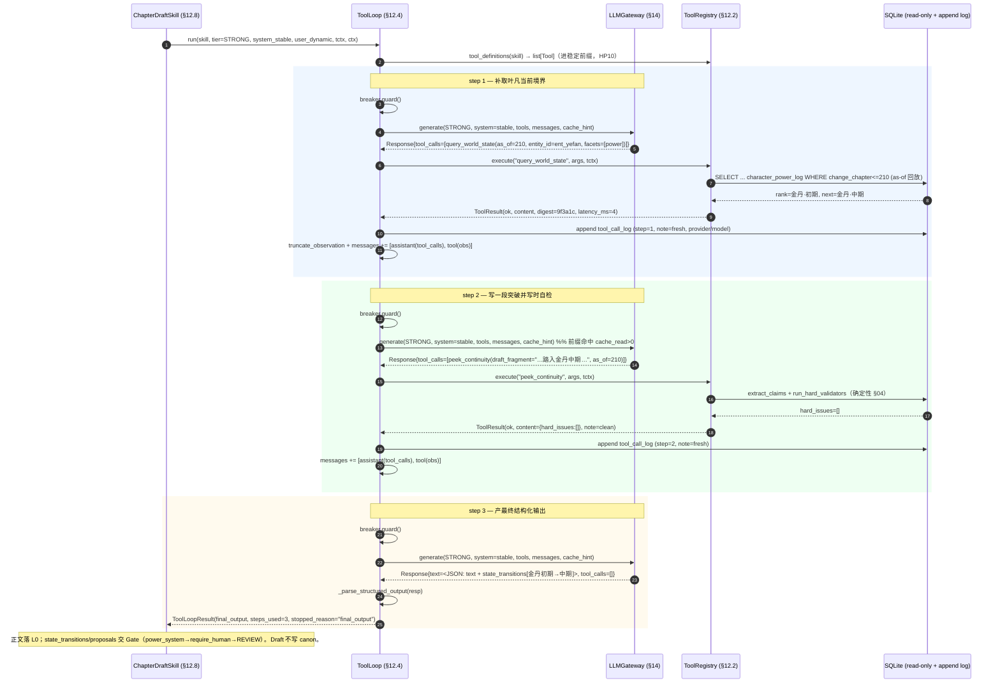

# Agent工具循环 实现规格 (§12)（实现规格）

> 本篇把设计稿 **§12（Agent 循环与工具调用）** 展开为**实现级规格**——精确到可直接照着写 Python：类/函数签名（带类型注解）、关键函数体（近真代码）、确定性 SQL 全文（对照 §02 真实表/列）、异常处置、边界清单、时序图、测试计划。
>
> **接缝纪律（逐字对齐 `impl/00-接缝契约与文件布局.md`）**：所有跨节共享的归一化类型（`ChatMessage`/`Tool`/`ToolCall`/`ToolResult`/`Response`/`Usage`/`CacheHint`/`ModelTier`）与异常（`LLMError` 系 / `ToolError` 系）**只在接缝四件套定义一次**，本篇一律 `import` 引用，**绝不重定义**。接缝四件套：
> - `novelforge/llm/types.py` — `ChatMessage/Tool/ToolCall/ToolResult/Response/Usage/Pricing/CacheHint/ProviderStreamEvent/CapabilitySet/Role/StopReason/StreamEventType` + `LLMUsage` 别名
> - `novelforge/llm/errors.py` — `LLMError` 树
> - `novelforge/llm/tiers.py` — `ModelTier/normalize_tier`
> - `novelforge/tools/errors.py` — `ToolError` 树
>
> 运行环境（实测）：Python 3.13；SQLite 3.51（自带 FTS5）；已装 `pydantic`/`pyyaml`/`pytest`；**未装** `anthropic`/`openai`/`httpx`/`jieba`/`networkx`。本篇所有外部 SDK/分词器均为**可选依赖**，零外网零 SDK 可 import 与单测（`FakeProvider` + in-memory sqlite）。
>
> 路径约定：设计稿 §12 的 `control_plane/tool_*`、`control_plane/tools/*` 等均为**示意**，本篇一律改用 `novelforge/tools/*`（取代设计稿示意路径，见接缝 §5 文件布局树）。

---

## 12.0 模块文件布局（本篇覆盖范围）

```
novelforge/tools/
├── __init__.py        # 导出 ToolRegistry/ToolLoop/ToolContext + register_builtin_tools
├── errors.py          # 【接缝权威】ToolError→UnknownTool/ToolScopeViolation/ToolHandlerError（仅 import，不在此重定义）
├── registry.py        # ToolRegistry + ToolContext + _ToolEntry + ToolHandler（§12.2）
├── loop.py            # ToolLoop + ToolLoopResult（§12.4：有界/去重/截断/终止/收尾）
├── context.py         # build_tool_context(skill_ctx) 工厂（从 SkillContext 造只读 ToolContext）
├── audit.py           # write_tool_call_log + ToolCallLogRepo（append-only，§12.5）
├── truncate.py        # truncate_observation（结构化优先级裁剪 + [truncated] 标记）
├── dedup.py           # dedup_key（tool,归一化 args）+ result_digest（sha256 前16）
└── builtin/
    ├── __init__.py    # register_builtin_tools(registry)：一次性登记 6 个 MVP 工具
    ├── world_state.py # query_world_state(as_of) — character_power_log/knowledge_edges/item_log/numeric_facts 做 as-of 回放
    ├── facts.py       # search_facts(entity|keyword) — facts WHERE canon + facts_fts(RRF)
    ├── entities.py    # lookup_entity(alias→canonical) — entity_aliases JOIN entities
    ├── foreshadow.py  # get_open_foreshadow — foreshadow 未回收/到期
    ├── recall.py      # get_recall_pack — 实体优先 SQL + facts_fts/scene_vec 补充
    └── continuity.py  # peek_continuity — extract_claims + run_hard_validators（写时自检）

novelforge/skills/chapter_draft.py   # ChapterDraftSkill：用 ToolLoop.run() 跑受限 ReAct（§12.8 端到端）
```

依赖方向（接缝 §6，禁止环）：`tools/*` 可 `import novelforge.llm.*`（调 Gateway、用归一化类型）；**绝不** `import novelforge.skills.*`——对 `SkillContract`/`SkillContext`/`CircuitBreaker`/`SkillResult`/`RepositoryBundle`/`RestrictedWorkspace` 仅用**字符串前向引用注解**（`from __future__ import annotations`），运行时由 `skills/*` 注入实例。

---

## 12.1 设计立场（与设计稿一致，不重述）

宏观固定管线 `Plan→Recall→Draft→Check→Revise→Gate→Commit`（§07）**不变**；只有 **Draft / Check** 阶段内部跑**有界 ReAct**。本篇落地的不变量（贯穿全篇，对照设计稿 §12.1 铁律）：

1. **循环只在 Draft/Check 内部**；Plan/Recall/Gate/Commit 无 ReAct。
2. **工具一律 `read_only=True`、一律确定性 SQL**（HP1）；LLM 只决定"何时调、调哪个、传什么参"。
3. **工具绝不写 canon**（HP2）；"修改意图"只能由 Skill 产 `BibleChangeProposal[]` / `state_transitions[]`，交 **Gate** 决定（本篇不做 canon 写入）。
4. **有界**：`max_tool_steps`（默认 6）封顶；每步 `breaker.guard()`；超步/超预算优雅降级，**绝不丢章**。
5. **可审计**：每次工具调用 append 一条 `tool_call_log`（HP9）。

---

## 12.2 `novelforge/tools/registry.py` — ToolRegistry / ToolContext / _ToolEntry

### 12.2.1 数据结构（全字段）

`Tool` / `ToolCall` / `ToolResult` / `CostHint` 是**接缝类型**（`novelforge/llm/types.py`），本篇只 import：

```python
# novelforge/tools/registry.py
from __future__ import annotations

import time
from typing import Callable

from pydantic import BaseModel

# —— 接缝四件套：只 import，绝不重定义 ——
from novelforge.llm.types import Tool, ToolCall, ToolResult          # 线协议 + 结果
from novelforge.tools.errors import (                               # 工具异常根
    UnknownTool, ToolScopeViolation, ToolHandlerError,
)
from novelforge.tools.dedup import result_digest                     # sha256 前16


class ToolContext(BaseModel):
    """注入 handler 的只读句柄（接缝 §3.1）。复用 SkillContext 的 repos/as_of；
    绝不给裸 conn 写权限——repos 暴露的连接是只读句柄（repos.conn_ro）。"""
    project_id: str
    as_of_chapter: int                       # = SkillContext.as_of_chapter（投影基准 = target_chapter-1）
    repos: "RepositoryBundle"                # 只读 Repository 句柄（§07；前向引用，运行时由 skills 注入）
    workspace: "RestrictedWorkspace"         # canon 对自动 Skill 只读（§07.8；前向引用）
    model_config = {"arbitrary_types_allowed": True}


# handler 签名：确定性 SQL、无 LLM、纯函数
ToolHandler = Callable[[ToolContext, dict], ToolResult]


class _ToolEntry(BaseModel):
    """Registry 内部条目：Tool（线协议，喂 LLM）+ 执行侧字段（不外泄进 LLM 请求）。"""
    tool: Tool                               # name/description/json_schema/read_only/cost_hint/strict
    handler: ToolHandler
    scope: str                               # 归属 read_scope；按 Skill.read_scopes 过滤可见性
    cacheable: bool = True                   # 同 run 内相同 args 复用结果（§12.4 去重）
    model_config = {"arbitrary_types_allowed": True}
```

> `Tool`（接缝 §1.2）字段：`name:str; description:str; json_schema:dict; read_only:bool=True; cost_hint:CostHint; strict:bool=True`。
> `ToolResult`（接缝 §1.4）字段：`ok:bool; content:Any=None; error:str=""; note:str=""; result_digest:str=""; latency_ms:int=0`。
> `ToolCall`（接缝 §1.3）字段：`id:str; name:str; args:dict={}`。
> **MVP 恒成立**：所有内置工具 `read_only=True`（§12.3 注册时断言保障）。

### 12.2.2 ToolRegistry：register / visible_for / tool_definitions / execute

```python
class ToolRegistry:
    """与 SkillRegistry 平级的进程内单例。登记工具、按 Skill scope 过滤可见、执行 handler。
    不关心厂商——拿到的是 §14 归一化的 ToolCall，吐回归一化的 ToolResult。"""

    def __init__(self) -> None:
        self._tools: dict[str, _ToolEntry] = {}

    # ---- 注册（启动期；HP1/HP2 双护栏之一）----
    def register(self, *, tool: Tool, handler: ToolHandler,
                 scope: str, cacheable: bool = True) -> None:
        assert tool.name not in self._tools, f"duplicate tool: {tool.name}"
        assert tool.read_only, (                        # MVP：自动循环只允许只读工具（HP1/HP2）
            f"tool {tool.name} must be read_only in auto loop")
        self._tools[tool.name] = _ToolEntry(
            tool=tool, handler=handler, scope=scope, cacheable=cacheable)

    # ---- 按 Skill.read_scopes 过滤可见工具 ----
    def visible_for(self, skill: "SkillContract") -> list[Tool]:
        allowed = set(skill.read_scopes)
        return [e.tool for e in self._tools.values() if e.scope in allowed]

    # ---- 暴露给 §14 Provider 的工具定义（= visible_for；进稳定前缀，§12.6）----
    def tool_definitions(self, skill: "SkillContract") -> list[Tool]:
        # 注意：返回的是 list[Tool]（线协议子集），不含 handler/scope/cacheable。
        # §14 Provider 在请求构造期再把每个 Tool.json_schema 翻译成各厂商 schema 方言。
        return self.visible_for(skill)

    # ---- 执行（带二次护栏 + 计时 + digest）----
    def execute(self, name: str, args: dict, tctx: ToolContext) -> ToolResult:
        entry = self._tools.get(name)
        if entry is None:                                # ① 未注册
            raise UnknownTool(f"unknown tool: {name}")
        if not entry.tool.read_only:                     # ② 执行期二次护栏（防注册后被改写）
            raise ToolScopeViolation(f"tool {name} is not read_only; refused in auto loop")
        t0 = time.perf_counter()
        try:
            res = entry.handler(tctx, args or {})        # handler 内部纯 SQL，无 LLM
        except (UnknownTool, ToolScopeViolation):
            raise                                        # 工具协议错误原样上抛（loop 归一）
        except Exception as cause:                       # ③ handler 内部任何异常 → 包装
            raise ToolHandlerError(name, cause)
        # 成功：补 latency_ms 与 result_digest（若 handler 未填）
        latency = int((time.perf_counter() - t0) * 1000)
        if res.latency_ms == 0:
            res = res.model_copy(update={"latency_ms": latency})
        if not res.result_digest:
            res = res.model_copy(update={"result_digest": result_digest(res.content)})
        return res
```

**契约要点（接缝 §3.1 错误归一化硬约束）**：
- 工具名未注册 / 对该 Skill 不可见 → 抛 `UnknownTool` / `ToolScopeViolation`。
- `read_only=False` 误入 → 抛 `ToolScopeViolation`（执行期二次护栏）。
- handler 内部异常 → 包装为 `ToolHandlerError(tool_name, cause)`。
- 成功 → `ToolResult(ok=True, content=..., result_digest=..., latency_ms=...)`。
- 这些异常由 **`ToolLoop`**（而非 Registry）捕获后归一为 `ToolResult(ok=False, error=...)` 回灌让模型自纠——见 §12.4 ⑤bis、§12.6（错误处置）。

**scope 过滤语义**：`visible_for` 只让 Skill 看见 `scope ∈ read_scopes` 的工具；但 `execute` 不依赖 Skill 上下文（它只认全局工具名），因此 **`ToolLoop` 在调用 `execute` 前必须先用 visible 集合校验工具名**（§12.4 ⑤bis），把"越权调用"转成 `ToolScopeViolation` 回灌，而非让 `execute` 直接跑了一个不该对该 Skill 可见的工具。

### 12.2.3 `novelforge/tools/dedup.py` — 去重键与结果摘要

```python
# novelforge/tools/dedup.py
from __future__ import annotations
import hashlib
import json
from typing import Any


def _canonical_args(args: dict | None) -> str:
    """归一化 args：键排序 + 紧凑分隔 + 中文不转义，保证同义参数同键。"""
    return json.dumps(args or {}, ensure_ascii=False, sort_keys=True, separators=(",", ":"))


def dedup_key(tool_name: str, args: dict | None) -> str:
    """同 run 内 (tool, 归一化 args) 的复用键（§12.4 去重缓存）。"""
    return f"{tool_name}::{_canonical_args(args)}"


def result_digest(content: Any) -> str:
    """content 的稳定摘要：sha256 前 16（审计 result_digest / 去重比对，§12.5）。"""
    try:
        payload = json.dumps(content, ensure_ascii=False, sort_keys=True,
                             separators=(",", ":"), default=str)
    except TypeError:
        payload = repr(content)
    return hashlib.sha256(payload.encode("utf-8")).hexdigest()[:16]
```

### 12.2.4 `novelforge/tools/truncate.py` — observation 截断

```python
# novelforge/tools/truncate.py
from __future__ import annotations
import json
from typing import Any

# 粗略 token 估算：复用 novelforge.tokenizer.cut 的词数 *1.0（中文词≈token），无需精确
from novelforge.tokenizer import cut


def estimate_tokens(obj: Any) -> int:
    s = obj if isinstance(obj, str) else json.dumps(obj, ensure_ascii=False, default=str)
    return max(1, len(cut(s)))


def truncate_observation(content: Any, token_budget_left: int) -> tuple[Any, int]:
    """把工具结果序列化为可回灌的 observation，并按剩余预算截断。
    结构化优先级：保实体/数值/issue 等关键字段，超长文本字段截断并标 [truncated]。
    返回 (observation, used_tokens)。token_budget_left<=0 时只回 digest 占位。"""
    if token_budget_left <= 0:
        return {"_note": "[truncated: obs_token_budget exhausted]"}, 1

    full = content
    used = estimate_tokens(full)
    if used <= token_budget_left:
        return full, used

    # 超预算：dict → 优先保留高价值 key，逐层裁长文本
    PRIORITY = ("hard_issues", "power_rank", "next_rank", "rank_order", "quantity",
                "knowledge_state", "value", "unit", "canonical_name", "entity_id",
                "state", "label", "due_chapter", "fact_id", "note")
    if isinstance(full, dict):
        kept: dict = {}
        for k in PRIORITY:
            if k in full:
                kept[k] = full[k]
        # 余下 key 按出现序补，直到逼近预算
        for k, v in full.items():
            if k in kept:
                continue
            if estimate_tokens(kept) >= token_budget_left:
                break
            kept[k] = _shorten(v)
        kept["_truncated"] = True
        return kept, min(token_budget_left, estimate_tokens(kept))
    if isinstance(full, list):
        out, acc = [], 0
        for item in full:
            t = estimate_tokens(item)
            if acc + t > token_budget_left:
                out.append({"_truncated": f"+{len(full) - len(out)} more"})
                break
            out.append(item); acc += t
        return out, min(token_budget_left, acc + 1)
    # 标量长文本
    return (str(full)[: token_budget_left * 2] + " [truncated]"), token_budget_left


def _shorten(v: Any) -> Any:
    if isinstance(v, str) and len(v) > 200:
        return v[:200] + " [truncated]"
    return v
```

---

## 12.3 `novelforge/tools/builtin/*` — 6 个 MVP 只读工具

全部 `read_only=True`、全部确定性 SQL、语义基准统一是 `ToolContext.as_of_chapter`（= 目标章 - 1，HP3 时序护栏，**绝不读未来章**）。下列每个 handler 给出**确定性 SQL 全文**，列名逐字对照 §02 真实 DDL。

> 共享约定：`tctx.repos.conn_ro` 是只读 `sqlite3.Connection`（`row_factory=sqlite3.Row`）。所有 handler 用参数化查询，绝不字符串拼接。`as_of` 一律先 `min(arg_as_of, tctx.as_of_chapter)` clamp。

### 12.3.1 注册入口 `builtin/__init__.py`

```python
# novelforge/tools/builtin/__init__.py
from __future__ import annotations
from novelforge.llm.types import Tool, CostHint
from novelforge.tools.registry import ToolRegistry
from novelforge.tools.builtin.world_state import handle_query_world_state, SCHEMA_WORLD_STATE
from novelforge.tools.builtin.facts import handle_search_facts, SCHEMA_SEARCH_FACTS
from novelforge.tools.builtin.entities import handle_lookup_entity, SCHEMA_LOOKUP_ENTITY
from novelforge.tools.builtin.foreshadow import handle_get_open_foreshadow, SCHEMA_OPEN_FORESHADOW
from novelforge.tools.builtin.recall import handle_get_recall_pack, SCHEMA_RECALL_PACK
from novelforge.tools.builtin.continuity import handle_peek_continuity, SCHEMA_PEEK_CONTINUITY


def register_builtin_tools(reg: ToolRegistry) -> None:
    reg.register(scope="world_state", handler=handle_query_world_state, tool=Tool(
        name="query_world_state",
        description="取某 as-of 章的世界状态投影切片（境界/物品/知情/数值/位置）。LLM 想确认角色当前硬状态时调。",
        json_schema=SCHEMA_WORLD_STATE,
        cost_hint=CostHint(est_sql_ms=6, est_result_tokens=500)))
    reg.register(scope="facts", handler=handle_search_facts, tool=Tool(
        name="search_facts",
        description="按实体或关键词检索已 canon 化的事实。LLM 想查既有设定时调。",
        json_schema=SCHEMA_SEARCH_FACTS,
        cost_hint=CostHint(est_sql_ms=8, est_result_tokens=600)))
    reg.register(scope="entities", handler=handle_lookup_entity, tool=Tool(
        name="lookup_entity",
        description="别名→canonical 实体归一（消歧）。LLM 拿到一个称谓不确定指谁时调。",
        json_schema=SCHEMA_LOOKUP_ENTITY,
        cost_hint=CostHint(est_sql_ms=3, est_result_tokens=120)))
    reg.register(scope="foreshadow", handler=handle_get_open_foreshadow, tool=Tool(
        name="get_open_foreshadow",
        description="列当前未回收/到期伏笔。LLM 想知道哪些伏笔该呼应/回收时调。",
        json_schema=SCHEMA_OPEN_FORESHADOW,
        cost_hint=CostHint(est_sql_ms=4, est_result_tokens=400)))
    reg.register(scope="recall", handler=handle_get_recall_pack, tool=Tool(
        name="get_recall_pack",
        description="取某实体/beat 的结构化召回包（事实+场景）。LLM 想补一块上下文时调。",
        json_schema=SCHEMA_RECALL_PACK,
        cost_hint=CostHint(est_sql_ms=12, est_result_tokens=900)))
    reg.register(scope="continuity", handler=handle_peek_continuity, tool=Tool(
        name="peek_continuity",
        description="对一小段草稿跑确定性 validator 预检硬冲突（写时自检，不阻断、不写状态）。",
        json_schema=SCHEMA_PEEK_CONTINUITY,
        cost_hint=CostHint(est_sql_ms=15, est_result_tokens=400)))
```

### 12.3.2 `world_state.py` — query_world_state（as-of 回放）

`get_world_state(as_of=N)` 是确定性投影：对每张 append-only 日志表取 `change_chapter <= N` 的最新一条/累计。本工具按 facet 切片组装。

```python
# novelforge/tools/builtin/world_state.py
from __future__ import annotations
from novelforge.llm.types import ToolResult

SCHEMA_WORLD_STATE = {
    "type": "object",
    "properties": {
        "as_of": {"type": "integer", "description": "故事内章号；省略=ctx.as_of_chapter"},
        "entity_id": {"type": "string", "description": "限定某实体（ent_xxx）；省略=全量"},
        "facets": {"type": "array", "items": {
            "type": "string", "enum": ["power", "item", "knowledge", "numeric", "geo"]},
            "description": "要哪些切片；省略=全部"},
    },
    "additionalProperties": False,
}

_ALL_FACETS = ("power", "item", "knowledge", "numeric", "geo")


def handle_query_world_state(tctx, args: dict) -> ToolResult:
    as_of = min(int(args.get("as_of", tctx.as_of_chapter)), tctx.as_of_chapter)  # HP3 不读未来章
    eid = args.get("entity_id")
    facets = tuple(args.get("facets") or _ALL_FACETS)
    conn = tctx.repos.conn_ro
    out: dict = {"as_of": as_of, "entity_id": eid, "facets": list(facets)}

    if "power" in facets:
        out["power"] = _power_as_of(conn, as_of, eid)
    if "item" in facets:
        out["item"] = _item_as_of(conn, as_of, eid)
    if "knowledge" in facets:
        out["knowledge"] = _knowledge_as_of(conn, as_of, eid)
    if "numeric" in facets:
        out["numeric"] = _numeric_as_of(conn, as_of, eid)
    if "geo" in facets:
        out["geo"] = _geo_as_of(conn, as_of, eid)

    empty = all(not out.get(f) for f in facets)
    return ToolResult(ok=True, content=out, note="empty" if empty else "")


# ---- 境界 as-of：character_power_log 取 change_chapter<=as_of 的最新一条/每实体 ----
def _power_as_of(conn, as_of: int, eid: str | None) -> list[dict]:
    # 每个 entity 取 <= as_of 的最大 change_chapter（并列时取最大 rowid）那一条
    sql = """
        SELECT cpl.entity_id, e.canonical_name, cpl.system_name,
               cpl.rank_id, cpl.rank_order, cpl.change_chapter, cpl.change_type
        FROM character_power_log cpl
        JOIN entities e ON e.id = cpl.entity_id
        WHERE cpl.change_chapter <= :as_of
          AND (:eid IS NULL OR cpl.entity_id = :eid)
          AND cpl.rowid = (
              SELECT c2.rowid FROM character_power_log c2
              WHERE c2.entity_id = cpl.entity_id
                AND c2.system_name = cpl.system_name
                AND c2.change_chapter <= :as_of
              ORDER BY c2.change_chapter DESC, c2.rowid DESC
              LIMIT 1)
        ORDER BY cpl.entity_id, cpl.system_name
    """
    rows = conn.execute(sql, {"as_of": as_of, "eid": eid}).fetchall()
    # 附 next_rank：同 system_name 下 rank_order 最小的更高一档（power_ranks 有序枚举）
    out = []
    for r in rows:
        nxt = conn.execute(
            """SELECT rank_name, rank_order FROM power_ranks
               WHERE system_name = :sys AND rank_order > :ord
               ORDER BY rank_order ASC LIMIT 1""",
            {"sys": r["system_name"], "ord": r["rank_order"]}).fetchone()
        cur = conn.execute(
            "SELECT rank_name FROM power_ranks WHERE id = :rid",
            {"rid": r["rank_id"]}).fetchone()
        out.append({
            "entity_id": r["entity_id"], "canonical_name": r["canonical_name"],
            "system_name": r["system_name"],
            "power_rank": cur["rank_name"] if cur else None,
            "rank_order": r["rank_order"], "change_chapter": r["change_chapter"],
            "change_type": r["change_type"],
            "next_rank": nxt["rank_name"] if nxt else None,
            "next_rank_order": nxt["rank_order"] if nxt else None,
        })
    return out


# ---- 物品 as-of：item_log 累计净持有（quantity_delta 求和 <= as_of）----
def _item_as_of(conn, as_of: int, eid: str | None) -> list[dict]:
    # owner 视角：累计某 owner 名下每件 item 的净 quantity。
    # item_log: from_owner_id / to_owner_id / quantity_delta / change_chapter
    sql = """
        SELECT il.item_entity_id, ie.canonical_name AS item_name,
               :eid AS owner_entity_id,
               SUM(CASE WHEN il.to_owner_id   = :eid THEN il.quantity_delta ELSE 0 END)
             - SUM(CASE WHEN il.from_owner_id = :eid THEN il.quantity_delta ELSE 0 END)
               AS quantity
        FROM item_log il
        JOIN entities ie ON ie.id = il.item_entity_id
        WHERE il.change_chapter <= :as_of
          AND (:eid IS NULL OR il.to_owner_id = :eid OR il.from_owner_id = :eid)
        GROUP BY il.item_entity_id
        HAVING quantity <> 0
        ORDER BY il.item_entity_id
    """
    if eid is None:
        # 无 entity 限定：直接给当前 item_ownership 游标视图（since_chapter<=as_of）
        sql = """
            SELECT io.item_entity_id, ie.canonical_name AS item_name,
                   io.owner_entity_id, io.quantity, io.since_chapter
            FROM item_ownership io
            JOIN entities ie ON ie.id = io.item_entity_id
            WHERE io.since_chapter <= :as_of
            ORDER BY io.item_entity_id
        """
        return [dict(r) for r in conn.execute(sql, {"as_of": as_of}).fetchall()]
    return [dict(r) for r in conn.execute(sql, {"as_of": as_of, "eid": eid}).fetchall()]


# ---- 知情 as-of：knowledge_edges 取每 (knower,secret) 的最新一条 <= as_of ----
def _knowledge_as_of(conn, as_of: int, eid: str | None) -> list[dict]:
    sql = """
        SELECT ke.knower_entity_id, e.canonical_name AS knower_name,
               ke.secret_key, ke.knowledge_state, ke.learned_chapter,
               ke.public_from_chapter, ke.secrecy_level
        FROM knowledge_edges ke
        JOIN entities e ON e.id = ke.knower_entity_id
        WHERE ke.learned_chapter <= :as_of
          AND (:eid IS NULL OR ke.knower_entity_id = :eid)
          AND ke.rowid = (
              SELECT k2.rowid FROM knowledge_edges k2
              WHERE k2.knower_entity_id = ke.knower_entity_id
                AND k2.secret_key = ke.secret_key
                AND k2.learned_chapter <= :as_of
              ORDER BY k2.learned_chapter DESC, k2.rowid DESC
              LIMIT 1)
        ORDER BY ke.knower_entity_id, ke.secret_key
    """
    return [dict(r) for r in conn.execute(sql, {"as_of": as_of, "eid": eid}).fetchall()]


# ---- 数值 as-of：numeric_facts 取每 (entity,metric_key) 最新 as_of_chapter<=as_of ----
def _numeric_as_of(conn, as_of: int, eid: str | None) -> list[dict]:
    sql = """
        SELECT nf.entity_id, nf.metric_key, nf.value, nf.unit,
               nf.as_of_chapter, nf.monotonic
        FROM numeric_facts nf
        WHERE nf.as_of_chapter <= :as_of
          AND (:eid IS NULL OR nf.entity_id = :eid)
          AND nf.rowid = (
              SELECT n2.rowid FROM numeric_facts n2
              WHERE (n2.entity_id IS nf.entity_id OR n2.entity_id = nf.entity_id)
                AND n2.metric_key = nf.metric_key
                AND n2.as_of_chapter <= :as_of
              ORDER BY n2.as_of_chapter DESC, n2.rowid DESC
              LIMIT 1)
        ORDER BY nf.entity_id, nf.metric_key
    """
    return [dict(r) for r in conn.execute(sql, {"as_of": as_of, "eid": eid}).fetchall()]


# ---- 位置 as-of：timeline_events 取某实体最近一次出现的事件位置 ----
def _geo_as_of(conn, as_of: int, eid: str | None) -> list[dict]:
    if eid is None:
        return []
    sql = """
        SELECT te.id AS event_id, te.title, te.chapter, te.location_id,
               gl.name AS location_name, te.story_time_start, te.story_time_end
        FROM timeline_events te
        LEFT JOIN geo_locations gl ON gl.id = te.location_id
        WHERE te.chapter <= :as_of
          AND EXISTS (SELECT 1 FROM json_each(te.participants) j WHERE j.value = :eid)
        ORDER BY te.story_time_end DESC, te.chapter DESC
        LIMIT 1
    """
    rows = conn.execute(sql, {"as_of": as_of, "eid": eid}).fetchall()
    return [dict(r) for r in rows]
```

### 12.3.3 `facts.py` — search_facts（facts + facts_fts，RRF 合并）

```python
# novelforge/tools/builtin/facts.py
from __future__ import annotations
from novelforge.llm.types import ToolResult
from novelforge.tokenizer import tokenize          # 查询词同口径 jieba/bigram 切词

SCHEMA_SEARCH_FACTS = {
    "type": "object",
    "properties": {
        "entity": {"type": "string", "description": "实体 canonical_name 或 ent_xxx"},
        "keyword": {"type": "string", "description": "自由关键词（走 facts_fts BM25）"},
        "limit": {"type": "integer", "default": 8, "minimum": 1, "maximum": 30},
    },
    "anyOf": [{"required": ["entity"]}, {"required": ["keyword"]}],  # 至少给一个
    "additionalProperties": False,
}


def handle_search_facts(tctx, args: dict) -> ToolResult:
    conn = tctx.repos.conn_ro
    limit = int(args.get("limit", 8))
    entity = args.get("entity")
    keyword = args.get("keyword")
    as_of = tctx.as_of_chapter

    struct_rows: list[dict] = []
    if entity:
        # 结构化优先（HP4）：按 entity_id 或 canonical_name 命中 canon facts，as-of 过滤
        struct_rows = [dict(r) for r in conn.execute(
            """SELECT f.id, f.entity_id, f.fact_type, f.subject, f.predicate,
                      f.object, f.detail_json, f.valid_from_chapter, f.risk_tier
               FROM facts f
               LEFT JOIN entities e ON e.id = f.entity_id
               WHERE f.status = 'canon'
                 AND f.valid_from_chapter <= :as_of
                 AND (f.valid_to_chapter IS NULL OR f.valid_to_chapter > :as_of)
                 AND (f.entity_id = :ent OR e.canonical_name = :ent OR f.subject = :ent)
               ORDER BY f.valid_from_chapter DESC
               LIMIT :lim""",
            {"ent": entity, "as_of": as_of, "lim": limit}).fetchall()]

    fts_rows: list[dict] = []
    if keyword:
        match = tokenize(keyword)                    # query/doc 同口径切词（§2.8）
        if match.strip():
            fts_rows = [dict(r) for r in conn.execute(
                """SELECT f.id, f.entity_id, f.fact_type, f.subject, f.predicate,
                          f.object, f.detail_json, f.valid_from_chapter, f.risk_tier,
                          bm25(facts_fts) AS score
                   FROM facts_fts
                   JOIN facts f ON f.id = facts_fts.fact_id
                   WHERE facts_fts MATCH :q
                     AND f.status = 'canon'
                     AND f.valid_from_chapter <= :as_of
                     AND (f.valid_to_chapter IS NULL OR f.valid_to_chapter > :as_of)
                   ORDER BY score
                   LIMIT :lim""",
                {"q": match, "as_of": as_of, "lim": limit}).fetchall()]

    merged = _rrf_merge(struct_rows, fts_rows, limit)  # RRF k=60，只用排名
    return ToolResult(ok=True, content={"facts": merged, "count": len(merged)},
                      note="empty" if not merged else "")


def _rrf_merge(a: list[dict], b: list[dict], limit: int, k: int = 60) -> list[dict]:
    """Reciprocal Rank Fusion（客户端，只用排名不归一化分数；§2.8 / §06）。"""
    score: dict[str, float] = {}
    by_id: dict[str, dict] = {}
    for rank, row in enumerate(a):
        fid = row["id"]; by_id[fid] = row
        score[fid] = score.get(fid, 0.0) + 1.0 / (k + rank + 1)
    for rank, row in enumerate(b):
        fid = row["id"]; by_id.setdefault(fid, row)
        score[fid] = score.get(fid, 0.0) + 1.0 / (k + rank + 1)
    ordered = sorted(score, key=lambda x: score[x], reverse=True)[:limit]
    return [by_id[x] for x in ordered]
```

### 12.3.4 `entities.py` — lookup_entity（entity_aliases JOIN entities）

```python
# novelforge/tools/builtin/entities.py
from __future__ import annotations
from novelforge.llm.types import ToolResult

SCHEMA_LOOKUP_ENTITY = {
    "type": "object",
    "properties": {"alias": {"type": "string", "description": "别名/称谓/旧名/绰号"}},
    "required": ["alias"],
    "additionalProperties": False,
}


def handle_lookup_entity(tctx, args: dict) -> ToolResult:
    alias = (args.get("alias") or "").strip()
    if not alias:
        return ToolResult(ok=True, content={"matches": []}, note="empty")
    conn = tctx.repos.conn_ro
    # 1) 精确：canonical_name 直接命中
    rows = conn.execute(
        """SELECT e.id AS entity_id, e.canonical_name, e.entity_type, e.status,
                  NULL AS alias, 'canonical' AS via
           FROM entities e WHERE e.canonical_name = :a""",
        {"a": alias}).fetchall()
    # 2) 精确别名：entity_aliases.alias = ?（UNIQUE，无歧义）
    rows += conn.execute(
        """SELECT e.id AS entity_id, e.canonical_name, e.entity_type, e.status,
                  ea.alias, ea.alias_type AS via
           FROM entity_aliases ea
           JOIN entities e ON e.id = ea.entity_id
           WHERE ea.alias = :a""",
        {"a": alias}).fetchall()
    matches = [dict(r) for r in rows]
    if not matches:
        # 3) 前缀兜底（消歧用，可能多条）
        matches = [dict(r) for r in conn.execute(
            """SELECT e.id AS entity_id, e.canonical_name, e.entity_type, e.status,
                      ea.alias, 'prefix' AS via
               FROM entity_aliases ea JOIN entities e ON e.id = ea.entity_id
               WHERE ea.alias LIKE :p
               UNION
               SELECT e.id, e.canonical_name, e.entity_type, e.status,
                      NULL, 'prefix'
               FROM entities e WHERE e.canonical_name LIKE :p
               LIMIT 8""",
            {"p": alias + "%"}).fetchall()]
    # 去重（同 entity_id 只留一条，优先精确）
    seen, dedup = set(), []
    for m in matches:
        if m["entity_id"] in seen:
            continue
        seen.add(m["entity_id"]); dedup.append(m)
    return ToolResult(ok=True, content={"matches": dedup, "ambiguous": len(dedup) > 1},
                      note="empty" if not dedup else ("ambiguous" if len(dedup) > 1 else ""))
```

### 12.3.5 `foreshadow.py` — get_open_foreshadow

```python
# novelforge/tools/builtin/foreshadow.py
from __future__ import annotations
from novelforge.llm.types import ToolResult

SCHEMA_OPEN_FORESHADOW = {
    "type": "object",
    "properties": {
        "as_of": {"type": "integer", "description": "故事内章号；省略=ctx.as_of_chapter"},
        "include_overdue": {"type": "boolean", "default": True},
    },
    "additionalProperties": False,
}


def handle_get_open_foreshadow(tctx, args: dict) -> ToolResult:
    as_of = min(int(args.get("as_of", tctx.as_of_chapter)), tctx.as_of_chapter)
    conn = tctx.repos.conn_ro
    # 未回收 = state NOT IN ('paid_off')；已 planted（planted_chapter<=as_of）
    rows = conn.execute(
        """SELECT id, label, description, state, planted_chapter, due_chapter,
                  paid_off_chapter, related_entity_id, importance,
                  CASE WHEN state <> 'paid_off' AND due_chapter IS NOT NULL
                            AND due_chapter <= :as_of
                       THEN 1 ELSE 0 END AS is_overdue
           FROM foreshadow
           WHERE state NOT IN ('paid_off')
             AND planted_chapter <= :as_of
           ORDER BY importance DESC, due_chapter ASC""",
        {"as_of": as_of}).fetchall()
    items = [dict(r) for r in rows]
    if not args.get("include_overdue", True):
        items = [i for i in items if not i["is_overdue"]]
    overdue = sum(1 for i in items if i["is_overdue"])
    return ToolResult(ok=True, content={"open_foreshadow": items, "overdue_count": overdue},
                      note="no_open_foreshadow" if not items else "")
```

> 注：§02 `foreshadow.state` CHECK 枚举为 `planted/reinforced/misled/paid_off/overdue`（无 `abandoned`）。设计稿 §12.3 表格里写的 `('paid_off','abandoned')` 与 §02 DDL 不符；**本实现以 §02 真实 DDL 为准**，未回收判据 = `state NOT IN ('paid_off')`，到期由 `due_chapter <= as_of` 计算（`overdue` 本身也是一个 state 值，已被 `NOT IN ('paid_off')` 含入）。

### 12.3.6 `recall.py` — get_recall_pack（实体优先 + FTS 补充）

```python
# novelforge/tools/builtin/recall.py
from __future__ import annotations
from novelforge.llm.types import ToolResult
from novelforge.tokenizer import tokenize

SCHEMA_RECALL_PACK = {
    "type": "object",
    "properties": {
        "entity_id": {"type": "string"},
        "keywords": {"type": "array", "items": {"type": "string"}},
        "k": {"type": "integer", "default": 8, "minimum": 1, "maximum": 20},
    },
    "additionalProperties": False,
}


def handle_get_recall_pack(tctx, args: dict) -> ToolResult:
    conn = tctx.repos.conn_ro
    as_of = tctx.as_of_chapter
    eid = args.get("entity_id")
    kws = args.get("keywords") or []
    k = int(args.get("k", 8))

    # 1) 实体优先：canon facts（HP4，零漏召回）
    facts = []
    if eid:
        facts = [dict(r) for r in conn.execute(
            """SELECT f.id, f.fact_type, f.subject, f.predicate, f.object,
                      f.valid_from_chapter, f.risk_tier
               FROM facts f
               WHERE f.status = 'canon' AND f.entity_id = :eid
                 AND f.valid_from_chapter <= :as_of
                 AND (f.valid_to_chapter IS NULL OR f.valid_to_chapter > :as_of)
               ORDER BY f.valid_from_chapter DESC LIMIT :k""",
            {"eid": eid, "as_of": as_of, "k": k}).fetchall()]

    # 2) 关键词补充：facts_fts BM25（query 同口径切词）
    kw_facts = []
    if kws:
        match = tokenize(" ".join(kws))
        if match.strip():
            kw_facts = [dict(r) for r in conn.execute(
                """SELECT f.id, f.fact_type, f.subject, f.predicate, f.object,
                          bm25(facts_fts) AS score
                   FROM facts_fts JOIN facts f ON f.id = facts_fts.fact_id
                   WHERE facts_fts MATCH :q AND f.status='canon'
                     AND f.valid_from_chapter <= :as_of
                   ORDER BY score LIMIT :k""",
                {"q": match, "as_of": as_of, "k": k}).fetchall()]

    # 3) 相似桥段：scene_vec 可选（无 embedding 后端则跳过；§2.8.3 仅 L2，as_of 过滤）
    scenes = _similar_scenes(conn, as_of, eid, kws, k) if _has_scene_vec(conn) else []

    pack = {"entity_id": eid, "facts": facts, "keyword_facts": kw_facts, "scenes": scenes}
    empty = not (facts or kw_facts or scenes)
    return ToolResult(ok=True, content=pack, note="empty" if empty else "")


def _has_scene_vec(conn) -> bool:
    r = conn.execute(
        "SELECT 1 FROM sqlite_master WHERE type IN ('table','view') AND name='scene_vec'"
    ).fetchone()
    return r is not None


def _similar_scenes(conn, as_of, eid, kws, k) -> list[dict]:
    # MVP：无 embedding 服务时退化为按 l2_scenes 的章节就近 + 关键词 LIKE 补充（确定性）
    rows = conn.execute(
        """SELECT id AS scene_id, chapter, scene_seq, summary
           FROM l2_scenes WHERE chapter <= :as_of
           ORDER BY chapter DESC LIMIT :k""",
        {"as_of": as_of, "k": k}).fetchall()
    return [dict(r) for r in rows]
```

> 真实向量召回（`scene_vec MATCH :query_vec AND k=... AND chapter<=as_of AND embedding_version=...`，§2.8.3）需 embedding 后端，标 `@pytest.mark.integration`；MVP 默认走确定性章节就近退化，保证零外网可测。

### 12.3.7 `continuity.py` — peek_continuity（局部草稿跑确定性 validator）

```python
# novelforge/tools/builtin/continuity.py
from __future__ import annotations
from novelforge.llm.types import ToolResult

SCHEMA_PEEK_CONTINUITY = {
    "type": "object",
    "properties": {
        "draft_fragment": {"type": "string", "description": "要预检的一小段草稿正文"},
        "as_of": {"type": "integer"},
    },
    "required": ["draft_fragment"],
    "additionalProperties": False,
}


def handle_peek_continuity(tctx, args: dict) -> ToolResult:
    as_of = min(int(args.get("as_of", tctx.as_of_chapter)), tctx.as_of_chapter)
    fragment = args.get("draft_fragment") or ""
    # 复用 §04 一致性引擎（不在本篇定义；前向引用 repos 暴露的确定性 validator 集）
    world = tctx.repos.world_state.project(as_of_chapter=as_of)   # = get_world_state(§04.4)
    claims = tctx.repos.continuity.extract_claims(fragment)        # §04 局部 claim 抽取
    issues = tctx.repos.continuity.run_hard_validators(            # 只跑 hard，不跑 LLM-judge
        claims, world, tctx.repos.conn_ro)
    hard = [i.model_dump() if hasattr(i, "model_dump") else dict(i) for i in issues]
    return ToolResult(ok=True, content={"hard_issues": hard},
                      note="clean" if not hard else f"{len(hard)} hard_issue")
```

**`peek_continuity` 是写时自检**：让 Draft 在产出整段正文前对一小段草稿跑 §04 hard validators（境界跳级 / 时序冲突 / 库存 / 金手指冷却 / 信息差缺失边），自我纠偏；**绝不阻断、绝不写状态**，仅返回 issue 供 LLM 自纠。命中 hard issue **照常回灌**（`ok=True`，issue 在 content 里）——见 §12.7 边界 6。

---

## 12.4 `novelforge/tools/loop.py` — ToolLoop（有界/去重/截断/终止/收尾）

### 12.4.1 数据结构

```python
# novelforge/tools/loop.py
from __future__ import annotations
from typing import Literal
from pydantic import BaseModel, Field

from novelforge.llm.types import (
    ChatMessage, Role, Tool, ToolCall, ToolResult, CacheHint,
)
from novelforge.llm.tiers import ModelTier
from novelforge.llm.gateway import LLMGateway
from novelforge.tools.registry import ToolRegistry, ToolContext
from novelforge.tools.errors import UnknownTool, ToolScopeViolation, ToolHandlerError
from novelforge.tools.dedup import dedup_key
from novelforge.tools.truncate import truncate_observation
from novelforge.tools.audit import write_tool_call_log


class ToolLoopResult(BaseModel):
    final_output: dict                       # {text, bible_change_proposals[], state_transitions[]}
    steps_used: int
    stopped_reason: Literal["final_output", "max_steps", "budget", "no_progress"]
    tool_calls: list[dict] = Field(default_factory=list)   # 调用摘要（已写 tool_call_log）
    degraded_by: str = ""                    # 非空 = 降级标记："tool_loop_max_steps"/"_budget"/"_no_progress"
```

### 12.4.2 run() 主体（近真代码）

```python
class ToolLoop:
    def __init__(self, *, gateway: LLMGateway, registry: ToolRegistry,
                 breaker: "CircuitBreaker", cfg_max_steps: int = 6,
                 obs_token_budget: int = 6000) -> None:
        self.gw = gateway
        self.registry = registry
        self.breaker = breaker
        self.max_steps = cfg_max_steps                 # config.pipeline.max_tool_steps（默认 6）
        self.obs_token_budget = obs_token_budget       # observation 累计 token 上限（默认 6000）
        self._cache: dict[str, ToolResult] = {}        # (tool,args)→result，run 内去重缓存
        self._obs_tokens = 0

    def run(self, *, skill: "SkillContract", tier: ModelTier, system_stable: str,
            user_dynamic: str, tctx: ToolContext, ctx: "SkillContext") -> ToolLoopResult:
        from novelforge.skills.budget import CircuitTripped   # 局部 import，避免顶层环

        tools: list[Tool] = self.registry.tool_definitions(skill)   # 进稳定前缀（§12.6）
        visible_names = {t.name for t in tools}                     # scope 过滤后的白名单
        cache_hint = CacheHint(stable_blocks=["tools", "system"], ttl="1h")
        messages: list[ChatMessage] = [ChatMessage(role=Role.USER, content=user_dynamic)]
        calls_summary: list[dict] = []

        for step in range(1, self.max_steps + 1):
            # ① 每步预算/断路检查（§07.6）
            try:
                self.breaker.guard()
            except CircuitTripped:
                return self._degrade(messages, system_stable, tier, step - 1,
                                     calls_summary, reason="budget")

            # ② §14 归一化的多供应商调用（system_stable 整循环逐字不变，HP10）
            resp = self.gw.generate(
                tier=tier, system=system_stable, tools=tools,
                messages=messages, cache_hint=cache_hint)
            # usage 已在 gateway 内部 charge 进 BudgetLedger（接缝 §4.1）

            # ③ 终止：模型不再要工具 → 解析最终结构化输出即停
            if not resp.tool_calls:
                final = self._parse_structured_output(resp)
                return ToolLoopResult(final_output=final, steps_used=step,
                                      stopped_reason="final_output",
                                      tool_calls=calls_summary)

            # ④ 执行本步所有 tool_calls
            tool_results: list[dict] = []
            progressed = False
            for call in resp.tool_calls:                          # call: ToolCall(id,name,args)
                res, note = self._exec_one(call, tctx, skill, visible_names)
                if note == "fresh":
                    progressed = True
                # ⑥ observation 截断 + token 预算（易变内容，绝不进前缀，§12.6）
                obs, used = truncate_observation(
                    res.content if res.ok else {"error": res.error},
                    self.obs_token_budget - self._obs_tokens)
                self._obs_tokens += used
                tool_results.append({"tool_call_id": call.id, "content": obs})
                # ⑦ append-only 审计（HP9，§12.5）
                write_tool_call_log(ctx, skill, step, call, res, note)
                calls_summary.append({"step": step, "tool": call.name,
                                      "digest": res.result_digest, "ok": res.ok,
                                      "note": note})

            # ⑧ 无进展保护：整步全缓存命中（无新信息）→ 提前收尾，防原地打转
            if not progressed:
                return self._degrade(messages, system_stable, tier, step,
                                     calls_summary, reason="no_progress")

            # 回灌：assistant(tool_calls) + tool(每个 result) —— §14 转回各厂商 message 形态
            messages.append(ChatMessage(role=Role.ASSISTANT, content="", tool_calls=resp.tool_calls))
            for tr in tool_results:
                messages.append(ChatMessage(role=Role.TOOL, tool_call_id=tr["tool_call_id"],
                                            content=_dumps(tr["content"])))

        # ⑨ 超步优雅收尾：用已取上下文强制产一次结构化输出（不再给工具）
        return self._degrade(messages, system_stable, tier, self.max_steps,
                             calls_summary, reason="max_steps")

    # ---- 执行单个 tool_call：scope 校验 + 去重缓存 + 异常归一回灌 ----
    def _exec_one(self, call: ToolCall, tctx: ToolContext,
                  skill: "SkillContract", visible_names: set[str]) -> tuple[ToolResult, str]:
        # ⑤bis scope 前置护栏：模型若请求了对该 Skill 不可见的工具 → 归一回灌（不上抛）
        if call.name not in visible_names:
            return ToolResult(ok=False, error=f"tool not visible to skill: {call.name}",
                              note="scope_violation", result_digest="", latency_ms=0), "fresh"
        key = dedup_key(call.name, call.args)
        entry = self.registry._tools.get(call.name)
        cacheable = entry.cacheable if entry else True
        # ⑤ 去重缓存命中 → 复用（不重复打 SQL、不重复计 token）
        if cacheable and key in self._cache:
            return self._cache[key], "cache_hit"
        # 执行：把 ToolError 系归一为 ToolResult(ok=False) 回灌让模型自纠（接缝 §4.3）
        try:
            res = self.registry.execute(call.name, call.args, tctx)
        except UnknownTool as e:
            res = ToolResult(ok=False, error=str(e), note="unknown_tool")
        except ToolScopeViolation as e:
            res = ToolResult(ok=False, error=str(e), note="scope_violation")
        except ToolHandlerError as e:
            res = ToolResult(ok=False, error=str(e), note="handler_error")
        if cacheable:
            self._cache[key] = res
        return res, "fresh"

    # ---- 降级收尾：不再给 tools，强制产一次最终结构化输出（绝不丢章）----
    def _degrade(self, messages, system_stable, tier, steps_used,
                 calls_summary, *, reason: str) -> ToolLoopResult:
        # 追加一条系统提示，逼模型用现有上下文产出最终 JSON（不再调工具）
        prompt = ChatMessage(role=Role.USER,
            content="（系统）已达上下文/预算上限，请基于以上信息直接产出最终 JSON："
                    "{text, bible_change_proposals[], state_transitions[]}，不要再调用工具。")
        try:
            resp = self.gw.generate(tier=tier, system=system_stable,
                                    tools=None,            # ★ 不给工具，强制终局
                                    messages=messages + [prompt],
                                    cache_hint=CacheHint(stable_blocks=["system"]))
            final = self._parse_structured_output(resp)
        except Exception:                                   # 连终局调用都失败 → 给空骨架，仍不丢章
            final = {"text": "", "bible_change_proposals": [], "state_transitions": []}
        return ToolLoopResult(final_output=final, steps_used=steps_used,
                              stopped_reason=reason, tool_calls=calls_summary,
                              degraded_by=f"tool_loop_{reason}")

    @staticmethod
    def _parse_structured_output(resp) -> dict:
        """从 Response.text 解析 {text, bible_change_proposals[], state_transitions[]}。
        宽松解析：剥 ```json fence；失败则整段当正文、两数组空（永不抛，保不丢章）。"""
        import json, re
        raw = (resp.text or "").strip()
        m = re.search(r"```(?:json)?\s*(\{.*\})\s*```", raw, re.S)
        body = m.group(1) if m else raw
        try:
            obj = json.loads(body)
            return {"text": obj.get("text", ""),
                    "bible_change_proposals": obj.get("bible_change_proposals", []),
                    "state_transitions": obj.get("state_transitions", [])}
        except Exception:
            return {"text": raw, "bible_change_proposals": [], "state_transitions": []}


def _dumps(obj) -> str:
    import json
    return obj if isinstance(obj, str) else json.dumps(obj, ensure_ascii=False, default=str)
```

### 12.4.3 五项控制机制（对照设计稿 §12.4）

| 机制 | 实现点 | 说明 |
|---|---|---|
| `max_tool_steps` 封顶 | `for step in range(1, max_steps+1)` | 默认 6；2–4 步多数够用，6 是护栏非目标。 |
| 每步 `breaker.guard()` | ① | 超预算抛 `CircuitTripped`，`_degrade(reason="budget")` 收尾。 |
| 去重 + 结果缓存 | `_exec_one` ⑤ | `dedup_key(tool,归一化 args)` 命中复用；`cacheable=False` 跳过缓存。 |
| observation 截断 + token 预算 | ⑥ `truncate_observation` | `obs_token_budget`（默认 6000）封顶；保关键字段、截长文本、标 `[truncated]`。 |
| 终止与收尾 | ③⑧⑨ + `_degrade` | `final_output`/`no_progress`/`max_steps`/`budget` 四种；后三者降级打 `degraded_by`。 |

---

## 12.5 `novelforge/tools/audit.py` — tool_call_log（对齐 §12.5 DDL，含 provider/model）

### 12.5.1 DDL（追加进 `novelforge/db/schema.sql`）

```sql
-- 控制平面：工具调用审计（append-only；与 Memory/Governance 同库同事务）
CREATE TABLE IF NOT EXISTS tool_call_log (
    id             INTEGER PRIMARY KEY AUTOINCREMENT,
    run_id         TEXT    NOT NULL,        -- = skill_run_log.run_id
    chapter        INTEGER NOT NULL,
    skill          TEXT    NOT NULL,        -- skill_name@version
    step           INTEGER NOT NULL,        -- ReAct 第几步（1..max_tool_steps）
    tool_name      TEXT    NOT NULL,
    args_json      TEXT    NOT NULL,        -- 归一化入参（json_valid CHECK）
    result_digest  TEXT    NOT NULL,        -- content 的 sha256 前 16（不存全量结果）
    latency_ms     INTEGER NOT NULL,        -- handler 执行耗时
    provider       TEXT,                    -- 本步 LLM 决策所用供应商（§14；纯本地步可空）
    model          TEXT,                    -- 本步所用模型 ID（§14 档→模型映射）
    note           TEXT,                    -- fresh / cache_hit / empty / scope_violation / handler_error / degraded
    ts             TEXT    NOT NULL DEFAULT (datetime('now')),
    CHECK (json_valid(args_json))
);
CREATE INDEX IF NOT EXISTS idx_tcl_run  ON tool_call_log(run_id, step);
CREATE INDEX IF NOT EXISTS idx_tcl_chap ON tool_call_log(chapter, tool_name);

-- append-only 护栏（HP9）：禁 UPDATE/DELETE
CREATE TRIGGER IF NOT EXISTS trg_tcl_no_update
    BEFORE UPDATE ON tool_call_log
    BEGIN SELECT RAISE(ABORT, 'tool_call_log is append-only'); END;
CREATE TRIGGER IF NOT EXISTS trg_tcl_no_delete
    BEFORE DELETE ON tool_call_log
    BEGIN SELECT RAISE(ABORT, 'tool_call_log is append-only'); END;
```

### 12.5.2 write_tool_call_log + ToolCallLogRepo

```python
# novelforge/tools/audit.py
from __future__ import annotations
import json

from novelforge.llm.types import ToolCall, ToolResult


def write_tool_call_log(ctx: "SkillContext", skill: "SkillContract", step: int,
                        call: ToolCall, res: ToolResult, note: str) -> None:
    """每次工具调用 append 一条 tool_call_log（HP9）。provider/model 取本步 LLM 决策所用。"""
    last = ctx.llm.last_usage()                          # Usage{provider, model, ...}（§14）
    ctx.repos.audit.append_tool_call(
        run_id=ctx.run_id, chapter=ctx.target_chapter,
        skill=f"{skill.name}@{skill.version}", step=step,
        tool_name=call.name,
        args_json=json.dumps(call.args, ensure_ascii=False),
        result_digest=res.result_digest, latency_ms=res.latency_ms,
        provider=last.provider or None, model=last.model or None,
        note=note)


class ToolCallLogRepo:
    """append-only 仓储；只暴露 append_tool_call（封装层强制无 UPDATE/DELETE）。"""
    def __init__(self, conn) -> None:
        self._conn = conn

    def append_tool_call(self, *, run_id: str, chapter: int, skill: str, step: int,
                         tool_name: str, args_json: str, result_digest: str,
                         latency_ms: int, provider: str | None, model: str | None,
                         note: str) -> None:
        self._conn.execute(
            """INSERT INTO tool_call_log
               (run_id, chapter, skill, step, tool_name, args_json,
                result_digest, latency_ms, provider, model, note)
               VALUES (?,?,?,?,?,?,?,?,?,?,?)""",
            (run_id, chapter, skill, step, tool_name, args_json,
             result_digest, latency_ms, provider, model, note))
        self._conn.commit()
```

> `ctx.run_id` 关联到 §07.3 `skill_run_log.run_id`，使任一章可复盘"它在 Draft 时查了什么、查到的摘要、花了多久、用哪个供应商/模型"。`provider`/`model` 由 §14 在 `Usage` 上回填，本篇通过 `ctx.llm.last_usage()` 读取——纯本地工具步（无 LLM 决策）时为 `None`。

---

## 12.6 Tool 契约、scope 过滤、缓存纪律（实现）

### 12.6.1 Tool 契约（`read_only=True` 恒成立于 MVP）

| 字段 | 类型 | MVP 取值 | 来源 |
|---|---|---|---|
| `name` | str | 6 个工具名 | 接缝 `Tool` |
| `description` | str | 给 LLM 看的"何时调" | 接缝 `Tool` |
| `json_schema` | dict | 各工具 `SCHEMA_*` | 接缝 `Tool`（统一字段名，非 input_schema/parameters） |
| `read_only` | bool | **恒 True** | 注册时 `assert tool.read_only`；执行期 `execute` 二次护栏 |
| `cost_hint` | CostHint | est_sql_ms/est_result_tokens | breaker 预扣 + 截断预测 |
| `strict` | bool | True | Provider 可强约束时启用 |
| `handler`/`scope`/`cacheable` | — | **不在 Tool 上** | 在 Registry 内部 `_ToolEntry`（不泄漏进 LLM 请求） |

`read_only=True` 恒成立由**三道闸**保障：(1) `register` 断言；(2) `execute` 执行期二次检查；(3) `register_builtin_tools` 构造的 6 个 `Tool` 全部默认 `read_only=True`。

### 12.6.2 scope 过滤（两段式）

1. **可见性过滤**（`visible_for` / `tool_definitions`）：只把 `scope ∈ skill.read_scopes` 的工具喂给 LLM。`ChapterDraftSkill.read_scopes = ["world_state","facts","entities","foreshadow","recall","continuity"]` → 6 个全可见。
2. **执行期前置护栏**（`ToolLoop._exec_one` ⑤bis）：即便模型幻觉出一个不可见工具名，`call.name not in visible_names` → 归一为 `ToolResult(ok=False, note="scope_violation")` 回灌，**不上抛、循环继续**。

### 12.6.3 缓存纪律：稳定前缀 vs observation 可变区

| 区域 | 内容 | 怎么拼 | 缓存策略 |
|---|---|---|---|
| **稳定前缀** `system_stable` | bible 渲染视图 + 风格约束 + 否定型禁忌 + **工具定义（`tool_definitions`）** | `render_stable_prefix(...)` 在 Skill 内一次性渲染，整循环逐字不变 | 进 1h prompt cache（`CacheHint(stable_blocks=["tools","system"], ttl="1h")`） |
| **可变区** `messages` | beat sheet / 动态召回 / 每步 tool_calls / 每步 observation | `ToolLoop.run` 里只 append 到 `messages`，`system_stable` 不动 | 绝不进前缀 |

实现要点（对照设计稿 §12.6 铁律）：
1. **工具定义进稳定前缀**：`tool_definitions(skill)` 对同一 Skill 稳定 → 与 bible/风格/约束同属稳定前缀。`cache_hint.stable_blocks=["tools","system"]` 告诉 §14 在 tools→system 之后打断点。
2. **observation 绝不进前缀**：`ToolLoop.run` 中 `system_stable` 形参整循环不变，所有变化（assistant tool_calls + tool result）只 append 到 `messages`。这是头号 silent cache invalidator 的物理隔离。
3. **`cache_hint` 如何传给 Gateway**：`ToolLoop` 每步 `gateway.generate(..., cache_hint=CacheHint(stable_blocks=["tools","system"], ttl="1h"))`。§14 据 `stable_blocks` 在稳定块之后插断点（Anthropic `cache_control`/OpenAI 自动/本地 none）。
4. **命中验证**：§14 用 `Usage.cache_read > 0` 验证前缀命中；循环里**每一步**都应命中同一前缀（首步可能 miss，后续步必命中），中途突然 miss → §14 告警"前缀被污染"。

---

## 12.7 异常处理与边界情况

### 12.7.1 异常处置分工（接缝 §4.3，本篇落地点）

| 错误来源 | 抛出类型（接缝） | 捕获点 | 处置 |
|---|---|---|---|
| 工具未知 | `UnknownTool` | `ToolLoop._exec_one` | 归一 `ToolResult(ok=False, note="unknown_tool")` 回灌，**循环继续** |
| scope 越权 | `ToolScopeViolation`（或 ⑤bis 前置拦截） | `ToolLoop._exec_one` | 归一 `ToolResult(ok=False, note="scope_violation")` 回灌 |
| handler 内部 | `ToolHandlerError` | `ToolLoop._exec_one` | 归一 `ToolResult(ok=False, note="handler_error")` 回灌 |
| 429/5xx/超时 | `RateLimitError`/`ServerError`/`ProviderError` | **`LLMGateway` 内部（对 ToolLoop 透明）** | 退避重试/回退链；ToolLoop 只看到最终 `Response` 或 `AllProvidersFailed` |
| 回退链耗尽 | `AllProvidersFailed` | **不在 ToolLoop**（上抛 Skill→Orchestrator） | 章节 held + 标记，不静默丢弃 |
| 预算超限 | `CircuitTripped`（§07.6.1） | `ToolLoop.run` ① guard 点 | `_degrade(reason="budget")` 优雅收尾 |

**接缝铁律落地**：`ToolError` 系**永远**被 `ToolLoop` 归一为观测回灌、绝不上抛；`LLMError` 系**永远**由 Gateway 消化或上抛 Orchestrator——两条根异常在 `ToolLoop` 内永不交叉处理。注意 `_exec_one` 的 try 块只 `except` 三个 `ToolError` 子类，**不** catch `LLMError`（它根本不会从 `registry.execute` 抛出，execute 不碰 LLM）。

### 12.7.2 边界情况清单（逐条）

| # | 边界 | 触发 | 处理 | 结果 |
|---|---|---|---|---|
| 1 | LLM 重复调同一工具（同 tool+args） | 模型在多步发出同一 `(name,args)` | `dedup_key` 命中 `_cache` → 复用，`note="cache_hit"`，不打 SQL、不计 token | 第二次 `tool_call_log.note=cache_hit`；不重复消耗 |
| 2 | 工具返回空 | SQL 无命中（如该实体无境界日志） | handler 返回 `ToolResult(ok=True, content={...空...}, note="empty"/"no_open_foreshadow")` | 正常回灌空结果；模型据"查无"决策；非错误 |
| 3 | 参数 schema 不合法 | 模型传了缺必填/类型错的 args | handler 内 KeyError/ValueError → `execute` 包 `ToolHandlerError` → loop 归一 `ok=False, note="handler_error"` | 回灌错误说明，模型自纠重传；循环继续 |
| 4 | 连续 N 步不产最终输出 | 模型一直要工具，到 `max_steps` | ⑨ `_degrade(reason="max_steps")`：不再给 tools，强制产终局 JSON | `stopped_reason="max_steps"`，`degraded_by="tool_loop_max_steps"`，**不丢章** |
| 5 | observation 超预算 | 工具结果累计超 `obs_token_budget` | ⑥ `truncate_observation` 保关键字段、截长文本、标 `[truncated]`；预算耗尽时回 digest 占位 | 上下文不爆；后续步预算从 0 起判，可能提前触发降级 |
| 6 | `peek_continuity` 命中 hard issue | 预检发现境界跳级等 | handler 仍 `ok=True`，issue 放 `content.hard_issues`，`note="N hard_issue"`，**照常回灌** | 不阻断、不写状态；LLM 据 issue 自我修正后再产正文（写时自检本意） |
| 7 | 整步全缓存命中（无进展） | 一步内所有 call 都 `cache_hit` | ⑧ `progressed=False` → `_degrade(reason="no_progress")` | `stopped_reason="no_progress"`，防原地打转 |
| 8 | 模型请求不可见工具 | 幻觉出超出 read_scopes 的工具名 | ⑤bis 前置拦截 → `ok=False, note="scope_violation"` 回灌 | 循环继续，模型改用可见工具 |
| 9 | 终局调用也失败 | `_degrade` 内 `generate` 抛 | catch → 给空骨架 `{text:"",...}` | 仍返回 `ToolLoopResult`（degraded），**绝不抛错丢章** |
| 10 | 模型并行多 tool_calls | 一步返回多个 call | for 循环逐个执行（确定性 SQL，无副作用顺序无关），各自回灌、各写一条 log | 全部执行；任一 fresh 即 `progressed=True` |
| 11 | `as_of` 越界（未来章） | 模型传 `as_of=999` | 所有 handler `min(as_of, tctx.as_of_chapter)` clamp | 只读到当前可见章（HP3） |

---

## 12.8 时序图：Draft 内 query_world_state → 写作 → peek_continuity → 最终输出



---

## 12.9 `novelforge/skills/chapter_draft.py` — ChapterDraftSkill 端到端骨架

> **canon 写入不在此**：`ChapterDraftSkill` 只产 `text + BibleChangeProposal[] + state_transitions[]`，交 **Gate（PromotionPolicy）** 决定去向（HP2）。本 Skill 对 canon 只读（§07.8 受限 workspace）。

```python
# novelforge/skills/chapter_draft.py
from __future__ import annotations

from novelforge.contracts import BibleChangeProposal, StateTransition, ChapterText
from novelforge.llm.tiers import ModelTier
from novelforge.tools.loop import ToolLoop
from novelforge.tools.context import build_tool_context
from novelforge.skills.contract import SkillContract, SkillTrigger, IOSpec, DoDCheck
from novelforge.skills.base import SkillContext, SkillResult


class ChapterDraftSkill:
    contract = SkillContract(
        name="ChapterDraftSkill", version="1.2.0",
        trigger=SkillTrigger.DRAFT, model_tier=ModelTier.STRONG,   # 原 OPUS 同值别名
        inputs=[IOSpec(name="beat_sheet", schema_ref="craft.BeatSheet"),
                IOSpec(name="world_as_of", schema_ref="state.WorldState"),
                IOSpec(name="recall", schema_ref="recall.RecallPack"),
                IOSpec(name="stable_prefix", schema_ref="prompt.StablePrefix")],
        outputs=[IOSpec(name="text", schema_ref="draft.ChapterText"),
                 IOSpec(name="bible_change_proposals", schema_ref="gov.BibleChangeProposal", required=False),
                 IOSpec(name="state_transitions", schema_ref="state.StateTransition", required=False)],
        workflow="受限 ReAct：按需补取 as-of 状态/伏笔/连续性预检 → 产正文+fact diff+状态迁移",
        dod=[DoDCheck(code="covers_all_beats", description="覆盖 beat sheet 全部 beat",
                      predicate_ref="dod_covers_all_beats"),
             DoDCheck(code="no_canon_write", description="只产 proposal，不直接改 bible",
                      predicate_ref="dod_no_canon_write"),
             DoDCheck(code="transitions_legal_from_asof",
                      description="state_transitions 须能从 as_of 合法迁移到达",
                      predicate_ref="dod_transitions_legal")],
        read_scopes=["world_state", "facts", "entities", "foreshadow", "recall", "continuity"],
        write_scopes=["drafts", "candidates"],             # canon 对它只读（§07.8）
        cache_prefix_keys=["bible_view", "style_constraints", "taboos", "tool_definitions"],
    )

    def run(self, ctx: SkillContext, *, beat_sheet, world_as_of, recall, stable_prefix) -> SkillResult:
        registry = ctx.tools                                # ToolRegistry 句柄（由 Orchestrator 注入）

        # ① 装配稳定前缀（进 1h cache）：bible/风格/约束 + 工具定义（§12.6）
        system_stable = render_stable_prefix(
            bible_view=stable_prefix.bible_view,
            style=stable_prefix.style, taboos=stable_prefix.taboos,
            tool_defs=registry.tool_definitions(self.contract))

        # ② 动态区（可变，不进前缀）：beat sheet + 本章动态召回 + 产出格式契约
        user_dynamic = render_draft_request(
            beat_sheet=beat_sheet, recall_dynamic=recall.dynamic_part(),
            as_of=ctx.as_of_chapter,
            output_contract="返回 JSON：{text, bible_change_proposals[], state_transitions[]}")

        # ③ 跑受限工具循环（§12.4）
        tctx = build_tool_context(ctx)                      # 从 SkillContext 造只读 ToolContext
        loop = ToolLoop(gateway=ctx.llm, registry=registry, breaker=ctx.breaker,
                        cfg_max_steps=ctx.cfg.pipeline.max_tool_steps,      # 默认 6
                        obs_token_budget=ctx.cfg.pipeline.obs_token_budget) # 默认 6000
        lr = loop.run(skill=self.contract, tier=self.contract.model_tier,
                      system_stable=system_stable, user_dynamic=user_dynamic,
                      tctx=tctx, ctx=ctx)

        # ④ 解析最终结构化产物（绝不写 canon——只产 proposal/transition，交 Gate）
        out = lr.final_output
        proposals = [BibleChangeProposal(**p) for p in out.get("bible_change_proposals", [])]
        transitions = [StateTransition(**s) for s in out.get("state_transitions", [])]
        degraded = lr.degraded_by                           # 非空 = 降级标记

        return SkillResult(
            ok=True,
            outputs={
                "text": ChapterText(body=out.get("text", ""), degraded=degraded or None),
                "bible_change_proposals": proposals,
                "state_transitions": transitions,
            },
            dod_report=[],                                  # 由 SkillRegistry.invoke 强制填充（§07.3）
            usage=ctx.llm.last_usage(),
            issues=[] if lr.stopped_reason == "final_output"
                   else [f"degraded:{lr.stopped_reason}"])
```

### 12.9.1 `novelforge/tools/context.py` — ToolContext 工厂

```python
# novelforge/tools/context.py
from __future__ import annotations
from novelforge.tools.registry import ToolContext


def build_tool_context(ctx: "SkillContext") -> ToolContext:
    """从 SkillContext 造只读 ToolContext（不给裸 conn 写权限；as_of 对齐写时约束）。"""
    return ToolContext(
        project_id=ctx.project_id,
        as_of_chapter=ctx.as_of_chapter,      # = target_chapter - 1（HP3 写时约束基准）
        repos=ctx.repos,                       # 只读 Repository（repos.conn_ro）
        workspace=ctx.workspace)               # canon 对自动 Skill 只读
```

**与 Gate 的边界（强调）**：`out["text"]` 落 L0 草稿区（`ws.write_draft`，由 Orchestrator §07.5 Commit 阶段做）；`bible_change_proposals` / `state_transitions` 进 **Gate**——`ChapterDraftSkill.run()` **自身不碰 canon**。DoD `transitions_legal_from_asof` 是 Skill 返回前的强校验，与循环内 `peek_continuity`（写时自检）互补。

---

## 12.10 pytest 测试计划

> 三层替身：**FakeProvider**（`novelforge/llm/providers/fake.py`，实现 `LLMProvider` 协议，`script/caps/errors` 可编排）+ **in-memory sqlite**（`connect(":memory:")` + `init_db` + seed）+ **契约测试**。全套零外网、零 SDK、零 key 可跑。jieba 缺失时 `facts_fts` 走 `tokenizer.py` bigram 回退，`search_facts`/`get_recall_pack` 用回退分词断言，**不依赖 jieba 安装**。

### 12.10.1 共享 fixtures（`tests/tools/conftest.py`）

```python
@pytest.fixture
def mem_db():
    conn = connect(":memory:")              # novelforge.db.connection.connect（开 PRAGMA）
    init_db(conn)                            # 跑 schema.sql 全量 DDL（含 tool_call_log）
    seed_yefan_fixture(conn)                 # §12.8.1 场景：ent_yefan 金丹初期 @ch210
    yield conn
    conn.close()

@pytest.fixture
def tctx(mem_db):                            # ToolContext，as_of_chapter=210
    return make_readonly_toolcontext(mem_db, project_id="p1", as_of_chapter=210)

@pytest.fixture
def registry():
    reg = ToolRegistry(); register_builtin_tools(reg); return reg
```

`seed_yefan_fixture` 灌入（对照 §02 真实列）：`entities(ent_yefan,叶凡,character)`；`entity_aliases(ent_yefan,'凡哥')`；`power_ranks` 金丹初期(order=30)/中期(order=31)；`character_power_log(ent_yefan, change_chapter=210, rank_order=30, change_type='breakthrough')`；一条 `facts(status='canon', entity_id=ent_yefan, fact_type='power_system')`；一条 `foreshadow(state='planted', planted_chapter=3, due_chapter=215)`；并 `rebuild_facts_fts(conn)`。

### 12.10.2 内置 6 工具单测（`tests/tools/test_builtin.py`，每个工具：正例/空/边界）

| test 函数 | 场景类 | 断言要点（确定性） |
|---|---|---|
| `test_query_world_state_power_facet` | 正例 | content["power"][0]["power_rank"]=="金丹·初期"，next_rank=="金丹·中期" |
| `test_query_world_state_as_of_clamps_future` | 边界 | `as_of=999` 被 clamp 到 210；结果等同 `as_of=210` |
| `test_query_world_state_item_net_quantity` | 正例 | item_log 累计净 quantity 正确（acquire +1 / consume -1） |
| `test_query_world_state_empty_entity` | 空 | 无日志实体 → 各 facet 空，note=="empty" |
| `test_search_facts_by_entity` | 正例 | entity 命中 canon facts；非 canon/未来章不返回 |
| `test_search_facts_by_keyword_fallback_tokenizer` | 边界 | jieba 缺失下 bigram 回退仍召回（不 skip）；RRF 合并去重 |
| `test_search_facts_empty` | 空 | 无命中 → facts==[]，note=="empty" |
| `test_search_facts_requires_arg` | 边界 | 既无 entity 又无 keyword → 两路均空（schema anyOf 在 LLM 侧约束） |
| `test_lookup_entity_canonical_hit` | 正例 | canonical_name 精确命中，via=="canonical" |
| `test_lookup_entity_alias_hit` | 正例 | 别名 '凡哥' → ent_yefan，via==alias_type |
| `test_lookup_entity_prefix_ambiguous` | 边界 | 前缀多命中 → ambiguous==True |
| `test_lookup_entity_empty` | 空 | 无命中 → matches==[]，note=="empty" |
| `test_get_open_foreshadow_excludes_paidoff` | 正例 | state='paid_off' 不返回；planted 的返回 |
| `test_get_open_foreshadow_overdue_flag` | 边界 | due_chapter<=as_of → is_overdue==1，overdue_count>0 |
| `test_get_open_foreshadow_empty` | 空 | 无未回收 → note=="no_open_foreshadow" |
| `test_get_recall_pack_entity_first` | 正例 | entity facts 优先；keyword_facts 补充；scenes 来自 l2_scenes |
| `test_get_recall_pack_no_scene_vec` | 边界 | 无 scene_vec 表 → scenes 走章节就近退化，不崩 |
| `test_get_recall_pack_empty` | 空 | 无 entity/keyword 命中 → note=="empty" |
| `test_peek_continuity_clean_when_legal` | 正例 | 合法迁移片段 → hard_issues==[]，note=="clean" |
| `test_peek_continuity_flags_rank_skip` | 边界 | 跳级片段 → 含 power_rank_skip hard issue，note 含 "hard_issue" |
| `test_peek_continuity_empty_fragment` | 空 | 空片段 → claims 空 → hard_issues==[]（clean） |

### 12.10.3 ToolRegistry 单测（`tests/tools/test_registry.py`）

| test 函数 | 断言要点 |
|---|---|
| `test_register_rejects_non_readonly` | `register(tool=Tool(read_only=False,...))` 抛 AssertionError（HP1/HP2 注册护栏） |
| `test_register_rejects_duplicate` | 同名二次 register 抛 AssertionError |
| `test_visible_for_filters_by_scope` | read_scopes=["facts"] → 只见 search_facts，不见 query_world_state |
| `test_tool_definitions_are_tool_instances` | 返回 `list[Tool]`，含 json_schema，**不含 handler/scope** |
| `test_execute_unknown_tool_raises` | `execute("nope",...)` 抛 `UnknownTool` |
| `test_execute_handler_error_wrapped` | handler 抛 → `ToolHandlerError`（含 tool_name/cause） |
| `test_execute_ok_sets_digest_and_latency` | 成功 → result_digest 非空、latency_ms>=0 |

### 12.10.4 ToolLoop 控制（`tests/tools/test_loop.py`，FakeProvider + mem_db）

FakeProvider 脚本化：`script=[Response(...), Response(...), ...]`，每次 `generate` 弹一个。复刻 §12.8.1 三步 trace：

```python
script = [
    Response(tool_calls=[ToolCall(id="t1", name="query_world_state",
              args={"as_of":210,"entity_id":"ent_yefan","facets":["power"]})]),
    Response(tool_calls=[ToolCall(id="t2", name="peek_continuity",
              args={"draft_fragment":"…踏入金丹中期…","as_of":210})]),
    Response(text='{"text":"<正文>","bible_change_proposals":[],'
                  '"state_transitions":[{"entity_id":"ent_yefan","facet":"power",'
                  '"from":"金丹·初期","to":"金丹·中期","at_chapter":211}]}'),
]
```

| test 函数 | 脚本/注入 | 断言要点 |
|---|---|---|
| `test_loop_final_output_immediate` | `[Response(text=final_json)]` | steps_used==1，stopped_reason=="final_output" |
| `test_loop_yefan_three_steps` | 上述三步脚本 | stopped_reason=="final_output"，steps_used==3，state_transitions 含金丹中期 |
| `test_loop_dedup_cache_hit` | 两步请求同 (tool,args) | 第二次 note=="cache_hit"；execute 只打 1 次 SQL（spy 计数 registry.execute） |
| `test_loop_no_progress_finalizes` | 整步全 cache 命中后再要工具 | stopped_reason=="no_progress"，degraded_by=="tool_loop_no_progress" |
| `test_loop_max_steps_degrades` | 每步都吐 tool_calls（>6 步） | stopped_reason=="max_steps"，steps_used==6，不抛错，final_output 非空 |
| `test_loop_budget_trip_degrades` | breaker.guard 注入 CircuitTripped | stopped_reason=="budget"，degraded_by=="tool_loop_budget"，不抛错 |
| `test_loop_unknown_tool_requeues` | 脚本含未知工具名 | 该步 ToolResult(ok=False,note="unknown_tool") 回灌；循环继续不抛 |
| `test_loop_scope_violation_requeues` | 脚本含不可见工具名 | note=="scope_violation"，ok=False 回灌；循环继续 |
| `test_loop_handler_error_requeues` | 工具 args 触发 handler 抛 | note=="handler_error"，ok=False 回灌；模型可自纠 |
| `test_loop_peek_hard_issue_requeued_not_blocked` | peek_continuity 命中 hard issue | ToolResult.ok==True，hard_issues 在 content，循环继续（边界 6） |
| `test_loop_writes_tool_call_log` | mem_db | 每次 fresh execute → tool_call_log 多一行；digest/latency/note/provider/model 落库 |
| `test_loop_observation_never_in_system` | spy gateway.generate | 每步传入的 `system` 逐字相等（HP10 稳定前缀不变）；obs 只在 messages |
| `test_loop_obs_token_budget_truncates` | 超大 content | observation 被截断含 `[truncated]`，累计不超 obs_token_budget |
| `test_loop_parse_strips_json_fence` | Response(text="```json{...}```") | _parse_structured_output 正确剥 fence 取三字段 |
| `test_loop_parse_garbage_no_throw` | Response(text="非JSON噪声") | 不抛；text=整段、两数组空（保不丢章） |

### 12.10.5 ChapterDraftSkill 端到端（`tests/skills/test_chapter_draft.py`，FakeProvider）

| test 函数 | 断言要点 |
|---|---|
| `test_chapter_draft_produces_structured_output` | run() → SkillResult.outputs 含 text/bible_change_proposals/state_transitions；text.body 非空 |
| `test_chapter_draft_does_not_write_canon` | run() 后 `facts`/`character_power_log`/`fact_revisions` 行数**不变**（只读 canon，HP2）；只可能写 tool_call_log |
| `test_chapter_draft_state_transition_present` | 三步脚本 → state_transitions[0] 含 from=金丹·初期 to=金丹·中期 |
| `test_chapter_draft_degraded_marks_issue` | max_steps 脚本 → outputs["text"].degraded=="tool_loop_max_steps"，issues 含 "degraded:max_steps" |
| `test_chapter_draft_uses_visible_tools_only` | tool_definitions(contract) == 6 个工具（read_scopes 全覆盖） |
| `test_chapter_draft_stable_prefix_has_tool_defs` | system_stable 渲染包含 6 个工具定义（缓存前缀纪律） |

### 12.10.6 契约测试（守接缝，`tests/tools/test_seam_contract.py`）

| test 函数 | 断言要点 |
|---|---|
| `test_tools_no_import_skills` | ast 扫描 `novelforge/tools/*`：无 `import novelforge.skills`（依赖方向，接缝 §6） |
| `test_tools_import_seam_types_only` | `Tool`/`ToolCall`/`ToolResult` 在 tools/ 下均来自 `novelforge.llm.types`，无本地重定义 |
| `test_tool_errors_single_definition` | `UnknownTool`/`ToolScopeViolation`/`ToolHandlerError` 各只在 `novelforge/tools/errors.py` 定义一次 |
| `test_all_builtin_tools_read_only` | `register_builtin_tools` 后 6 个工具 `tool.read_only is True` |
| `test_toolloop_only_calls_gateway_generate` | spy：`ToolLoop.run` 全程只调 `gateway.generate`，不直接碰 provider/SDK |

---

## 12.10b 稳定前缀装配函数（补遗：`render_stable_prefix` / `render_draft_request`）

`ChapterDraftSkill.run`（§12.9）用到的两个装配函数定义如下，置于 `novelforge/skills/prompts.py`。它们落实 HP10 缓存纪律：**工具定义进稳定前缀（参与 1h cache）、observation/召回动态部分进可变区**。

```python
# novelforge/skills/prompts.py
from novelforge.llm.types import Tool

def render_stable_prefix(*, bible_view: str, style: str, taboos: list[str],
                         tool_defs: list[Tool]) -> str:
    """组装走 prompt cache 的稳定 system 前缀。
    只含「按章不变」的内容：bible 只读渲染视图 + 风格规约 + always-on 全局禁忌 + 工具定义。
    绝不含章节号/时间戳/uuid/召回结果（HP10 头号 silent invalidator）。
    工具定义用 Tool.json_schema 序列化为稳定文本（顺序固定、键排序），保证逐字节可缓存。"""
    parts = ["# 世界圣经（只读）\n" + bible_view,
             "# 文风规约\n" + style,
             "# 全局禁忌（always-on，硬注入）\n" + "\n".join(f"- {t}" for t in taboos),
             "# 可用工具\n" + _stable_tool_block(tool_defs)]
    return "\n\n".join(parts)

def render_draft_request(*, chapter: int, beat_sheet: dict,
                         recall_dynamic: str, world_constraint: str) -> str:
    """组装可变区 user 消息：本章 beat sheet 契约 + 动态召回 + as-of 写时约束块。
    这些「按章变化」的内容绝不进稳定前缀。"""
    return (f"## 起草第 {chapter} 章\n"
            f"### 节拍契约（beat sheet，必须覆盖）\n{_fmt_beats(beat_sheet)}\n"
            f"### 写时硬约束（as-of 第 {chapter-1} 章，不得违反）\n{world_constraint}\n"
            f"### 相关召回（动态，仅供参考）\n{recall_dynamic}")
```

> `_stable_tool_block` 必须对工具列表做确定性序列化（按 `name` 排序、`json_schema` 用 `sort_keys=True`），否则工具集顺序抖动会使稳定前缀逐字节变化 → cache miss。`world_constraint` 由 §04 `build_constraint_block(world, beat_entities)` 产出，放可变区。

---

## 12.11 与其他节的衔接

- **宏观管线 / Orchestrator / SkillContract/SkillContext / BudgetLedger/CircuitBreaker/CircuitTripped / 受限 workspace**：§07（本篇是其 Draft/Check 内部微观循环）。
- **World State 各表、`get_world_state(as_of=N)` 投影、确定性 validator（`peek_continuity` 复用）**：§02、§04。
- **召回策略（`get_recall_pack`/`search_facts` 实体优先 + FTS/向量补充、RRF k=60）**：§06。
- **治理闸门、`PromotionPolicy`/`Route`/`review_queue`/`fact_candidates`/`promotion_log`（state_transitions 与 BibleChangeProposal 去向）**：§03、§07。
- **厂商无关 `LLMProvider`/`LLMGateway`、跨厂商 tool_calls 与结构化输出归一化、能力降级、语义档 FAST/MID/STRONG**：§14（本篇只消费其 `generate()→Response` 归一化产物）。
- **接缝四件套（共享类型/异常/枚举/文件布局/依赖方向/测试分层）**：`impl/00-接缝契约与文件布局.md`。
