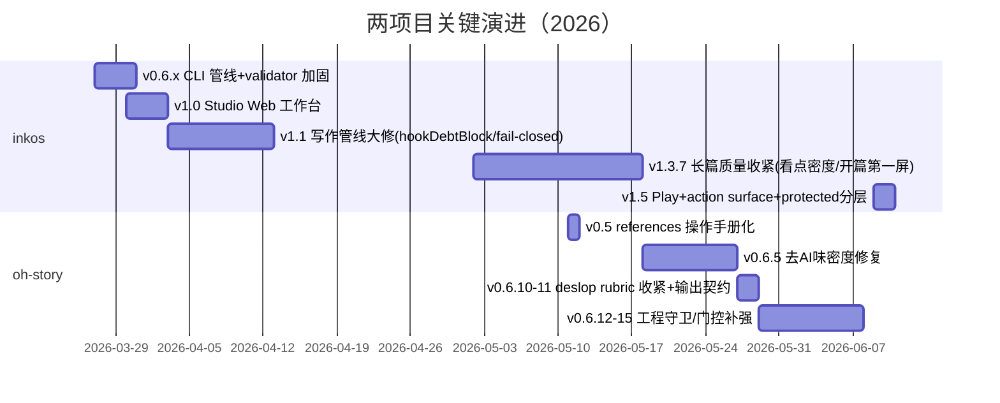

# 调研报告：inkos 与 oh-story-claudecode —— 对 NovelForge 的优化启示

> **日期**：2026-06-12　**调研对象**：[Narcooo/inkos](https://github.com/Narcooo/inkos) v1.5.0、[worldwonderer/oh-story-claudecode](https://github.com/worldwonderer/oh-story-claudecode) v0.6.15
> **方法**：GitHub API 元数据 + releases 时间线 + 两个并行子代理对源码/skill 文件的全量阅读（inkos 本地克隆 master，oh-story 浅克隆 v0.6.15）
> **置信度**：高（结论均来自仓库一手源码与文档，关键发现附文件路径）

---

## 一、执行摘要

两个项目代表了 AI 网文写作的两条技术路线：**inkos**（7.2k★，TypeScript monorepo，6 人团队，AGPL-3.0）是重运行时的智能体系统——状态机、事件溯源、确定性 reducer、CI 断言 prompt 边界；**oh-story**（2.3k★，单作者，MIT）是重方法论的 Claude Code skill 包——把网文编辑的行业经验（扫榜/拆文/钩子公式/去 AI 味）操作化成可执行的规则与门控。

NovelForge 的确定性内核（FTS 召回、validator、canon 账本、并行多候选、锚点补丁、逐章成本）在工程上不输两者，部分能力（BM25 召回、前缀缓存、候选并行、成本入库）是两家都没有的。**差距集中在三处：修订循环的路由智能、内容质量规则的操作化深度、伏笔/状态账本的精细度。** 本报告提炼 14 条可借鉴项，按投入产出分为三档，全部与既定的三条 non-goal（去重不加稳定前缀、不做 DOC/MCTS、不用向量替换 BM25）无冲突。

---

## 二、两个项目的画像与演进

| 维度 | inkos | oh-story-claudecode |
|---|---|---|
| 定位 | 故事创作 Agent 系统（长篇/短篇/剧本/开放世界） | 网文写作 skill 包（扫榜→拆文→写作→去AI味→封面） |
| 技术形态 | pnpm monorepo：core(pipeline/state/play) + cli + studio(React+Hono) | 13 个 SKILL.md + 7 agents + 6 hooks + 共享 references |
| 星数/创建 | 7,176★ / 2026-03 | 2,325★ / 2026-04 |
| 核心信条 | 完成态以真实工具结果为准，不信模型口头声明 | 套路 = 确定性的情绪满足；先确定性量化，后 LLM 裁量 |

**演进主轴**（来自 releases）：

两家不约而同的近期重心都是：**从"写得出"转向"防漂移、可校验、可降级"**——与 NovelForge 的设计哲学一致，说明方向选对了；区别在他们各自补的细节。

---

## 三、核心发现（带出处）

### 3.1 inkos：修订路由与状态结算是最大亮点

1. **审稿输出 `repair_scope: local|structural|unknown` 类型化路由**（`continuity.ts:477`、`reviser.ts:663`）。structural（OOC/主线偏离/时间线）→ 强制全文重写；全部 local（套话密度/段落问题）→ 强制 patch-only。NovelForge 目前是"先试补丁、失败回退重写"——inkos 是**事前判定该不该补丁**，两者可叠加。
2. **修订接受条件：净提升 ε=3 分才换稿 + 保留全部 snapshot 最终回退最高分版本**（`chapter-review-cycle.ts`）；**审稿 JSON 解析失败 → 直接跳过自动修稿**（"不基于不可靠审计改写有效正文"）。
3. **状态结算（settler）的 mention/advance 二分**（`agents/settler-prompts.ts`）：伏笔被"提及"≠被"推进"，防假回收；settler 禁止发明新 hookId，新线索一律进候选池由确定性 `hook-arbiter.ts` 仲裁（映射旧 hook/新建/拒绝重述）——与 NovelForge 的 fact_candidates 晋升机制同构，可直接套到伏笔账本。
4. **结算降级不阻塞连载**（`chapter-state-recovery.ts`）：validator 不过→只重试结算层（不动正文）→仍败则标 `state-degraded`、truth files 回滚、留 issue 供 `repair-state` 人工修复。
5. **Play 的世界状态投影**（`models/play.ts`、`play/play-reducer.ts`）：时态边（validFromEventId/validUntilEventId）+ **per-character visibility map**（按角色的信息边界）+ 证据 8 级单调状态机（unknown→…→exhausted）。直接解决"角色不该知道他不在场的事"。
6. **上下文工程三小招**（`utils/memory-retrieval.ts`、`context-assembly.ts`、`governed-working-set.ts`）：查询词提取时**剥离否定句**（防"不要写X"召回X）；**最陈旧未解伏笔强制配额**（每章 2 条强制入场）；角色矩阵按本章出场角色**裁剪行**；>6000 字符的大文件降级注入**标题目录索引**而非截断；protected/compressible 白名单分层并把 token 预算写入逐章 trace。
7. **弱模型容错**：lenient zod schema——单字段畸形丢弃该项而非崩整轮（`models/play.ts:3` "degrade, not hard-error"）；显式**不重试** MODEL_NOT_AVAILABLE/裸 500（"模型根本没上推理，重试只是拖延真错误"）。
8. **全书规划**（`agents/architect.ts`）：story_frame 末尾必须有**可验证的全书 Objective**，卷级按 OKR 递归分解出 Key Results；每个事实只许活在一个文件（反重复硬规则）；建书时 foundation-reviewer 独立 5 维打分，<80 分驳回重生成。

### 3.2 oh-story：去 AI 味量化体系与商业化规则是最大亮点

1. **去 AI 味六项量化指标**（`skills/story-deslop/SKILL.md`）——全部可落成零成本 regex 检测器：

| 指标 | 轻 / 中 / 重 |
|---|---|
| 禁用词密度（命中/千字） | ≤5 / 6-15 / >15 |
| 连续排比段数 | ≤2 / 3-4 / ≥5 |
| 心理词占比（/总段数） | ≤10% / 10-25% / >25% |
| 对话标签密度（"说道"类/对话句） | ≤30% / 30-50% / >50% |
| 平均段落句数 | ≤3 / 3-5 / >5 |
| 重复描写密度（处/千字） | ≤1 / 2-3 / ≥4 |

   配套**禁用句式毒级表**（`references/banned-words.md`）：★★★★★「不是A，而是B」；★★★★「，带着……」「他/她知道……」；★★★「眼中闪过一丝/嘴角勾起一抹」；弱化副词（微微/淡淡/缓缓/轻轻）>3 个/千字即 AI 签名；比喻默认全删。修复用**三遍法**（去泛化→去书面化→回自然感）+ 删除比例分级熔断（轻≤15%/中≤25%/重≤35%）+ 同段两轮无新改动即收敛终止 + 疑似项标 `[需复核]` 移交人工。项目级 `.deslop-whitelist` 豁免世界观术语。
2. **四 Agent 对抗审稿**（`skills/story-review/SKILL.md`）：「审查是找问题，不是验证正确性」。architect（结构/钩子）、character-designer（语言风格与档案一致性）、narrative-writer（AI 味/节奏）、consistency-checker（grep-first 只查事实不评文学）。统一 Findings Schema：`severity(S1-S4)/category/location/evidence/issue/fix`，**无原文证据的 finding 不输出**；Agent 分歧不自动妥协、交用户裁决；缺 agent 时有完整降级链。配 13 维 rubric + 黄金三问（读者为什么翻下一页？本章改变了什么？证据是什么？）+ 番茄/起点/知乎三套平台标准。
3. **章前"准备层"**（`skills/story-long-write/SKILL.md`）：无细纲禁止写正文；细纲含**目标情绪 + 章首钩子（7 式）+ 章尾钩子（13 式，标期待度）+ 情节点序列**；写前必答三问（本章情绪词？借鉴哪个技法？用在哪段？），答不出禁止动笔；硬规则——章首前 100 字必须有钩子、**连续两章不用同种钩子**。
4. **文风锚点 few-shot**：拆文产出 `文风.md`（句长分布/标点习惯/对话潜台词/情绪交替周期 + 4-6 段原文锚点），写作时按本章情绪选 1-2 段进 prompt 做风格 few-shot；缺失则 fail-fast 不瞎编。这是去 AI 味的**预防侧**，比事后修补便宜。
5. **爽点工程**：爽点 = 大众逻辑（对手不可战胜）×主角逻辑（轻描淡写）的落差；装逼打脸 5 章循环；「前置小无敌」（打脸前道具实力必须备好）；**爽点循环完成率 = 主角向爽点闭环数/章数**（≥70% 高 / 50-70% 中 / <50% 低）。
6. **状态追踪四件套**（`追踪/`：伏笔.md/时间线.md/角色状态.md/上下文.md）：角色状态含「公众形象」「待回收伏笔挂角色名下」，变更记录只留最近 10 条、更早合并成摘要行；「最简记忆包」筛选标准一句话——**只保留不知道就会写错的信息**。
7. **成本策略**：拆文每章用 haiku 提取，机械校验失败→**升级 sonnet 重试**，再失败标跳过不阻断；黄金三章后自动停靠出预览再问是否全量拆（人审门控+省成本）。
8. **工程守卫**：共享规则文件 6 处字节同步 + CI 守卫脚本；SessionStart hook 扫"正文章数 vs 设定/追踪文件缺口"开场即提醒；选题可行性按样本量封顶（<15 样本不给"高"评级）。

---

## 四、优化建议（对照 NovelForge 现状，按投入产出排序）

### P0 — 低成本高确定性（建议直接做）

| # | 建议 | 来源 | 对接 NovelForge 的位置 |
|---|---|---|---|
| 1 | **去 AI 味确定性预筛**：六项量化指标 + 禁用词/句式毒级表落成 regex 检测器，作为 craft_check 的新检查组（warn 级），LLM 评委只裁灰区 | oh-story §3.2.1 | `craft/` 新增 `deslop_check.py`；指标超"中"档时计入 craft warn，触发现有润色循环 |
| 2 | **审稿输出 repair_scope 路由**：continuity/craft issue 增加 `repair_scope: local\|structural` 字段，structural 直接走全文重写、local 强制锚点补丁——叠加在现有"补丁失败回退"之前 | inkos §3.1.1 | `continuity_check_skill.py` 输出 schema + `orchestrator._revise()` 路由 |
| 3 | **修订接受条件加固**：revise/润色循环引入净提升 ε（如 0.3 分）+ 各轮快照、终选最高分版本（现有润色已"取分高版本"，revise 循环没有）；评分/审稿 JSON 解析失败 → 跳过该轮自动修订而非硬来 | inkos §3.1.2 | `orchestrator` REVISE loop 与 `_quality_pass` |
| 4 | **LLM 输出 lenient 解析**：评委/审稿 JSON 逐字段容错（畸形字段丢弃该项，不崩整轮）；瞬态错误重试黑名单（MODEL_NOT_AVAILABLE 类不重试） | inkos §3.1.7 | `candidate_judge._parse_verdict`、`gateway._call_with_retry` 的 `_RETRYABLE` 反面清单 |
| 5 | **召回三小招**：查询词剥离否定句；每章强制注入 2 条最陈旧未解伏笔；recall pack 的角色信息按本章出场角色裁剪 | inkos §3.1.6 | `memory/recall.py`（FTS 查询预处理 + 配额逻辑） |

### P1 — 中等投入（一至两个迭代）

| # | 建议 | 来源 | 说明 |
|---|---|---|---|
| 6 | **伏笔账本精细化**：状态结算区分 mention/advance；新伏笔先进候选池、由确定性仲裁器决定映射/新建/拒绝（复用 fact_candidates 的晋升模式）；待回收伏笔挂角色名下 | inkos §3.1.3 + oh-story §3.2.6 | 现有 foreshadow 表只有 planted→overdue 翻转，假回收检测为空白 |
| 7 | **章节卡升级为"细纲契约"**：增加目标情绪、钩子类型（7+13 式枚举）、期待度字段；评委 hook 维度改为"是否兑现细纲承诺"（有 ground truth 可对照）；新增确定性检查「连续两章同型钩子」 | oh-story §3.2.3 | `chapter_cards` schema + planner/judge prompt；与现有 pacing/beat 管理衔接 |
| 8 | **审稿 findings 化**：质量问题从分数升级为结构化清单（severity/location/**evidence**/fix），无证据不输出；findings 直接喂锚点补丁生成器（目前补丁的 issues_str 是松散描述） | oh-story §3.2.2 | 与 #2 的 repair_scope 是同一次 schema 改造 |
| 9 | **文风锚点 few-shot**：项目级 `style_anchors`（4-6 段 300-500 字范文片段，按情绪标签索引），chapter_draft 按本章目标情绪注入 1-2 段；注意放进**动态段而非稳定前缀**（避免破坏现有前缀缓存） | oh-story §3.2.4 | 预防侧去 AI 味，比 #1 的事后修补更便宜 |
| 10 | **看板新增"爽点循环完成率"**：细纲承诺的爽点闭环数/实际兑现数，随质量趋势展示；结算 agent 顺带产出 | oh-story §3.2.5 | 质量趋势看板已有逐章分数+成本曲线，加一条线即可 |
| 11 | **结算降级不阻塞**：状态结算失败只重试结算层（不动正文），仍败标 `state-degraded` 继续连载，留 repair 入口 | inkos §3.1.4 | 挂机连载的鲁棒性；与现有降级人审互补 |

### P2 — 方向性（先评估再排期）

| # | 建议 | 来源 | 说明 |
|---|---|---|---|
| 12 | **canon 账本 v2：时态边 + per-character visibility** | inkos §3.1.5 | knowledge_edges 已有雏形；加 visibility 能让 continuity_check 检测"角色知道了不在场的事"。改动面大，建议先做单项 validator 原型 |
| 13 | **全书可验证 Objective + 卷级 KR**：给挂机连载一个可判定的收敛目标，卷末结算时核对 KR 兑现 | inkos §3.1.8 | volumes 表已有 synopsis，加 objective/key_results 字段 |
| 14 | **弱模型分层 + 失败升级**：摘要/提取类任务用 fast 档，机械校验失败自动升级 mid 重试（现有 tier 体系支持，缺"失败升级"一步） | oh-story §3.2.7 | 与逐章成本看板配合可量化省多少钱 |

### 明确不建议照搬的

- **inkos 放弃 FTS、纯靠词命中打分召回**——NovelForge 的 BM25+FTS 更强，不要倒退。
- **oh-story 的 Markdown 文件即数据库**——适合 skill 包形态，不适合有 SQLite 账本和 API 的 NovelForge。
- **三条既定 non-goal 不受影响**：两个项目都没有用向量检索（oh-story 明确 grep-first，与既定判断互相印证），也都没做 DOC/MCTS 式搜索。

---

## 五、工程文化层面的三个观察

1. **"先确定性量化、后 LLM 裁量"是两家共同的胜负手**——oh-story 的六项指标、inkos 的确定性 reducer/hook-arbiter 都在把 LLM 从"裁判"降级为"灰区仲裁员"。NovelForge 的 validator 体系同源，应继续向内容质量域（AI 味、钩子、爽点）扩张。
2. **每个自动环节都要有降级链和人审出口**——inkos 的 state-degraded、oh-story 的 `[需复核]`/删除比例熔断/收敛终止。NovelForge 的挂机降级已有骨架，缺的是修订/结算环节的同等待遇（P0-3、P1-11）。
3. **prompt 边界值得 CI 断言**——inkos 用 `instruction-adherence-boundary.test.ts` 断言每个 surface 的 mustContain/mustNotContain；oh-story 用脚本守卫共享规则文件字节一致。NovelForge 的 skill prompt 目前没有任何回归保护，FakeProvider 测试只覆盖流程不覆盖 prompt 内容契约。

---

## 六、信源

- [Narcooo/inkos](https://github.com/Narcooo/inkos)（README/CHANGELOG/releases + 源码：`packages/core/src/{pipeline,agents,state,play,utils,llm}/`）
- [worldwonderer/oh-story-claudecode](https://github.com/worldwonderer/oh-story-claudecode)（README/CHANGELOG/releases + `skills/*/SKILL.md`、`references/{banned-words,anti-ai-writing,state-tracking,hooks-chapter,commercial-core-methods,quality-rubric}.md`、`demo/拆文库-盘龙/`）
- GitHub API（stars/forks/languages/releases，2026-06-12 抓取）

**置信度说明**：高置信（源码直接验证）——§3 全部发现；中置信——两项目的设计动机推断（基于 CHANGELOG 措辞）。无低置信引用；未使用社交媒体信源。
