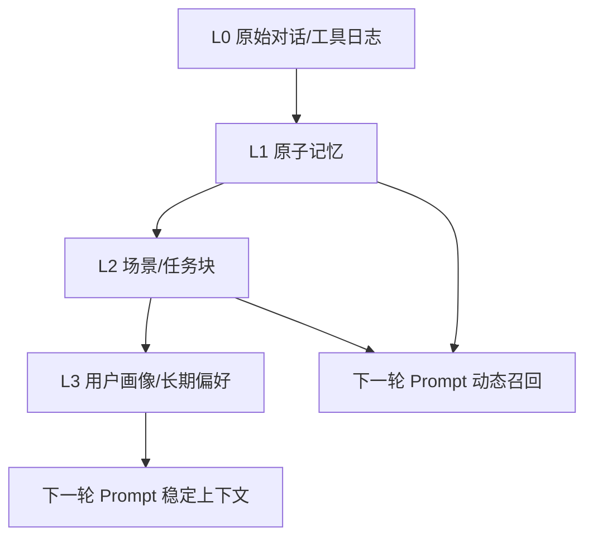
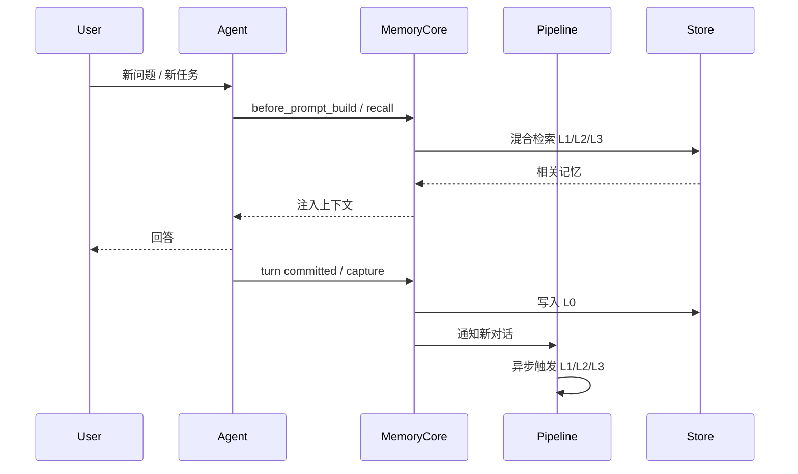
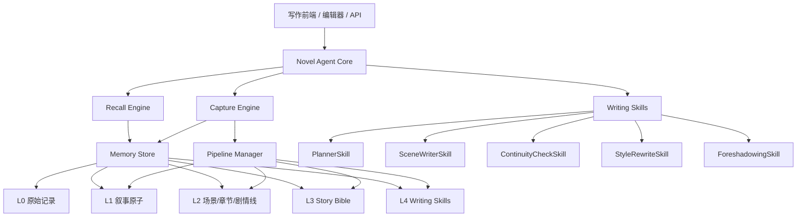
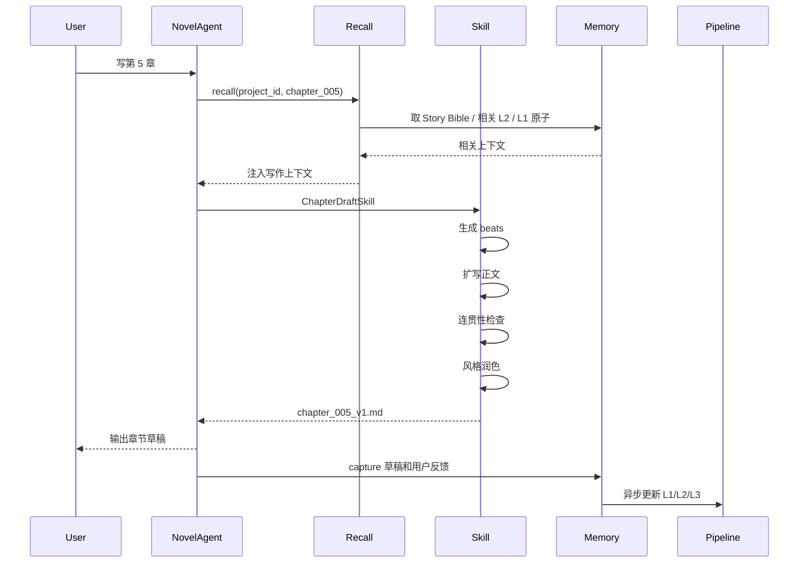

我先研究了一轮这个仓库的 README、插件配置、核心源码入口、capture/recall/pipeline/L1/L2/L3/offload/skill 文档。结论是：**TencentDB-Agent-Memory 的核心不是“向量库记忆”，而是一套“事件驱动的分层记忆系统”：把原始对话沉淀为原子记忆，再聚合为场景，最后形成用户画像/长期偏好，并在下一轮对话前用混合检索召回。**

下面分两部分：先拆这个项目的核心设计原理，再给出一个借鉴它架构的 **AI 写小说项目设计文档草案**。

---

# 一、TencentDB-Agent-Memory 的核心设计原理

## 1. 这个项目真正解决的问题

它要解决的不是“把所有历史都塞进 prompt”，而是解决 Agent 长期运行中的三个问题：

1. **上下文越来越长**：历史对话、工具调用、草稿、错误尝试都会堆积。
2. **简单 summary 不可逆**：总结后丢失证据链，后续很难追溯“这个结论从哪里来”。
3. **向量库平铺不够用**：只存碎片，缺少从事实到场景再到画像的结构化抽象。

项目 README 中文版把它概括为：**“符号化短期记忆 + 分层式长期记忆”**，并明确反对“暴力堆历史”和“不可逆 summary”，核心做法是将记忆分层、可折叠、可展开，并保持从高层结论回到底层证据的链路。([GitHub][1])

---

## 2. 整体架构：L0 → L1 → L2 → L3 的记忆金字塔

它的长期记忆可以抽象成四层：

| 层级                  | 项目中的含义    | 数据形态                  | 作用                   |
| ------------------- | --------- | --------------------- | -------------------- |
| **L0 Conversation** | 原始对话记录    | JSONL / 本地记录 / 可索引文本  | 证据源，不能丢              |
| **L1 Atom**         | 原子记忆      | 结构化 JSON 片段           | 可检索的事实、偏好、约束         |
| **L2 Scenario**     | 场景记忆      | Markdown scene blocks | 把碎片聚合成任务/场景          |
| **L3 Persona**      | 用户画像/长期偏好 | `persona.md`          | 给 Agent 提供稳定、长期的用户理解 |

README 中明确列出了 L0 Conversation → L1 Atom → L2 Scenario → L3 Persona 的长期记忆分层，同时还把短期上下文拆成底层原始证据、中层步骤摘要、顶层 Mermaid 符号画布；高层给方向，底层保留证据。([GitHub][1])

可以把它理解成：



---

## 3. 它不是“同步写记忆”，而是事件驱动管线

项目的核心类 `TdaiCore` 是一个 host-neutral facade，负责统一 recall、capture、search、pipeline 等能力；它不绑定特定 Agent 宿主，而是通过 HostAdapter、LLMRunner 等抽象接口接入不同运行环境。源码入口中可以看到它提供了 `handleBeforeRecall`、`handleTurnCommitted`、`searchMemories`、`searchConversations` 等核心方法。([GitHub][2])

它的主循环可以概括为：



这里有一个关键设计：**capture 是高频、轻量、可靠的；extraction 是异步、批处理、可恢复的。**

项目的 `auto-capture` 逻辑会先把 L0 对话本地记录下来，并在可用时写入索引；它本身不直接做 L1 抽取，而是通知 `MemoryPipelineManager`，由管线决定何时抽取、聚合和生成画像。([GitHub][3])

---

## 4. L1：从原始对话中抽取“原子记忆”

L1 抽取器的做法是：把近期 L0 消息交给 LLM，用 JSON-mode 或结构化输出抽取记忆，并在写入前做去重、冲突判断和质量过滤。源码中的 `l1-extractor` 显示，它会进行场景切分、记忆抽取、批量冲突检测，并把结果写入 L1 JSONL。([GitHub][4])

抽象算法如下：

```text
输入：最近一批 L0 对话消息
输出：L1 原子记忆列表

1. 过滤不值得抽取的消息
2. 按 session / 时间窗口组织上下文
3. 调用 LLM 生成结构化 JSON：
   - 事实
   - 偏好
   - 任务目标
   - 约束
   - 决策
   - 待办
4. 对每条候选记忆做：
   - 格式校验
   - 类型归一化
   - 置信度判断
   - 近邻检索去重
   - 冲突检测
5. 写入 L1 记忆库
6. 保留 source_ref，指回 L0 原始证据
```

这里最重要的是：**L1 不是摘要，而是可索引、可去重、可追溯的原子事实。**

---

## 5. L2：把原子记忆聚合成“场景”

L2 的目标不是继续压缩，而是把许多 L1 碎片组织成更有意义的“场景块”。源码中的 `scene-extractor` 使用 LLM 驱动的工具化流程，在受限目录 `scene_blocks` 中读写场景文件；它会备份场景块、加载 scene index、构造已有场景摘要，再让 LLM 更新或创建 scene block，失败时可恢复备份。([GitHub][5])

可以理解为：

```text
L1 原子记忆：
- 用户喜欢 Python
- 用户在做 AI 写小说项目
- 用户关心 Agent Memory 架构
- 用户想要设计文档
- 用户偏好中文输出

聚合成 L2 场景：
scene_ai_novel_memory_project.md
- 项目目标
- 当前需求
- 技术方向
- 已确认偏好
- 相关决策
- 后续任务
```

L2 的价值是：**让 Agent 能理解“这一堆事实属于同一个任务/项目/场景”。**

---

## 6. L3：从场景中生成长期画像

L3 Persona 不是简单用户标签，而是从多个 L2 场景里提炼出的长期稳定信息。`persona-generator` 源码显示，它会读取 checkpoint、已有 persona、scene index，只处理上次 persona 生成后变化过的场景，并以增量方式更新 `persona.md`。([GitHub][6])

L3 适合存：

```text
用户长期偏好：
- 喜欢结构化、工程化设计文档
- 倾向用中文沟通
- 常做 AI Agent / 自动化 / 创作类项目
- 需要兼顾简单 MVP 与复杂可扩展架构
```

在下一轮对话中，L3 会作为稳定上下文注入，帮助 Agent 不用每次重新理解用户。

---

## 7. Recall：不是只做向量检索，而是混合召回

项目的 `auto-recall` 逻辑会在 Agent 生成回答前自动注入相关记忆。它支持 keyword、embedding、hybrid 三种策略：keyword 基于 FTS5 BM25，embedding 基于向量相似度，hybrid 使用 RRF 进行融合；如果 embedding 不可用，会回退到 keyword。它还会把 L3 persona、L2 scene navigation 和 L1 动态召回区分开，以利于 prompt caching。([GitHub][7])

核心算法可以抽象为：

```text
输入：当前用户问题 query
输出：要注入 prompt 的记忆上下文

1. 读取 L3 persona，作为稳定上下文
2. 读取 L2 scene navigation，作为项目/场景导航
3. 对 L1 原子记忆做检索：
   a. BM25(keyword)
   b. Vector similarity(embedding)
   c. RRF 融合排名
4. 控制 token / 字符预算
5. 将稳定上下文 append 到 system context
6. 将动态 L1 记忆 prepend 到当前 prompt
```

RRF 融合可以写成：

```text
score(doc) = Σ 1 / (k + rank_i(doc))
```

其中 `rank_i` 是文档在某个检索器中的排名，`k` 通常用来降低排名差异带来的极端影响。项目源码中采用了这种 client-side RRF 思路。([GitHub][7])

---

## 8. Pipeline Manager：批处理、空闲触发、热身阈值、串行队列

`MemoryPipelineManager` 管理 L0 → L1 → L2 → L3 的生命周期。源码显示，它支持：

* L1 按对话数量阈值触发；
* L1 也可按 idle timeout 触发；
* L2 在 L1 之后按定时器或间隔触发；
* L3 有全局互斥，避免并发画像生成；
* warm-up 阈值可以从 1、2、4 逐渐增长；
* 使用串行队列避免并发写入冲突。([GitHub][8])

这说明它是一个**生产级记忆管线**，而不是每轮对话后立刻调用一堆 LLM。

---

## 9. Gateway / Plugin：把记忆系统做成可插拔 Sidecar

仓库还提供了 Gateway server，暴露 `/health`、`/recall`、`/capture`、`/search/memories`、`/search/conversations`、`/session/end`、`/seed` 等接口；它是一个 sidecar HTTP 服务，并包含 API key、CORS、loopback 等安全处理。([GitHub][9])

插件配置文件里能看到它支持 `storeBackend`、capture、extraction、persona、pipeline、recall、embedding、BM25、LLM、offload 等模块化配置；同时暴露 `tdai_memory_search`、`tdai_conversation_search` 两个工具契约。([GitHub][10])

这对我们做 AI 写小说项目很重要：**记忆系统最好不要写死在写作 Agent 里，而是作为独立 Memory Core / Sidecar 服务存在。**

---

## 10. Skill 的设计方式

仓库的 `SKILL.md` 不是普通说明文，而是一个“可执行操作规程”：它定义了 skill 的 name、description、purpose、配置、标准工作流、验证步骤、smoke test、Definition of Done 等。里面还围绕 L0 → L1 → L2 → L3 的安装、配置、验证、召回工具做了完整闭环。([GitHub][11])

这给我们的启发是：

> AI 写小说项目里的 skill 不应该只是 prompt 模板，而应该是带有触发条件、输入输出契约、执行流程、校验规则和完成标准的模块化能力。

例如：

```text
Skill: ChapterDraftSkill
触发：用户要求写新章节
输入：当前章节目标、相关人物、前文摘要、风格要求
流程：
1. recall 相关记忆
2. 生成章节 beats
3. 扩写场景
4. 连贯性检查
5. 风格润色
输出：章节正文 + 变更摘要 + 新增事实
完成标准：
- 没有人物设定冲突
- 时间线一致
- 章节目标达成
- 新增伏笔已登记
```

---

# 二、可借鉴的核心设计原则

从这个项目抽象出来，适合复用到 AI 写小说系统的原则有 8 条：

| 原则                    | TencentDB-Agent-Memory 中的表现 | 用到小说项目里的方式                |
| --------------------- | --------------------------- | ------------------------- |
| **分层记忆**              | L0/L1/L2/L3                 | 原始草稿 / 叙事原子 / 场景章节 / 故事圣经 |
| **证据链可追溯**            | 高层 persona 可追到 scene 和原始记录  | 人物设定、剧情决策都能追到章节原文         |
| **短期任务符号化**           | Mermaid canvas + refs       | 当前章节写作画布、场景状态图            |
| **混合检索**              | BM25 + embedding + RRF      | 检索相关人物、地点、伏笔、章节           |
| **异步管线**              | capture 轻量，extract 异步       | 写作不中断，后台整理设定和时间线          |
| **Host-neutral Core** | TdaiCore + Adapter          | 写作前端、CLI、API、编辑器都能接入      |
| **Sidecar 服务化**       | Gateway HTTP API            | Memory Core 独立部署          |
| **Skill 化流程**         | SKILL.md 标准工作流              | 写大纲、写章节、改文风、查冲突都变成 skill  |

---

# 三、AI 写小说项目设计文档草案

下面是一版直接借鉴该项目架构的设计文档初稿。

---

# 《NovelCraft Agent Memory》设计文档 v0.1

## 1. 项目定位

**NovelCraft Agent Memory** 是一个面向长篇小说创作的 AI 写作记忆与技能系统。

它不是单纯的“AI 续写器”，而是一个能长期维护以下内容的小说创作 Agent：

* 世界观设定；
* 人物设定；
* 剧情时间线；
* 章节结构；
* 伏笔与回收；
* 文风偏好；
* 已写正文；
* 用户修改意见；
* 创作过程中的决策记录。

核心目标是解决长篇小说创作中的三个问题：

1. **一致性问题**：人物、地点、能力、时间线不能前后矛盾。
2. **长上下文问题**：不能每次把几十万字全文塞进模型。
3. **创作过程记忆问题**：AI 要记住用户的长期偏好、世界规则和已经做过的剧情决策。

---

## 2. 总体架构



系统分成六个核心部分：

| 模块                   | 职责                                |
| -------------------- | --------------------------------- |
| **Novel Agent Core** | 写作任务入口，负责调用 recall、skills、capture |
| **Memory Core**      | 维护 L0/L1/L2/L3/L4 分层记忆            |
| **Recall Engine**    | 写作前检索相关设定、前文、伏笔、风格约束              |
| **Pipeline Manager** | 异步整理草稿、抽取设定、更新故事圣经                |
| **Writing Skills**   | 模块化写作能力                           |
| **Gateway/API**      | 给前端、编辑器、CLI、其他 Agent 调用           |

---

## 3. 分层记忆设计

### 3.1 L0：Raw Draft / Conversation

L0 是所有原始证据，不做语义判断，只负责可靠记录。

包括：

* 用户输入；
* AI 输出；
* 章节草稿；
* 修改意见；
* 被废弃版本；
* 工具调用结果；
* 研究资料；
* prompt 和生成参数；
* 人工确认的设定变更。

示例目录：

```text
/projects/{project_id}/
  l0/
    conversations/
      2026-06-05.session.jsonl
    drafts/
      chapter_001_v1.md
      chapter_001_v2.md
    tool_refs/
      ref_0001_worldbuilding.md
      ref_0002_timeline_check.md
```

L0 的设计原则是：**宁可多存，不要丢证据。**

---

### 3.2 L1：Narrative Atom

L1 是从 L0 中抽取出来的“叙事原子”。

叙事原子不是普通摘要，而是可检索、可去重、可追溯的小说事实。

典型类型：

| 类型                | 示例                    |
| ----------------- | --------------------- |
| `character_fact`  | “林澈左手有一道旧伤。”          |
| `world_rule`      | “灵力不能直接治愈记忆损伤。”       |
| `timeline_event`  | “第 3 章夜晚，主角第一次进入黑塔。”  |
| `relationship`    | “苏眠知道林澈隐瞒了真实身份。”      |
| `foreshadowing`   | “第 2 章出现的银色钥匙尚未回收。”   |
| `style_rule`      | “叙事风格偏冷静克制，少用网络流行语。”  |
| `user_preference` | “用户希望节奏更像悬疑小说，而不是爽文。” |
| `open_question`   | “黑塔的真正建造者尚未确定。”       |
| `constraint`      | “前 20 章不能暴露反派真实身份。”   |

L1 数据结构示例：

```json
{
  "id": "atom_000124",
  "project_id": "novel_001",
  "type": "character_fact",
  "entity": "林澈",
  "content": "林澈左手有一道旧伤，来源尚未解释。",
  "status": "confirmed",
  "confidence": 0.92,
  "chapter": 1,
  "timeline": "第一卷 / 第1天 / 傍晚",
  "tags": ["人物设定", "伏笔"],
  "source_refs": [
    "l0/drafts/chapter_001_v2.md#L23-L28"
  ],
  "created_at": "2026-06-05T10:20:00+07:00",
  "updated_at": "2026-06-05T10:20:00+07:00"
}
```

---

### 3.3 L2：Scene / Chapter / Arc Blocks

L2 把 L1 原子聚合成更高层的小说结构。

L2 不再是单条事实，而是面向创作的“场景块”“章节块”“剧情线块”。

示例：

```text
scene_blocks/
  volume_01/
    chapter_001_opening.md
    chapter_002_key_discovery.md
  arcs/
    arc_black_tower.md
    arc_su_mian_secret.md
  characters/
    lin_che.md
    su_mian.md
```

`chapter_001_opening.md` 示例：

```markdown
# Chapter 001 - 雨夜与黑塔

## 章节功能
- 引入主角林澈
- 展示城市异常
- 埋下银色钥匙伏笔
- 建立冷峻、悬疑的基调

## 已发生事件
1. 林澈在雨夜醒来，发现左手旧伤发热。
2. 城市远处出现黑塔虚影。
3. 他捡到一枚银色钥匙，但不知道用途。

## 涉及人物
- 林澈
- 苏眠，仅在电话中出现

## 新增设定
- 黑塔只在雨夜出现。
- 银色钥匙与黑塔有关。

## 未解决问题
- 林澈左手旧伤的来源
- 银色钥匙的用途
- 苏眠为什么知道黑塔

## Source Refs
- l0/drafts/chapter_001_v2.md
- atom_000124
- atom_000131
```

L2 的作用是：**让模型每次写作时不必读全书，而是读取与当前章节相关的结构化场景。**

---

### 3.4 L3：Story Bible

L3 对应 TencentDB-Agent-Memory 里的 Persona，但小说项目里不叫用户画像，而叫 **Story Bible**。

它是整个小说项目的最高层稳定记忆。

```text
story_bible.md
```

内容包括：

```markdown
# Story Bible

## 基本信息
- 类型：悬疑 / 都市奇幻
- 叙事视角：第三人称有限视角
- 风格：冷静、克制、带压迫感
- 节奏：每章至少有一个信息推进点

## 核心主题
- 记忆与身份
- 城市作为囚笼
- 真相与自我欺骗

## 世界规则
1. 黑塔只在雨夜出现。
2. 灵力不能直接改变真实记忆。
3. 所有进入黑塔的人都会失去一段过去。

## 主要人物
### 林澈
- 主角
- 左手有旧伤
- 曾经进入过黑塔但失忆
- 行事谨慎，不轻易信任他人

### 苏眠
- 知道部分黑塔真相
- 与林澈过去有关
- 当前动机不完全可信

## 长期伏笔
| 伏笔 | 首次出现 | 当前状态 | 计划回收 |
|---|---|---|---|
| 银色钥匙 | 第1章 | 未回收 | 第8-10章 |
| 左手旧伤 | 第1章 | 未解释 | 第一卷中段 |
| 苏眠的电话 | 第1章 | 部分解释 | 第5章 |

## 禁止破坏的约束
- 第20章前不能暴露黑塔建造者。
- 林澈不能突然拥有未铺垫的能力。
- 苏眠不能在第一卷前半段完全可信。
```

L3 的作用是：**给所有写作技能提供全局一致性约束。**

---

### 3.5 L4：Writing Skills

L4 是比 Story Bible 更进一步的“可复用写作流程”。

借鉴这个仓库的 skill 思路，小说系统中的 skill 应该不是 prompt，而是结构化能力包：

```text
skills/
  outline.skill.md
  chapter_draft.skill.md
  scene_expand.skill.md
  continuity_check.skill.md
  style_rewrite.skill.md
  foreshadowing_manage.skill.md
  character_dialogue.skill.md
```

每个 skill 应包含：

```markdown
# Skill: Chapter Draft

## Purpose
根据章节目标、Story Bible、相关场景和用户要求，生成一章小说草稿。

## Trigger
- 用户说“写下一章”
- 用户说“根据大纲扩写第 N 章”
- 系统进入 chapter_draft 任务

## Inputs
- project_id
- chapter_id
- chapter_goal
- target_word_count
- style_constraints
- recalled_context

## Workflow
1. Recall Story Bible
2. Recall related characters
3. Recall previous chapter and unresolved hooks
4. Generate chapter beats
5. Expand each beat into prose
6. Run continuity check
7. Run style check
8. Output draft and change summary

## Output
- chapter_draft.md
- new_atoms.json
- unresolved_hooks.json
- revision_notes.md

## Definition of Done
- 没有人物设定冲突
- 没有时间线冲突
- 至少推进一个剧情点
- 新增设定已进入 L1 候选记忆
```

---

## 4. 核心写作流程

### 4.1 写下一章的主流程



---

## 5. 核心算法设计

### 5.1 Capture Algorithm

目标：每次写作交互都可靠落盘，不阻塞用户。

```python
def capture_turn(project_id, session_id, user_input, agent_output, metadata):
    # 1. 原子写入 L0
    l0_record = {
        "project_id": project_id,
        "session_id": session_id,
        "user_input": user_input,
        "agent_output": agent_output,
        "metadata": metadata,
        "timestamp": now()
    }
    append_jsonl(f"projects/{project_id}/l0/conversations/{session_id}.jsonl", l0_record)

    # 2. 立即建立关键词索引
    index_bm25(l0_record)

    # 3. 可选：后台建立向量索引
    enqueue_embedding_job(l0_record)

    # 4. 通知管线
    pipeline.notify(project_id, session_id)
```

设计原则：

* L0 先写，抽取失败也不能丢原文。
* 索引可以延迟。
* L1/L2/L3 由管线异步触发。

这与 TencentDB-Agent-Memory 里的 capture 思路一致：先记录 L0，再通知 pipeline，由 pipeline 统一决定后续抽取时机。([GitHub][3])

---

### 5.2 L1 Narrative Atom Extraction

目标：从草稿和对话中提取小说事实。

```python
def extract_l1_atoms(project_id, new_l0_records):
    prompt = build_l1_extraction_prompt(new_l0_records)

    candidates = llm_json_extract(prompt, schema=NovelAtomList)

    final_atoms = []

    for atom in candidates:
        if not quality_gate(atom):
            continue

        neighbors = hybrid_search(
            project_id=project_id,
            query=atom.content,
            top_k=10
        )

        decision = llm_dedup_decision(atom, neighbors)

        if decision.action == "store":
            final_atoms.append(atom)

        elif decision.action == "merge":
            merge_atom(decision.target_id, atom)

        elif decision.action == "conflict":
            mark_conflict(atom, decision.target_id)

    write_l1_atoms(project_id, final_atoms)
```

L1 抽取的关键不是“抽出来”，而是：

1. 抽成结构化事实；
2. 保留 source refs；
3. 做去重；
4. 做冲突判断；
5. 允许后续回溯。

---

### 5.3 L2 Scene Aggregation

目标：把 L1 事实组织成章节、场景、人物、剧情线。

```python
def update_l2_scene_blocks(project_id, changed_atoms):
    scene_index = load_scene_index(project_id)
    related_blocks = retrieve_related_scene_blocks(changed_atoms)

    workspace = create_sandbox_workspace(
        allowed_dirs=["scene_blocks", "metadata"]
    )

    llm_tool_agent.run(
        task="Update scene/chapter/arc blocks",
        inputs={
            "changed_atoms": changed_atoms,
            "scene_index": scene_index,
            "related_blocks": related_blocks
        },
        tools=[
            read_scene_block,
            write_scene_block,
            soft_delete_scene_block,
            update_scene_index
        ],
        workspace=workspace
    )

    validate_scene_blocks(project_id)
    rebuild_scene_index(project_id)
```

这里要借鉴 TencentDB-Agent-Memory 的一个重要安全设计：**让 LLM 在受限 workspace 中读写场景块，而不是给它任意文件权限。** 该项目的 L2 scene extractor 就是以 scene_blocks 为受限工作区，并带有备份、失败恢复和索引同步。([GitHub][5])

---

### 5.4 L3 Story Bible Update

目标：把变化过的 L2 内容增量更新到全局故事圣经。

```python
def update_story_bible(project_id):
    checkpoint = load_bible_checkpoint(project_id)
    changed_scenes = get_scenes_changed_since(checkpoint)

    if not changed_scenes:
        return

    existing_bible = read_story_bible(project_id)

    new_bible = llm_update_story_bible(
        existing_bible=existing_bible,
        changed_scenes=changed_scenes,
        rules=[
            "不得删除仍然有效的设定",
            "冲突设定必须标记为 conflict",
            "未确认内容必须标记为 tentative",
            "新增伏笔必须进入 unresolved hooks"
        ]
    )

    write_story_bible(project_id, new_bible)
    update_checkpoint(project_id)
```

这对应项目里的 L3 Persona 生成逻辑：读取 checkpoint、已有 persona、scene index，只处理发生变化的场景，再增量更新高层画像。([GitHub][6])

---

### 5.5 Recall Algorithm

目标：写作前自动找出最相关的设定、前文、人物、伏笔、风格规则。

```python
def recall_for_writing(project_id, task):
    query = build_recall_query(task)

    stable_context = {
        "story_bible": read_story_bible(project_id),
        "scene_navigation": read_scene_index(project_id),
        "skill_guide": get_relevant_skill_guide(task)
    }

    keyword_hits = bm25_search(project_id, query, top_k=30)
    vector_hits = vector_search(project_id, query, top_k=30)

    ranked_atoms = rrf_merge(keyword_hits, vector_hits, k=60)

    related_scenes = retrieve_scene_blocks(
        project_id=project_id,
        atoms=ranked_atoms,
        chapter_id=task.chapter_id,
        characters=task.characters
    )

    active_canvas = read_active_canvas(project_id)

    return budget_context(
        stable=stable_context,
        dynamic={
            "atoms": ranked_atoms,
            "scenes": related_scenes,
            "canvas": active_canvas
        },
        max_tokens=task.context_budget
    )
```

召回上下文建议分两类：

| 类型    | 内容                    | 注入位置                    |
| ----- | --------------------- | ----------------------- |
| 稳定上下文 | Story Bible、风格规则、全局约束 | system / cached context |
| 动态上下文 | 当前章节相关人物、前文、伏笔、冲突     | 当前 prompt 前部            |

这对应 TencentDB-Agent-Memory 中把 L3 persona、L2 scene navigation 和 L1 动态召回区分注入的做法。([GitHub][7])

---

### 5.6 Continuity Check Algorithm

AI 写小说项目比普通 Agent Memory 多一个关键能力：**一致性检查**。

```python
def continuity_check(project_id, draft):
    extracted_claims = extract_claims_from_draft(draft)

    issues = []

    for claim in extracted_claims:
        related_atoms = hybrid_search(project_id, claim.content, top_k=10)
        related_bible_sections = search_story_bible(project_id, claim.content)

        verdict = llm_check_consistency(
            claim=claim,
            related_atoms=related_atoms,
            related_bible_sections=related_bible_sections
        )

        if verdict.status in ["conflict", "unsupported", "timeline_error"]:
            issues.append(verdict)

    return issues
```

问题类型可以分为：

| 问题     | 示例                  |
| ------ | ------------------- |
| 人物冲突   | 前文说角色不会开车，新章突然飙车    |
| 时间线冲突  | 一天内发生不可能完成的多地行动     |
| 能力冲突   | 角色使用了尚未获得的能力        |
| 世界规则冲突 | 世界规则禁止复活，新章直接复活     |
| 伏笔遗漏   | 章节目标要求回收钥匙伏笔，但正文没处理 |
| 风格偏移   | 原本冷峻悬疑，突然变成轻松吐槽风    |

---

## 6. Writing Skills 设计

### 6.1 PlannerSkill：大纲规划

用途：生成全书大纲、卷大纲、章节大纲。

输入：

```json
{
  "genre": "都市奇幻悬疑",
  "target_chapters": 80,
  "core_theme": "记忆与身份",
  "main_characters": ["林澈", "苏眠"],
  "constraints": [
    "前20章不能暴露黑塔建造者",
    "每5章至少回收一个小伏笔"
  ]
}
```

输出：

```text
- 全书结构
- 每卷目标
- 每章功能
- 主要反转点
- 伏笔布置表
```

---

### 6.2 ChapterDraftSkill：章节生成

用途：根据章节目标和召回上下文写正文。

流程：

```text
1. 读取 Story Bible
2. 读取上一章摘要
3. 读取当前章节目标
4. 读取相关人物和伏笔
5. 生成 beats
6. 扩写 beats
7. 检查一致性
8. 输出草稿
9. 提交新增事实到 L1 候选
```

---

### 6.3 SceneExpandSkill：场景扩写

用途：把一句话剧情扩成完整场景。

输入：

```text
“林澈第一次看到黑塔，并意识到苏眠隐瞒了什么。”
```

输出：

```text
- 场景目标
- 环境描写
- 人物行动
- 对话
- 情绪变化
- 结尾钩子
```

---

### 6.4 ContinuityCheckSkill：连续性检查

用途：检查草稿是否违反 Story Bible 和已有章节。

输出格式：

```json
{
  "status": "has_issues",
  "issues": [
    {
      "type": "timeline_conflict",
      "severity": "high",
      "claim": "林澈在凌晨三点抵达北城，同时又在同一时间出现在南站。",
      "evidence": ["chapter_004.md", "atom_000231"],
      "suggestion": "将南站事件调整到凌晨四点后，或改为电话沟通。"
    }
  ]
}
```

---

### 6.5 StyleRewriteSkill：文风改写

用途：在不改变事实的前提下调整风格。

可支持：

* 更冷峻；
* 更文学；
* 更网文爽感；
* 更悬疑；
* 更克制；
* 更口语；
* 更古风；
* 更轻小说。

它必须遵守一个原则：

> 改写只能改变表达，不能私自改变事实、设定、时间线和人物动机。

---

### 6.6 ForeshadowingSkill：伏笔管理

用途：自动维护伏笔的布置、强化、误导、回收。

伏笔结构：

```json
{
  "id": "hook_00012",
  "name": "银色钥匙",
  "first_appearance": "chapter_001",
  "status": "unresolved",
  "importance": "high",
  "planned_payoff": "chapter_009",
  "related_characters": ["林澈", "苏眠"],
  "source_refs": ["chapter_001_v2.md#L80-L93"]
}
```

---

## 7. 存储设计

推荐本地优先，后续可替换为云数据库。

```text
/projects/{project_id}/
  config.yaml

  l0/
    conversations/
    drafts/
    tool_refs/

  l1/
    atoms.jsonl
    conflicts.jsonl
    embeddings.index

  l2/
    scene_blocks/
    character_blocks/
    arc_blocks/
    timeline_blocks/
    scene_index.json

  l3/
    story_bible.md
    story_bible.backups/

  l4/
    skills/
      planner.skill.md
      chapter_draft.skill.md
      continuity_check.skill.md

  canvas/
    active_chapter.mmd
    revision_graph.mmd

  indexes/
    bm25.sqlite
    vector.sqlite
```

数据库表可以先做成：

| 表                      | 作用           |
| ---------------------- | ------------ |
| `projects`             | 小说项目         |
| `l0_records`           | 原始对话、草稿、工具记录 |
| `l1_atoms`             | 叙事原子         |
| `l1_atom_links`        | 原子之间的关系      |
| `l1_conflicts`         | 冲突记录         |
| `scene_blocks`         | L2 场景块索引     |
| `story_bible_versions` | 故事圣经版本       |
| `skills`               | 写作 skill 注册表 |
| `embeddings`           | 向量索引         |
| `checkpoints`          | 管线进度         |

---

## 8. API 设计

借鉴该项目 Gateway 的 sidecar 思路，小说系统也可以暴露独立 API。

```http
GET /health
POST /projects
POST /projects/{project_id}/capture
POST /projects/{project_id}/recall
POST /projects/{project_id}/draft/chapter
POST /projects/{project_id}/rewrite
POST /projects/{project_id}/check/continuity
POST /projects/{project_id}/search/atoms
POST /projects/{project_id}/search/drafts
POST /projects/{project_id}/pipeline/run
POST /projects/{project_id}/session/end
```

### `/recall` 示例

请求：

```json
{
  "task": "write_chapter",
  "chapter_id": "chapter_005",
  "query": "写第5章，林澈进入黑塔第一层，苏眠保持神秘",
  "characters": ["林澈", "苏眠"],
  "context_budget": 12000
}
```

返回：

```json
{
  "stable_context": {
    "story_bible": "...",
    "style_rules": "...",
    "global_constraints": "..."
  },
  "dynamic_context": {
    "related_atoms": [],
    "related_scenes": [],
    "unresolved_hooks": [],
    "previous_chapter_summary": "..."
  }
}
```

---

## 9. Prompt / Context 组织方式

生成章节时，推荐 prompt 分层：

```text
[System]
你是小说创作 Agent，必须遵守 Story Bible 和用户要求。

[Stable Context]
- Story Bible
- 全局世界规则
- 文风规则
- 禁止破坏的设定

[Dynamic Recall]
- 当前章节相关人物
- 上一章摘要
- 未回收伏笔
- 当前剧情线
- 时间线约束

[Task]
写第 5 章：
- 章节目标
- 字数范围
- 情绪曲线
- 必须出现的事件
- 不能出现的内容

[Output Contract]
输出：
1. 章节正文
2. 新增设定
3. 新增伏笔
4. 可能的连续性风险
```

---

## 10. 主生成算法：Plan → Recall → Draft → Check → Revise → Commit

```python
def write_chapter(project_id, chapter_id, user_instruction):
    # 1. 规划
    chapter_plan = planner_skill.run(
        project_id=project_id,
        chapter_id=chapter_id,
        instruction=user_instruction
    )

    # 2. 召回
    context = recall_for_writing(
        project_id=project_id,
        task={
            "type": "write_chapter",
            "chapter_id": chapter_id,
            "instruction": user_instruction,
            "characters": chapter_plan.characters,
            "context_budget": 12000
        }
    )

    # 3. 起草
    draft = chapter_draft_skill.run(
        plan=chapter_plan,
        context=context
    )

    # 4. 连续性检查
    issues = continuity_check_skill.run(
        project_id=project_id,
        draft=draft
    )

    # 5. 修订
    if issues:
        draft = revision_skill.run(
            draft=draft,
            issues=issues,
            context=context
        )

    # 6. 提交
    capture_turn(
        project_id=project_id,
        session_id=current_session(),
        user_input=user_instruction,
        agent_output=draft,
        metadata={
            "chapter_id": chapter_id,
            "plan": chapter_plan,
            "issues": issues
        }
    )

    return draft
```

---

## 11. 与 TencentDB-Agent-Memory 的映射关系

| TencentDB-Agent-Memory     | AI 小说项目                                   |
| -------------------------- | ----------------------------------------- |
| L0 Conversation            | 原始对话、草稿、修改记录                              |
| L1 Atom Memory             | 人物事实、世界规则、剧情事件、伏笔                         |
| L2 Scenario                | 场景块、章节块、剧情线、人物卡                           |
| L3 Persona                 | Story Bible / 小说总设定                       |
| Mermaid task canvas        | 当前章节写作画布                                  |
| `tdai_memory_search`       | `novel_memory_search`                     |
| `tdai_conversation_search` | `novel_draft_search`                      |
| Persona Generator          | Story Bible Generator                     |
| Scene Extractor            | Chapter / Arc / Character Block Extractor |
| Skill generation roadmap   | Writing Skill / SOP 自动沉淀                  |

---

## 12. MVP 版本建议

### MVP 0：最小可用版

目标：能写长篇时记住设定。

范围：

* 项目管理；
* L0 草稿保存；
* L1 叙事原子抽取；
* BM25 检索；
* 手动 Story Bible；
* 写章节前自动 recall；
* 连续性检查基础版。

技术实现：

```text
Python/FastAPI 或 Node.js
SQLite
FTS5 BM25
本地 Markdown 文件
任意 LLM API
```

---

### MVP 1：分层记忆版

新增：

* L2 scene blocks；
* 自动章节摘要；
* 人物卡自动更新；
* 伏笔管理；
* hybrid recall：BM25 + embedding + RRF；
* Story Bible 增量更新。

---

### MVP 2：Agent + Skill 版

新增：

* PlannerSkill；
* ChapterDraftSkill；
* ContinuityCheckSkill；
* StyleRewriteSkill；
* ForeshadowingSkill；
* Skill registry；
* 写作过程 Mermaid canvas；
* 可视化剧情图谱。

---

### MVP 3：复杂生产版

新增：

* 多项目；
* 多作者协作；
* 版本分支；
* 章节 diff；
* 自动冲突修复建议；
* 角色关系图；
* 时间线图；
* skill 自动沉淀；
* 可插拔模型和数据库。

---

# 四、这个项目最值得借鉴的“核心算法”

一句话总结：

> **用事件驱动管线把原始上下文逐层压缩成可追溯的结构化记忆，再在生成前用混合检索和稳定/动态上下文分区，把最相关的高层约束和底层证据注入 Agent。**

具体算法组合是：

| 算法 / 方法               | 作用                                        |
| --------------------- | ----------------------------------------- |
| **分层记忆压缩**            | L0 原文 → L1 原子 → L2 场景 → L3 画像/Story Bible |
| **结构化抽取**             | 用 LLM JSON 输出抽取可存储的原子记忆                   |
| **去重与冲突检测**           | 新记忆写入前与旧记忆比对                              |
| **混合检索**              | BM25 + embedding                          |
| **RRF 排名融合**          | 融合关键词检索和向量检索结果                            |
| **异步 pipeline**       | capture 快速写入，后台慢慢整理                       |
| **checkpoint**        | 防止重复抽取或中断后丢进度                             |
| **可追溯 source_ref**    | 高层结论能追到底层证据                               |
| **受限 workspace 工具调用** | LLM 只能改允许的记忆文件                            |
| **Skill/SOP 化**       | 把复杂任务沉淀成可复用操作流程                           |

---

# 五、对 AI 写小说项目的关键设计判断

我建议这个小说项目不要一开始做成“一个超大 Agent”，而应该拆成：

```text
Novel Agent = Writing Core + Memory Core + Skill System
```

其中：

1. **Writing Core** 负责生成；
2. **Memory Core** 负责长期一致性；
3. **Skill System** 负责把复杂写作流程模块化。

最关键的工程原则是：

```text
不要把整本小说塞进 prompt。
不要只做向量库。
不要只做 summary。
不要让 LLM 无限制改文件。
不要让写作流程和记忆系统强耦合。
```

推荐核心形态是：

```text
原始草稿可追溯
事实抽取可结构化
章节场景可聚合
故事圣经可增量更新
写作 skill 可组合
生成前 recall
生成后 capture
后台 pipeline 整理
```

下一步建议直接把这份文档扩成三份实现级文档：**接口设计、数据库/文件结构设计、Skill 工作流与 Prompt 契约设计**。

[1]: https://github.com/TencentCloud/TencentDB-Agent-Memory/blob/main/README_CN.md "TencentDB-Agent-Memory/README_CN.md at main · TencentCloud/TencentDB-Agent-Memory · GitHub"
[2]: https://raw.githubusercontent.com/TencentCloud/TencentDB-Agent-Memory/main/src/core/tdai-core.ts "raw.githubusercontent.com"
[3]: https://raw.githubusercontent.com/TencentCloud/TencentDB-Agent-Memory/main/src/core/hooks/auto-capture.ts "raw.githubusercontent.com"
[4]: https://raw.githubusercontent.com/TencentCloud/TencentDB-Agent-Memory/main/src/core/record/l1-extractor.ts "raw.githubusercontent.com"
[5]: https://raw.githubusercontent.com/TencentCloud/TencentDB-Agent-Memory/main/src/core/scene/scene-extractor.ts "raw.githubusercontent.com"
[6]: https://raw.githubusercontent.com/TencentCloud/TencentDB-Agent-Memory/main/src/core/persona/persona-generator.ts "raw.githubusercontent.com"
[7]: https://raw.githubusercontent.com/TencentCloud/TencentDB-Agent-Memory/main/src/core/hooks/auto-recall.ts "raw.githubusercontent.com"
[8]: https://raw.githubusercontent.com/TencentCloud/TencentDB-Agent-Memory/main/src/utils/pipeline-manager.ts "raw.githubusercontent.com"
[9]: https://raw.githubusercontent.com/TencentCloud/TencentDB-Agent-Memory/main/src/gateway/server.ts "raw.githubusercontent.com"
[10]: https://raw.githubusercontent.com/TencentCloud/TencentDB-Agent-Memory/main/openclaw.plugin.json "raw.githubusercontent.com"
[11]: https://github.com/TencentCloud/TencentDB-Agent-Memory/blob/main/SKILL.md "TencentDB-Agent-Memory/SKILL.md at main · TencentCloud/TencentDB-Agent-Memory · GitHub"
